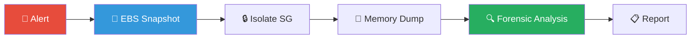
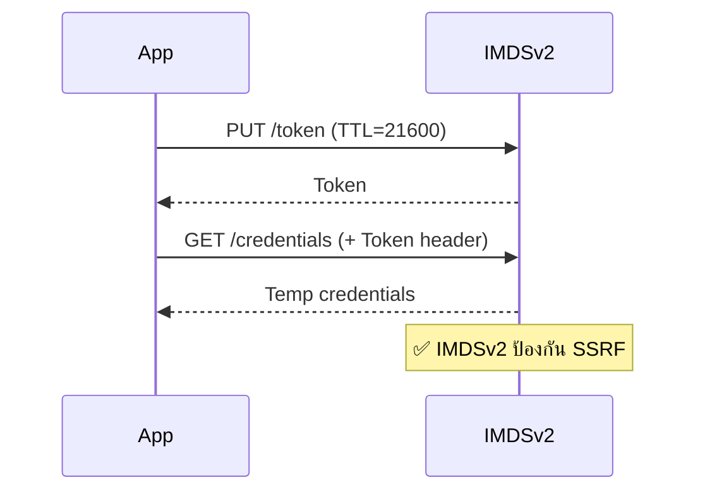
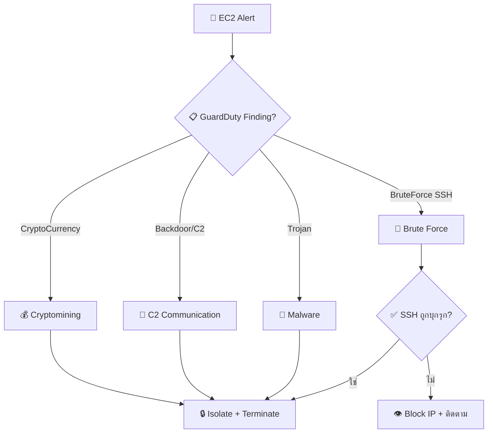
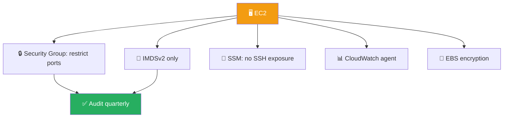
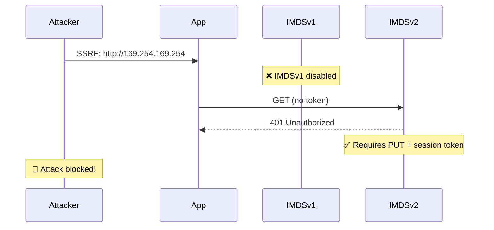

# Playbook: AWS EC2 Instance Compromise

**ID**: PB-22
**ระดับความรุนแรง**: วิกฤต | **หมวดหมู่**: ความปลอดภัยคลาวด์
**MITRE ATT&CK**: [T1190](https://attack.mitre.org/techniques/T1190/) (Exploit Public-Facing App), [T1496](https://attack.mitre.org/techniques/T1496/) (Resource Hijacking)
**ทริกเกอร์**: GuardDuty finding, CloudWatch CPU alarm, VPC Flow Log anomaly, billing spike

## หลังเหตุการณ์ (Post-Incident)

- [ ] ทบทวน EC2 security groups ตาม least privilege
- [ ] ใช้ IMDSv2 เพื่อป้องกัน SSRF
- [ ] ทบทวน IAM instance profile permissions
- [ ] ใช้ GuardDuty/CloudTrail monitoring
- [ ] สร้าง golden AMI สำหรับ re-deployment
- [ ] จัดทำ [Incident Report](../../11_Reporting_Templates/incident_report.th.md)

### ผังขั้นตอน Forensics

```mermaid
graph LR
    Detect["🚨 Alert"] --> Snap["📸 EBS Snapshot"]
    Snap --> Isolate["🔒 Isolate SG"]
    Isolate --> Memory["💾 Memory Dump"]
    Memory --> Analyze["🔍 Forensic Analysis"]
    Analyze --> Report["📋 Report"]
    style Detect fill:#e74c3c,color:#fff
    style Snap fill:#3498db,color:#fff
    style Analyze fill:#27ae60,color:#fff
```

### ผังป้องกัน IMDS Credential Theft

```mermaid
sequenceDiagram
    participant App
    participant IMDS as IMDSv2
    App->>IMDS: PUT /token (TTL=21600)
    IMDS-->>App: Token
    App->>IMDS: GET /credentials (+ Token header)
    IMDS-->>App: Temp credentials
    Note over IMDS: ✅ IMDSv2 ป้องกัน SSRF
```

---

## ผังการตัดสินใจ

```mermaid
graph TD
    Alert["🚨 EC2 Alert"] --> Type{"📋 GuardDuty Finding?"}
    Type -->|CryptoCurrency| Mine["💰 Cryptomining"]
    Type -->|Backdoor/C2| C2["📡 C2 Communication"]
    Type -->|BruteForce SSH| BF["🔑 Brute Force"]
    Type -->|Trojan| Malware["🦠 Malware"]
    Mine --> Contain["🔒 Isolate + Terminate"]
    C2 --> Contain
    BF --> Assess{"✅ SSH ถูกบุกรุก?"}
    Malware --> Contain
    Assess -->|ใช่| Contain
    Assess -->|ไม่| Monitor["👁️ Block IP + ติดตาม"]
```

---

## 1. การวิเคราะห์

### 1.1 GuardDuty Finding Types

| Finding | ลักษณะ | ความรุนแรง |
|:---|:---|:---|
| `CryptoCurrency:EC2/BitcoinTool` | Mining binary ตรวจพบ | 🔴 สูง |
| `Backdoor:EC2/C&CActivity` | EC2 ติดต่อ C2 server | 🔴 สูง |
| `UnauthorizedAccess:EC2/SSHBruteForce` | SSH brute force | 🟠 ปานกลาง |
| `Trojan:EC2/BlackholeTraffic` | Traffic ไป blackhole IP | 🔴 สูง |
| `Recon:EC2/PortProbeUnprotectedPort` | Port scanning | 🟡 ปานกลาง |
| `UnauthorizedAccess:EC2/RDPBruteForce` | RDP brute force | 🟠 ปานกลาง |

### 1.2 รายการตรวจสอบ

| รายการ | วิธีตรวจสอบ | เสร็จ |
|:---|:---|:---:|
| Instance ID, Region, VPC | AWS Console | ☐ |
| Owner tag / Cost center | AWS tags | ☐ |
| Production หรือ Dev/Test? | Tags / CMDB | ☐ |
| IAM role ที่ attach (สิทธิ์อะไร?) | IAM Console | ☐ |
| Security Group (ports ที่เปิด) | EC2 Console | ☐ |
| VPC Flow Logs — outbound ผิดปกติ | VPC Flow Logs | ☐ |
| Entry vector (SSH เปิด? web app? SSRF?) | SG + application | ☐ |
| User data script มี secrets? | EC2 Console | ☐ |
| IMDSv1 เปิด? (credential theft risk) | `curl http://169.254.169.254/` | ☐ |

---

## 2. การควบคุม

| # | การดำเนินการ | คำสั่ง/เครื่องมือ | เสร็จ |
|:---:|:---|:---|:---:|
| 1 | **Snapshot EBS volumes** สำหรับ forensics | `aws ec2 create-snapshot` | ☐ |
| 2 | **Isolate** — attach restrictive Security Group (deny all) | AWS Console | ☐ |
| 3 | **Deregister** จาก ALB/Target Group/ASG | AWS Console | ☐ |
| 4 | **ปิด IAM role** temp credentials (revoke session) | `aws iam put-role-policy` (deny all) | ☐ |
| 5 | **Block** outbound C2/mining IPs | NACL / SG | ☐ |
| 6 | **Capture** memory dump (ถ้า forensics จำเป็น) | SSM / SSH | ☐ |

---

## 3. การกำจัด

| # | การดำเนินการ | เสร็จ |
|:---:|:---|:---:|
| 1 | **Terminate** instance (ถ้า stateless / immutable) | ☐ |
| 2 | **Rebuild** จาก clean AMI (patched) | ☐ |
| 3 | **หมุนเวียน** IAM credentials + SSH keys | ☐ |
| 4 | **Patch** entry vector (web app vulnerability, SSH config) | ☐ |
| 5 | **ลบ** unauthorized users/SSH keys จาก AMI | ☐ |

---

## 4. การฟื้นฟู

| # | การดำเนินการ | เสร็จ |
|:---:|:---|:---:|
| 1 | ใช้ **SSM** แทน SSH (ไม่ต้องเปิด port 22) | ☐ |
| 2 | บังคับ **IMDSv2** (ปิด v1 — ป้องกัน credential theft) | ☐ |
| 3 | เปิด **GuardDuty** ทุก region | ☐ |
| 4 | ใช้ **Inspector** สำหรับ vulnerability scanning | ☐ |
| 5 | ตั้ง **billing alerts** + **budget caps** | ☐ |
| 6 | ตรวจสอบ Security Groups ทุกไตรมาส | ☐ |

---

## 5. Evidence Checklist

| ประเภทหลักฐาน | สิ่งที่ต้องเก็บ | แหล่งข้อมูล | เหตุผลที่ต้องเก็บ |
|:---|:---|:---|:---|
| หลักฐานของ instance | instance ID, AMI, tag, launch context, IAM role ที่ผูกอยู่ | EC2 / CMDB | ใช้ระบุ blast radius และ owner |
| หลักฐานจาก host | process, binary, modified file, startup persistence, snapshot ของ memory/disk | SSM / EBS forensics / EDR | ใช้พิสูจน์เส้นทาง compromise และ persistence |
| หลักฐานบน cloud | CloudTrail action, role usage, SG change, metadata access | CloudTrail / Config | ใช้ดูว่ามี control-plane หรือ IAM abuse ต่อหรือไม่ |
| หลักฐานเครือข่าย | VPC Flow, DNS, C2/mining destination, port ผิดปกติ | VPC Flow / DNS / firewall | ใช้ยืนยัน remote control, exfiltration, หรือ mining |
| หลักฐานด้านต้นทุนและธุรกิจ | billing spike, service impact, autoscaling disruption, customer effect | Billing / app owner / monitoring | ใช้ประกอบ executive escalation |

---

## 6. Minimum Telemetry Required

| แหล่ง Telemetry | ใช้เพื่ออะไร | ความสำคัญ | Blind Spot ถ้าไม่มี |
|:---|:---|:---:|:---|
| CloudTrail และ EC2 control-plane logs | ดู launch, role, API, SG, และ metadata-related action | Required | ผูกเหตุเข้ากับ attacker identity หรือ control-plane abuse ไม่ได้ |
| Host และ EDR telemetry | ดู process, file change, persistence, isolation status | Required | ยืนยัน host compromise หรือขอบเขตการ rebuild ไม่ได้ |
| VPC Flow และ DNS logs | ดู C2, mining pool, lateral movement, exfiltration | Required | มองไม่เห็น network behavior ของ attacker |
| Billing และ GuardDuty finding | ดู crypto-mining, anomalous usage, threat finding | Recommended | ตรวจการ abuse ช้าและความมั่นใจในการ triage ต่ำลง |
| AMI, asset, และ change records | ดู expected instance state และ deployment context ล่าสุด | Recommended | อาจสับสน deployment churn กับ compromise |

---

## 7. False Positive และ Tuning Guide

| Scenario | ทำไมจึงดูน่าสงสัย | วิธีตรวจสอบ | Tuning Action | ต้องยกระดับเมื่อ |
|:---|:---|:---|:---|:---|
| autoscaling หรือ blue/green deployment | instance ใหม่, SG change, process start ดูเหมือน malicious | ยืนยัน deployment pipeline, AMI, และ ASG event | tune เฉพาะ pipeline identity และ rollout window ที่อนุมัติ | มี console change แบบ manual หรือ binary แปลกบน instance |
| security scan หรือ SSM automation | command และ inventory collection ดูเหมือน attacker activity | ยืนยัน SSM document, owner, และ target set | allowlist เฉพาะ automation document ที่ documented | instance เดียวกันติดต่อปลายทางเสี่ยงร่วมด้วย |
| batch processing หรือ GPU workload ตามปกติ | compute/eject สูงดูเหมือน mining หรือ abuse | ยืนยัน workload owner, schedule, และ destination service | ปรับ threshold เฉพาะ instance profile และ tag ที่อนุมัติ | เจอ mining pool, port แปลก, หรือ IAM abuse ร่วม |
| forensic หรือ IR acquisition | snapshot และ stop/start action ดู disruptive | ยืนยัน incident ticket และ responder ที่อนุมัติ | suppress เฉพาะ responder role และช่วงเวลาเก็บหลักฐาน | responder role ไปทำ privilege expansion หรือ data access ที่ไม่เกี่ยวข้อง |

---

## 8. เกณฑ์การยกระดับ

| เงื่อนไข | ยกระดับไปยัง |
|:---|:---|
| Production instance ถูกบุกรุก | SOC Lead + Cloud team |
| IAM credentials ถูกขโมย | [PB-16 Cloud IAM](Cloud_IAM.th.md) |
| Billing spike > $1,000 ผิดปกติ | Finance + Cloud team |
| Cryptomining ยืนยัน | [PB-31 Cryptomining](Cryptomining.th.md) |
| C2 confirmed | [PB-13 C2](C2_Communication.th.md) |
| หลาย instances / accounts | Major Incident |

---

### ผัง EC2 Security Hardening

```mermaid
graph TD
    EC2["🖥️ EC2"] --> SG["🔒 Security Group: restrict ports"]
    EC2 --> IMDS["🔑 IMDSv2 only"]
    EC2 --> SSM["📡 SSM: no SSH exposure"]
    EC2 --> CW["📊 CloudWatch agent"]
    EC2 --> EBS["💾 EBS encryption"]
    SG --> Audit["✅ Audit quarterly"]
    IMDS --> Audit
    style EC2 fill:#f39c12,color:#fff
    style Audit fill:#27ae60,color:#fff
```

### ผัง SSRF Metadata Protection

```mermaid
sequenceDiagram
    participant Attacker
    participant App
    participant IMDS as IMDSv1
    participant IMDSv2
    Attacker->>App: SSRF: http://169.254.169.254
    Note over IMDS: ❌ IMDSv1 disabled
    App->>IMDSv2: GET (no token)
    IMDSv2-->>App: 401 Unauthorized
    Note over IMDSv2: ✅ Requires PUT + session token
    Note over Attacker: 🛑 Attack blocked!
```

## กฎตรวจจับ (Sigma)

| กฎ | ไฟล์ |
|:---|:---|
| AWS EC2 Crypto Mining | [cloud_aws_ec2_mining.yml](../../08_Detection_Engineering/sigma_rules/cloud_aws_ec2_mining.yml) |
| AWS Root Account Login | [cloud_root_login.yml](../../08_Detection_Engineering/sigma_rules/cloud_root_login.yml) |

## เอกสารที่เกี่ยวข้อง

- [กรอบการตอบสนองต่อเหตุการณ์](../Framework.th.md)
- [PB-16 Cloud IAM](Cloud_IAM.th.md)
- [PB-31 Cryptomining](Cryptomining.th.md)

## AWS-Specific Investigation Steps

| Check | AWS Service | Command/Console |
|:---|:---|:---|
| Instance metadata | EC2 | describe-instances |
| Security groups | VPC | describe-security-groups |
| IAM role abuse | IAM | get-instance-profile |
| CloudTrail events | CloudTrail | lookup-events |
| VPC flow logs | VPC | Filter by instance ENI |

### Containment Actions Matrix

| Action | Impact | Reversible | Speed |
|:---|:---|:---|:---|
| Security group deny-all | Moderate | ✅ Yes | Fast |
| Instance stop | High | ✅ Yes | Fast |
| Snapshot + terminate | High | ❌ No | Medium |
| IAM role revoke | Moderate | ✅ Yes | Fast |
| VPC isolation | High | ✅ Yes | Medium |

### Cloud Forensics Checklist
- [ ] Capture instance metadata
- [ ] Create EBS snapshot (evidence)
- [ ] Export CloudTrail logs (72 hrs)
- [ ] Capture VPC flow logs
- [ ] Check Lambda/serverless for persistence
- [ ] Review IAM key usage

### Post-Incident AWS Hardening

| Control | Action | Priority |
|:---|:---|:---|
| IMDSv2 | Enforce token-based | P1 |
| Security Groups | Least privilege | P1 |
| IAM Roles | Scope down permissions | P1 |
| CloudTrail | Ensure enabled all regions | P1 |

### Instance Metadata Protection

| Setting | Recommended | Check Command |
|:---|:---|:---|
| IMDSv2 | Required | describe-instances |
| SSRF protection | Enabled | Security review |
| Role permissions | Least privilege | IAM Access Analyzer |

## References

- [MITRE ATT&CK T1190 — Exploit Public-Facing Application](https://attack.mitre.org/techniques/T1190/)
- [AWS Security Incident Response Guide](https://docs.aws.amazon.com/whitepapers/latest/aws-security-incident-response-guide/welcome.html)
