# Playbook: AWS S3 Bucket Compromise

**ID**: PB-21
**Severity**: High/Critical | **Category**: Cloud Security (AWS)
**MITRE ATT&CK**: [T1530](https://attack.mitre.org/techniques/T1530/) (Data from Cloud Storage), [T1537](https://attack.mitre.org/techniques/T1537/) (Transfer Data to Cloud Account)
**TLP**: AMBER
**Trigger**: CloudTrail alert (`PutBucketPolicy` with public access), GuardDuty `S3/PublicAccess`, abnormal data egress, CSPM alert

### S3 Exposure Detection

```mermaid
graph TD
    Alert["🚨 Alert"] --> Type{"📦 Type?"}
    Type -->|Public bucket| Public["🌐 Remove public ACL"]
    Type -->|Unauthorized access| Unauth["🔑 Check IAM policy"]
    Type -->|Data download| DL["📊 Assess volume"]
    Public --> Audit["🔍 Audit all buckets"]
    Unauth --> Audit
    DL --> Audit
    Audit --> Harden["🔒 Harden"]
```

### Credential Rotation

```mermaid
sequenceDiagram
    participant SOC
    participant IAM
    participant S3
    participant Dev
    SOC->>IAM: 🚨 Compromised access key found
    SOC->>IAM: Disable compromised key
    SOC->>IAM: Generate new access key
    SOC->>S3: Enable versioning + delete markers
    SOC->>Dev: Provide new credentials
    Dev-->>SOC: ✅ Updated
```

---

## Decision Flow

```mermaid
graph TD
    Alert["🚨 S3 Alert"] --> Type{"🔍 Alert Type?"}
    Type -->|Public Access Enabled| Public["🌐 Bucket Made Public"]
    Type -->|High Data Egress| Egress["📤 Unusual Download Volume"]
    Type -->|Unauthorized API Calls| API["🔑 Credentials Compromised"]
    Type -->|Data Modified/Deleted| Tamper["🗑️ Data Tampering"]
    Public --> Block["🔒 Block Public Access NOW"]
    Egress --> Identity["🔍 Identify IAM User"]
    API --> Identity
    Tamper --> Version["📸 Check Versioning"]
    Block --> Logs["📋 Review Access Logs"]
    Identity --> Compromised{"Credentials Stolen?"}
    Compromised -->|Yes| Disable["🔒 Disable IAM Keys"]
    Logs --> Impact["📊 Assess Data Impact"]
```

---

## 1. Analysis

### 1.1 Common S3 Compromise Scenarios

| Scenario | Indicators | Severity |
|:---|:---|:---|
| **Public bucket** — misconfigured policy | `Principal: *`, Block Public Access off | 🔴 Critical |
| **Credentials stolen** — access keys used externally | `GetObject` from unknown IP | 🔴 Critical |
| **Ransomware** — objects encrypted/deleted | `DeleteObject`, `PutObject` with new KMS key | 🔴 Critical |
| **Data staging** — attacker uploads tools/dumps | `PutObject` with suspicious filenames | 🟠 High |
| **Exfiltration** — bulk data download | Excessive `GetObject` calls, high egress | 🔴 Critical |

### 1.2 Investigation Checklist

| Check | How | Done |
|:---|:---|:---:|
| Bucket name, region, account | AWS Console / CLI | ☐ |
| Is "Block Public Access" enabled? | `aws s3api get-public-access-block` | ☐ |
| Bucket Policy — `Principal: *`? | `aws s3api get-bucket-policy` | ☐ |
| ACL — public-read / public-read-write? | `aws s3api get-bucket-acl` | ☐ |
| Who modified the policy? (IAM user/role) | CloudTrail: `PutBucketPolicy` event | ☐ |
| Source IP of the change | CloudTrail event details | ☐ |
| Was data accessed by external IPs? | S3 Server Access Logs / CloudTrail Data Events | ☐ |
| What data is in the bucket? Classification? | Manual review / Macie | ☐ |
| How long was it exposed? | CloudTrail timeline | ☐ |
| Is versioning enabled? | `aws s3api get-bucket-versioning` | ☐ |

### 1.3 Data Classification Check

| Data Type | Present? | Action Required |
|:---|:---|:---|
| PII / Customer data | ☐ | PDPA notification (72h) |
| Credentials / Secrets / Keys | ☐ | Immediate rotation |
| Financial records | ☐ | Legal notification |
| Source code | ☐ | IP exposure assessment |
| Database backups | ☐ | Credential rotation |
| Logs with sensitive info | ☐ | Risk assessment |

---

## 2. Containment

### 2.1 Immediate Actions

| # | Action | Command / How | Done |
|:---:|:---|:---|:---:|
| 1 | **Block Public Access** | `aws s3api put-public-access-block --bucket <BUCKET> --public-access-block-configuration BlockPublicAcls=true,IgnorePublicAcls=true,BlockPublicPolicy=true,RestrictPublicBuckets=true` | ☐ |
| 2 | **Disable IAM credentials** that made the change | IAM Console / CLI | ☐ |
| 3 | **Tag** bucket as `Status: Compromised` | `aws s3api put-bucket-tagging` | ☐ |
| 4 | **Enable versioning** (preserve evidence) | `aws s3api put-bucket-versioning` | ☐ |

### 2.2 If Credentials Compromised

| # | Action | Done |
|:---:|:---|:---:|
| 1 | Deactivate compromised Access Keys | ☐ |
| 2 | Rotate ALL access keys for the IAM user | ☐ |
| 3 | Check CloudTrail for other API calls by same identity | ☐ |
| 4 | Escalate to [PB-16 Cloud IAM](Cloud_IAM.en.md) | ☐ |

---

## 3. Eradication

| # | Action | Done |
|:---:|:---|:---:|
| 1 | Restore known-good Bucket Policy (from IaC/Terraform) | ☐ |
| 2 | Rotate ALL credentials, API keys, secrets found in bucket | ☐ |
| 3 | Rotate IAM access keys for compromised users | ☐ |
| 4 | If data deleted/encrypted: restore from versioning or backup | ☐ |
| 5 | Audit IAM permissions — restrict `PutBucketPolicy` | ☐ |

---

## 4. Recovery

| # | Action | Done |
|:---:|:---|:---:|
| 1 | Enable account-level S3 Block Public Access (SCP) | ☐ |
| 2 | Enable S3 Server Access Logging for all buckets | ☐ |
| 3 | Enable CloudTrail Data Events for S3 | ☐ |
| 4 | Enable Amazon Macie for PII/sensitive data discovery | ☐ |
| 5 | Implement IaC (Terraform) with bucket policy guardrails | ☐ |
| 6 | Confirm AWS Config rule `s3-bucket-public-read-prohibited` is active | ☐ |
| 7 | Monitor bucket for 72 hours | ☐ |

---

## 5. IoC Collection

| Type | Value | Source |
|:---|:---|:---|
| Bucket name | | AWS Console |
| IAM identity that modified policy | | CloudTrail |
| Source IP | | CloudTrail |
| External IPs that accessed data | | S3 Access Logs |
| Files accessed / downloaded | | CloudTrail Data Events |
| Duration of exposure | | CloudTrail timeline |

---

## 6. Escalation Criteria

| Condition | Escalate To |
|:---|:---|
| PII / customer data exposed publicly | Legal + DPO (PDPA 72h) |
| Credentials found in public bucket | CISO + IAM team |
| Data exfiltrated by external IPs | Major Incident |
| IAM compromise — multiple API calls | [PB-16 Cloud IAM](Cloud_IAM.en.md) |
| S3 ransomware (data deleted/encrypted) | CISO + AWS Support |
| Multiple buckets affected | Cloud team + SOC Lead |

---

## Root Cause Analysis (VERIS)

| Field | Value |
|:---|:---|
| **Actor** | External / Internal / Partner |
| **Action** | Misconfiguration / Hacking |
| **Asset** | S3 Bucket |
| **Attribute** | Confidentiality |

---

### S3 Hardening Checklist

```mermaid
graph TD
    S3["📦 S3 Bucket"] --> BPA["🔒 Block Public Access"]
    S3 --> Encrypt["🔐 SSE-S3/KMS"]
    S3 --> Version["📋 Versioning"]
    S3 --> Logging["📊 Access Logging"]
    S3 --> Lifecycle["♻️ Lifecycle Policy"]
    BPA --> Audit["✅ Quarterly audit"]
    Encrypt --> Audit
    style S3 fill:#f39c12,color:#fff
    style Audit fill:#27ae60,color:#fff
```

### Bucket Policy Audit

```mermaid
sequenceDiagram
    participant CSPM
    participant SOC
    participant AWS
    participant Dev
    CSPM->>SOC: 🚨 Public bucket detected
    SOC->>AWS: Check bucket policy
    AWS-->>SOC: Principal: * (public!)
    SOC->>AWS: Enable BPA
    SOC->>Dev: Check application impact
    Dev-->>SOC: ✅ No impact — app uses IAM role
```

## Related Documents

- [IR Framework](../Framework.en.md)
- [Incident Report](../../templates/incident_report.en.md)
- [PB-16 Cloud IAM](Cloud_IAM.en.md)
- [PB-22 AWS EC2](AWS_EC2_Compromise.en.md)
- [PB-27 Cloud Storage Exposure](Cloud_Storage_Exposure.en.md)

## References

- [AWS S3 Security Best Practices](https://docs.aws.amazon.com/AmazonS3/latest/userguide/security-best-practices.html)
- [Preventing Public Access to S3](https://docs.aws.amazon.com/AmazonS3/latest/userguide/access-control-block-public-access.html)
- [AWS GuardDuty S3 Finding Types](https://docs.aws.amazon.com/guardduty/latest/ug/guardduty_finding-types-s3.html)
