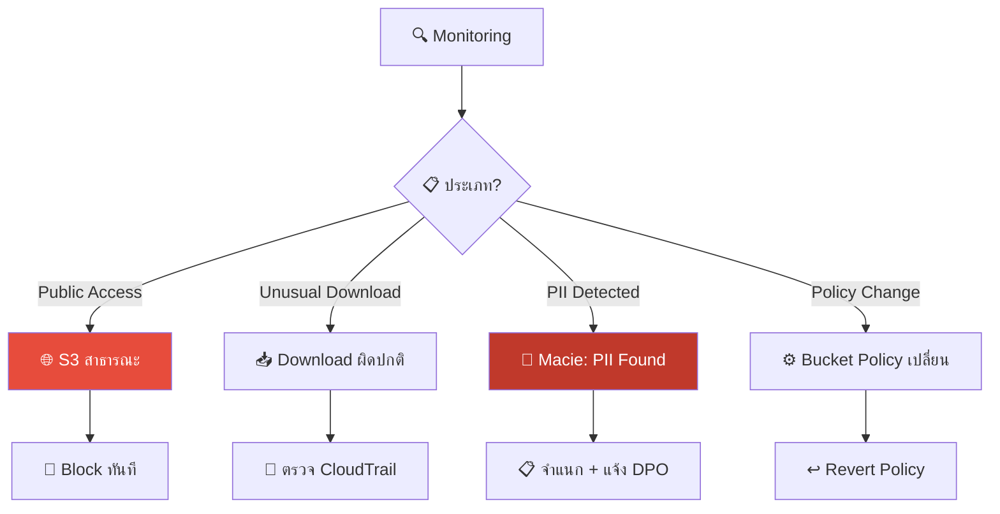
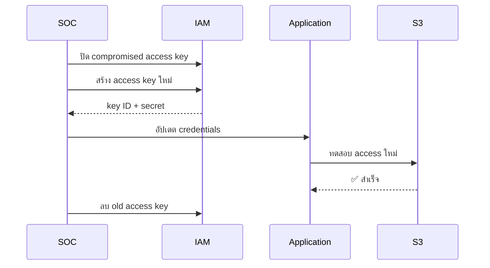
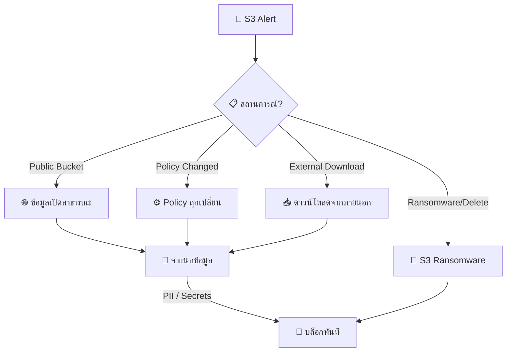
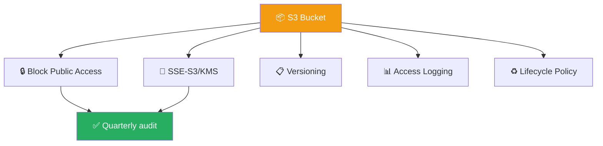
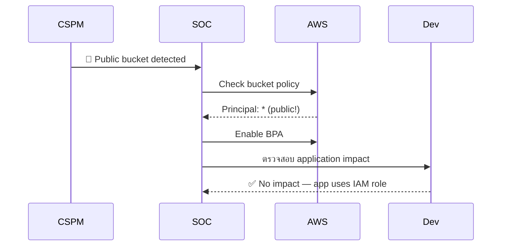

# Playbook: AWS S3 Compromise

**ID**: PB-21
**ระดับความรุนแรง**: สูง/วิกฤต | **หมวดหมู่**: ความปลอดภัยคลาวด์
**MITRE ATT&CK**: [T1530](https://attack.mitre.org/techniques/T1530/) (Data from Cloud Storage)
**ทริกเกอร์**: AWS Config rule violation, GuardDuty S3 finding, Macie PII alert, CloudTrail anomaly

### ผังการตรวจจับ S3 Exposure

### ผังขั้นตอนหมุนเวียน Credentials

---

## ผังการตัดสินใจ

---

## 1. การวิเคราะห์

### 1.1 สถานการณ์ที่พบบ่อย

| สถานการณ์ | ตัวบ่งชี้ | ความรุนแรง |
|:---|:---|:---|
| **Public bucket + PII** | S3 ACL/Policy = public | 🔴 วิกฤต |
| **Policy เปลี่ยนเป็น public** | CloudTrail `PutBucketPolicy` | 🔴 สูง |
| **Download จาก external IP** | S3 access logs | 🔴 สูง |
| **S3 ransomware** | ลบ objects + ransom note | 🔴 วิกฤต |
| **Credentials ใน bucket** | Macie / TruffleHog | 🔴 วิกฤต |

### 1.2 รายการตรวจสอบ

| รายการ | วิธีตรวจสอบ | เสร็จ |
|:---|:---|:---:|
| Bucket name + region + owner tag | AWS Console | ☐ |
| ข้อมูลอะไรใน bucket? จำแนกประเภท | Macie / manual | ☐ |
| เปิดเป็น public? (Policy / ACL) | `aws s3api get-bucket-policy` | ☐ |
| Block Public Access ปิดอยู่? | `aws s3api get-public-access-block` | ☐ |
| ใครเปลี่ยน? เมื่อไหร่? | CloudTrail | ☐ |
| มีข้อมูลถูก download จาก external IP? | S3 access logs | ☐ |
| มี credentials/secrets อยู่ใน bucket? | Secrets scanner | ☐ |
| Versioning เปิดอยู่? | AWS Console | ☐ |

---

## 2. การควบคุม

### 2.1 การดำเนินการทันที

| # | การดำเนินการ | คำสั่ง | เสร็จ |
|:---:|:---|:---|:---:|
| 1 | **Block Public Access** | `aws s3api put-public-access-block --bucket <name> --public-access-block-configuration BlockPublicAcls=true,IgnorePublicAcls=true,BlockPublicPolicy=true,RestrictPublicBuckets=true` | ☐ |
| 2 | **เพิกถอน credentials** ที่เก็บใน S3 | IAM Console | ☐ |
| 3 | **เปิด versioning** เก็บหลักฐาน | `aws s3api put-bucket-versioning --bucket <name> --versioning-configuration Status=Enabled` | ☐ |
| 4 | **Tag** `Status: Compromised` | AWS Console | ☐ |
| 5 | **กู้คืน bucket policy** จาก IaC | Terraform / CFN | ☐ |

### 2.2 หาก Credentials ถูกเปิดเผย

| # | การดำเนินการ | เสร็จ |
|:---:|:---|:---:|
| 1 | หมุนเวียน API keys, access keys, tokens ทั้งหมด | ☐ |
| 2 | ตรวจ CloudTrail ว่า credentials ถูกใช้หรือไม่ | ☐ |
| 3 | หากถูกใช้ → ยกระดับไป [PB-16 Cloud IAM](Cloud_IAM.th.md) | ☐ |

---

## 3. การกำจัด

| # | การดำเนินการ | เสร็จ |
|:---:|:---|:---:|
| 1 | คืนค่า bucket policy ที่ถูกต้อง (จาก IaC) | ☐ |
| 2 | หมุนเวียน credentials ทั้งหมดที่อยู่ใน bucket | ☐ |
| 3 | ตรวจสอบ IAM — จำกัดผู้ที่เปลี่ยน policy ได้ | ☐ |
| 4 | หาก S3 ransomware → กู้คืนจาก versioning / backup | ☐ |

---

## 4. การฟื้นฟู

| # | การดำเนินการ | เสร็จ |
|:---:|:---|:---:|
| 1 | **Block Public Access ระดับ account** (SCP) | ☐ |
| 2 | เปิด **Macie** สำหรับ data classification | ☐ |
| 3 | เปิด **AWS Config rules** (s3-bucket-public-read/write-prohibited) | ☐ |
| 4 | ใช้ **Terraform/CloudFormation** สำหรับ bucket policies | ☐ |
| 5 | เปิด **S3 Object Lock** สำหรับ backup buckets | ☐ |
| 6 | เปิด **Server Access Logging** ทุก bucket | ☐ |

---

## 5. เกณฑ์การยกระดับ

| เงื่อนไข | ยกระดับไปยัง |
|:---|:---|
| PII / ข้อมูลลูกค้าถูกเข้าถึง | Legal + DPO (PDPA 72 ชม.) |
| Credentials เปิดเผยและถูกใช้ | CISO + [PB-16 Cloud IAM](Cloud_IAM.th.md) |
| S3 ransomware (ลบ objects) | [PB-02 Ransomware](Ransomware.th.md) + CISO |
| หลาย buckets/accounts | Major Incident |

---

### ผัง S3 Hardening Checklist

### ผัง Bucket Policy Audit

## เอกสารที่เกี่ยวข้อง

- [กรอบการตอบสนองต่อเหตุการณ์](../Framework.th.md)
- [PB-27 Cloud Storage Exposure](Cloud_Storage_Exposure.th.md)
- [PB-16 Cloud IAM](Cloud_IAM.th.md)

## อ้างอิง

- [MITRE ATT&CK T1530 — Data from Cloud Storage](https://attack.mitre.org/techniques/T1530/)
- [AWS S3 Security Best Practices](https://docs.aws.amazon.com/AmazonS3/latest/userguide/security-best-practices.html)
