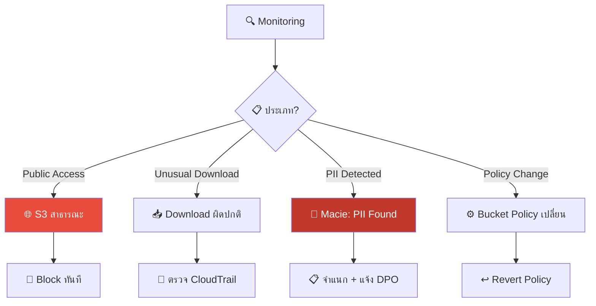
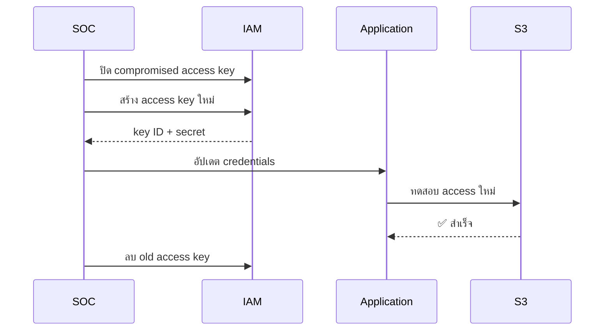
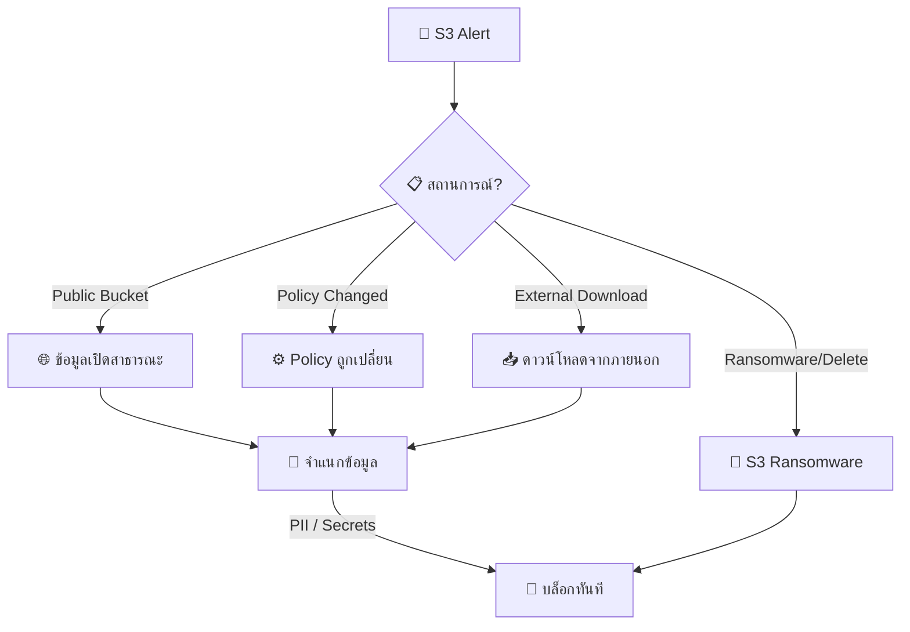
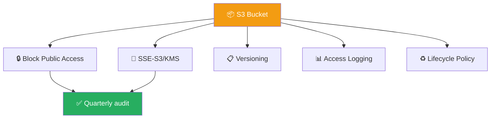
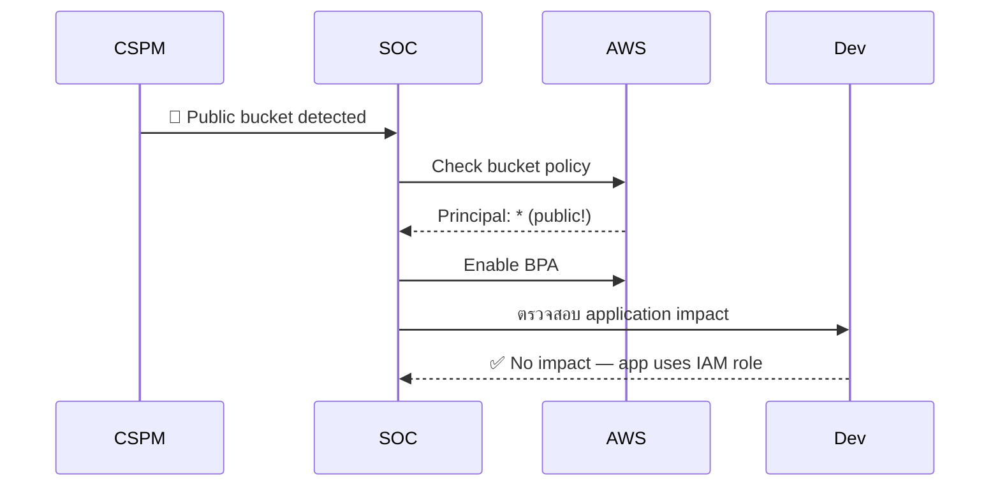

# Playbook: AWS S3 Compromise

**ID**: PB-21
**ระดับความรุนแรง**: สูง/วิกฤต | **หมวดหมู่**: ความปลอดภัยคลาวด์
**MITRE ATT&CK**: [T1530](https://attack.mitre.org/techniques/T1530/) (Data from Cloud Storage)
**ทริกเกอร์**: AWS Config rule violation, GuardDuty S3 finding, Macie PII alert, CloudTrail anomaly

## หลังเหตุการณ์ (Post-Incident)

- [ ] ใช้ S3 Block Public Access เป็น default
- [ ] ทบทวน bucket policies ทั้งหมด
- [ ] ใช้ S3 access logging และ CloudTrail
- [ ] เปิด SSE-KMS encryption สำหรับ sensitive buckets
- [ ] ใช้ VPC endpoints สำหรับ S3 access
- [ ] จัดทำ [Incident Report](../../11_Reporting_Templates/incident_report.th.md)

### ผังการตรวจจับ S3 Exposure

```mermaid
graph TD
    Monitor["🔍 Monitoring"] --> Type{"📋 ประเภท?"}
    Type -->|Public Access| Public["🌐 S3 สาธารณะ"]
    Type -->|Unusual Download| Download["📥 Download ผิดปกติ"]
    Type -->|PII Detected| PII["🔴 Macie: PII Found"]
    Type -->|Policy Change| Policy["⚙️ Bucket Policy เปลี่ยน"]
    Public --> Urgent["🔴 Block ทันที"]
    Download --> Investigate["🔎 ตรวจ CloudTrail"]
    PII --> Classify["📋 จำแนก + แจ้ง DPO"]
    Policy --> Revert["↩️ Revert Policy"]
    style Public fill:#e74c3c,color:#fff
    style PII fill:#c0392b,color:#fff
```

### ผังขั้นตอนหมุนเวียน Credentials

```mermaid
sequenceDiagram
    participant SOC
    participant IAM
    participant App as Application
    participant S3
    SOC->>IAM: ปิด compromised access key
    SOC->>IAM: สร้าง access key ใหม่
    IAM-->>SOC: key ID + secret
    SOC->>App: อัปเดต credentials
    App->>S3: ทดสอบ access ใหม่
    S3-->>App: ✅ สำเร็จ
    SOC->>IAM: ลบ old access key
```

---

## ผังการตัดสินใจ

```mermaid
graph TD
    Alert["🚨 S3 Alert"] --> Type{"📋 สถานการณ์?"}
    Type -->|Public Bucket| Pub["🌐 ข้อมูลเปิดสาธารณะ"]
    Type -->|Policy Changed| Pol["⚙️ Policy ถูกเปลี่ยน"]
    Type -->|External Download| DL["📥 ดาวน์โหลดจากภายนอก"]
    Type -->|Ransomware/Delete| Ransom["🔴 S3 Ransomware"]
    Pub --> Classify["📁 จำแนกข้อมูล"]
    Pol --> Classify
    DL --> Classify
    Classify -->|PII / Secrets| Critical["🔴 บล็อกทันที"]
    Ransom --> Critical
```

---

## 1. การวิเคราะห์

### 1.1 สถานการณ์ที่พบบ่อย

| สถานการณ์ | ตัวบ่งชี้ | ความรุนแรง |
|:---|:---|:---|
| **Public bucket + PII** | S3 ACL/Policy = public | 🔴 วิกฤต |
| **Policy เปลี่ยนเป็น public** | CloudTrail `PutBucketPolicy` | 🔴 สูง |
| **Download จาก external IP** | S3 access logs | 🔴 สูง |
| **S3 ransomware** | ลบ objects + ransom note | 🔴 วิกฤต |
| **Credentials ใน bucket** | Macie / TruffleHog | 🔴 วิกฤต |

### 1.2 รายการตรวจสอบ

| รายการ | วิธีตรวจสอบ | เสร็จ |
|:---|:---|:---:|
| Bucket name + region + owner tag | AWS Console | ☐ |
| ข้อมูลอะไรใน bucket? จำแนกประเภท | Macie / manual | ☐ |
| เปิดเป็น public? (Policy / ACL) | `aws s3api get-bucket-policy` | ☐ |
| Block Public Access ปิดอยู่? | `aws s3api get-public-access-block` | ☐ |
| ใครเปลี่ยน? เมื่อไหร่? | CloudTrail | ☐ |
| มีข้อมูลถูก download จาก external IP? | S3 access logs | ☐ |
| มี credentials/secrets อยู่ใน bucket? | Secrets scanner | ☐ |
| Versioning เปิดอยู่? | AWS Console | ☐ |

---

## 2. การควบคุม

### 2.1 การดำเนินการทันที

| # | การดำเนินการ | คำสั่ง | เสร็จ |
|:---:|:---|:---|:---:|
| 1 | **Block Public Access** | `aws s3api put-public-access-block --bucket <name> --public-access-block-configuration BlockPublicAcls=true,IgnorePublicAcls=true,BlockPublicPolicy=true,RestrictPublicBuckets=true` | ☐ |
| 2 | **เพิกถอน credentials** ที่เก็บใน S3 | IAM Console | ☐ |
| 3 | **เปิด versioning** เก็บหลักฐาน | `aws s3api put-bucket-versioning --bucket <name> --versioning-configuration Status=Enabled` | ☐ |
| 4 | **Tag** `Status: Compromised` | AWS Console | ☐ |
| 5 | **กู้คืน bucket policy** จาก IaC | Terraform / CFN | ☐ |

### 2.2 หาก Credentials ถูกเปิดเผย

| # | การดำเนินการ | เสร็จ |
|:---:|:---|:---:|
| 1 | หมุนเวียน API keys, access keys, tokens ทั้งหมด | ☐ |
| 2 | ตรวจ CloudTrail ว่า credentials ถูกใช้หรือไม่ | ☐ |
| 3 | หากถูกใช้ → ยกระดับไป [PB-16 Cloud IAM](Cloud_IAM.th.md) | ☐ |

---

## 3. การกำจัด

| # | การดำเนินการ | เสร็จ |
|:---:|:---|:---:|
| 1 | คืนค่า bucket policy ที่ถูกต้อง (จาก IaC) | ☐ |
| 2 | หมุนเวียน credentials ทั้งหมดที่อยู่ใน bucket | ☐ |
| 3 | ตรวจสอบ IAM — จำกัดผู้ที่เปลี่ยน policy ได้ | ☐ |
| 4 | หาก S3 ransomware → กู้คืนจาก versioning / backup | ☐ |

---

## 4. การฟื้นฟู

| # | การดำเนินการ | เสร็จ |
|:---:|:---|:---:|
| 1 | **Block Public Access ระดับ account** (SCP) | ☐ |
| 2 | เปิด **Macie** สำหรับ data classification | ☐ |
| 3 | เปิด **AWS Config rules** (s3-bucket-public-read/write-prohibited) | ☐ |
| 4 | ใช้ **Terraform/CloudFormation** สำหรับ bucket policies | ☐ |
| 5 | เปิด **S3 Object Lock** สำหรับ backup buckets | ☐ |
| 6 | เปิด **Server Access Logging** ทุก bucket | ☐ |

---

## 5. Evidence Checklist

| ประเภทหลักฐาน | สิ่งที่ต้องเก็บ | แหล่งข้อมูล | เหตุผลที่ต้องเก็บ |
|:---|:---|:---|:---|
| หลักฐานของ bucket | bucket name, policy diff, ACL, Block Public Access state, versioning state | S3 console / Config / IaC | ใช้พิสูจน์ว่าอะไรเปลี่ยนและ control ไหนล้ม |
| หลักฐานด้านตัวตน | IAM actor, source IP, access key, API path, session context | CloudTrail | ใช้แยกว่าเป็น misconfiguration, insider, หรือ external action |
| หลักฐานการเข้าถึง | object ที่ถูก list/read/delete, requester IP, user agent, data-event timeline | CloudTrail Data Events / access logs | ใช้ดูว่าการเปิดเผยกลายเป็น data loss หรือไม่ |
| หลักฐานความอ่อนไหวของข้อมูล | PII, customer file, credential, source code, backup | Macie / DLP / manual review | ใช้รองรับ breach decision และลำดับความสำคัญการกู้คืน |
| หลักฐานการกู้คืน | versioned object state, delete event, encryption change, backup availability | S3 versioning / backup records | ใช้ตัดสินว่าข้อมูลแค่เปิดเผยหรือถูกเปลี่ยน/ทำลาย |

---

## 6. Minimum Telemetry Required

| แหล่ง Telemetry | ใช้เพื่ออะไร | ความสำคัญ | Blind Spot ถ้าไม่มี |
|:---|:---|:---:|:---|
| CloudTrail management และ data events | ดู policy change, object read/write/delete, actor identity | Required | พิสูจน์ไม่ได้ว่าอะไรเปลี่ยนหรือข้อมูลถูกเข้าถึงหรือไม่ |
| S3 access logging และ requester context | ดู external reader, user agent, source IP | Required | รู้ว่าเปิด public แต่ไม่รู้ว่ามีคนอ่านจริงหรือไม่ |
| Macie, DLP, หรือ classification telemetry | ดูขอบเขตข้อมูลอ่อนไหวและ record count | Required | ขอบเขตการแจ้งเหตุและผลกระทบไม่ชัด |
| Config, IaC, และ guardrail telemetry | ใช้เทียบ planned กับ unplanned policy state | Recommended | analyst อาจตี drift ที่ตั้งใจเป็น incident |
| Backup/versioning visibility | ดูความสามารถในการ restore และผลจากการลบข้อมูล | Recommended | วางแผน recovery ไม่แม่น |

---

## 7. False Positive และ Tuning Guide

| Scenario | ทำไมจึงดูน่าสงสัย | วิธีตรวจสอบ | Tuning Action | ต้องยกระดับเมื่อ |
|:---|:---|:---|:---|:---|
| bucket ของ public static website | public-read อาจตั้งใจใช้จริง | ยืนยัน website bucket tag, owner, และไม่มี object อ่อนไหว | suppress เฉพาะ website bucket ที่อนุมัติ | มี file อ่อนไหว, credential, หรือ write exposure |
| controlled partner data exchange | cross-account/external access อาจถูกต้อง | ยืนยัน partner account, expiry, object prefix, และ ticket | tune เฉพาะ principal และ prefix ที่อนุมัติ | การเข้าถึงขยายเกิน prefix หรือกลายเป็น anonymous/public |
| data migration หรือ backup restore | object write จำนวนมากและ policy change ดูผิดปกติ | ยืนยัน job owner, change window, และ restore plan | ลด severity เฉพาะ role และช่วงเวลาที่อนุมัติ | มี delete, policy broadening, หรือ principal ใหม่ที่ไม่ควรมี |
| security tooling enforcement | Config/guardrail อาจ flip access state เร็ว | ยืนยัน Config rule, remediation role, และ change ticket | allowlist remediation role ที่ documented | role เดียวกันปิด logging หรือสร้าง broad access เพิ่ม |

---

## 8. เกณฑ์การยกระดับ

| เงื่อนไข | ยกระดับไปยัง |
|:---|:---|
| PII / ข้อมูลลูกค้าถูกเข้าถึง | Legal + DPO (PDPA 72 ชม.) |
| Credentials เปิดเผยและถูกใช้ | CISO + [PB-16 Cloud IAM](Cloud_IAM.th.md) |
| S3 ransomware (ลบ objects) | [PB-02 Ransomware](Ransomware.th.md) + CISO |
| หลาย buckets/accounts | Major Incident |

---

### ผัง S3 Hardening Checklist

```mermaid
graph TD
    S3["📦 S3 Bucket"] --> BPA["🔒 Block Public Access"]
    S3 --> Encrypt["🔐 SSE-S3/KMS"]
    S3 --> Version["📋 Versioning"]
    S3 --> Logging["📊 Access Logging"]
    S3 --> Lifecycle["♻️ Lifecycle Policy"]
    BPA --> Audit["✅ Quarterly audit"]
    Encrypt --> Audit
    style S3 fill:#f39c12,color:#fff
    style Audit fill:#27ae60,color:#fff
```

### ผัง Bucket Policy Audit

```mermaid
sequenceDiagram
    participant CSPM
    participant SOC
    participant AWS
    participant Dev
    CSPM->>SOC: 🚨 Public bucket detected
    SOC->>AWS: Check bucket policy
    AWS-->>SOC: Principal: * (public!)
    SOC->>AWS: Enable BPA
    SOC->>Dev: ตรวจสอบ application impact
    Dev-->>SOC: ✅ No impact — app uses IAM role
```

## กฎตรวจจับ (Sigma)

| กฎ | ไฟล์ |
|:---|:---|
| AWS S3 Public Access Enabled | [cloud_aws_s3_public_access.yml](../../08_Detection_Engineering/sigma_rules/cloud_aws_s3_public_access.yml) |
| Cloud Storage Public Access | [cloud_storage_public_access.yml](../../08_Detection_Engineering/sigma_rules/cloud_storage_public_access.yml) |

## เอกสารที่เกี่ยวข้อง

- [กรอบการตอบสนองต่อเหตุการณ์](../Framework.th.md)
- [PB-27 Cloud Storage Exposure](Cloud_Storage_Exposure.th.md)
- [PB-16 Cloud IAM](Cloud_IAM.th.md)

## S3 Security Assessment

| Check | Finding | Severity |
|:---|:---|:---|
| Public access block | Disabled | Critical |
| Bucket policy | Allow * | Critical |
| ACL grants | Public read/write | Critical |
| Encryption | Not enabled | High |
| Versioning | Disabled | Medium |
| Logging | Not enabled | Medium |

### S3 Incident Response Steps

| Step | Action | AWS CLI |
|:---|:---|:---|
| 1 | Block public access | `put-public-access-block` |
| 2 | Review bucket policy | `get-bucket-policy` |
| 3 | Check access logs | S3 server access logs |
| 4 | Identify exposed data | `list-objects-v2` |
| 5 | Assess data sensitivity | Manual review |
| 6 | Enable encryption | `put-bucket-encryption` |

### S3 Monitoring Checklist

| Monitor | Tool | Frequency |
|:---|:---|:---|
| Public access | Config Rules | Real-time |
| Data access patterns | CloudTrail | Daily review |
| Encryption status | S3 inventory | Weekly |

### Data Exposure Impact

| Data Type | Notification Required |
|:---|:---|
| PII | PDPA + affected users |
| Credentials | Rotate + notify owners |
| Internal docs | Risk assessment only |

## References

- [MITRE ATT&CK T1530 — Data from Cloud Storage](https://attack.mitre.org/techniques/T1530/)
- [AWS S3 Security Best Practices](https://docs.aws.amazon.com/AmazonS3/latest/userguide/security-best-practices.html)
