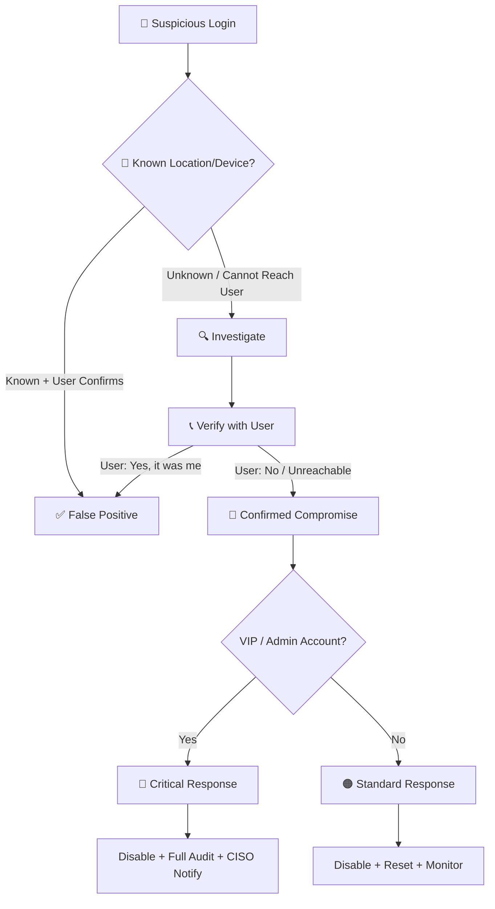

# Playbook: Account Compromise / Unauthorized Access

**ID**: PB-05
**Severity**: High/Critical | **Category**: Identity & Access
**MITRE ATT&CK**: [T1078](https://attack.mitre.org/techniques/T1078/) (Valid Accounts), [T1110](https://attack.mitre.org/techniques/T1110/) (Brute Force)
**Trigger**: SIEM alert (unusual login location/time), User report ("I didn't log in"), UEBA anomaly

---

## Decision Flow

---

## 1. Analysis

### 1.1 Login Context Review

| Check | How | Done |
|:---|:---|:---:|
| Login source IP/location | SIEM, IdP logs, GeoIP | ☐ |
| Device fingerprint | Known device or new? | ☐ |
| Login time | Normal business hours? | ☐ |
| Impossible travel | Multiple logins from distant locations in short time? | ☐ |
| VPN/proxy usage | Is source IP a known VPN/Tor exit? | ☐ |

### 1.2 Post-Login Activity Audit

| Activity | What to Check | Tool | Done |
|:---|:---|:---|:---:|
| **Email rules** | New forwarding rules, redirects, delegates | M365 / Google Admin | ☐ |
| **MFA changes** | New MFA device enrolled, backup codes generated | IdP audit log | ☐ |
| **OAuth consents** | New application authorized | Azure AD / Google | ☐ |
| **API keys** | New keys or tokens created | Cloud console | ☐ |
| **File access** | Unusual file downloads or sharing | DLP, Cloud audit | ☐ |
| **Admin actions** | Role changes, new accounts created | AD / IdP logs | ☐ |
| **Lateral movement** | RDP/SSH to other hosts | SIEM, EDR | ☐ |

### 1.3 Scope Assessment

- [ ] Is only one account affected, or multiple?
- [ ] Were any admin/service accounts compromised?
- [ ] Any data accessed or exfiltrated?
- [ ] How was the account compromised? (phishing, credential stuffing, leaked password)

---

## 2. Containment

### 2.1 Immediate Actions (within 10 minutes)

| # | Action | Tool | Done |
|:---:|:---|:---|:---:|
| 1 | **Disable account** in AD/IdP | AD / Okta / Azure AD | ☐ |
| 2 | **Revoke all sessions** — kill active tokens | IdP session management | ☐ |
| 3 | **Block source IP** at firewall (if external) | Firewall | ☐ |
| 4 | **Isolate endpoint** if device is involved | EDR | ☐ |

### 2.2 If Admin/VIP Account

| # | Additional Action | Done |
|:---:|:---|:---:|
| 1 | Review all admin actions taken during compromise window | ☐ |
| 2 | Check for new accounts or role assignments created by attacker | ☐ |
| 3 | Audit privileged group memberships | ☐ |
| 4 | Rotate service account credentials if accessed | ☐ |
| 5 | Notify CISO | ☐ |

---

## 3. Eradication

| # | Action | Done |
|:---:|:---|:---:|
| 1 | **Reset password** to a strong, unique value | ☐ |
| 2 | **Reset MFA** — remove all devices, re-enroll with user verification | ☐ |
| 3 | Remove unauthorized email forwarding rules | ☐ |
| 4 | Revoke unauthorized OAuth/application consents | ☐ |
| 5 | Delete any API keys/tokens created during compromise | ☐ |
| 6 | Check for persistence: Azure AD app registrations, service principals | ☐ |
| 7 | If password was reused: notify user to change on all other services | ☐ |

---

## 4. Recovery

| # | Action | Done |
|:---:|:---|:---:|
| 1 | Re-enable account after password + MFA reset | ☐ |
| 2 | Add user to "High Risk" monitoring group for 48 hours | ☐ |
| 3 | Verify user can access normally from expected location | ☐ |
| 4 | Send targeted awareness note to affected user | ☐ |

---

## 5. IoC Collection

| Type | Value | Source |
|:---|:---|:---|
| Attacker IP | | SIEM / IdP |
| Attacker GeoLocation | | GeoIP |
| User-Agent string | | IdP logs |
| Compromised account | | Alert |
| Attacker actions | | Audit log |
| Data accessed | | DLP / Cloud audit |

---

## 6. Escalation Criteria

| Condition | Escalate To |
|:---|:---|
| Admin/service account compromised | SOC Lead + CISO |
| Multiple accounts compromised | Major Incident |
| Data exfiltration confirmed | [PB-08](Data_Exfiltration.en.md) + Legal |
| Part of credential stuffing campaign | Threat Intel team |
| Phishing was the entry vector | Cross-reference [PB-01](Phishing.en.md) |

---

## Related Documents

- [IR Framework](../Framework.en.md)
- [Incident Report](../../templates/incident_report.en.md)
- [PB-01 Phishing](Phishing.en.md)
- [PB-04 Brute Force](Brute_Force.en.md)
- [PB-06 Impossible Travel](Impossible_Travel.en.md)

## References

- [MITRE ATT&CK T1078 — Valid Accounts](https://attack.mitre.org/techniques/T1078/)
- [CISA Account Security](https://www.cisa.gov/secure-our-world)
- [NIST SP 800-63 — Digital Identity Guidelines](https://pages.nist.gov/800-63-3/)
