# Playbook: Account Compromise / Unauthorized Access

**ID**: PB-05
**Severity**: High/Critical | **Category**: Identity & Access
**MITRE ATT&CK**: [T1078](https://attack.mitre.org/techniques/T1078/) (Valid Accounts), [T1110](https://attack.mitre.org/techniques/T1110/) (Brute Force)
**Trigger**: Identity Protection alert, Impossible travel / anomalous token, User report, TI credential leak

### Account Compromise Lifecycle

```mermaid
graph LR
    Cred["🔑 Get Credential"] --> Login["🔓 Login"]
    Login --> Persist["⚙️ Establish Persistence"]
    Persist --> Pivot["🔀 Pivot / BEC"]
    Pivot --> Exfil["📤 Exfiltrate Data"]
    style Cred fill:#e74c3c,color:#fff
    style Login fill:#f39c12,color:#fff
    style Persist fill:#e67e22,color:#fff
    style Pivot fill:#8e44ad,color:#fff
    style Exfil fill:#c0392b,color:#fff
```

### Response Sequence

```mermaid
sequenceDiagram
    participant IdP
    participant SOC
    participant User
    participant Exchange
    IdP->>SOC: 🚨 Risk detection
    SOC->>IdP: Revoke all sessions
    SOC->>IdP: Reset password
    SOC->>User: ☎️ Verify identity (phone)
    SOC->>Exchange: Check inbox rules
    Exchange-->>SOC: Found forwarding rule!
    SOC->>Exchange: Remove malicious rules
    SOC->>IdP: Re-register MFA
```

---

## Decision Flow

```mermaid
graph TD
    Alert["🚨 Suspicious Login"] --> Context{"📍 Known Location/Device?"}
    Context -->|Known + User Confirms| FP["✅ False Positive"]
    Context -->|Unknown / Cannot Reach User| Investigate["🔍 Investigate"]
    Investigate --> Contact["📞 Verify with User"]
    Contact -->|User: Yes, it was me| FP
    Contact -->|User: No / Unreachable| Compromised["🚨 Confirmed Compromise"]
    Compromised --> Severity{"VIP / Admin Account?"}
    Severity -->|Yes| Critical["🔴 Critical Response"]
    Severity -->|No| Standard["🟠 Standard Response"]
    Critical --> FullLock["Disable + Full Audit + CISO Notify"]
    Standard --> Lock["Disable + Reset + Monitor"]
```

---

## 1. Analysis

### 1.1 Login Context Review

| Check | How | Done |
|:---|:---|:---:|
| Login source IP/location | SIEM, IdP logs, GeoIP | ☐ |
| Device fingerprint | Known device or new? | ☐ |
| Login time | Normal business hours? | ☐ |
| Impossible travel | Multiple logins from distant locations in short time? | ☐ |
| VPN/proxy usage | Is source IP a known VPN/Tor exit? | ☐ |

### 1.2 Post-Login Activity Audit

| Activity | What to Check | Tool | Done |
|:---|:---|:---|:---:|
| **Email rules** | New forwarding rules, redirects, delegates | M365 / Google Admin | ☐ |
| **MFA changes** | New MFA device enrolled, backup codes generated | IdP audit log | ☐ |
| **OAuth consents** | New application authorized | Azure AD / Google | ☐ |
| **API keys** | New keys or tokens created | Cloud console | ☐ |
| **File access** | Unusual file downloads or sharing | DLP, Cloud audit | ☐ |
| **Admin actions** | Role changes, new accounts created | AD / IdP logs | ☐ |
| **Lateral movement** | RDP/SSH to other hosts | SIEM, EDR | ☐ |

### 1.3 Scope Assessment

- [ ] Is only one account affected, or multiple?
- [ ] Were any admin/service accounts compromised?
- [ ] Any data accessed or exfiltrated?
- [ ] How was the account compromised? (phishing, credential stuffing, leaked password)

---

## 2. Containment

### 2.1 Immediate Actions (within 10 minutes)

| # | Action | Tool | Done |
|:---:|:---|:---|:---:|
| 1 | **Disable account** in AD/IdP | AD / Okta / Azure AD | ☐ |
| 2 | **Revoke all sessions** — kill active tokens | IdP session management | ☐ |
| 3 | **Block source IP** at firewall (if external) | Firewall | ☐ |
| 4 | **Isolate endpoint** if device is involved | EDR | ☐ |

### 2.2 If Admin/VIP Account

| # | Additional Action | Done |
|:---:|:---|:---:|
| 1 | Review all admin actions taken during compromise window | ☐ |
| 2 | Check for new accounts or role assignments created by attacker | ☐ |
| 3 | Audit privileged group memberships | ☐ |
| 4 | Rotate service account credentials if accessed | ☐ |
| 5 | Notify CISO | ☐ |

---

## 3. Eradication

| # | Action | Done |
|:---:|:---|:---:|
| 1 | **Reset password** to a strong, unique value | ☐ |
| 2 | **Reset MFA** — remove all devices, re-enroll with user verification | ☐ |
| 3 | Remove unauthorized email forwarding rules | ☐ |
| 4 | Revoke unauthorized OAuth/application consents | ☐ |
| 5 | Delete any API keys/tokens created during compromise | ☐ |
| 6 | Check for persistence: Azure AD app registrations, service principals | ☐ |
| 7 | If password was reused: notify user to change on all other services | ☐ |

---

## 4. Recovery

| # | Action | Done |
|:---:|:---|:---:|
| 1 | Re-enable account after password + MFA reset | ☐ |
| 2 | Add user to "High Risk" monitoring group for 48 hours | ☐ |
| 3 | Verify user can access normally from expected location | ☐ |
| 4 | Send targeted awareness note to affected user | ☐ |

---

## 5. IoC Collection

| Type | Value | Source |
|:---|:---|:---|
| Attacker IP | | SIEM / IdP |
| Attacker GeoLocation | | GeoIP |
| User-Agent string | | IdP logs |
| Compromised account | | Alert |
| Attacker actions | | Audit log |
| Data accessed | | DLP / Cloud audit |

---

## 6. Escalation Criteria

| Condition | Escalate To |
|:---|:---|
| Admin/service account compromised | SOC Lead + CISO |
| Multiple accounts compromised | Major Incident |
| Data exfiltration confirmed | [PB-08](Data_Exfiltration.en.md) + Legal |
| Part of credential stuffing campaign | Threat Intel team |
| Phishing was the entry vector | Cross-reference [PB-01](Phishing.en.md) |

---

### Post-Compromise Activity Check

```mermaid
graph TD
    Compromise["🔴 Account Compromised"] --> Email["📧 Inbox rules?"]
    Compromise --> OAuth["🔑 OAuth apps?"]
    Compromise --> MFA["📱 MFA changed?"]
    Compromise --> Data["📁 Data accessed?"]
    Email --> Clean["🧹 Remove"]
    OAuth --> Clean
    MFA --> Reset["🔄 Reset MFA"]
    Data --> DLP["📊 DLP report"]
    style Compromise fill:#e74c3c,color:#fff
```

### Identity Protection Layers

```mermaid
graph LR
    User["👤 User"] --> MFA2["📱 MFA"]
    MFA2 --> CA["🛡️ Conditional Access"]
    CA --> PIM["🔑 PIM"]
    PIM --> PAM["🏰 PAM"]
    PAM --> Monitor["👁️ UEBA"]
    style MFA2 fill:#3498db,color:#fff
    style CA fill:#27ae60,color:#fff
    style PAM fill:#f39c12,color:#fff
    style Monitor fill:#e74c3c,color:#fff
```

## Related Documents

- [IR Framework](../Framework.en.md)
- [Incident Report](../../templates/incident_report.en.md)
- [PB-01 Phishing](Phishing.en.md)
- [PB-04 Brute Force](Brute_Force.en.md)
- [PB-06 Impossible Travel](Impossible_Travel.en.md)

## References

- [MITRE ATT&CK T1078 — Valid Accounts](https://attack.mitre.org/techniques/T1078/)
- [CISA Account Security](https://www.cisa.gov/secure-our-world)
- [NIST SP 800-63 — Digital Identity Guidelines](https://pages.nist.gov/800-63-3/)
