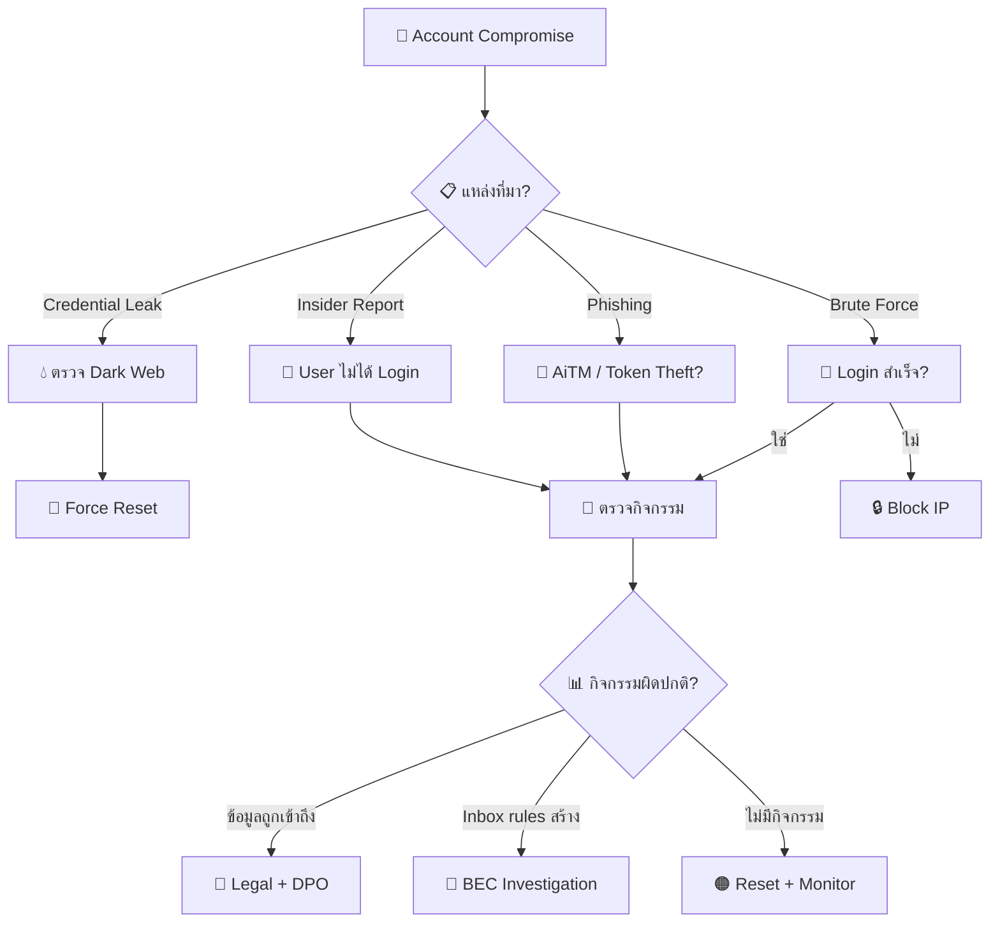
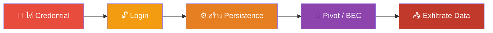
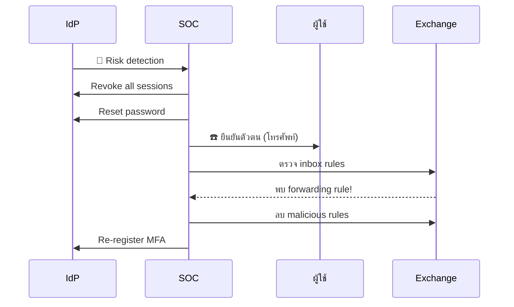
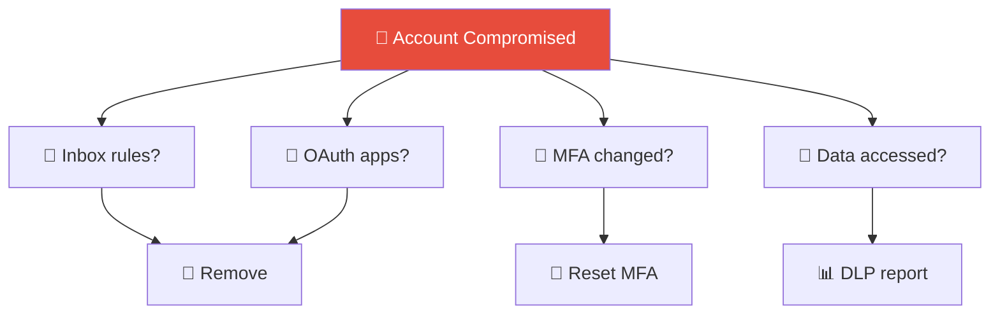

# Playbook: บัญชีถูกบุกรุก (Account Compromise)

**ID**: PB-05
**ระดับความรุนแรง**: สูง | **หมวดหมู่**: Identity & Access
**MITRE ATT&CK**: [T1078](https://attack.mitre.org/techniques/T1078/) (Valid Accounts), [T1110](https://attack.mitre.org/techniques/T1110/) (Brute Force)
**ทริกเกอร์**: Identity Protection alert, SIEM (impossible travel, anomalous activity), leaked credential alert, ผู้ใช้รายงาน

---

## ผังการตัดสินใจ

---

## 1. การวิเคราะห์

### 1.1 ตัวบ่งชี้การบุกรุกบัญชี

| ตัวบ่งชี้ | วิธีตรวจสอบ | ความรุนแรง |
|:---|:---|:---|
| **Login จาก IP/ประเทศผิดปกติ** | Sign-in logs / GeoIP | 🟠 สูง |
| **MFA ถูกปิดหรือเปลี่ยน** | IdP audit logs | 🔴 วิกฤต |
| **Inbox forwarding rules** สร้างใหม่ | Exchange audit | 🔴 สูง |
| **OAuth apps** ถูก consent | Enterprise Apps | 🔴 สูง |
| **Credential ใน breach database** | Have I Been Pwned / TI | 🟠 สูง |
| **Password spray สำเร็จ** | SIEM (Event 4624 after 4625s) | 🔴 สูง |

### 1.2 รายการตรวจสอบ

| รายการ | วิธีตรวจสอบ | เสร็จ |
|:---|:---|:---:|
| บัญชีที่ได้รับผลกระทบ (+role/privileges) | IdP | ☐ |
| Sign-in details (IP, device, client app, MFA method) | Sign-in logs | ☐ |
| Credential source (leak, phishing, brute force) | TI / SIEM | ☐ |
| กิจกรรมหลัง login (files accessed, emails sent) | Cloud audit | ☐ |
| Inbox rules / forwarding สร้างใหม่? | Exchange audit | ☐ |
| OAuth apps ถูก consent? | Enterprise Apps | ☐ |
| MFA methods เปลี่ยน? | IdP audit | ☐ |
| มีบัญชีอื่นถูกบุกรุกด้วย? (same password) | SIEM pivot | ☐ |
| ข้อมูลอะไรถูกเข้าถึง? | File audit / DLP | ☐ |

### 1.3 กิจกรรมหลังบุกรุก (Post-Compromise)

| กิจกรรม | ตรวจสอบ | เสร็จ |
|:---|:---|:---:|
| ดาวน์โหลดข้อมูลจาก SharePoint/OneDrive | Cloud audit | ☐ |
| ส่งอีเมลไปยัง external (BEC attempt) | Message trace | ☐ |
| สร้าง inbox rules (auto-delete/forward) | Get-InboxRule | ☐ |
| เพิ่ม delegates/permissions | Get-MailboxPermission | ☐ |
| consent OAuth app (Mail.Read/Send) | Enterprise Apps | ☐ |
| Password/MFA เปลี่ยน | IdP audit | ☐ |
| เข้าถึง VPN/internal applications | VPN/App logs | ☐ |

### วงจรชีวิตการบุกรุกบัญชี

### ผังขั้นตอนการตอบสนอง

---

## 2. การควบคุม

| # | การดำเนินการ | เครื่องมือ | เสร็จ |
|:---:|:---|:---|:---:|
| 1 | **รีเซ็ตรหัสผ่าน** ทันที (out-of-band) | IdP admin | ☐ |
| 2 | **เพิกถอน sessions** และ refresh tokens ทั้งหมด | IdP admin | ☐ |
| 3 | **ลบ inbox forwarding rules** ที่อันตราย | Exchange admin | ☐ |
| 4 | **ลบ OAuth apps** ที่ไม่ได้รับอนุมัติ | Enterprise Apps | ☐ |
| 5 | **Block** source IP ที่ firewall/proxy | Security tools | ☐ |
| 6 | **ตรวจ** shared/similar passwords กับบัญชีอื่น | Password audit | ☐ |

---

## 3. การกำจัด

| # | การดำเนินการ | เสร็จ |
|:---:|:---|:---:|
| 1 | ลงทะเบียน **MFA ใหม่** (FIDO2/passkeys ถ้าเป็นไปได้) | ☐ |
| 2 | ลบ delegates/permissions ที่เพิ่มมา | ☐ |
| 3 | ลบ app registrations / credentials ที่สร้างระหว่างโจมตี | ☐ |
| 4 | ตรวจว่า attacker ส่งอีเมลหลอกจากบัญชีนี้ → แจ้ง recipients | ☐ |

---

## 4. การฟื้นฟู

| # | การดำเนินการ | เสร็จ |
|:---:|:---|:---:|
| 1 | เปิด **Credential Leak Monitoring** (dark web) | ☐ |
| 2 | บังคับ **Phishing-resistant MFA** (FIDO2/passkeys) | ☐ |
| 3 | เปิด **CAE** (Continuous Access Evaluation) | ☐ |
| 4 | บังคับ **Password Complexity** + ห้ามใช้ซ้ำ | ☐ |
| 5 | ใช้ **Conditional Access** (location, device compliance) | ☐ |
| 6 | **Security awareness training** สำหรับ phishing | ☐ |

---

## 5. เกณฑ์การยกระดับ

| เงื่อนไข | ยกระดับไปยัง |
|:---|:---|
| Admin/privileged account | CISO ทันที |
| BEC indicators (inbox rules + financial requests) | [PB-17 BEC](BEC.th.md) |
| ข้อมูลสำคัญถูกเข้าถึง/ดาวน์โหลด | [PB-08 Data Exfil](Data_Exfiltration.th.md) + Legal |
| Token theft / AiTM | [PB-26 MFA Bypass](MFA_Bypass.th.md) |
| หลายบัญชีถูกบุกรุก (same campaign) | Major Incident |
| Lateral movement ตรวจพบ | [PB-09 Lateral Movement](Lateral_Movement.th.md) |

---

### ผัง Post-Compromise Activity Check

### ผัง Identity Protection Layers

## เอกสารที่เกี่ยวข้อง

- [กรอบการตอบสนองต่อเหตุการณ์](../Framework.th.md)
- [PB-04 Brute Force](Brute_Force.th.md)
- [PB-01 ฟิชชิง](Phishing.th.md)

## อ้างอิง

- [MITRE ATT&CK T1078 — Valid Accounts](https://attack.mitre.org/techniques/T1078/)
