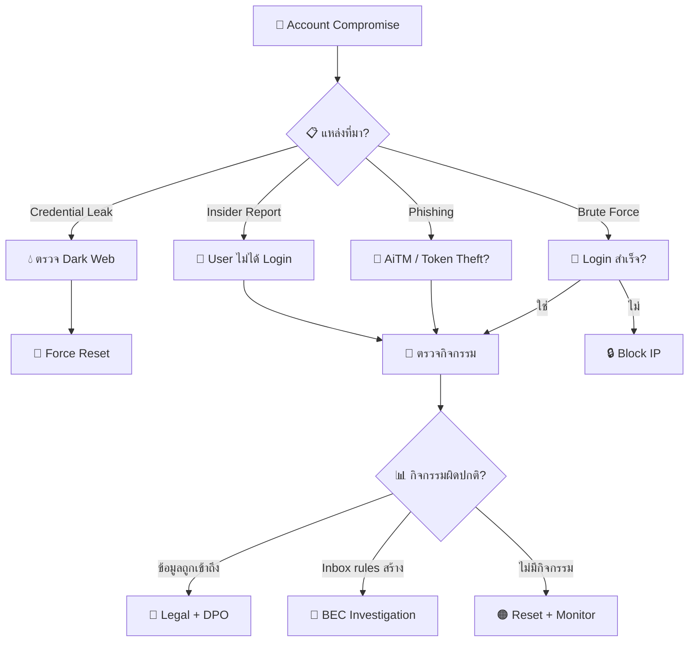
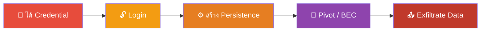
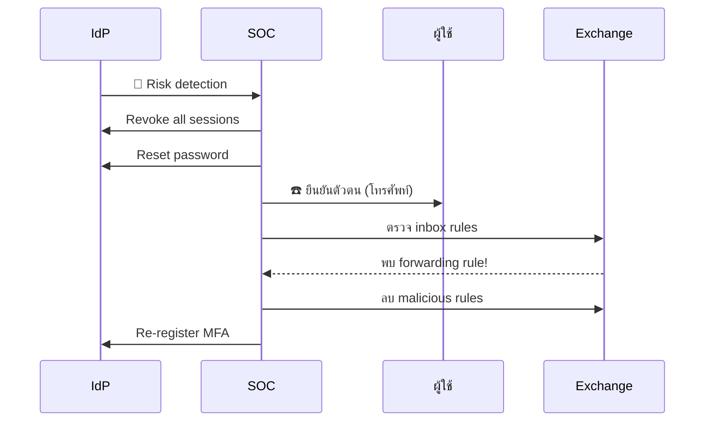
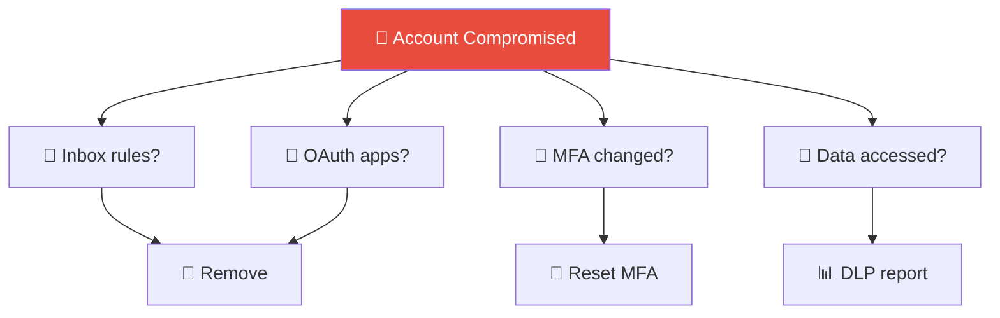
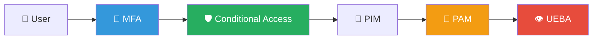

# Playbook: บัญชีถูกบุกรุก (Account Compromise)

**ID**: PB-05
**ระดับความรุนแรง**: สูง | **หมวดหมู่**: Identity & Access
**MITRE ATT&CK**: [T1078](https://attack.mitre.org/techniques/T1078/) (Valid Accounts), [T1110](https://attack.mitre.org/techniques/T1110/) (Brute Force)
**ทริกเกอร์**: Identity Protection alert, SIEM (impossible travel, anomalous activity), leaked credential alert, ผู้ใช้รายงาน

---

## ผังการตัดสินใจ

```mermaid
graph TD
    Alert["🚨 Account Compromise"] --> Source{"📋 แหล่งที่มา?"}
    Source -->|Credential Leak| Leak["💧 ตรวจ Dark Web"]
    Source -->|Brute Force| BF["🔑 Login สำเร็จ?"]
    Source -->|Phishing| Phish["📧 AiTM / Token Theft?"]
    Source -->|Insider Report| Report["👤 User ไม่ได้ Login"]
    Leak --> Reset["🔐 Force Reset"]
    BF -->|ใช่| Investigate["🔎 ตรวจกิจกรรม"]
    BF -->|ไม่| Block["🔒 Block IP"]
    Phish --> Investigate
    Report --> Investigate
    Investigate --> Impact{"📊 กิจกรรมผิดปกติ?"}
    Impact -->|ข้อมูลถูกเข้าถึง| Data["🔴 Legal + DPO"]
    Impact -->|Inbox rules สร้าง| BEC["🔴 BEC Investigation"]
    Impact -->|ไม่มีกิจกรรม| Contain["🟠 Reset + Monitor"]
```

---

## หลังเหตุการณ์ (Post-Incident)

- [ ] ทบทวนนโยบาย authentication (บังคับ MFA ทุกบัญชี)
- [ ] อัพเดท Conditional Access policies ตาม attack vector
- [ ] ใช้ sign-in risk policies (Azure AD / Okta)
- [ ] ตรวจสอบและเพิกถอน OAuth app consents ที่ค้าง
- [ ] สร้าง Sigma rule สำหรับรูปแบบ credential abuse ที่พบ
- [ ] จัดทำ [Incident Report](../../11_Reporting_Templates/incident_report.th.md)

## 1. การวิเคราะห์

### 1.1 ตัวบ่งชี้การบุกรุกบัญชี

| ตัวบ่งชี้ | วิธีตรวจสอบ | ความรุนแรง |
|:---|:---|:---|
| **Login จาก IP/ประเทศผิดปกติ** | Sign-in logs / GeoIP | 🟠 สูง |
| **MFA ถูกปิดหรือเปลี่ยน** | IdP audit logs | 🔴 วิกฤต |
| **Inbox forwarding rules** สร้างใหม่ | Exchange audit | 🔴 สูง |
| **OAuth apps** ถูก consent | Enterprise Apps | 🔴 สูง |
| **Credential ใน breach database** | Have I Been Pwned / TI | 🟠 สูง |
| **Password spray สำเร็จ** | SIEM (Event 4624 after 4625s) | 🔴 สูง |

### 1.2 รายการตรวจสอบ

| รายการ | วิธีตรวจสอบ | เสร็จ |
|:---|:---|:---:|
| บัญชีที่ได้รับผลกระทบ (+role/privileges) | IdP | ☐ |
| Sign-in details (IP, device, client app, MFA method) | Sign-in logs | ☐ |
| Credential source (leak, phishing, brute force) | TI / SIEM | ☐ |
| กิจกรรมหลัง login (files accessed, emails sent) | Cloud audit | ☐ |
| Inbox rules / forwarding สร้างใหม่? | Exchange audit | ☐ |
| OAuth apps ถูก consent? | Enterprise Apps | ☐ |
| MFA methods เปลี่ยน? | IdP audit | ☐ |
| มีบัญชีอื่นถูกบุกรุกด้วย? (same password) | SIEM pivot | ☐ |
| ข้อมูลอะไรถูกเข้าถึง? | File audit / DLP | ☐ |

### 1.3 กิจกรรมหลังบุกรุก (Post-Compromise)

| กิจกรรม | ตรวจสอบ | เสร็จ |
|:---|:---|:---:|
| ดาวน์โหลดข้อมูลจาก SharePoint/OneDrive | Cloud audit | ☐ |
| ส่งอีเมลไปยัง external (BEC attempt) | Message trace | ☐ |
| สร้าง inbox rules (auto-delete/forward) | Get-InboxRule | ☐ |
| เพิ่ม delegates/permissions | Get-MailboxPermission | ☐ |
| consent OAuth app (Mail.Read/Send) | Enterprise Apps | ☐ |
| Password/MFA เปลี่ยน | IdP audit | ☐ |
| เข้าถึง VPN/internal applications | VPN/App logs | ☐ |

### วงจรชีวิตการบุกรุกบัญชี

```mermaid
graph LR
    Cred["🔑 ได้ Credential"] --> Login["🔓 Login"]
    Login --> Persist["⚙️ สร้าง Persistence"]
    Persist --> Pivot["🔀 Pivot / BEC"]
    Pivot --> Exfil["📤 Exfiltrate Data"]
    style Cred fill:#e74c3c,color:#fff
    style Login fill:#f39c12,color:#fff
    style Persist fill:#e67e22,color:#fff
    style Pivot fill:#8e44ad,color:#fff
    style Exfil fill:#c0392b,color:#fff
```

### ผังขั้นตอนการตอบสนอง

```mermaid
sequenceDiagram
    participant IdP
    participant SOC
    participant User as ผู้ใช้
    participant Exchange
    IdP->>SOC: 🚨 Risk detection
    SOC->>IdP: Revoke all sessions
    SOC->>IdP: Reset password
    SOC->>User: ☎️ ยืนยันตัวตน (โทรศัพท์)
    SOC->>Exchange: ตรวจ inbox rules
    Exchange-->>SOC: พบ forwarding rule!
    SOC->>Exchange: ลบ malicious rules
    SOC->>IdP: Re-register MFA
```

---

## 2. การควบคุม

| # | การดำเนินการ | เครื่องมือ | เสร็จ |
|:---:|:---|:---|:---:|
| 1 | **รีเซ็ตรหัสผ่าน** ทันที (out-of-band) | IdP admin | ☐ |
| 2 | **เพิกถอน sessions** และ refresh tokens ทั้งหมด | IdP admin | ☐ |
| 3 | **ลบ inbox forwarding rules** ที่อันตราย | Exchange admin | ☐ |
| 4 | **ลบ OAuth apps** ที่ไม่ได้รับอนุมัติ | Enterprise Apps | ☐ |
| 5 | **Block** source IP ที่ firewall/proxy | Security tools | ☐ |
| 6 | **ตรวจ** shared/similar passwords กับบัญชีอื่น | Password audit | ☐ |

---

## 3. การกำจัด

| # | การดำเนินการ | เสร็จ |
|:---:|:---|:---:|
| 1 | ลงทะเบียน **MFA ใหม่** (FIDO2/passkeys ถ้าเป็นไปได้) | ☐ |
| 2 | ลบ delegates/permissions ที่เพิ่มมา | ☐ |
| 3 | ลบ app registrations / credentials ที่สร้างระหว่างโจมตี | ☐ |
| 4 | ตรวจว่า attacker ส่งอีเมลหลอกจากบัญชีนี้ → แจ้ง recipients | ☐ |

---

## 4. การฟื้นฟู

| # | การดำเนินการ | เสร็จ |
|:---:|:---|:---:|
| 1 | เปิด **Credential Leak Monitoring** (dark web) | ☐ |
| 2 | บังคับ **Phishing-resistant MFA** (FIDO2/passkeys) | ☐ |
| 3 | เปิด **CAE** (Continuous Access Evaluation) | ☐ |
| 4 | บังคับ **Password Complexity** + ห้ามใช้ซ้ำ | ☐ |
| 5 | ใช้ **Conditional Access** (location, device compliance) | ☐ |
| 6 | **Security awareness training** สำหรับ phishing | ☐ |

---

## 5. เกณฑ์การยกระดับ

| เงื่อนไข | ยกระดับไปยัง |
|:---|:---|
| Admin/privileged account | CISO ทันที |
| BEC indicators (inbox rules + financial requests) | [PB-17 BEC](BEC.th.md) |
| ข้อมูลสำคัญถูกเข้าถึง/ดาวน์โหลด | [PB-08 Data Exfil](Data_Exfiltration.th.md) + Legal |
| Token theft / AiTM | [PB-26 MFA Bypass](MFA_Bypass.th.md) |
| หลายบัญชีถูกบุกรุก (same campaign) | Major Incident |
| Lateral movement ตรวจพบ | [PB-09 Lateral Movement](Lateral_Movement.th.md) |

---

## 6. Evidence Checklist

| ประเภทหลักฐาน | สิ่งที่ต้องเก็บ | แหล่งข้อมูล | เหตุผลที่ต้องเก็บ |
|:---|:---|:---|:---|
| หลักฐานด้านตัวตน | username, UPN, role, MFA method, session/token IDs | IdP / auth logs | ยืนยันตัวตนที่ถูกบุกรุกและระดับสิทธิ์ |
| หลักฐานการเข้าถึง | source IP, geolocation, device, client app, impossible travel details | Sign-in logs / SIEM | ใช้แยกพฤติกรรมปกติกับพฤติกรรมอันตราย |
| หลักฐานกิจกรรมหลัง login | inbox rules, OAuth consents, file access, admin actions, app registrations | Exchange / cloud audit / IAM logs | ใช้ดู persistence และผลกระทบทางธุรกิจ |
| หลักฐานจากการยืนยันกับผู้ใช้ | บันทึกการสัมภาษณ์ผู้ใช้, travel/device context, business justification | Ticket / call log | ใช้ปิด false positive และอธิบายการตัดสินใจ |
| หลักฐานด้านขอบเขต | login ลักษณะเดียวกัน, password reuse indicator, บัญชีอื่นที่เกี่ยวข้อง | SIEM / password audit | ใช้ดูว่าเป็นเคสเดี่ยวหรือเป็น campaign |

---

## 7. Minimum Telemetry Required

| แหล่ง Telemetry | ใช้เพื่ออะไร | ความสำคัญ | Blind Spot ถ้าไม่มี |
|:---|:---|:---:|:---|
| Identity provider sign-in logs | ดูแหล่งที่มา, MFA event, session creation, impossible travel | Required | ยืนยัน compromise หรือแยก benign login pattern ไม่ได้ |
| Cloud audit และ mailbox activity logs | ดู post-login action, inbox rule, OAuth grant, admin change | Required | ประเมินผลกระทบหลังได้สิทธิ์เข้าใช้ไม่ได้ |
| Endpoint และ device telemetry | ดู device posture, browser history, token theft, malware overlap | Recommended | บอกไม่ได้ว่า identity abuse เริ่มจาก endpoint ที่ติดมัลแวร์หรือไม่ |
| Password reset และ helpdesk records | ใช้ยืนยันผู้ใช้, lockout history, social engineering indicator | Recommended | การตัดสินใจของ analyst จะขาดบริบทจากผู้ใช้ |
| SIEM correlation ข้ามหลาย identity | ดู IP ซ้ำ, password reuse, บัญชีที่เกี่ยวข้อง | Required | มองไม่เห็น campaign-level compromise |

---

## 8. False Positive และ Tuning Guide

| Scenario | ทำไมจึงดูน่าสงสัย | วิธีตรวจสอบ | Tuning Action | ต้องยกระดับเมื่อ |
|:---|:---|:---|:---|:---|
| การเดินทางธุรกิจหรือการใช้ VPN ที่ถูกต้อง | ประเทศ, ASN, หรือ IP ใหม่อาจทำให้ alert ดูเหมือน takeover | ยืนยัน itinerary, VPN egress, และ device compliance | tune logic ด้าน location โดยอิง known VPN egress และช่วงเวลาเดินทาง | มี MFA reset, inbox rule change, หรือ post-login activity ที่ผิดปกติ |
| การ enroll อุปกรณ์ managed ใหม่ | first-time device หรือ client app ใหม่ดูเหมือนถูกยึดบัญชี | ยืนยัน MDM enrollment, join status, และ helpdesk request | suppress เฉพาะ workflow การ enroll ที่อนุมัติและช่วงเวลาจำกัด | อุปกรณ์ unmanaged หรือแหล่ง login ไม่สอดคล้องกับข้อมูล enroll |
| การ reset รหัสผ่านหรือกู้สิทธิ์โดย helpdesk | session churn และ auth change ดูเหมือน attacker recovery action | ยืนยัน ticket ID, operator, และผู้ใช้ที่ได้รับผล | correlate reset event กับ helpdesk workflow ก่อน alert | หลัง reset มี risky login หรือ admin change ที่ไม่ได้รับอนุญาต |
| การใช้ service account หรือ automation token | non-interactive login อาจดูผิดปกติใน sign-in analytics | ยืนยัน source range, app ID, และ schedule ที่คาดไว้ | แยก detection และ threshold ของ service identity ออกจาก user ปกติ | service identity ไปทำ mailbox, admin, หรือกิจกรรมแบบ user |

---

### ผัง Post-Compromise Activity Check

```mermaid
graph TD
    Compromise["🔴 Account Compromised"] --> Email["📧 Inbox rules?"]
    Compromise --> OAuth["🔑 OAuth apps?"]
    Compromise --> MFA["📱 MFA changed?"]
    Compromise --> Data["📁 Data accessed?"]
    Email --> Clean["🧹 Remove"]
    OAuth --> Clean
    MFA --> Reset["🔄 Reset MFA"]
    Data --> DLP["📊 DLP report"]
    style Compromise fill:#e74c3c,color:#fff
```

### ผัง Identity Protection Layers

```mermaid
graph LR
    User["👤 User"] --> MFA["📱 MFA"]
    MFA --> CA["🛡️ Conditional Access"]
    CA --> PIM["🔑 PIM"]
    PIM --> PAM["🏰 PAM"]
    PAM --> Monitor["👁️ UEBA"]
    style MFA fill:#3498db,color:#fff
    style CA fill:#27ae60,color:#fff
    style PAM fill:#f39c12,color:#fff
    style Monitor fill:#e74c3c,color:#fff
```

## กฎตรวจจับ (Sigma)

| กฎ | ไฟล์ |
|:---|:---|
| Login from Unusual Location | [cloud_unusual_login.yml](../../08_Detection_Engineering/sigma_rules/cloud_unusual_login.yml) |
| Multiple Failed Login Attempts | [win_multiple_failed_logins.yml](../../08_Detection_Engineering/sigma_rules/win_multiple_failed_logins.yml) |
| Suspicious Inbox Rule Created | [cloud_email_inbox_rule.yml](../../08_Detection_Engineering/sigma_rules/cloud_email_inbox_rule.yml) |

## เอกสารที่เกี่ยวข้อง

- [กรอบการตอบสนองต่อเหตุการณ์](../Framework.th.md)
- [PB-04 Brute Force](Brute_Force.th.md)
- [PB-01 ฟิชชิง](Phishing.th.md)

## Account Compromise Assessment

| Indicator | Source | Severity |
|:---|:---|:---|
| Login from new location | Azure AD/SIEM | Medium |
| MFA bypass detected | Auth logs | Critical |
| Password changed unexpectedly | AD audit | High |
| New inbox rules | Exchange/M365 | High |
| Mass email sent | Email gateway | Medium |

### Recovery Steps

| Step | Action | Verification |
|:---|:---|:---|
| 1 | Reset password | Confirm with user |
| 2 | Revoke all sessions | Check active sessions |
| 3 | Re-enroll MFA | Verify new device |
| 4 | Review inbox rules | Remove malicious |
| 5 | Check OAuth apps | Revoke suspicious |

## References

- [MITRE ATT&CK T1078 — Valid Accounts](https://attack.mitre.org/techniques/T1078/)
