# Playbook: Azure AD / Entra ID Identity Risk

**ID**: PB-23
**Severity**: High/Critical | **Category**: Cloud Identity
**MITRE ATT&CK**: [T1078.004](https://attack.mitre.org/techniques/T1078/004/) (Cloud Accounts), [T1556](https://attack.mitre.org/techniques/T1556/) (Modify Authentication Process)
**TLP**: AMBER
**Trigger**: Azure AD Identity Protection, Sentinel alert, Conditional Access failure, Audit log anomaly

### Identity Protection Pipeline

```mermaid
graph LR
    Signal["📡 Risk Signal"] --> RiskEngine["🔍 Risk Engine"]
    RiskEngine --> UserRisk{"👤 User Risk?"}
    UserRisk -->|Low| Monitor["👁️ Monitor"]
    UserRisk -->|Medium| MFA["📱 Require MFA"]
    UserRisk -->|High| Block["🔒 Block + Reset"]
    style Signal fill:#3498db,color:#fff
    style Block fill:#e74c3c,color:#fff
    style MFA fill:#f39c12,color:#fff
```

### PIM Activation Flow

```mermaid
sequenceDiagram
    participant Admin
    participant PIM as Azure PIM
    participant Approver
    participant SOC
    Admin->>PIM: Request Global Admin role
    PIM->>Approver: 📧 Approval required
    Approver->>PIM: ✅ Approve (with justification)
    PIM->>Admin: Role active for 2 hours
    PIM->>SOC: 📋 Audit log entry
    Note over PIM: ⏳ Auto-deactivate after TTL
```

---

## Decision Flow

```mermaid
graph TD
    Alert["🚨 Azure AD Identity Risk"] --> Risk{"📊 Risk Level?"}
    Risk -->|High / Confirmed Compromised| High["🔴 Immediate Response"]
    Risk -->|Medium / At Risk| Medium["🟠 Investigate"]
    Risk -->|Low / Dismissed| Low["🟡 Monitor"]
    High --> Contact["📞 Out-of-Band User Contact"]
    Medium --> Contact
    Contact -->|User Confirms Activity| Legit["✅ Dismiss Risk"]
    Contact -->|User Denies / Unreachable| Compromised["🔴 Confirmed Compromise"]
    Compromised --> Revoke["🔒 Revoke + Reset + Investigate"]
```

---

## 1. Analysis

### 1.1 Azure AD Risk Detection Types

| Risk Detection | Severity | Description |
|:---|:---|:---|
| **Unfamiliar sign-in properties** | Medium | Login from new device, location, IP |
| **Impossible travel** | Medium | Logins from distant locations in short time |
| **Anonymous IP address** | Medium | Login from Tor / VPN / proxy |
| **Malware-linked IP** | High | IP associated with malware C2 |
| **Leaked credentials** | High | Credentials found in breach dump |
| **Token issuer anomaly** | High | Token from unusual issuer |
| **Anomalous token** | High | Token with suspicious claims |
| **MFA fatigue** | High | Repeated MFA denials then accept |
| **Suspicious inbox manipulation** | High | Forwarding rules after risky sign-in |

### 1.2 Investigation Checklist

| Check | How | Done |
|:---|:---|:---:|
| Contact user via out-of-band channel (call / Slack) | "Did you just login from [location]?" | ☐ |
| Review Azure AD Sign-in Logs | Portal → Azure AD → Sign-in logs | ☐ |
| Check device compliance status | Was device Compliant / Hybrid Joined? | ☐ |
| Review failed attempts before success | Indicating brute force → compromise | ☐ |
| Check MFA prompt history | Was MFA prompted and passed/bypassed? | ☐ |
| Review Conditional Access results | Which policies applied/failed | ☐ |
| Check for risky sign-ins from same IP | Other accounts targeted? | ☐ |

### 1.3 Post-Compromise Activity

| Activity | Location | Done |
|:---|:---|:---:|
| Inbox forwarding rules created | Exchange Admin → Mail flow rules | ☐ |
| OAuth app consents granted | Enterprise Apps → User consent | ☐ |
| MFA method changes | Authentication methods | ☐ |
| Password self-service reset | Directory audit logs | ☐ |
| File downloads | SharePoint / OneDrive audit | ☐ |
| Admin role assignments | Azure AD roles audit | ☐ |
| Teams / SharePoint access | M365 audit logs | ☐ |

---

## 2. Containment

### 2.1 Immediate Actions

| # | Action | How | Done |
|:---:|:---|:---|:---:|
| 1 | **Revoke all sessions** | Azure Portal → Users → [User] → "Revoke Sessions" | ☐ |
| 2 | **Reset password** | Azure AD / on-prem AD sync | ☐ |
| 3 | **Block sign-in** (if active threat) | Azure Portal → Users → [User] → Block Sign-in | ☐ |
| 4 | **Confirm user risk** in Identity Protection | Mark as "confirmed compromised" | ☐ |
| 5 | **Block attacker IP** in Named Locations or Conditional Access | Azure AD CA | ☐ |

### 2.2 If MFA Bypass Detected

| # | Action | Done |
|:---:|:---|:---:|
| 1 | Remove ALL registered MFA methods | ☐ |
| 2 | Re-register MFA using phishing-resistant method (FIDO2) | ☐ |
| 3 | Block legacy authentication protocols | ☐ |
| 4 | Enable number matching for push MFA | ☐ |
| 5 | Check for AiTM phishing → [PB-26](MFA_Bypass.en.md) | ☐ |

---

## 3. Eradication

| # | Action | Done |
|:---:|:---|:---:|
| 1 | Remove malicious OAuth app consents | ☐ |
| 2 | Delete inbox forwarding rules / delegates | ☐ |
| 3 | Remove attacker-registered MFA methods | ☐ |
| 4 | Revert any permission/role changes | ☐ |
| 5 | Scan user's endpoint for malware | ☐ |
| 6 | Delete phishing emails from mailbox if applicable | ☐ |

---

## 4. Recovery

| # | Action | Done |
|:---:|:---|:---:|
| 1 | **Unblock sign-in** after verification from clean device | ☐ |
| 2 | **Dismiss user risk** in Identity Protection | ☐ |
| 3 | Enforce Conditional Access: compliant device required | ☐ |
| 4 | Enable Continuous Access Evaluation (CAE) | ☐ |
| 5 | Enable risk-based Conditional Access policies | ☐ |
| 6 | Monitor account for 48 hours via Identity Protection | ☐ |

---

## 5. IoC Collection

| Type | Value | Source |
|:---|:---|:---|
| Risky sign-in IP | | Azure AD Sign-in logs |
| Attacker geolocation | | IP geolocation |
| Risk detection type | | Identity Protection |
| Device used (non-compliant) | | Sign-in details |
| OAuth app ID (malicious) | | Enterprise Apps |
| Inbox rules created | | Exchange audit |

---

## 6. Escalation Criteria

| Condition | Escalate To |
|:---|:---|
| Global Admin / Privileged role compromised | CISO immediately |
| Multiple users compromised from same IP | Major Incident |
| MFA bypass confirmed | [PB-26 MFA Bypass](MFA_Bypass.en.md) + CISO |
| Data exfiltration from compromised session | Legal + DPO (PDPA 72h) |
| Leaked credentials from breach dump | Org-wide password reset assessment |
| BEC follow-up from compromised account | [PB-17 BEC](BEC.en.md) |

---

## Root Cause Analysis (VERIS)

| Field | Value |
|:---|:---|
| **Actor** | External |
| **Action** | Hacking / Social |
| **Asset** | Person / Cloud Identity |
| **Attribute** | Integrity / Confidentiality |

---

### Entra ID Security Stack

```mermaid
graph TD
    EntraID["🔐 Entra ID"] --> IdP["🛡️ Identity Protection"]
    EntraID --> CA["📋 Conditional Access"]
    EntraID --> PIM["🔑 PIM"]
    EntraID --> AccessReview["👁️ Access Review"]
    IdP --> SIEM["📊 Sentinel"]
    CA --> SIEM
    PIM --> SIEM
    style EntraID fill:#3498db,color:#fff
    style SIEM fill:#e74c3c,color:#fff
```

### Audit Log Analysis

```mermaid
sequenceDiagram
    participant SOC
    participant AuditLog as Entra Audit Log
    participant Sentinel
    SOC->>AuditLog: Query: new app registrations
    AuditLog-->>SOC: 3 suspicious apps
    SOC->>AuditLog: Query: role assignments
    AuditLog-->>SOC: Global Admin added!
    SOC->>Sentinel: Create hunting query
    Sentinel->>SOC: 🚨 Correlated alert
```

## Related Documents

- [IR Framework](../Framework.en.md)
- [Incident Report](../../templates/incident_report.en.md)
- [PB-05 Account Compromise](Account_Compromise.en.md)
- [PB-06 Impossible Travel](Impossible_Travel.en.md)
- [PB-17 BEC](BEC.en.md)
- [PB-26 MFA Bypass](MFA_Bypass.en.md)

## References

- [Azure AD Identity Protection](https://learn.microsoft.com/en-us/entra/id-protection/overview-identity-protection)
- [Remediate Risks and Unblock Users](https://learn.microsoft.com/en-us/entra/id-protection/howto-identity-protection-remediate-unblock)
- [Microsoft Incident Response Playbooks](https://learn.microsoft.com/en-us/security/operations/incident-response-overview)
