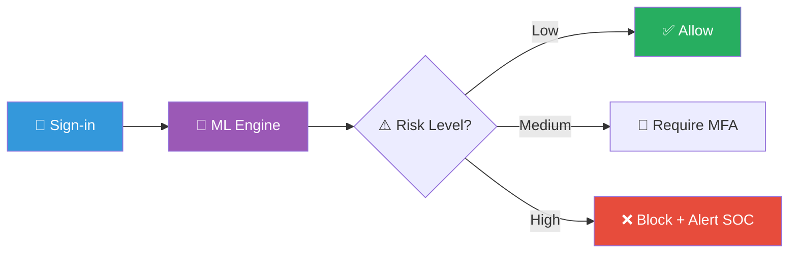
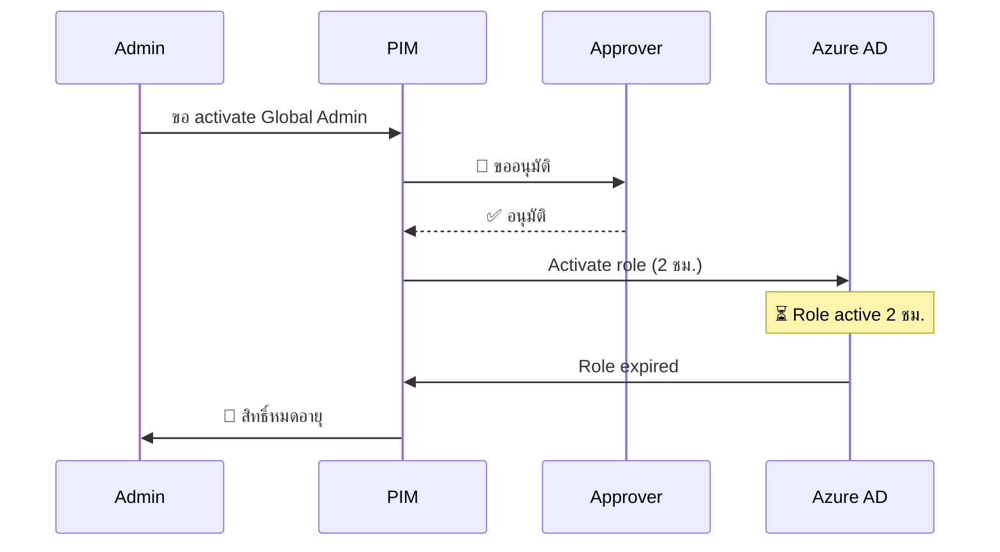
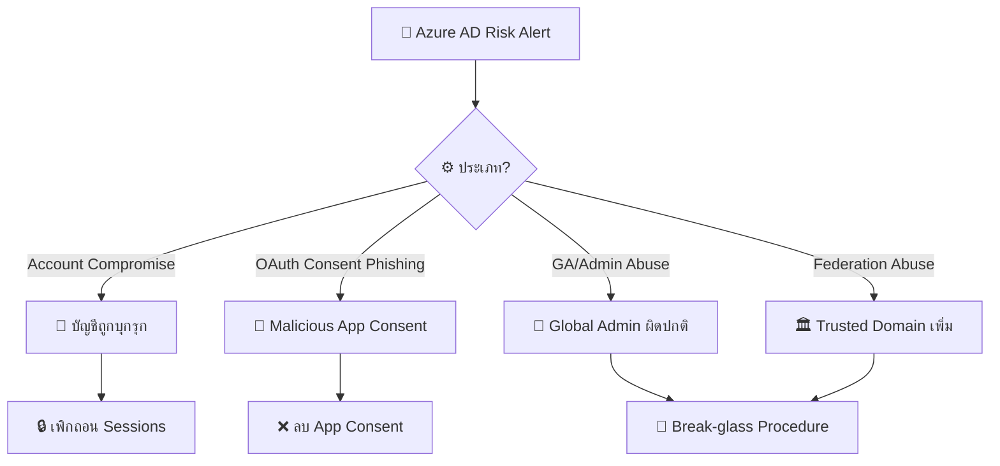
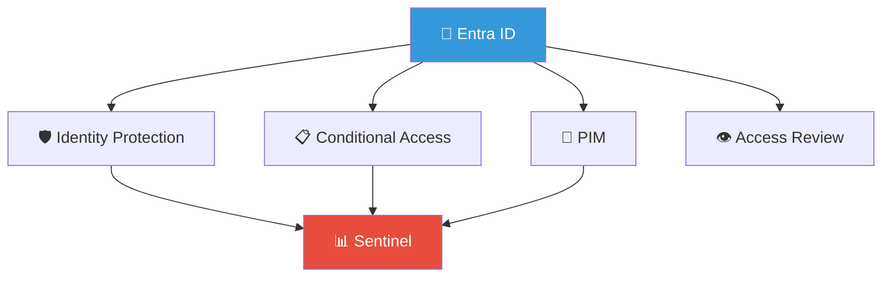
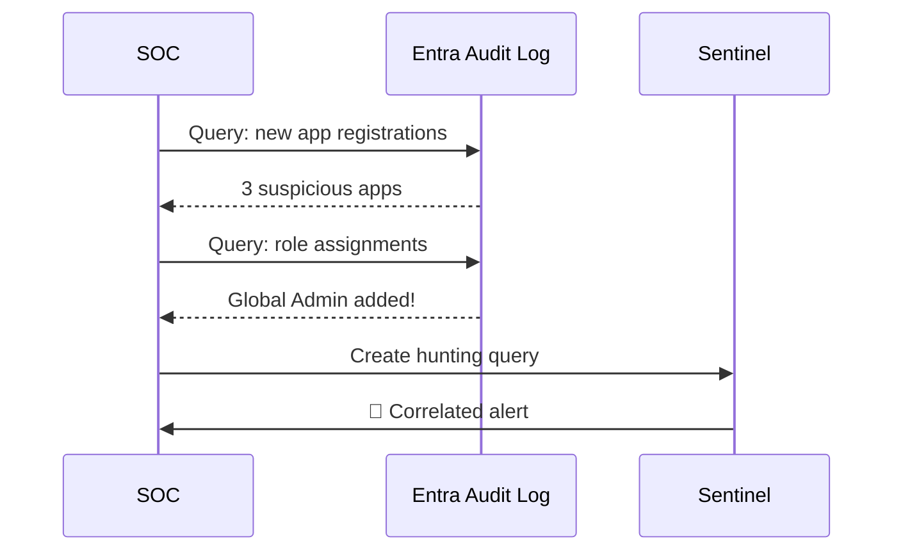

# Playbook: Azure AD / Entra ID Compromise

**ID**: PB-23
**ระดับความรุนแรง**: สูง/วิกฤต | **หมวดหมู่**: Identity & Access
**MITRE ATT&CK**: [T1098](https://attack.mitre.org/techniques/T1098/) (Account Manipulation), [T1556](https://attack.mitre.org/techniques/T1556/) (Modify Authentication Process)
**ทริกเกอร์**: Identity Protection risk alert, Conditional Access failure, Unified Audit Log anomaly, Sentinel alert

### ผัง Identity Protection Pipeline

### ผังขั้นตอน PIM Activation

---

## ผังการตัดสินใจ

---

## 1. การวิเคราะห์

### 1.1 ประเภทความเสี่ยง (Identity Protection)

| ประเภท | ตัวบ่งชี้ | ความรุนแรง |
|:---|:---|:---|
| **Unfamiliar sign-in** | IP/Location ใหม่ | 🟡 ปานกลาง |
| **Atypical travel** | Impossible travel | 🟠 สูง |
| **Anomalous token** | Token ผิดปกติ (replay) | 🔴 สูง |
| **Malware linked IP** | IP ที่เชื่อมกับ malware | 🔴 สูง |
| **Leaked credentials** | Found in breach data | 🔴 สูง |
| **Consent phishing** | OAuth app ที่อันตราย | 🔴 สูง |
| **GA sign-in** | Global Admin login | 🔴 สูง |
| **Federation change** | เพิ่ม trusted domain | 🔴 วิกฤต |
| **MFA manipulation** | เปลี่ยน/ลบ MFA methods | 🔴 สูง |

### 1.2 รายการตรวจสอบ

| รายการ | วิธีตรวจสอบ | เสร็จ |
|:---|:---|:---:|
| บัญชีที่ได้รับผลกระทบ (+role/privileges) | Azure AD Portal | ☐ |
| Sign-in details (IP, device, client app) | Sign-in logs | ☐ |
| Risk detections ทั้งหมด | Identity Protection | ☐ |
| Role assignments ที่เปลี่ยน | Audit logs | ☐ |
| OAuth consents ใหม่ (Enterprise Applications) | Enterprise Apps | ☐ |
| App registrations ใหม่ | App registrations | ☐ |
| Conditional Access evaluation results | Sign-in logs | ☐ |
| MFA methods ที่เปลี่ยน | Authentication methods | ☐ |
| Inbox rules/delegates ที่สร้าง | Exchange audit | ☐ |

### 1.3 กิจกรรมหลังถูกบุกรุก

| กิจกรรม | ตรวจสอบ | เสร็จ |
|:---|:---|:---:|
| สร้าง/แก้ไข App Registration | Audit logs | ☐ |
| เพิ่ม credentials ให้ Service Principal | Audit logs | ☐ |
| เปลี่ยน Role assignments | Directory audit | ☐ |
| consent OAuth app | Enterprise Apps | ☐ |
| สร้าง inbox forwarding rule | Exchange audit | ☐ |

---

## 2. การควบคุม

| # | การดำเนินการ | เครื่องมือ | เสร็จ |
|:---:|:---|:---|:---:|
| 1 | **เพิกถอน sessions** ทั้งหมด (Revoke-AzureADUserAllRefreshToken) | Azure AD | ☐ |
| 2 | **รีเซ็ตรหัสผ่าน** ผ่านช่องทาง out-of-band | Azure AD | ☐ |
| 3 | **ปิดบัญชี** ชั่วคราว (Block sign-in) | Azure AD | ☐ |
| 4 | **ลบ OAuth apps** ที่อันตราย | Enterprise Apps | ☐ |
| 5 | **กู้คืน role assignments** ที่ถูกเปลี่ยน | Azure AD | ☐ |
| 6 | **ลบ App Registration** + credentials ที่สร้างใหม่ | Azure AD | ☐ |

---

## 3. การกำจัด

| # | การดำเนินการ | เสร็จ |
|:---:|:---|:---:|
| 1 | ล้างและลงทะเบียน **MFA ใหม่** (FIDO2/passkeys) | ☐ |
| 2 | ลบ inbox rules / forwarding / delegates | ☐ |
| 3 | ลบ Service Principal credentials ที่ผู้โจมตีสร้าง | ☐ |
| 4 | หาก federation abuse → ลบ trusted domain ที่เพิ่ม | ☐ |

---

## 4. การฟื้นฟู

| # | การดำเนินการ | เสร็จ |
|:---:|:---|:---:|
| 1 | บังคับ **FIDO2/passkeys** สำหรับ admins | ☐ |
| 2 | เปิด **PIM** (Privileged Identity Management) | ☐ |
| 3 | ตรวจสอบ **Conditional Access policies** | ☐ |
| 4 | เปิด **CAE** (Continuous Access Evaluation) | ☐ |
| 5 | จำกัด **admin consent workflow** | ☐ |
| 6 | ติดตาม 30 วัน | ☐ |

---

## 5. เกณฑ์การยกระดับ

| เงื่อนไข | ยกระดับไปยัง |
|:---|:---|
| Global Admin ถูกบุกรุก | CISO + Major Incident |
| Federation abuse (trusted domain เพิ่ม) | CISO + Microsoft support |
| ข้อมูลถูกนำออก | Legal + DPO (PDPA 72 ชม.) |
| หลายบัญชีถูกบุกรุก | Major Incident |
| BEC follow-up | [PB-17 BEC](BEC.th.md) |

---

### ผัง Entra ID Security Stack

### ผัง Audit Log Analysis

## เอกสารที่เกี่ยวข้อง

- [กรอบการตอบสนองต่อเหตุการณ์](../Framework.th.md)
- [PB-05 บัญชีถูกบุกรุก](Account_Compromise.th.md)
- [PB-26 MFA Bypass](MFA_Bypass.th.md)

## อ้างอิง

- [MITRE ATT&CK T1098 — Account Manipulation](https://attack.mitre.org/techniques/T1098/)
- [Microsoft — Incident Response Playbooks](https://learn.microsoft.com/en-us/security/operations/incident-response-playbooks)
