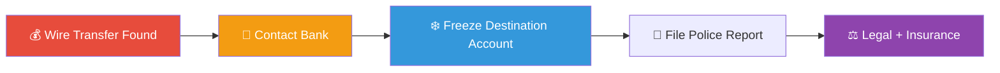
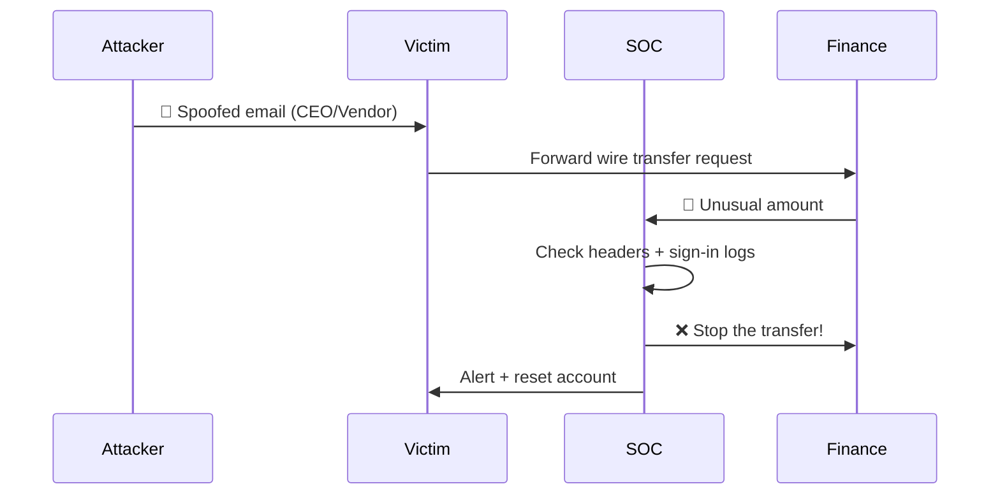
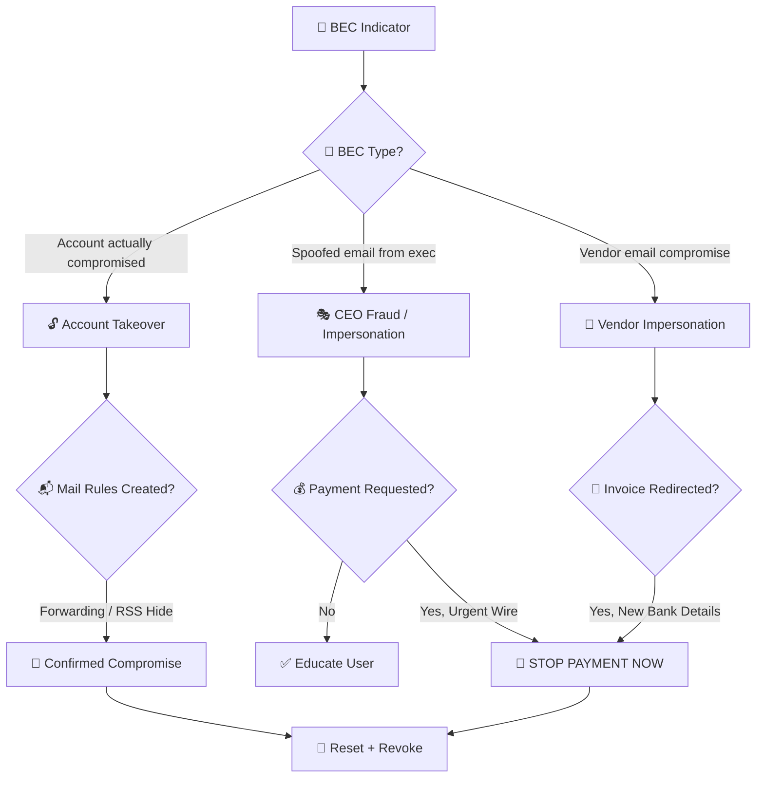
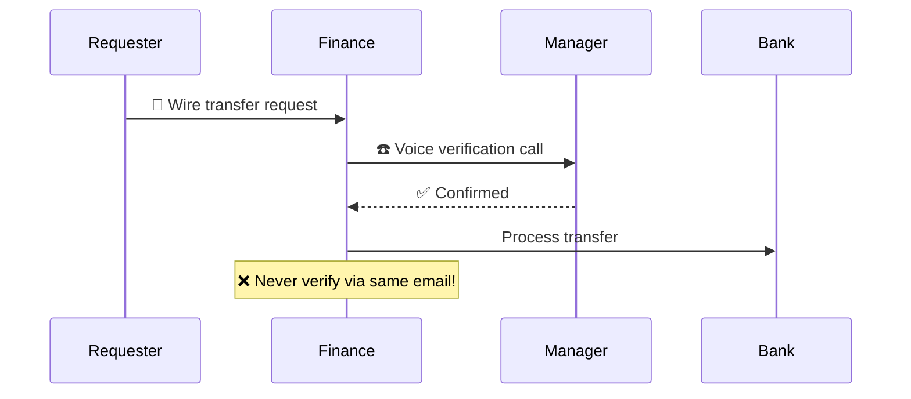

# Playbook: Business Email Compromise (BEC)

**ID**: PB-17
**Severity**: High/Critical | **Category**: Email Security / Fraud
**MITRE ATT&CK**: [T1566](https://attack.mitre.org/techniques/T1566/) (Phishing), [T1114](https://attack.mitre.org/techniques/T1114/) (Email Collection), [T1534](https://attack.mitre.org/techniques/T1534/) (Internal Spearphishing)
**Trigger**: User report ("Suspicious invoice"), mail filter ("Forwarding rule created"), Finance team ("Unusual payment request")

### Payment Recall Flow (Urgent!)

```mermaid
graph LR
    Discover["💰 Wire Transfer Found"] --> Bank["🏦 Contact Bank"]
    Bank --> Freeze["❄️ Freeze Destination Account"]
    Freeze --> Police["👮 File Police Report"]
    Police --> Legal["⚖️ Legal + Insurance"]
    style Discover fill:#e74c3c,color:#fff
    style Bank fill:#f39c12,color:#fff
    style Freeze fill:#3498db,color:#fff
    style Legal fill:#8e44ad,color:#fff
```

### BEC Detection Sequence

```mermaid
sequenceDiagram
    participant Attacker
    participant Victim
    participant SOC
    participant Finance
    Attacker->>Victim: 📧 Spoofed email (CEO/Vendor)
    Victim->>Finance: Forward wire transfer request
    Finance->>SOC: 🚨 Unusual amount
    SOC->>SOC: Check headers + sign-in logs
    SOC->>Finance: ❌ Stop the transfer!
    SOC->>Victim: Alert + reset account
```

> ⚠️ **CRITICAL**: BEC is the #1 cybercrime by financial losses (FBI IC3). Time is critical — stop wire transfers ASAP.

---

## Decision Flow

```mermaid
graph TD
    Alert["🚨 BEC Indicator"] --> Type{"📧 BEC Type?"}
    Type -->|Spoofed email from exec| Spoof["🎭 CEO Fraud / Impersonation"]
    Type -->|Account actually compromised| Takeover["🔓 Account Takeover"]
    Type -->|Vendor email compromise| Vendor["🏢 Vendor Impersonation"]
    Spoof --> Finance{"💰 Payment Requested?"}
    Takeover --> Rules{"📬 Mail Rules Created?"}
    Vendor --> Invoice{"🧾 Invoice Redirected?"}
    Finance -->|Yes, Urgent Wire| StopPay["🚨 STOP PAYMENT NOW"]
    Finance -->|No| Educate["✅ Educate User"]
    Rules -->|Forwarding / RSS Hide| Compromised["🔴 Confirmed Compromise"]
    Invoice -->|Yes, New Bank Details| StopPay
    Compromised --> Reset["🔄 Reset + Revoke"]
    StopPay --> Reset
```

---

## 1. Analysis

### 1.1 BEC Type Classification

| Type | Description | Indicators |
|:---|:---|:---|
| **CEO Fraud** | Impersonating executive to request wire | Spoofed "From", urgency, new bank account |
| **Account Takeover** | Attacker controls real mailbox | Foreign login, forwarding rules, sent items |
| **Vendor Impersonation** | Fake vendor with modified invoice | Similar domain (typosquat), new bank details |
| **Payroll Diversion** | Request to change direct deposit | HR-targeted email, new account info |
| **Gift Card Scam** | Request to purchase gift cards | Executive name, urgency, unusual request |

### 1.2 Email Header Analysis

| Check | What to Look For | Done |
|:---|:---|:---:|
| `From` vs `Return-Path` | Mismatch = spoofing | ☐ |
| `Reply-To` | Different domain than sender | ☐ |
| SPF result | `fail` or `softfail` | ☐ |
| DKIM result | `fail` or missing | ☐ |
| DMARC result | `fail` or `none` policy | ☐ |
| Domain age (if external) | Newly registered lookalike? | ☐ |
| X-Originating-IP | Suspicious location? | ☐ |

### 1.3 Account Takeover Investigation

| Check | How | Done |
|:---|:---|:---:|
| Login from foreign/unusual IP? | Azure AD / O365 sign-in logs | ☐ |
| MFA bypassed? (legacy auth, app passwords) | Conditional Access logs | ☐ |
| Inbox rules created? (forwarding, RSS, delete) | `Get-InboxRule` / Admin portal | ☐ |
| Emails sent from the account? | Sent Items, message trace | ☐ |
| OAuth apps consented? | Enterprise applications audit | ☐ |
| Mail flow rules (transport) modified? | Exchange admin | ☐ |

### 1.4 Common Malicious Inbox Rule Patterns

| Rule Name | Action | Purpose |
|:---|:---|:---|
| `.` or `..` | Move to RSS Feeds / Deleted | Hide replies from victim |
| `Invoice` / `Payment` | Forward to external + delete | Intercept financial emails |
| `Security` / `Alert` | Delete | Prevent victim seeing password alerts |
| Auto-forward all | Forward to external address | Ongoing data exfiltration |

---

## 2. Containment

### 2.1 If Payment Was Made (URGENT)

| # | Action | Timeline | Done |
|:---:|:---|:---|:---:|
| 1 | **Contact bank** to freeze/recall wire transfer | Within 24 hours | ☐ |
| 2 | Contact receiving bank (if known) | Same day | ☐ |
| 3 | File report with law enforcement (FBI IC3 / local) | Within 48 hours | ☐ |
| 4 | Notify CFO / Finance leadership | Immediately | ☐ |
| 5 | Preserve all email evidence | Now | ☐ |

### 2.2 Account Remediation

| # | Action | Tool | Done |
|:---:|:---|:---|:---:|
| 1 | **Reset password** of compromised account | AD / IdP | ☐ |
| 2 | **Revoke all OAuth tokens** and refresh tokens | Azure AD / O365 | ☐ |
| 3 | **Remove all inbox rules** (especially forwarding/RSS) | Exchange Admin | ☐ |
| 4 | **Revoke MFA and re-register** | MFA portal | ☐ |
| 5 | **Block legacy authentication** | Conditional Access | ☐ |
| 6 | **Check and remove** OAuth app consents | Enterprise Apps | ☐ |

---

## 3. Eradication

| # | Action | Done |
|:---:|:---|:---:|
| 1 | Search ALL mailboxes for same phishing message | ☐ |
| 2 | Delete phishing emails from all affected mailboxes | ☐ |
| 3 | Block sender domain/IP at email gateway | ☐ |
| 4 | Block lookalike domains at DNS/proxy | ☐ |
| 5 | Check if compromised account sent phishing to internal/external | ☐ |
| 6 | Notify external recipients if phishing was sent from compromised account | ☐ |

---

## 4. Recovery

| # | Action | Done |
|:---:|:---|:---:|
| 1 | Re-enable account with new credentials and MFA | ☐ |
| 2 | Implement payment verification process (dual approval, callback) | ☐ |
| 3 | Enable DMARC enforcement on company domain | ☐ |
| 4 | Deploy anti-phishing policy with impersonation protection | ☐ |
| 5 | Conduct BEC awareness training for Finance / HR | ☐ |
| 6 | Monitor account for 30 days | ☐ |

---

## 5. IoC Collection

| Type | Value | Source |
|:---|:---|:---|
| Attacker email address | | Email headers |
| Reply-To domain | | Email headers |
| Attacker IP (login) | | Sign-in logs |
| Inbox rule details | | Exchange audit |
| Forwarding destination | | Inbox rules |
| Spoofed domain | | Email headers |
| Bank account (fraudulent) | | Invoice / email |

---

## 6. Evidence Checklist

| Evidence Type | What to Collect | Source | Why It Matters |
|:---|:---|:---|:---|
| Email fraud evidence | Original message, headers, reply-to chain, impersonated identities | Mailbox export / gateway | Confirms spoofing, impersonation path, and campaign scope |
| Mailbox abuse evidence | Inbox rules, forwarding, delegates, OAuth apps, sent items | Exchange / cloud audit | Shows persistence and how the fraud was conducted |
| Identity evidence | Sign-in source, MFA events, session IDs, device/app context | IdP / auth logs | Distinguishes spoofing-only from real account takeover |
| Financial evidence | Invoice, account-change request, bank details, transfer timing | ERP / finance tickets / email | Supports recall, legal action, and business impact assessment |
| Communication evidence | Call notes, vendor confirmations, executive verification trail | Ticketing / call log / finance workflow | Demonstrates whether controls were followed and where they failed |

---

## 7. Minimum Telemetry Required

| Telemetry Source | Required For | Priority | Blind Spot If Missing |
|:---|:---|:---:|:---|
| Mailbox audit and message trace | Inbox rules, forwarding, message flow, purge scope | Required | Cannot confirm mailbox abuse or victim scope |
| Identity provider sign-in logs | Login origin, MFA, session changes, token misuse | Required | Cannot prove account compromise versus impersonation-only fraud |
| Email gateway and domain-auth telemetry | SPF, DKIM, DMARC, sender path, lookalike domains | Required | Spoofing and domain abuse remain poorly scoped |
| Finance workflow and payment records | Verification control use, transfer status, beneficiary details | Required | Financial impact and recall action become delayed |
| Threat intel and lookalike monitoring | Domain age, registrar, prior abuse, campaign indicators | Recommended | Detection of broader campaign activity weakens |

---

## 8. False Positive and Tuning Guide

| Scenario | Why It Looks Suspicious | How to Validate | Tuning Action | Escalate If |
|:---|:---|:---|:---|:---|
| Legitimate executive urgency email | Short, urgent requests may resemble CEO fraud | Call-back verify with executive assistant or approved channel | Keep alerts informational for verified sender-workflow combinations | Payment details change, secrecy request, or reply-to mismatch appears |
| Vendor bank detail update in normal process | Real AP changes can look like invoice fraud | Confirm via known phone number and vendor master change process | Tune only for vendors with documented verified workflow | Change bypasses callback control or introduces new beneficiary urgency |
| Internal mass mail from finance or HR | Bulk sensitive requests may resemble data-theft BEC | Validate campaign owner, approved template, and mailing list | Allowlist approved internal sender plus campaign window | Message content or recipients diverge from approved scope |
| Shared mailbox delegation changes | Planned delegate updates can resemble mailbox abuse | Check ticket, approver, and admin identity | Suppress only approved delegate changes during change window | Forwarding to external domains or hidden inbox rules appear |

---

## 9. Escalation Criteria

| Condition | Escalate To |
|:---|:---|
| Wire transfer executed | CFO + Legal + Bank + Law Enforcement |
| Executive account compromised | CISO immediately |
| Multiple accounts compromised | Major Incident |
| Vendor email chain compromised | Legal + Vendor relationship |
| PII exposed from mailbox | Legal + DPO (PDPA 72h) |
| Internal phishing sent from compromised account | [PB-01 Phishing](Phishing.en.md) |

---

### BEC Kill Chain

```mermaid
graph LR
    Recon["🔍 Recon"] --> Phish["🎣 Phishing"]
    Phish --> Access["🔓 Mailbox Access"]
    Access --> Rules["📋 Inbox Rules"]
    Rules --> Imperson["🎭 Impersonate"]
    Imperson --> Wire["💸 Wire Transfer"]
    style Recon fill:#3498db,color:#fff
    style Access fill:#f39c12,color:#fff
    style Wire fill:#e74c3c,color:#fff
```

### Payment Verification Process

```mermaid
sequenceDiagram
    participant Requester
    participant Finance
    participant Manager
    participant Bank
    Requester->>Finance: 💸 Wire transfer request
    Finance->>Manager: ☎️ Voice verification call
    Manager-->>Finance: ✅ Confirmed
    Finance->>Bank: Process transfer
    Note over Finance: ❌ Never verify via same email!
```

## Detection Rules (Sigma)

| Rule | File |
|:---|:---|
| Suspicious Inbox Rule Created | [cloud_email_inbox_rule.yml](../../08_Detection_Engineering/sigma_rules/cloud_email_inbox_rule.yml) |
| Login from Unusual Location | [cloud_unusual_login.yml](../../08_Detection_Engineering/sigma_rules/cloud_unusual_login.yml) |

## Related Documents

- [IR Framework](../Framework.en.md)
- [Incident Report](../../11_Reporting_Templates/incident_report.en.md)
- [PB-01 Phishing](Phishing.en.md)
- [PB-05 Account Compromise](Account_Compromise.en.md)
- [PB-06 Impossible Travel](Impossible_Travel.en.md)

## References

- [MITRE ATT&CK T1566 — Phishing](https://attack.mitre.org/techniques/T1566/)
- [FBI IC3 — BEC Scams](https://www.fbi.gov/scams-and-safety/common-scams-and-crimes/business-email-compromise)
- [Microsoft — BEC Investigation](https://learn.microsoft.com/en-us/security/operations/incident-response-playbook-phishing)
