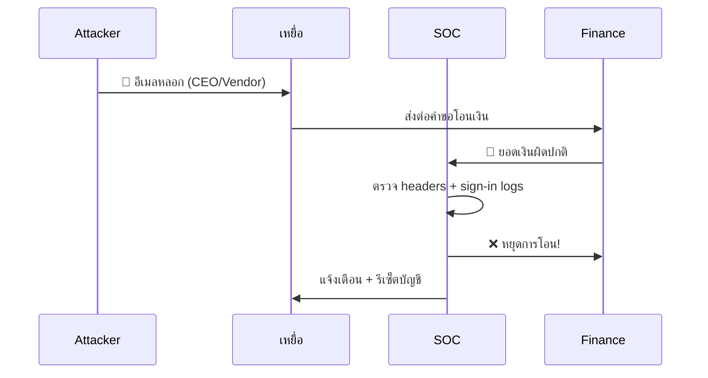
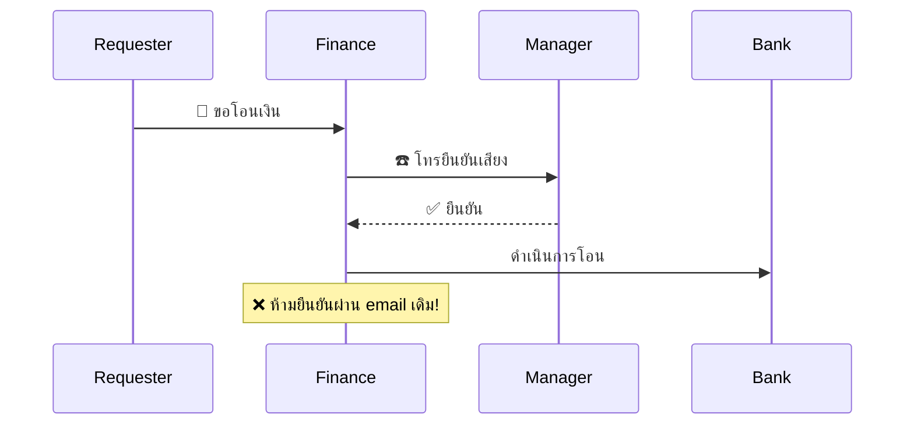

# Playbook: Business Email Compromise (BEC)

**ID**: PB-17
**ระดับความรุนแรง**: สูง/วิกฤต | **หมวดหมู่**: การฉ้อโกงทางอีเมล
**MITRE ATT&CK**: [T1566](https://attack.mitre.org/techniques/T1566/) (Phishing), [T1114](https://attack.mitre.org/techniques/T1114/) (Email Collection)
**ทริกเกอร์**: ผู้ใช้รายงาน (ใบแจ้งหนี้น่าสงสัย), Mail filter (สร้าง forwarding rule), Finance team alert

### ผังขั้นตอนเรียกคืนเงิน (Urgent!)


### ผังตรวจจับ BEC



---

## ผังการตัดสินใจ

```mermaid
graph TD
    Alert["🚨 BEC Alert"] --> Payment{"💰 เงินถูกโอนแล้ว?"}
    Payment -->|ใช่| Bank["🏦 ติดต่อธนาคารทันที!"]
    Payment -->|ไม่| Assess["📊 ประเมินบัญชี"]
    Bank --> Freeze["🔒 Freeze บัญชีปลายทาง"]
    Assess --> Compromised{"👤 อีเมลถูกบุกรุก?"}
    Compromised -->|ใช่| Reset["🔐 รีเซ็ต + ลบ Rules"]
    Compromised -->|ไม่ (spoofed)| Block["🔒 บล็อกผู้ส่ง"]
    Freeze --> Investigate["🔍 สอบสวนขอบเขต"]
```

---

## 1. การวิเคราะห์

### 1.1 ประเภท BEC

| ประเภท | ลักษณะ | เป้าหมาย | ความรุนแรง |
|:---|:---|:---|:---|
| **CEO Fraud** | ปลอม CEO/CFO สั่งโอนเงินด่วน | Finance | 🔴 วิกฤต |
| **Invoice Fraud** | เปลี่ยนบัญชีธนาคารในใบแจ้งหนี้ | AP team | 🔴 วิกฤต |
| **Lawyer Impersonation** | ปลอมทนายสั่งจ่ายด่วน (confidential) | Finance | 🔴 วิกฤต |
| **Payroll Diversion** | เปลี่ยนบัญชีเงินเดือนพนักงาน | HR/Payroll | 🟠 สูง |
| **Data Theft** | ขอ W-2/ข้อมูลพนักงาน/ลูกค้า | HR / Admin | 🟠 สูง |
| **Vendor Email Compromise** | Vendor ถูกบุกรุกจริง → อีเมลจาก vendor ของจริง | AP team | 🔴 วิกฤต |

### 1.2 รายการตรวจสอบ

| รายการ | วิธีตรวจสอบ | เสร็จ |
|:---|:---|:---:|
| วิเคราะห์ email headers (SPF/DKIM/DMARC) | Mail headers | ☐ |
| Display name vs actual email (ตรงกัน?) | Directory lookup | ☐ |
| Reply-to address ต่างจาก From? | Mail headers | ☐ |
| มี inbox rules / forwarding ถูกสร้าง? | Exchange admin (Get-InboxRule) | ☐ |
| เงินถูกโอนแล้วหรือไม่? + จำนวนเท่าไร? | Finance team | ☐ |
| มีผู้ใช้อื่นได้รับอีเมลเดียวกัน? | Mail log search (message trace) | ☐ |
| Compromised account or external spoof? | Sign-in logs + MFA | ☐ |
| มี OAuth apps ถูก consent? | Enterprise Apps | ☐ |

### 1.3 กิจกรรมใน Compromised Mailbox

| กิจกรรม | ตรวจสอบ | เสร็จ |
|:---|:---|:---:|
| Inbox rules → auto-delete/forward/move | Get-InboxRule | ☐ |
| Delegates / folder permissions | Get-MailboxPermission | ☐ |
| Sent Items — ส่งอีเมลหลอกไปที่ใครบ้าง | Sent items / Message trace | ☐ |
| OAuth apps with Mail.Read/Mail.Send | Enterprise Apps | ☐ |

---

## 2. การควบคุม

### 2.1 หากเงินถูกโอนแล้ว (ทำทันที!)

| # | การดำเนินการ | เสร็จ |
|:---:|:---|:---:|
| 1 | **ติดต่อธนาคาร** — recall / freeze transfer | ☐ |
| 2 | **แจ้งความ** ตำรวจ / anti-fraud unit | ☐ |
| 3 | **บันทึก** transaction details ทั้งหมด | ☐ |

### 2.2 Contain Compromised Account

| # | การดำเนินการ | เสร็จ |
|:---:|:---|:---:|
| 1 | **รีเซ็ตรหัสผ่าน** (out-of-band channel) | ☐ |
| 2 | **เพิกถอน sessions** ทั้งหมด | ☐ |
| 3 | **ลบ inbox rules** ที่อันตราย | ☐ |
| 4 | **ลบ delegates / permissions** ที่ผิดปกติ | ☐ |
| 5 | **ลบอีเมลหลอก** จากทุก mailbox (Search-Mailbox) | ☐ |
| 6 | **ลบ OAuth apps** ที่ไม่ได้รับอนุมัติ | ☐ |

---

## 3. การกำจัด

| # | การดำเนินการ | เสร็จ |
|:---:|:---|:---:|
| 1 | ลงทะเบียน MFA ใหม่ (FIDO2/passkeys) | ☐ |
| 2 | ลบ forwarding rules ทั้งหมดจากบัญชี | ☐ |
| 3 | ตรวจว่า attacker ส่งอีเมลหลอกไปหาใครอีก → แจ้งเตือน | ☐ |
| 4 | ลบ app registrations ที่ผู้โจมตีสร้าง | ☐ |

---

## 4. การฟื้นฟู

| # | การดำเนินการ | เสร็จ |
|:---:|:---|:---:|
| 1 | บังคับ **DMARC policy** (`p=reject`) | ☐ |
| 2 | กำหนดขั้นตอนยืนยันการโอนเงิน (**dual approval**, callback) | ☐ |
| 3 | จำกัด **admin consent** สำหรับ OAuth apps | ☐ |
| 4 | **Security awareness training** — BEC scenarios | ☐ |
| 5 | ติดตาม Dark Web สำหรับ compromised credentials | ☐ |

---

## 5. เกณฑ์การยกระดับ

| เงื่อนไข | ยกระดับไปยัง |
|:---|:---|
| เงินถูกโอนแล้ว | Legal + Finance + ธนาคาร **ทันที** |
| CEO/CFO account ถูกบุกรุก | CISO ทันที |
| ข้อมูลพนักงาน/ลูกค้าถูกส่งออก | DPO (PDPA 72 ชม.) |
| Vendor email compromise (supply chain) | SOC Lead + Procurement |
| หลายบัญชีถูกบุกรุก | Major Incident |

---

### ผัง BEC Kill Chain


### ผัง Payment Verification Process



## เอกสารที่เกี่ยวข้อง

- [กรอบการตอบสนองต่อเหตุการณ์](../Framework.th.md)
- [PB-01 ฟิชชิง](Phishing.th.md)
- [PB-05 บัญชีถูกบุกรุก](Account_Compromise.th.md)

## อ้างอิง

- [FBI — BEC Scams](https://www.ic3.gov/Media/Y2022/PSA220504)
- [Microsoft — Investigate and respond to BEC](https://learn.microsoft.com/en-us/security/operations/incident-response-playbook-phishing)
