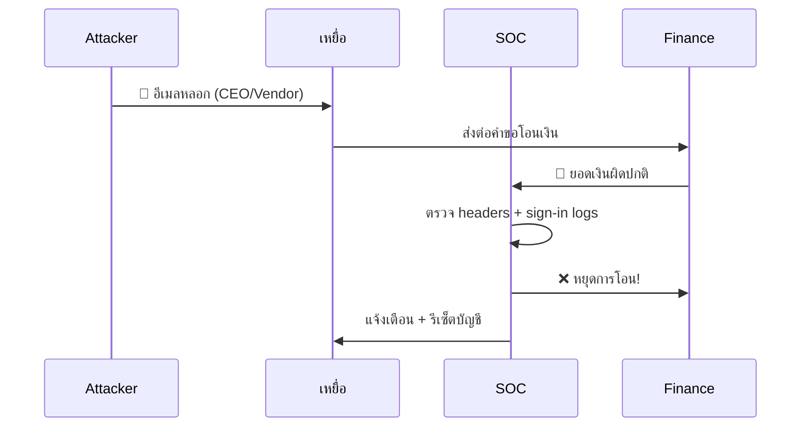
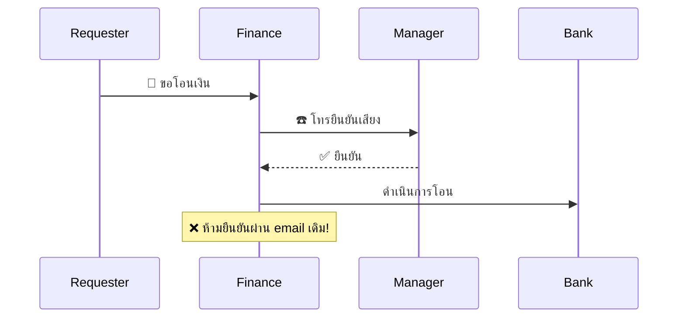

# Playbook: Business Email Compromise (BEC)

**ID**: PB-17
**ระดับความรุนแรง**: สูง/วิกฤต | **หมวดหมู่**: การฉ้อโกงทางอีเมล
**MITRE ATT&CK**: [T1566](https://attack.mitre.org/techniques/T1566/) (Phishing), [T1114](https://attack.mitre.org/techniques/T1114/) (Email Collection)
**ทริกเกอร์**: ผู้ใช้รายงาน (ใบแจ้งหนี้น่าสงสัย), Mail filter (สร้าง forwarding rule), Finance team alert

## หลังเหตุการณ์ (Post-Incident)

- [ ] อัพเดท email gateway rules ตาม pattern ที่พบ
- [ ] ทบทวน payment approval workflow (dual-approval)
- [ ] จัด awareness training เรื่อง BEC ให้ finance team
- [ ] ใช้ email authentication (SPF/DKIM/DMARC strict)
- [ ] ตรวจสอบ vendor email compromise indicators
- [ ] จัดทำ [Incident Report](../../11_Reporting_Templates/incident_report.th.md)

### ผังขั้นตอนเรียกคืนเงิน (Urgent!)

```mermaid
graph LR
    Discover["💰 พบว่าโอนเงิน"] --> Bank["🏦 ติดต่อธนาคาร"]
    Bank --> Freeze["❄️ Freeze บัญชีปลายทาง"]
    Freeze --> Police["👮 แจ้งความ"]
    Police --> Legal["⚖️ Legal + Insurance"]
    style Discover fill:#e74c3c,color:#fff
    style Bank fill:#f39c12,color:#fff
    style Freeze fill:#3498db,color:#fff
    style Legal fill:#8e44ad,color:#fff
```

### ผังตรวจจับ BEC

```mermaid
sequenceDiagram
    participant Attacker
    participant Victim as เหยื่อ
    participant SOC
    participant Finance
    Attacker->>Victim: 📧 อีเมลหลอก (CEO/Vendor)
    Victim->>Finance: ส่งต่อคำขอโอนเงิน
    Finance->>SOC: 🚨 ยอดเงินผิดปกติ
    SOC->>SOC: ตรวจ headers + sign-in logs
    SOC->>Finance: ❌ หยุดการโอน!
    SOC->>Victim: แจ้งเตือน + รีเซ็ตบัญชี
```

---

## ผังการตัดสินใจ

```mermaid
graph TD
    Alert["🚨 BEC Alert"] --> Payment{"💰 เงินถูกโอนแล้ว?"}
    Payment -->|ใช่| Bank["🏦 ติดต่อธนาคารทันที!"]
    Payment -->|ไม่| Assess["📊 ประเมินบัญชี"]
    Bank --> Freeze["🔒 Freeze บัญชีปลายทาง"]
    Assess --> Compromised{"👤 อีเมลถูกบุกรุก?"}
    Compromised -->|ใช่| Reset["🔐 รีเซ็ต + ลบ Rules"]
    Compromised -->|ไม่ (spoofed)| Block["🔒 บล็อกผู้ส่ง"]
    Freeze --> Investigate["🔍 สอบสวนขอบเขต"]
```

---

## 1. การวิเคราะห์

### 1.1 ประเภท BEC

| ประเภท | ลักษณะ | เป้าหมาย | ความรุนแรง |
|:---|:---|:---|:---|
| **CEO Fraud** | ปลอม CEO/CFO สั่งโอนเงินด่วน | Finance | 🔴 วิกฤต |
| **Invoice Fraud** | เปลี่ยนบัญชีธนาคารในใบแจ้งหนี้ | AP team | 🔴 วิกฤต |
| **Lawyer Impersonation** | ปลอมทนายสั่งจ่ายด่วน (confidential) | Finance | 🔴 วิกฤต |
| **Payroll Diversion** | เปลี่ยนบัญชีเงินเดือนพนักงาน | HR/Payroll | 🟠 สูง |
| **Data Theft** | ขอ W-2/ข้อมูลพนักงาน/ลูกค้า | HR / Admin | 🟠 สูง |
| **Vendor Email Compromise** | Vendor ถูกบุกรุกจริง → อีเมลจาก vendor ของจริง | AP team | 🔴 วิกฤต |

### 1.2 รายการตรวจสอบ

| รายการ | วิธีตรวจสอบ | เสร็จ |
|:---|:---|:---:|
| วิเคราะห์ email headers (SPF/DKIM/DMARC) | Mail headers | ☐ |
| Display name vs actual email (ตรงกัน?) | Directory lookup | ☐ |
| Reply-to address ต่างจาก From? | Mail headers | ☐ |
| มี inbox rules / forwarding ถูกสร้าง? | Exchange admin (Get-InboxRule) | ☐ |
| เงินถูกโอนแล้วหรือไม่? + จำนวนเท่าไร? | Finance team | ☐ |
| มีผู้ใช้อื่นได้รับอีเมลเดียวกัน? | Mail log search (message trace) | ☐ |
| Compromised account or external spoof? | Sign-in logs + MFA | ☐ |
| มี OAuth apps ถูก consent? | Enterprise Apps | ☐ |

### 1.3 กิจกรรมใน Compromised Mailbox

| กิจกรรม | ตรวจสอบ | เสร็จ |
|:---|:---|:---:|
| Inbox rules → auto-delete/forward/move | Get-InboxRule | ☐ |
| Delegates / folder permissions | Get-MailboxPermission | ☐ |
| Sent Items — ส่งอีเมลหลอกไปที่ใครบ้าง | Sent items / Message trace | ☐ |
| OAuth apps with Mail.Read/Mail.Send | Enterprise Apps | ☐ |

---

## 2. การควบคุม

### 2.1 หากเงินถูกโอนแล้ว (ทำทันที!)

| # | การดำเนินการ | เสร็จ |
|:---:|:---|:---:|
| 1 | **ติดต่อธนาคาร** — recall / freeze transfer | ☐ |
| 2 | **แจ้งความ** ตำรวจ / anti-fraud unit | ☐ |
| 3 | **บันทึก** transaction details ทั้งหมด | ☐ |

### 2.2 Contain Compromised Account

| # | การดำเนินการ | เสร็จ |
|:---:|:---|:---:|
| 1 | **รีเซ็ตรหัสผ่าน** (out-of-band channel) | ☐ |
| 2 | **เพิกถอน sessions** ทั้งหมด | ☐ |
| 3 | **ลบ inbox rules** ที่อันตราย | ☐ |
| 4 | **ลบ delegates / permissions** ที่ผิดปกติ | ☐ |
| 5 | **ลบอีเมลหลอก** จากทุก mailbox (Search-Mailbox) | ☐ |
| 6 | **ลบ OAuth apps** ที่ไม่ได้รับอนุมัติ | ☐ |

---

## 3. การกำจัด

| # | การดำเนินการ | เสร็จ |
|:---:|:---|:---:|
| 1 | ลงทะเบียน MFA ใหม่ (FIDO2/passkeys) | ☐ |
| 2 | ลบ forwarding rules ทั้งหมดจากบัญชี | ☐ |
| 3 | ตรวจว่า attacker ส่งอีเมลหลอกไปหาใครอีก → แจ้งเตือน | ☐ |
| 4 | ลบ app registrations ที่ผู้โจมตีสร้าง | ☐ |

---

## 4. การฟื้นฟู

| # | การดำเนินการ | เสร็จ |
|:---:|:---|:---:|
| 1 | บังคับ **DMARC policy** (`p=reject`) | ☐ |
| 2 | กำหนดขั้นตอนยืนยันการโอนเงิน (**dual approval**, callback) | ☐ |
| 3 | จำกัด **admin consent** สำหรับ OAuth apps | ☐ |
| 4 | **Security awareness training** — BEC scenarios | ☐ |
| 5 | ติดตาม Dark Web สำหรับ compromised credentials | ☐ |

---

## 5. เกณฑ์การยกระดับ

| เงื่อนไข | ยกระดับไปยัง |
|:---|:---|
| เงินถูกโอนแล้ว | Legal + Finance + ธนาคาร **ทันที** |
| CEO/CFO account ถูกบุกรุก | CISO ทันที |
| ข้อมูลพนักงาน/ลูกค้าถูกส่งออก | DPO (PDPA 72 ชม.) |
| Vendor email compromise (supply chain) | SOC Lead + Procurement |
| หลายบัญชีถูกบุกรุก | Major Incident |

---

## 6. Evidence Checklist

| ประเภทหลักฐาน | สิ่งที่ต้องเก็บ | แหล่งข้อมูล | เหตุผลที่ต้องเก็บ |
|:---|:---|:---|:---|
| หลักฐานอีเมลหลอก | original message, headers, reply-to chain, identity ที่ถูกสวม | Mailbox export / gateway | ยืนยันเส้นทางการปลอมแปลงและขอบเขตของแคมเปญ |
| หลักฐาน mailbox abuse | inbox rules, forwarding, delegates, OAuth apps, sent items | Exchange / cloud audit | ใช้ดู persistence และวิธีการทำ fraud |
| หลักฐานด้านตัวตน | sign-in source, MFA events, session IDs, device/app context | IdP / auth logs | ใช้แยก spoofing-only กับ account takeover จริง |
| หลักฐานทางการเงิน | invoice, request เปลี่ยนบัญชี, beneficiary details, เวลาโอน | ERP / finance tickets / email | ใช้ทำ recall และรองรับด้านกฎหมาย |
| หลักฐานการสื่อสาร | call notes, การยืนยันกับ vendor, verification trail | Ticketing / call log / finance workflow | ใช้พิสูจน์ว่าควบคุมใดถูกใช้หรือถูกข้าม |

---

## 7. Minimum Telemetry Required

| แหล่ง Telemetry | ใช้เพื่ออะไร | ความสำคัญ | Blind Spot ถ้าไม่มี |
|:---|:---|:---:|:---|
| Mailbox audit และ message trace | ดู inbox rule, forwarding, message flow, purge scope | Required | ยืนยัน mailbox abuse และขอบเขตผู้ได้รับผลกระทบไม่ได้ |
| Identity provider sign-in logs | ดู login origin, MFA, session change, token misuse | Required | พิสูจน์ account compromise ไม่ได้ |
| Email gateway และ domain-auth telemetry | ดู SPF, DKIM, DMARC, sender path, lookalike domain | Required | ขอบเขตของ spoofing และ domain abuse ไม่ชัด |
| Finance workflow และ payment records | ดู verification control, transfer status, beneficiary details | Required | ประเมินผลกระทบทางการเงินและ recall ช้า |
| Threat intel และ lookalike monitoring | ดู registrar, domain age, prior abuse, campaign signal | Recommended | มอง broader campaign ไม่ครบ |

---

## 8. False Positive และ Tuning Guide

| Scenario | ทำไมจึงดูน่าสงสัย | วิธีตรวจสอบ | Tuning Action | ต้องยกระดับเมื่อ |
|:---|:---|:---|:---|:---|
| อีเมลเร่งด่วนจากผู้บริหารที่ถูกต้อง | ข้อความสั้นและเร่งด่วนดูคล้าย CEO fraud | โทรยืนยันผ่าน executive assistant หรือช่องทางที่อนุมัติ | informational เฉพาะ sender-workflow ที่ตรวจสอบแล้ว | มีการเปลี่ยน payment detail, secrecy request, หรือ reply-to mismatch |
| การอัปเดตบัญชีธนาคารของ vendor ตามปกติ | ขั้นตอน AP จริงอาจดูเหมือน invoice fraud | ยืนยันผ่านเบอร์ที่รู้จักและ master change process | tune เฉพาะ vendor ที่มี verified workflow | callback control ถูกข้ามหรือมีความเร่งด่วนผิดปกติ |
| เมลภายในจาก finance หรือ HR ที่ส่งเป็นจำนวนมาก | คำขอข้อมูลอ่อนไหวจำนวนมากดูคล้าย data theft BEC | ยืนยัน campaign owner, template, และ mailing list | allowlist sender ภายในและช่วงเวลา campaign ที่อนุมัติ | เนื้อหา/ผู้รับหลุดออกนอก scope |
| การเปลี่ยน delegate ของ shared mailbox ตามแผน | delegate update อาจดูเหมือน mailbox abuse | ตรวจ ticket, approver, และ admin identity | suppress เฉพาะ delegate change ที่ได้รับอนุมัติ | พบ forwarding ออกภายนอกหรือ hidden inbox rule |

---

### ผัง BEC Kill Chain

```mermaid
graph LR
    Recon["🔍 Recon"] --> Phish["🎣 Phishing"]
    Phish --> Access["🔓 Mailbox Access"]
    Access --> Rules["📋 Inbox Rules"]
    Rules --> Imperson["🎭 Impersonate"]
    Imperson --> Wire["💸 Wire Transfer"]
    style Recon fill:#3498db,color:#fff
    style Access fill:#f39c12,color:#fff
    style Wire fill:#e74c3c,color:#fff
```

### ผัง Payment Verification Process

```mermaid
sequenceDiagram
    participant Requester
    participant Finance
    participant Manager
    participant Bank
    Requester->>Finance: 💸 ขอโอนเงิน
    Finance->>Manager: ☎️ โทรยืนยันเสียง
    Manager-->>Finance: ✅ ยืนยัน
    Finance->>Bank: ดำเนินการโอน
    Note over Finance: ❌ ห้ามยืนยันผ่าน email เดิม!
```

## กฎตรวจจับ (Sigma)

| กฎ | ไฟล์ |
|:---|:---|
| Suspicious Inbox Rule Created | [cloud_email_inbox_rule.yml](../../08_Detection_Engineering/sigma_rules/cloud_email_inbox_rule.yml) |
| Login from Unusual Location | [cloud_unusual_login.yml](../../08_Detection_Engineering/sigma_rules/cloud_unusual_login.yml) |

## เอกสารที่เกี่ยวข้อง

- [กรอบการตอบสนองต่อเหตุการณ์](../Framework.th.md)
- [PB-01 ฟิชชิง](Phishing.th.md)
- [PB-05 บัญชีถูกบุกรุก](Account_Compromise.th.md)

## BEC Attack Pattern Recognition

| Pattern | Red Flags | Urgency Claim |
|:---|:---|:---|
| CEO fraud | Impersonates executive | "Urgent wire transfer" |
| Invoice fraud | Modified payment details | "Updated bank info" |
| Attorney impersonation | Legal urgency | "Confidential matter" |
| Data theft | HR/payroll request | "Need all W-2s" |
| Account compromise | Real account, fake request | Varies |

### Financial Impact Assessment

| Check | Action | Owner |
|:---|:---|:---|
| Wire initiated? | Contact bank immediately | Finance |
| Amount transferred? | Document for reporting | Finance |
| Multiple victims? | Company-wide alert | SOC |
| Law enforcement? | FBI IC3 report | Legal |

### BEC Prevention Checklist
- [ ] DMARC/DKIM/SPF configured
- [ ] External email banner enabled
- [ ] Wire transfer requires verbal confirmation
- [ ] Domain lookalike monitoring active

### Wire Recall Process

| Timeline | Success Rate | Action |
|:---|:---|:---|
| < 24 hrs | 50-70% | Contact bank urgently |
| 24-48 hrs | 20-40% | Bank + law enforcement |
| > 48 hrs | < 10% | Law enforcement only |

## References

- [FBI — BEC Scams](https://www.ic3.gov/Media/Y2022/PSA220504)
- [Microsoft — Investigate and respond to BEC](https://learn.microsoft.com/en-us/security/operations/incident-response-playbook-phishing)
