# Playbook: Brute Force / Password Spray

**ID**: PB-04
**Severity**: Low/Medium/High | **Category**: Identity & Access
**MITRE ATT&CK**: [T1110](https://attack.mitre.org/techniques/T1110/) (Brute Force), [T1110.001](https://attack.mitre.org/techniques/T1110/001/) (Password Guessing), [T1110.003](https://attack.mitre.org/techniques/T1110/003/) (Password Spraying)
**Trigger**: SIEM alert ("Multiple failed logins"), IdP risk detection, Firewall/WAF logs

---

## Decision Flow

```mermaid
graph TD
    Alert["🚨 Failed Login Spike"] --> Type{"🔍 Attack Type?"}
    Type -->|Many fails → 1 account| Brute["🔨 Brute Force"]
    Type -->|1 password → Many accounts| Spray["🌧️ Password Spray"]
    Type -->|Credential list tested| Stuffing["📋 Credential Stuffing"]
    Brute --> Success{"✅ Any Success After Fails?"}
    Spray --> Success
    Stuffing --> Success
    Success -->|Yes, Login Succeeded| Compromised["🔴 Account Compromised!"]
    Success -->|No, All Failed| Attempt["🟡 Attack Attempt"]
    Compromised --> Reset["🔄 Reset + Investigate"]
    Attempt --> Block["🚫 Block Source + Monitor"]
```

---

## 1. Analysis

### 1.1 Attack Type Identification

| Type | Pattern | Detection |
|:---|:---|:---|
| **Brute Force** | 100+ attempts against ONE account in minutes | SIEM: high fail count per user |
| **Password Spray** | 1-2 attempts per account across MANY accounts | SIEM: same source, many targets |
| **Credential Stuffing** | Leaked credential pairs tested | Multiple users, different passwords |
| **Slow & Low** | Spread attempts over hours/days to avoid lockout | UEBA baseline deviation |
| **Distributed** | Same attack from many IPs (botnet) | Correlation: same target, many sources |

### 1.2 Investigation Checklist

| Check | How | Done |
|:---|:---|:---:|
| Source IP(s) — internal or external? | SIEM / Firewall | ☐ |
| IP reputation | AbuseIPDB, VirusTotal | ☐ |
| Target account(s) — VIP, admin, service? | AD / IdP | ☐ |
| Volume — how many attempts? | SIEM query | ☐ |
| Any SUCCESSFUL login after failures? | **CRITICAL** — Event ID 4624 after 4625s | ☐ |
| Protocol used (RDP, SSH, OWA, VPN, API) | Authentication logs | ☐ |
| Account lockout triggered? | AD / IdP | ☐ |
| Is the target exposed externally? | Firewall rules, Shodan | ☐ |

### 1.3 Severity Assessment

| Scenario | Severity | Action |
|:---|:---|:---|
| External IP, all failures, non-admin accounts | **Low** | Block IP, monitor |
| External IP, all failures, admin/VIP accounts | **Medium** | Block IP, alert account owner |
| Successful login after failed attempts | **High** | Treat as [PB-05 Account Compromise](Account_Compromise.en.md) |
| Password spray hitting many accounts | **High** | Block IP, org-wide password assessment |
| Internal source IP | **High** | Compromised host investigation |

---

## 2. Containment

### 2.1 Attack Attempt (No Success)

| # | Action | Tool | Done |
|:---:|:---|:---|:---:|
| 1 | **Block source IP(s)** at firewall/WAF | Firewall | ☐ |
| 2 | **GeoIP block** if source is from non-business country | Firewall / IdP | ☐ |
| 3 | **Lock accounts** only if lockout threshold wasn't auto-triggered | AD | ☐ |
| 4 | **Alert account owners** (especially VIP/admins) | Email / Chat | ☐ |

### 2.2 Successful Login Detected (CRITICAL)

| # | Action | Tool | Done |
|:---:|:---|:---|:---:|
| 1 | **Immediately reset password** of compromised account | AD / IdP | ☐ |
| 2 | **Terminate all sessions** | IdP | ☐ |
| 3 | **Enforce MFA** before re-enabling | IdP | ☐ |
| 4 | **Block source IP** | Firewall | ☐ |
| 5 | **Audit account activity** from successful login onward | SIEM | ☐ |
| 6 | Escalate to [PB-05 Account Compromise](Account_Compromise.en.md) | SOC | ☐ |

### 2.3 If Internal Source

| # | Action | Done |
|:---:|:---|:---:|
| 1 | Isolate source host — likely compromised | ☐ |
| 2 | Investigate what's running on source host | ☐ |
| 3 | Check for malware / attacker tooling | ☐ |

---

## 3. Eradication

| # | Action | Done |
|:---:|:---|:---:|
| 1 | Remove attacker IP from any Allow lists | ☐ |
| 2 | If internal source: clean/re-image compromised host | ☐ |
| 3 | Check if any other accounts were compromised | ☐ |
| 4 | Verify all targeted accounts have strong, unique passwords | ☐ |

---

## 4. Recovery

| # | Action | Done |
|:---:|:---|:---:|
| 1 | Unlock legitimately locked accounts after verification | ☐ |
| 2 | Enforce MFA on all targeted accounts | ☐ |
| 3 | Implement smart lockout (Azure AD) or progressive delays | ☐ |
| 4 | Review and reduce externally exposed auth endpoints | ☐ |
| 5 | Deploy password banned list (common passwords) | ☐ |
| 6 | Consider passwordless authentication for high-risk accounts | ☐ |
| 7 | Monitor targeted accounts for 30 days | ☐ |

---

## 5. IoC Collection

| Type | Value | Source |
|:---|:---|:---|
| Attacker IP(s) | | Firewall / SIEM |
| Targeted account(s) | | Auth logs |
| Attempted passwords (if visible) | | Auth logs |
| Attack duration | | SIEM |
| Successful login timestamp | | Auth logs |
| Protocol targeted | | Auth logs |

---

## 6. Escalation Criteria

| Condition | Escalate To |
|:---|:---|
| Successful login after brute force | [PB-05 Account Compromise](Account_Compromise.en.md) |
| Admin / service account targeted | SOC Lead + Identity team |
| Password spray > 100 accounts | SOC Lead |
| Internal source IP | Tier 2 + Endpoint team |
| Distributed attack (botnet) | SOC Lead + Network team |
| Externally exposed RDP targeted | Network team — disable external RDP |

---

## Related Documents

- [IR Framework](../Framework.en.md)
- [Incident Report](../../templates/incident_report.en.md)
- [PB-05 Account Compromise](Account_Compromise.en.md)
- [PB-06 Impossible Travel](Impossible_Travel.en.md)
- [Shift Handover Log](../../templates/shift_handover.en.md)

## References

- [MITRE ATT&CK T1110 — Brute Force](https://attack.mitre.org/techniques/T1110/)
- [OWASP Brute Force Prevention](https://owasp.org/www-community/controls/Blocking_Brute_Force_Attacks)
- [Microsoft Smart Lockout](https://learn.microsoft.com/en-us/entra/identity/authentication/howto-password-smart-lockout)
