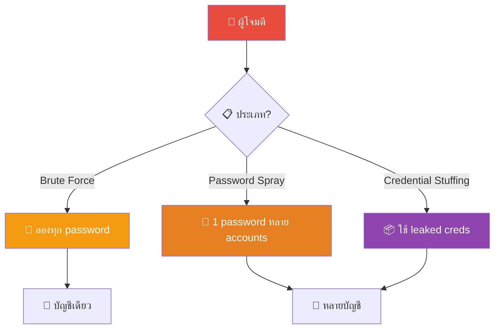
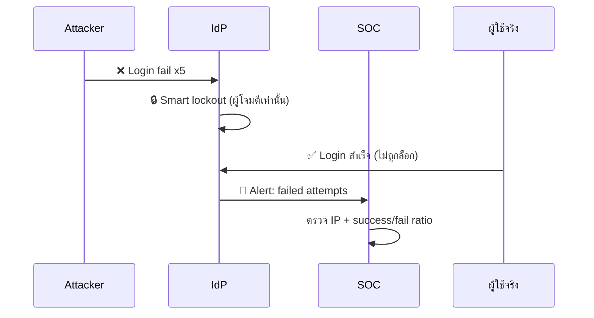
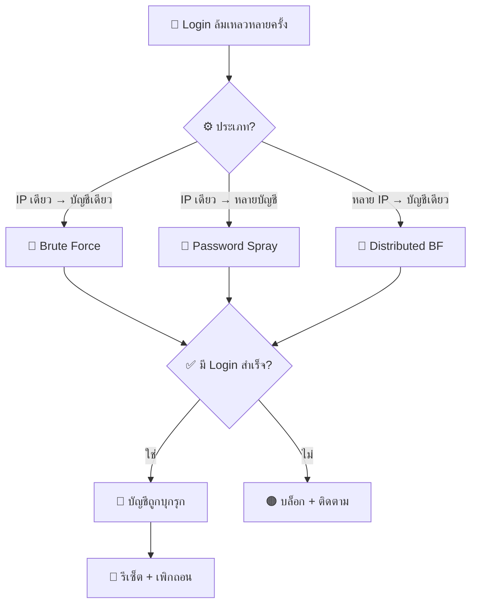
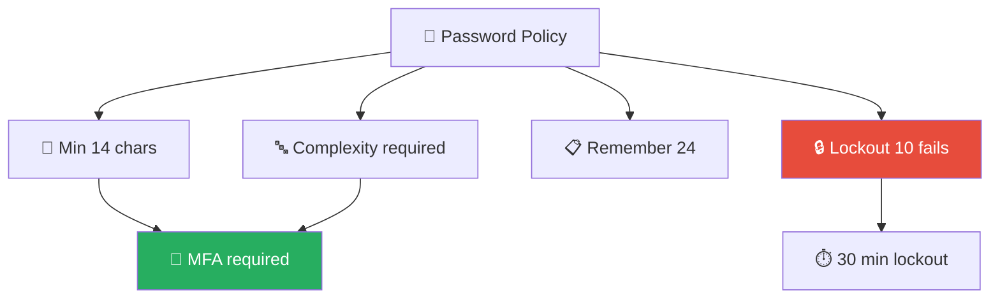
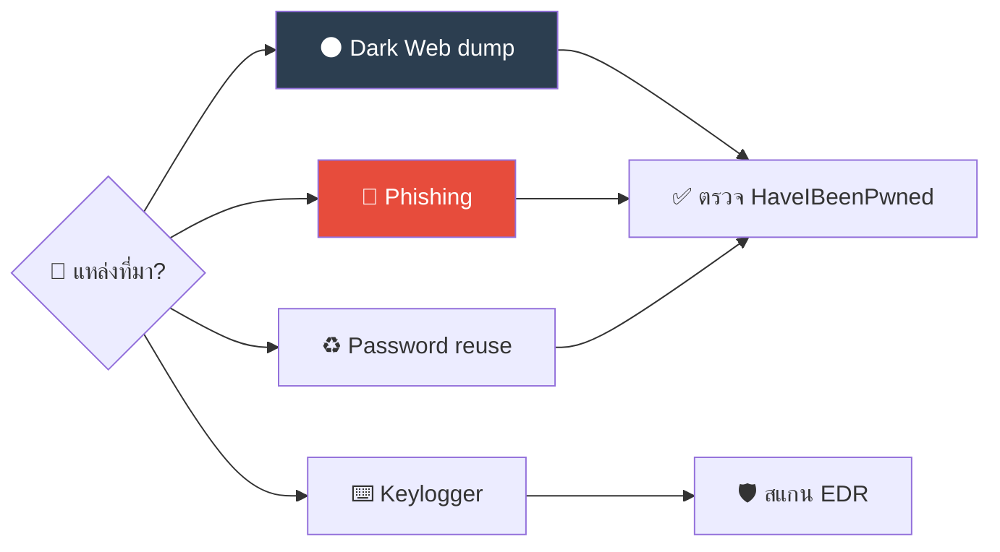

# Playbook: Brute Force / Password Spray

**ID**: PB-04
**ระดับความรุนแรง**: ต่ำ/ปานกลาง/สูง | **หมวดหมู่**: Identity & Access
**MITRE ATT&CK**: [T1110](https://attack.mitre.org/techniques/T1110/) (Brute Force)
**ทริกเกอร์**: SIEM alert (Event 4625 spike), IdP lockout, VPN failed logins, SSH fail2ban

### ผังรูปแบบการโจมตี

### ผัง Smart Lockout

---

## ผังการตัดสินใจ

---

## 1. การวิเคราะห์

### 1.1 ประเภทการโจมตี

| ประเภท | ลักษณะ | ความรุนแรง |
|:---|:---|:---|
| **Brute Force** | เดารหัสผ่านหลายรอบต่อบัญชีเดียว | 🟡 ปานกลาง |
| **Password Spray** | รหัสผ่านเดียวกดต่อหลายบัญชี | 🟠 สูง |
| **Credential Stuffing** | ใช้ credentials ที่รั่วไหล | 🔴 สูง |
| **Distributed** | หลาย IP → หลีกเลี่ยง lockout | 🔴 สูง |

### 1.2 รายการตรวจสอบ

| รายการ | วิธีตรวจสอบ | เสร็จ |
|:---|:---|:---:|
| จำนวน login ล้มเหลว | SIEM (Event 4625) | ☐ |
| Source IP / ประเทศ | SIEM / GeoIP | ☐ |
| บัญชีที่ถูกโจมตี (เดียว/หลาย) | SIEM | ☐ |
| มี login สำเร็จในช่วงเดียวกัน? | Event 4624 | ☐ |
| IP อยู่ใน TI feeds? | VirusTotal, AbuseIPDB | ☐ |
| Target protocol (SSH/RDP/O365/VPN) | SIEM | ☐ |

---

## 2. การควบคุม

### 2.1 ไม่มี Login สำเร็จ

| # | การดำเนินการ | เสร็จ |
|:---:|:---|:---:|
| 1 | **บล็อก** source IP ที่ firewall/WAF | ☐ |
| 2 | **เพิ่ม** rate limiting | ☐ |
| 3 | **ติดตาม** บัญชีเป้าหมาย | ☐ |

### 2.2 มี Login สำเร็จ

| # | การดำเนินการ | เสร็จ |
|:---:|:---|:---:|
| 1 | **รีเซ็ตรหัสผ่าน** ทันที | ☐ |
| 2 | **เพิกถอน sessions** ทั้งหมด | ☐ |
| 3 | **บล็อก** source IP | ☐ |
| 4 | **ตรวจ** กิจกรรมหลัง login สำเร็จ | ☐ |
| 5 | ยกระดับไป [PB-05 Account Compromise](Account_Compromise.th.md) | ☐ |

---

## 3. การฟื้นฟู

| # | การดำเนินการ | เสร็จ |
|:---:|:---|:---:|
| 1 | บังคับ MFA ทุกบัญชี | ☐ |
| 2 | ใช้ Smart Lockout / Account lockout policies | ☐ |
| 3 | พิจารณา Passwordless authentication | ☐ |
| 4 | เปิด credential leak monitoring | ☐ |

---

## 4. เกณฑ์การยกระดับ

| เงื่อนไข | ยกระดับไปยัง |
|:---|:---|
| Login สำเร็จ — บัญชีถูกบุกรุก | [PB-05](Account_Compromise.th.md) |
| Admin account ถูกโจมตี | CISO |
| Distributed attack (>100 IPs) | SOC Lead |

---

### ผัง Password Policy Hardening

### ผังแหล่งที่มา Credential

## เอกสารที่เกี่ยวข้อง

- [กรอบการตอบสนองต่อเหตุการณ์](../Framework.th.md)
- [PB-05 บัญชีถูกบุกรุก](Account_Compromise.th.md)

## อ้างอิง

- [MITRE ATT&CK T1110 — Brute Force](https://attack.mitre.org/techniques/T1110/)
