# Playbook: Command & Control (C2) Traffic

**ID**: PB-13
**Severity**: High/Critical | **Category**: Network Security
**MITRE ATT&CK**: [T1071](https://attack.mitre.org/techniques/T1071/) (Application Layer Protocol), [T1573](https://attack.mitre.org/techniques/T1573/) (Encrypted Channel), [T1571](https://attack.mitre.org/techniques/T1571/) (Non-Standard Port)
**Trigger**: IDS/IPS alert, EDR beacon detection, DNS anomaly, Proxy alert (known C2 domain), SIEM correlation

### C2 Lifecycle

```mermaid
graph LR
    Implant["🦠 Implant"] --> Beacon["📡 Beacon"]
    Beacon --> C2["🖥️ C2 Server"]
    C2 --> Task["📋 Task"]
    Task --> Execute["⚡ Execute"]
    Execute --> Result["📤 Exfil Result"]
    Result --> C2
    style Implant fill:#e74c3c,color:#fff
    style C2 fill:#8e44ad,color:#fff
    style Execute fill:#c0392b,color:#fff
```



### Sinkhole Operation

```mermaid
sequenceDiagram
    participant Host as Infected Host
    participant DNS
    participant Sinkhole
    participant SOC
    Note over DNS: Redirect C2 domain → Sinkhole IP
    Host->>DNS: Resolve c2.evil.com
    DNS-->>Host: Sinkhole IP
    Host->>Sinkhole: Beacon attempt
    Sinkhole->>SOC: 📋 Log beacon
    SOC->>SOC: Identify all infected hosts
    SOC->>Host: Isolate + Remediate
```



---

## Decision Flow

```mermaid
graph TD
    Alert["🚨 C2 / Beaconing Alert"] --> Rep{"🔍 Domain/IP Reputation?"}
    Rep -->|Known C2 (TI Match)| Confirmed["🔴 Confirmed C2"]
    Rep -->|Suspicious / NRD| Analyze["⚠️ Deep Analysis"]
    Rep -->|Clean / CDN| Beacon{"📊 Beaconing Pattern?"}
    Analyze --> Process{"Which Process?"}
    Beacon -->|Regular Interval + Fixed Size| Suspicious["⚠️ Suspicious"]
    Beacon -->|Irregular / User-Driven| FP["✅ Likely Legitimate"]
    Suspicious --> Process
    Process -->|powershell / cmd / rundll32| Confirmed
    Process -->|Browser / Known App| Context["Check User Context"]
    Context -->|User Initiated| FP
    Context -->|No User Activity| Confirmed
    Confirmed --> Isolate["🔌 Isolate + Block"]
```

---

## 1. Analysis

### 1.1 Network Indicators

| Check | How | Done |
|:---|:---|:---:|
| Destination IP/domain reputation | VirusTotal, AbuseIPDB, ThreatFox | ☐ |
| Domain age | WHOIS — newly registered domain (< 30 days)? | ☐ |
| DNS query pattern | High frequency, unusual TLD, DGA-like characters? | ☐ |
| Beaconing interval | Regular callback interval (e.g., every 60s, 300s, 3600s) | ☐ |
| JA3/JA3S fingerprint | Match against known C2 framework signatures | ☐ |
| Data volume per connection | Fixed-size small payloads = heartbeat; large = exfil | ☐ |
| Protocol/port | Standard HTTP/HTTPS or unusual port? | ☐ |

### 1.2 Endpoint Indicators

| Check | How | Done |
|:---|:---|:---:|
| Initiating process | Which process is making connections? (EDR) | ☐ |
| Process parent chain | Legitimate parent chain or suspicious? | ☐ |
| Process injection | Is a legitimate process (svchost.exe) making anomalous connections? | ☐ |
| Persistence | Any new scheduled tasks, services, or registry Run keys? | ☐ |
| Loaded DLLs | Any unsigned or unusual DLLs loaded? | ☐ |

### 1.3 Known C2 Frameworks

| Framework | Common Indicators |
|:---|:---|
| **Cobalt Strike** | Default malleable profile, JA3 fingerprint, DNS beacons |
| **Metasploit** | Meterpreter HTTP/S callbacks, encoded payloads |
| **Sliver** | mTLS/WireGuard, DNS canaries |
| **Covenant** | .NET implants, Grunt callbacks |
| **Empire** | PowerShell agent, stager downloads |
| **Custom** | Unknown domain + beaconing + non-standard process |

---

## 2. Containment

### 2.1 Immediate Actions (within 5 minutes)

| # | Action | Tool | Done |
|:---:|:---|:---|:---:|
| 1 | **Block C2 IP/domain** at perimeter firewall | Firewall | ☐ |
| 2 | **DNS sinkhole** the C2 domain | DNS server | ☐ |
| 3 | **Network isolate** the infected host | EDR | ☐ |
| 4 | **Block hash** of malicious process/binary | EDR global blacklist | ☐ |
| 5 | **Disable user account** on affected host | AD / IdP | ☐ |

### 2.2 Extended Containment

| # | Action | Done |
|:---:|:---|:---:|
| 1 | Search for same C2 indicators on ALL hosts (threat hunt) | ☐ |
| 2 | Check if other hosts beaconed to same destination | ☐ |
| 3 | Block all domains registered by same registrant (WHOIS pivot) | ☐ |
| 4 | Check lateral movement from infected host | ☐ |

---

## 3. Eradication

| # | Action | Done |
|:---:|:---|:---:|
| 1 | Kill malicious process(es) | ☐ |
| 2 | Remove implant/payload from disk | ☐ |
| 3 | Remove persistence mechanisms | ☐ |
| 4 | If process injection was used, **re-image the host** (cleaning may be unreliable) | ☐ |
| 5 | Memory dump capture before cleanup (for forensic analysis) | ☐ |
| 6 | Full EDR/AV scan of affected host | ☐ |

---

## 4. Recovery

| # | Action | Done |
|:---:|:---|:---:|
| 1 | Reconnect host after verified clean state | ☐ |
| 2 | Submit C2 IoCs to TI platform (update all defenses) | ☐ |
| 3 | Create/update SIEM detection rule for this C2 pattern | ☐ |
| 4 | Add JA3/JA3S fingerprint to monitoring if novel | ☐ |
| 5 | Monitor reconnected host for 72 hours | ☐ |

---

## 5. IoC Collection

| Type | Value | Source |
|:---|:---|:---|
| C2 Domain | | DNS logs / NDR |
| C2 IP | | Firewall / Proxy |
| JA3 Fingerprint | | NDR / TLS inspection |
| Beacon Interval | | Network analysis |
| Malicious Process | | EDR |
| Process Hash (SHA256) | | EDR |
| Dropped Files | | EDR / Forensics |
| Persistence Location | | EDR |

---

## 6. Escalation Criteria

| Condition | Escalate To |
|:---|:---|
| Confirmed C2 with active beaconing | Tier 2 + Threat Hunt |
| Multiple hosts beaconing | Major Incident |
| Known APT framework detected | CISO + External IR |
| Data exfiltration over C2 | [PB-08](Data_Exfiltration.en.md) + Legal |
| Domain controller / critical server infected | CISO immediately |
| C2 via DNS tunneling | Network team + Tier 2 |

---

### C2 Framework Classification

```mermaid
graph TD
    C2["📡 C2 Framework"] --> Type{"📋 Protocol?"}
    Type -->|HTTP/S| Web["🌐 Cobalt Strike, Sliver"]
    Type -->|DNS| DNS["🔤 DNScat2, Iodine"]
    Type -->|DoH| DoH["🔒 Godoh"]
    Type -->|Cloud| Cloud["☁️ Azure C2, GC2"]
    Web --> Detect["🔍 Proxy/TLS inspection"]
    DNS --> Detect2["🔍 DNS analytics"]
    style C2 fill:#e74c3c,color:#fff
```



### Beacon Detection Pattern

```mermaid
sequenceDiagram
    participant Malware
    participant Proxy
    participant SIEM
    participant SOC
    loop Every 60s ± jitter
        Malware->>Proxy: HTTPS callback
    end
    Proxy->>SIEM: Log pattern
    SIEM->>SIEM: Detect periodic beaconing
    SIEM->>SOC: 🚨 C2 beacon detected
    SOC->>SOC: Block domain + isolate host
```



## Related Documents

- [IR Framework](../Framework.en.md)
- [Incident Report](../../templates/incident_report.en.md)
- [PB-03 Malware Infection](Malware_Infection.en.md)
- [PB-12 Lateral Movement](Lateral_Movement.en.md)
- [PB-08 Data Exfiltration](Data_Exfiltration.en.md)

## References

- [MITRE ATT&CK T1071 — Application Layer Protocol](https://attack.mitre.org/techniques/T1071/)
- [SANS Hunt Evil: Beaconing](https://www.sans.org/white-papers/39600/)
- [JA3 Fingerprinting](https://github.com/salesforce/ja3)
