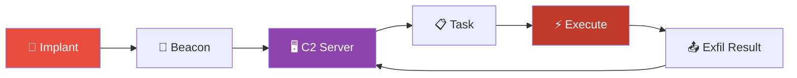
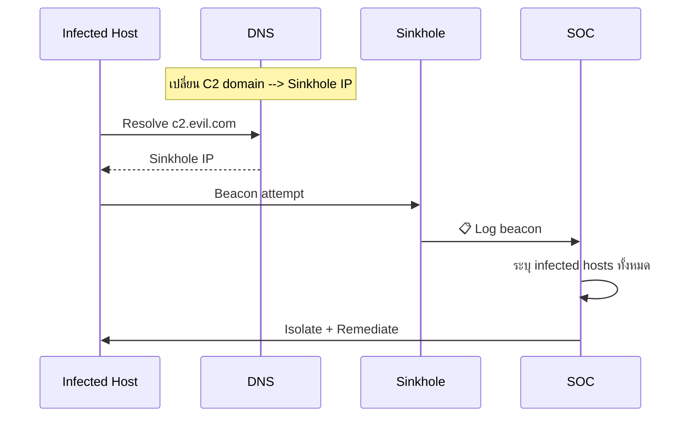
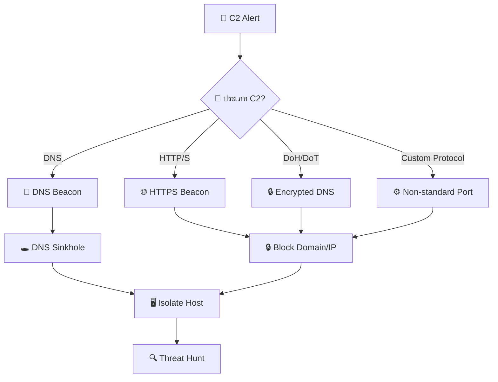
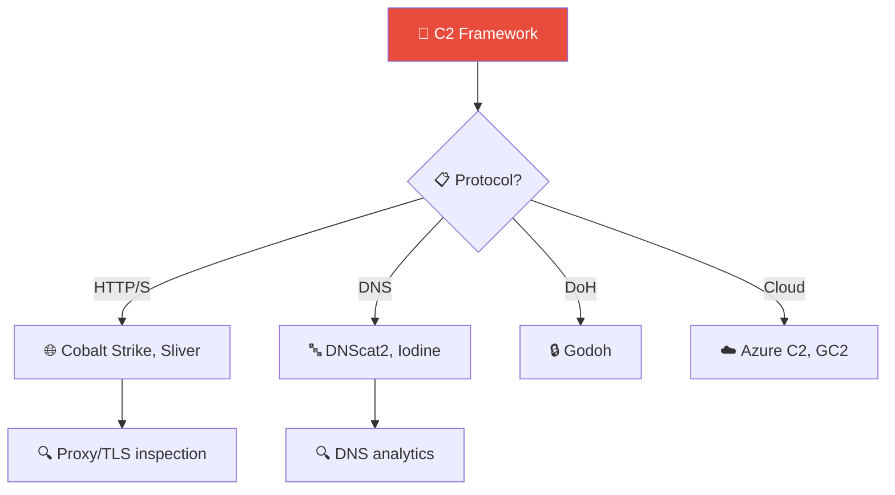
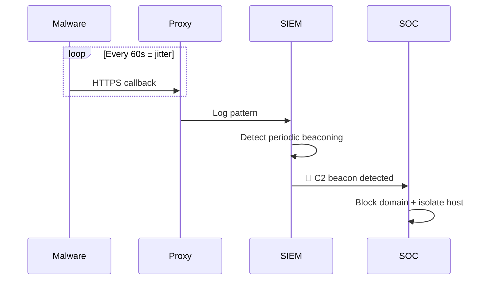

# Playbook: การสื่อสาร C2 (Command and Control)

**ID**: PB-13
**ระดับความรุนแรง**: สูง/วิกฤต | **หมวดหมู่**: เครือข่าย / การโจมตี
**MITRE ATT&CK**: [T1071](https://attack.mitre.org/techniques/T1071/) (Application Layer Protocol), [T1573](https://attack.mitre.org/techniques/T1573/) (Encrypted Channel)
**ทริกเกอร์**: IDS/IPS alert, EDR beacon detection, DNS anomaly, proxy alert (known C2 domain)

### ผังวงจรชีวิต C2

### ผังขั้นตอน Sinkhole

---

## ผังการตัดสินใจ

---

## 1. การวิเคราะห์

### 1.1 ประเภทช่องทาง C2

| ช่องทาง | เครื่องมือ | ตัวบ่งชี้ | การตรวจจับ |
|:---|:---|:---|:---|
| **HTTP/S Beacon** | Cobalt Strike, Metasploit | Periodic callbacks, jitter | Proxy / SSL inspection |
| **DNS Beacon** | DNS over payload | High entropy subdomains | DNS logs, RPZ |
| **DoH/DoT** | Built-in OS | Bypass DNS monitoring | Block external DoH |
| **Social Media** | Twitter/Telegram API | API calls | Proxy / CASB |
| **Cloud Services** | Azure, AWS, GCP APIs | Legitimate domain | Network analytics |
| **Custom TCP/UDP** | Custom malware | Non-standard ports | Netflow / IDS |

### 1.2 รายการตรวจสอบ

| รายการ | วิธีตรวจสอบ | เสร็จ |
|:---|:---|:---:|
| Host ที่ติดต่อ C2 คือเครื่องใด? | EDR / SIEM | ☐ |
| Domain/IP ของ C2 server | Proxy, DNS, Netflow | ☐ |
| ช่วงเวลา beacon (interval + jitter) | Proxy / EDR | ☐ |
| Process ที่ทำ C2 connection | EDR (Sysmon Event 3) | ☐ |
| hash ของ malware / implant | EDR | ☐ |
| ตรวจ C2 ใน TI feeds (VirusTotal, AbuseIPDB) | TI platform | ☐ |
| มี host อื่นติดต่อ C2 เดียวกันหรือไม่? | SIEM pivot search | ☐ |
| มี lateral movement จาก host นี้? | EDR + AD logs | ☐ |

---

## 2. การควบคุม

### 2.1 การดำเนินการทันที

| # | การดำเนินการ | เครื่องมือ | เสร็จ |
|:---:|:---|:---|:---:|
| 1 | **Block** C2 domain/IP ที่ proxy, firewall, DNS | All | ☐ |
| 2 | **Isolate** host ที่ติดเชื้อจากเครือข่าย | EDR / Network | ☐ |
| 3 | **Kill** process ที่ทำ C2 connection | EDR | ☐ |
| 4 | **ค้นหา** host อื่นที่ติดต่อ C2 เดียวกัน | SIEM | ☐ |
| 5 | **Block** malicious hash ใน EDR | EDR policy | ☐ |

### 2.2 ป้องกัน Lateral Movement

| # | การดำเนินการ | เสร็จ |
|:---:|:---|:---:|
| 1 | รีเซ็ตรหัสผ่านบัญชีบน host ที่ติดเชื้อ | ☐ |
| 2 | ตรวจ AD/Kerberos anomalies | ☐ |
| 3 | เพิ่ม monitoring บน segment ที่เกี่ยวข้อง | ☐ |

---

## 3. การกำจัด

| # | การดำเนินการ | เสร็จ |
|:---:|:---|:---:|
| 1 | ลบ malware/implant ออกจาก host ทั้งหมด | ☐ |
| 2 | ลบ persistence (scheduled task, registry, service) | ☐ |
| 3 | รีเซ็ต credentials ที่อาจถูกขโมย | ☐ |
| 4 | สำรอง forensic evidence | ☐ |

---

## 4. การฟื้นฟู

| # | การดำเนินการ | เสร็จ |
|:---:|:---|:---:|
| 1 | Rebuild/restore host จาก known-good image | ☐ |
| 2 | เพิ่ม detection rules สำหรับ C2 pattern | ☐ |
| 3 | Block DoH/DoT ไปยัง external resolvers | ☐ |
| 4 | เปิด SSL/TLS inspection | ☐ |
| 5 | ติดตาม 30 วัน | ☐ |

---

## 5. เกณฑ์การยกระดับ

| เงื่อนไข | ยกระดับไปยัง |
|:---|:---|
| Cobalt Strike / APT tool ตรวจพบ | Tier 2 + Threat Hunt |
| หลาย host ติดต่อ C2 เดียวกัน | Major Incident |
| Lateral movement ตรวจพบ | [PB-09 Lateral Movement](Lateral_Movement.th.md) |
| Data exfiltration ผ่าน C2 | [PB-08 Data Exfiltration](Data_Exfiltration.th.md) |
| Nation-state indicators | CISO + Law Enforcement |

---

### ผัง C2 Framework Classification

### ผัง Beacon Detection Pattern

## เอกสารที่เกี่ยวข้อง

- [กรอบการตอบสนองต่อเหตุการณ์](../Framework.th.md)
- [แม่แบบรายงานเหตุการณ์](../../templates/incident_report.th.md)
- [PB-03 มัลแวร์](Malware_Infection.th.md)
- [PB-25 DNS Tunneling](DNS_Tunneling.th.md)

## อ้างอิง

- [MITRE ATT&CK — Command and Control](https://attack.mitre.org/tactics/TA0011/)
