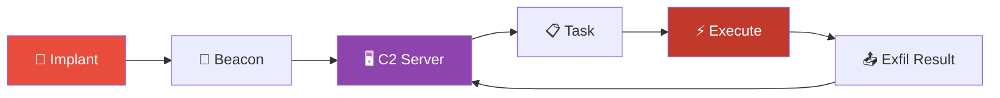
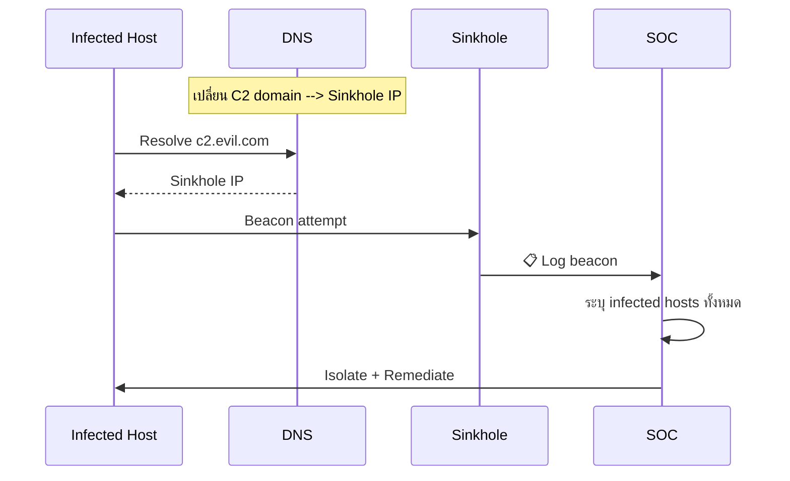
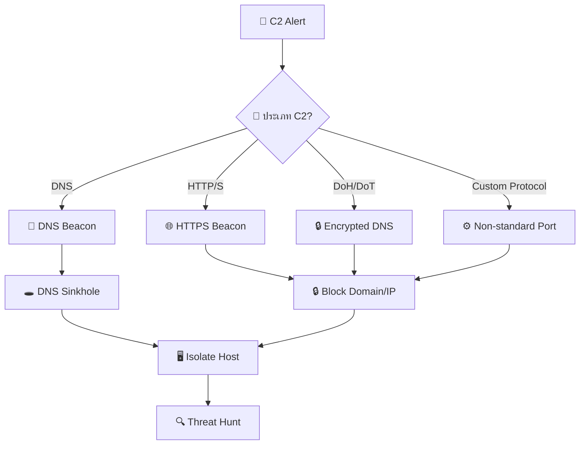
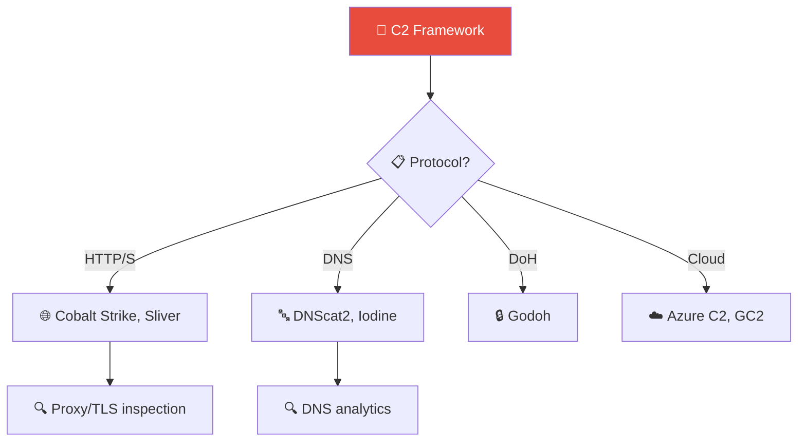
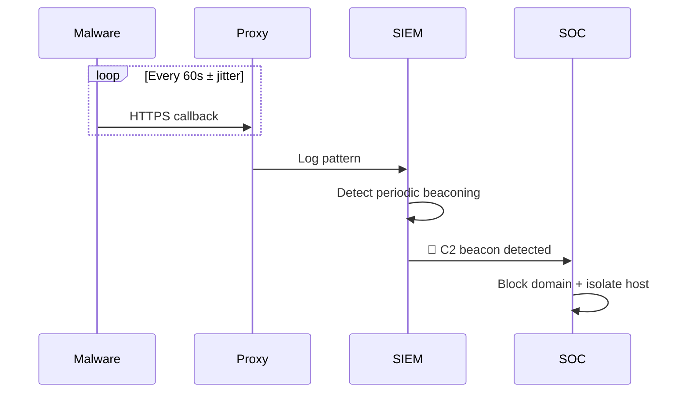

# Playbook: การสื่อสาร C2 (Command and Control)

**ID**: PB-13
**ระดับความรุนแรง**: สูง/วิกฤต | **หมวดหมู่**: เครือข่าย / การโจมตี
**MITRE ATT&CK**: [T1071](https://attack.mitre.org/techniques/T1071/) (Application Layer Protocol), [T1573](https://attack.mitre.org/techniques/T1573/) (Encrypted Channel)
**ทริกเกอร์**: IDS/IPS alert, EDR beacon detection, DNS anomaly, proxy alert (known C2 domain)

## หลังเหตุการณ์ (Post-Incident)

- [ ] บล็อก C2 domains/IPs ที่ firewall และ DNS
- [ ] ส่ง C2 indicators ไปยัง threat intel sharing platforms
- [ ] ตรวจ TLS inspection coverage สำหรับ encrypted C2
- [ ] ใช้ JA3/JA3S fingerprint detection
- [ ] ใช้ DNS sinkholing สำหรับ C2 domains
- [ ] จัดทำ [Incident Report](../../11_Reporting_Templates/incident_report.th.md)

### ผังวงจรชีวิต C2

```mermaid
graph LR
    Implant["🦠 Implant"] --> Beacon["📡 Beacon"]
    Beacon --> C2["🖥️ C2 Server"]
    C2 --> Task["📋 Task"]
    Task --> Execute["⚡ Execute"]
    Execute --> Result["📤 Exfil Result"]
    Result --> C2
    style Implant fill:#e74c3c,color:#fff
    style C2 fill:#8e44ad,color:#fff
    style Execute fill:#c0392b,color:#fff
```

### ผังขั้นตอน Sinkhole

```mermaid
sequenceDiagram
    participant Host as Infected Host
    participant DNS
    participant Sinkhole
    participant SOC
    Note over DNS: เปลี่ยน C2 domain --> Sinkhole IP
    Host->>DNS: Resolve c2.evil.com
    DNS-->>Host: Sinkhole IP
    Host->>Sinkhole: Beacon attempt
    Sinkhole->>SOC: 📋 Log beacon
    SOC->>SOC: ระบุ infected hosts ทั้งหมด
    SOC->>Host: Isolate + Remediate
```

---

## ผังการตัดสินใจ

```mermaid
graph TD
    Alert["🚨 C2 Alert"] --> Type{"📡 ประเภท C2?"}
    Type -->|DNS| DNS["📡 DNS Beacon"]
    Type -->|HTTP/S| HTTP["🌐 HTTPS Beacon"]
    Type -->|DoH/DoT| DoH["🔒 Encrypted DNS"]
    Type -->|Custom Protocol| Custom["⚙️ Non-standard Port"]
    DNS --> Sinkhole["🕳️ DNS Sinkhole"]
    HTTP --> Block["🔒 Block Domain/IP"]
    DoH --> Block
    Custom --> Block
    Sinkhole --> Isolate["🖥️ Isolate Host"]
    Block --> Isolate
    Isolate --> Hunt["🔍 Threat Hunt"]
```

---

## 1. การวิเคราะห์

### 1.1 ประเภทช่องทาง C2

| ช่องทาง | เครื่องมือ | ตัวบ่งชี้ | การตรวจจับ |
|:---|:---|:---|:---|
| **HTTP/S Beacon** | Cobalt Strike, Metasploit | Periodic callbacks, jitter | Proxy / SSL inspection |
| **DNS Beacon** | DNS over payload | High entropy subdomains | DNS logs, RPZ |
| **DoH/DoT** | Built-in OS | Bypass DNS monitoring | Block external DoH |
| **Social Media** | Twitter/Telegram API | API calls | Proxy / CASB |
| **Cloud Services** | Azure, AWS, GCP APIs | Legitimate domain | Network analytics |
| **Custom TCP/UDP** | Custom malware | Non-standard ports | Netflow / IDS |

### 1.2 รายการตรวจสอบ

| รายการ | วิธีตรวจสอบ | เสร็จ |
|:---|:---|:---:|
| Host ที่ติดต่อ C2 คือเครื่องใด? | EDR / SIEM | ☐ |
| Domain/IP ของ C2 server | Proxy, DNS, Netflow | ☐ |
| ช่วงเวลา beacon (interval + jitter) | Proxy / EDR | ☐ |
| Process ที่ทำ C2 connection | EDR (Sysmon Event 3) | ☐ |
| hash ของ malware / implant | EDR | ☐ |
| ตรวจ C2 ใน TI feeds (VirusTotal, AbuseIPDB) | TI platform | ☐ |
| มี host อื่นติดต่อ C2 เดียวกันหรือไม่? | SIEM pivot search | ☐ |
| มี lateral movement จาก host นี้? | EDR + AD logs | ☐ |

---

## 2. การควบคุม

### 2.1 การดำเนินการทันที

| # | การดำเนินการ | เครื่องมือ | เสร็จ |
|:---:|:---|:---|:---:|
| 1 | **Block** C2 domain/IP ที่ proxy, firewall, DNS | All | ☐ |
| 2 | **Isolate** host ที่ติดเชื้อจากเครือข่าย | EDR / Network | ☐ |
| 3 | **Kill** process ที่ทำ C2 connection | EDR | ☐ |
| 4 | **ค้นหา** host อื่นที่ติดต่อ C2 เดียวกัน | SIEM | ☐ |
| 5 | **Block** malicious hash ใน EDR | EDR policy | ☐ |

### 2.2 ป้องกัน Lateral Movement

| # | การดำเนินการ | เสร็จ |
|:---:|:---|:---:|
| 1 | รีเซ็ตรหัสผ่านบัญชีบน host ที่ติดเชื้อ | ☐ |
| 2 | ตรวจ AD/Kerberos anomalies | ☐ |
| 3 | เพิ่ม monitoring บน segment ที่เกี่ยวข้อง | ☐ |

---

## 3. การกำจัด

| # | การดำเนินการ | เสร็จ |
|:---:|:---|:---:|
| 1 | ลบ malware/implant ออกจาก host ทั้งหมด | ☐ |
| 2 | ลบ persistence (scheduled task, registry, service) | ☐ |
| 3 | รีเซ็ต credentials ที่อาจถูกขโมย | ☐ |
| 4 | สำรอง forensic evidence | ☐ |

---

## 4. การฟื้นฟู

| # | การดำเนินการ | เสร็จ |
|:---:|:---|:---:|
| 1 | Rebuild/restore host จาก known-good image | ☐ |
| 2 | เพิ่ม detection rules สำหรับ C2 pattern | ☐ |
| 3 | Block DoH/DoT ไปยัง external resolvers | ☐ |
| 4 | เปิด SSL/TLS inspection | ☐ |
| 5 | ติดตาม 30 วัน | ☐ |

---

## 5. Evidence Checklist

| ประเภทหลักฐาน | สิ่งที่ต้องเก็บ | แหล่งข้อมูล | เหตุผลที่ต้องเก็บ |
|:---|:---|:---|:---|
| หลักฐานเครือข่าย | domain, IP, JA3/JA3S, interval, port, URI path, DNS query | NDR / DNS / proxy / firewall | ใช้ reconstruct beaconing และ C2 infrastructure |
| หลักฐานจาก host | process, binary hash, injection chain, persistence, memory dump | EDR / forensic tools | ใช้ระบุ implant และขอบเขตการ cleanup |
| หลักฐานด้านขอบเขต | host ทั้งหมดที่ beacon, user context, destination ที่ใช้ร่วมกัน | SIEM correlation | ใช้ดูว่าเป็น single host หรือ campaign |
| หลักฐาน exfiltration | transfer size, payload pattern, suspicious upload, tunnel use | NetFlow / proxy / DLP | ใช้ดูว่า C2 ถูกใช้ขโมยข้อมูลด้วยหรือไม่ |
| หลักฐาน threat intel | framework mapping, infrastructure age, prior abuse, actor overlap | TI platform | ใช้ช่วยตั้ง severity และ hunt ต่อ |

---

## 6. Minimum Telemetry Required

| แหล่ง Telemetry | ใช้เพื่ออะไร | ความสำคัญ | Blind Spot ถ้าไม่มี |
|:---|:---|:---:|:---|
| DNS, proxy, firewall, และ NDR telemetry | ดู beaconing, destination profile, tunneling, JA3 | Required | พิสูจน์ C2 traffic behavior ไม่ได้ |
| Endpoint และ EDR telemetry | ดู process lineage, implant, persistence | Required | ผูก network activity กับ process บน host ไม่ได้ |
| SIEM correlation ข้ามหลาย host | ดู infrastructure เดียวกันและการกระจายหลายเครื่อง | Required | มอง scope ของ campaign ไม่ครบ |
| NetFlow และ DLP telemetry | ดู volume และ exfiltration ผ่าน C2 | Recommended | พลาดผลกระทบด้านข้อมูล |
| Threat intel context | enrichment เรื่อง framework และ infrastructure | Recommended | triage และ hunting แม่นน้อยลง |

---

## 7. False Positive และ Tuning Guide

| Scenario | ทำไมจึงดูน่าสงสัย | วิธีตรวจสอบ | Tuning Action | ต้องยกระดับเมื่อ |
|:---|:---|:---|:---|:---|
| software updater polling | callback ตามรอบอาจดูเหมือน beacon | ยืนยัน signer, update domain, และ package owner | allowlist approved update domain พร้อม process context | host เดียวกันมี persistence หรือ destination แปลก |
| monitoring หรือ management agent | heartbeat ตามรอบดูเหมือน C2 | ยืนยัน agent binary, management server, และ interval | suppress เฉพาะ process/destination pair ที่อนุมัติ | identity ของ agent เปลี่ยนหรือ destination อยู่นอก infra ที่อนุมัติ |
| backup หรือ sync client | encrypted traffic ซ้ำ ๆ อาจดูน่าสงสัย | ยืนยัน client, tenant, และ owner | tune fingerprint และ endpoint ของ client ที่อนุมัติ | process เดียวกันไปโดน domain ใหม่หรือ port แปลก |
| security test หรือ red-team beacon | beacon โดยตั้งใจทำให้ดูเหมือนจริง | ยืนยัน exercise window, host list, และ implant hash | suppress เฉพาะ indicator ของ exercise ที่อนุมัติ | traffic โผล่นอก scope หรือแตะ segment สำคัญจริง |

---

## 8. เกณฑ์การยกระดับ

| เงื่อนไข | ยกระดับไปยัง |
|:---|:---|
| Cobalt Strike / APT tool ตรวจพบ | Tier 2 + Threat Hunt |
| หลาย host ติดต่อ C2 เดียวกัน | Major Incident |
| Lateral movement ตรวจพบ | [PB-09 Lateral Movement](Lateral_Movement.th.md) |
| Data exfiltration ผ่าน C2 | [PB-08 Data Exfiltration](Data_Exfiltration.th.md) |
| Nation-state indicators | CISO + Law Enforcement |

---

### ผัง C2 Framework Classification

```mermaid
graph TD
    C2["📡 C2 Framework"] --> Type{"📋 Protocol?"}
    Type -->|HTTP/S| Web["🌐 Cobalt Strike, Sliver"]
    Type -->|DNS| DNS["🔤 DNScat2, Iodine"]
    Type -->|DoH| DoH["🔒 Godoh"]
    Type -->|Cloud| Cloud["☁️ Azure C2, GC2"]
    Web --> Detect["🔍 Proxy/TLS inspection"]
    DNS --> Detect2["🔍 DNS analytics"]
    style C2 fill:#e74c3c,color:#fff
```

### ผัง Beacon Detection Pattern

```mermaid
sequenceDiagram
    participant Malware
    participant Proxy
    participant SIEM
    participant SOC
    loop Every 60s ± jitter
        Malware->>Proxy: HTTPS callback
    end
    Proxy->>SIEM: Log pattern
    SIEM->>SIEM: Detect periodic beaconing
    SIEM->>SOC: 🚨 C2 beacon detected
    SOC->>SOC: Block domain + isolate host
```

## กฎตรวจจับ (Sigma)

| กฎ | ไฟล์ |
|:---|:---|
| Network Beaconing Pattern | [net_beaconing.yml](../../08_Detection_Engineering/sigma_rules/net_beaconing.yml) |
| DNS Tunneling Detection | [net_dns_tunneling.yml](../../08_Detection_Engineering/sigma_rules/net_dns_tunneling.yml) |
| PowerShell Encoded Command | [proc_powershell_encoded.yml](../../08_Detection_Engineering/sigma_rules/proc_powershell_encoded.yml) |

## เอกสารที่เกี่ยวข้อง

- [กรอบการตอบสนองต่อเหตุการณ์](../Framework.th.md)
- [แม่แบบรายงานเหตุการณ์](../../11_Reporting_Templates/incident_report.th.md)
- [PB-03 มัลแวร์](Malware_Infection.th.md)
- [PB-25 DNS Tunneling](DNS_Tunneling.th.md)

## C2 Protocol Detection

| Protocol | Detection | Difficulty |
|:---|:---|:---|
| HTTP/S beaconing | JA3/JA3S fingerprint | Medium |
| DNS tunneling | Entropy + volume | Medium |
| ICMP tunneling | Payload analysis | High |
| Cloud service abuse | Domain reputation | Hard |
| Custom protocol | ML behavioral | Very Hard |

### Beaconing Analysis Template

| Feature | Value | Normal? | Score |
|:---|:---|:---|:---|
| Interval | 60s ± 5s | ❌ Too regular | +3 |
| Jitter | 8% | ❌ Low variance | +2 |
| Packet size | 256 bytes | ⚠️ Fixed | +1 |
| Session duration | 24/7 | ❌ Non-human | +3 |

### C2 Containment Steps
- [ ] Block C2 domain/IP at firewall
- [ ] Sinkhole DNS for C2 domain
- [ ] Isolate infected endpoints
- [ ] Capture memory for analysis
- [ ] Identify all beaconing hosts

### C2 IOC Sharing

| Type | Share With | Format |
|:---|:---|:---|
| Domain/IP | TI community | STIX |
| JA3 hash | Industry ISAC | CSV |
| Behavioral pattern | Internal SOC | Report |

## References

- [MITRE ATT&CK — Command and Control](https://attack.mitre.org/tactics/TA0011/)
