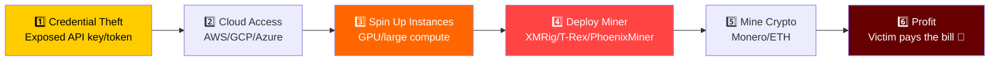
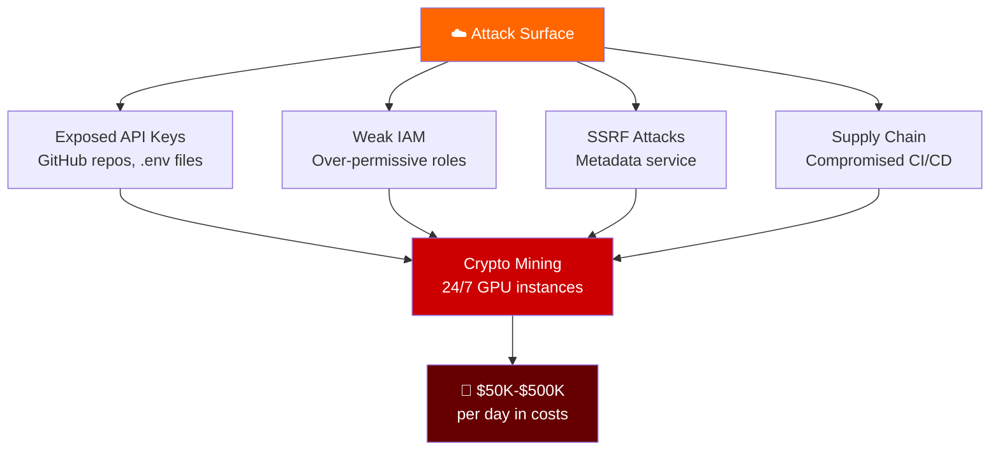
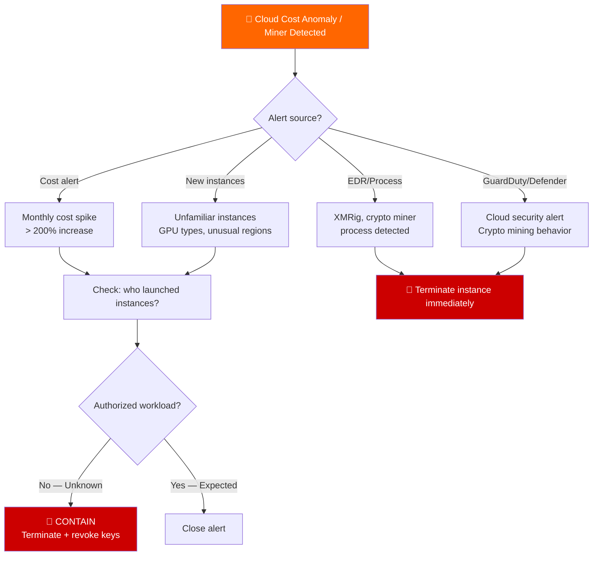
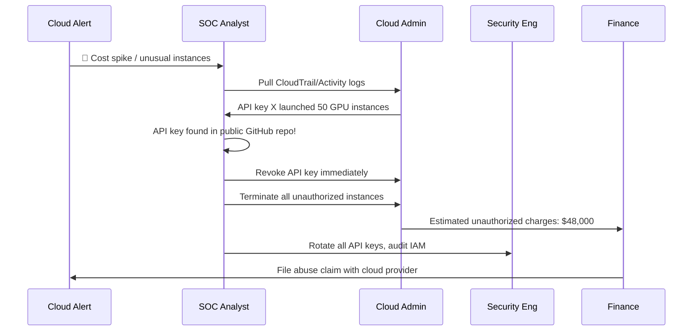
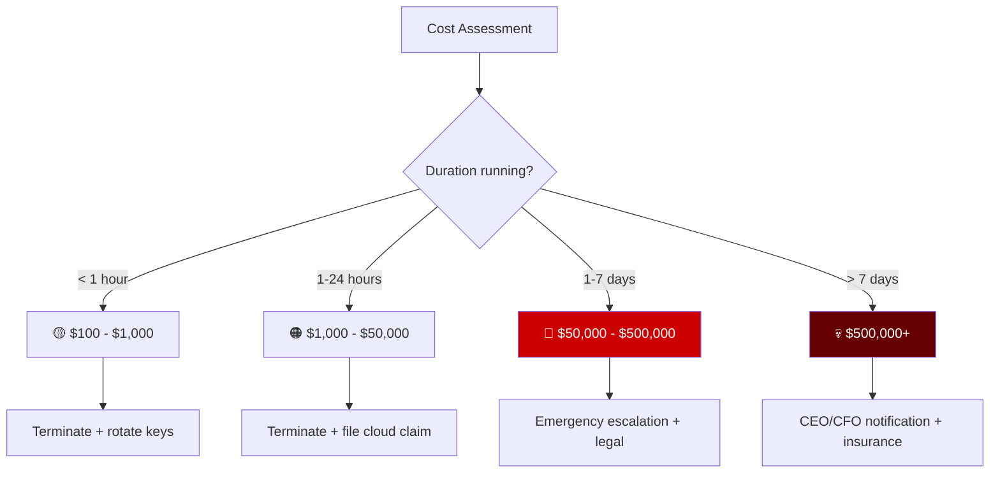
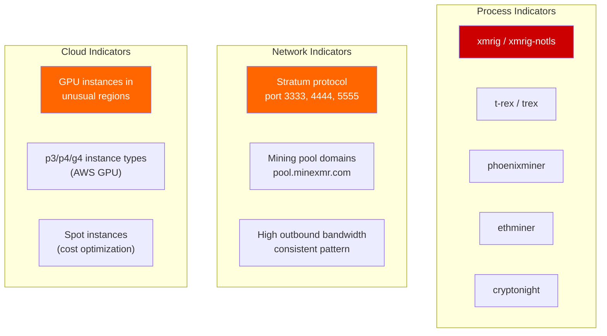

# Playbook: Cloud Cryptojacking Response

**ID**: PB-47
**Severity**: High | **Category**: Impact / Resource Hijacking
**MITRE ATT&CK**: [T1496](https://attack.mitre.org/techniques/T1496/) (Resource Hijacking)
**Trigger**: Cloud cost spike alert, unusual compute usage, EDR (crypto miner process), new large instances launched, API key abuse detected

> ⚠️ **WARNING**: Cloud cryptojacking can rack up hundreds of thousands in compute costs within hours. Attackers use stolen API keys or exposed credentials to spin up GPU instances for crypto mining.

### Cryptojacking Attack Chain


```mermaid
graph LR
    A["1️⃣ Credential Theft\nExposed API key/token"] --> B["2️⃣ Cloud Access\nAWS/GCP/Azure"]
    B --> C["3️⃣ Spin Up Instances\nGPU/large compute"]
    C --> D["4️⃣ Deploy Miner\nXMRig/T-Rex/PhoenixMiner"]
    D --> E["5️⃣ Mine Crypto\nMonero/ETH"]
    E --> F["6️⃣ Profit\nVictim pays the bill 💸"]
    style A fill:#ffcc00,color:#000
    style C fill:#ff6600,color:#fff
    style D fill:#ff4444,color:#fff
    style F fill:#660000,color:#fff
```

### Cloud Attack Surface


```mermaid
graph TD
    Surface["☁️ Attack Surface"] --> Keys["Exposed API Keys\nGitHub repos, .env files"]
    Surface --> IAM["Weak IAM\nOver-permissive roles"]
    Surface --> SSRF["SSRF Attacks\nMetadata service"]
    Surface --> Supply["Supply Chain\nCompromised CI/CD"]
    
    Keys --> Mine["Crypto Mining\n24/7 GPU instances"]
    IAM --> Mine
    SSRF --> Mine
    Supply --> Mine
    
    Mine --> Cost["💸 $50K-$500K\nper day in costs"]
    
    style Surface fill:#ff6600,color:#fff
    style Cost fill:#660000,color:#fff
    style Mine fill:#cc0000,color:#fff
```

---

## Decision Flow


```mermaid
graph TD
    Alert["🚨 Cloud Cost Anomaly / Miner Detected"] --> Source{"Alert source?"}
    Source -->|"Cost alert"| Cost["Monthly cost spike\n> 200% increase"]
    Source -->|"New instances"| Instances["Unfamiliar instances\nGPU types, unusual regions"]
    Source -->|"EDR/Process"| Process["XMRig, crypto miner\nprocess detected"]
    Source -->|"GuardDuty/Defender"| Guard["Cloud security alert\nCrypto mining behavior"]
    Cost --> Investigate["Check: who launched instances?"]
    Instances --> Investigate
    Process --> Isolate["🔴 Terminate instance immediately"]
    Guard --> Isolate
    Investigate --> Auth{"Authorized workload?"}
    Auth -->|"No — Unknown"| Contain["🔴 CONTAIN\nTerminate + revoke keys"]
    Auth -->|"Yes — Expected"| Close["Close alert"]
    style Alert fill:#ff6600,color:#fff
    style Contain fill:#cc0000,color:#fff
    style Isolate fill:#cc0000,color:#fff
```

### Investigation Workflow


```mermaid
sequenceDiagram
    participant Cloud as Cloud Alert
    participant SOC as SOC Analyst
    participant CloudAdmin as Cloud Admin
    participant SecEng as Security Eng
    participant Finance

    Cloud->>SOC: 🚨 Cost spike / unusual instances
    SOC->>CloudAdmin: Pull CloudTrail/Activity logs
    CloudAdmin->>SOC: API key X launched 50 GPU instances
    SOC->>SOC: API key found in public GitHub repo!
    SOC->>CloudAdmin: Revoke API key immediately
    SOC->>CloudAdmin: Terminate all unauthorized instances
    CloudAdmin->>Finance: Estimated unauthorized charges: $48,000
    SOC->>SecEng: Rotate all API keys, audit IAM
    Finance->>Cloud: File abuse claim with cloud provider
```

### Cost Impact Assessment


```mermaid
graph TD
    Impact["Cost Assessment"] --> Hours{"Duration running?"}
    Hours -->|"< 1 hour"| Low["🟡 $100 - $1,000"]
    Hours -->|"1-24 hours"| Med["🟠 $1,000 - $50,000"]
    Hours -->|"1-7 days"| High["🔴 $50,000 - $500,000"]
    Hours -->|"> 7 days"| Cat["💀 $500,000+"]
    Low --> Action1["Terminate + rotate keys"]
    Med --> Action2["Terminate + file cloud claim"]
    High --> Action3["Emergency escalation + legal"]
    Cat --> Action4["CEO/CFO notification + insurance"]
    style Cat fill:#660000,color:#fff
    style High fill:#cc0000,color:#fff
```

### Common Miner Indicators


```mermaid
graph TD
    subgraph "Process Indicators"
        P1["xmrig / xmrig-notls"]
        P2["t-rex / trex"]
        P3["phoenixminer"]
        P4["ethminer"]
        P5["cryptonight"]
    end
    subgraph "Network Indicators"
        N1["Stratum protocol\nport 3333, 4444, 5555"]
        N2["Mining pool domains\npool.minexmr.com"]
        N3["High outbound bandwidth\nconsistent pattern"]
    end
    subgraph "Cloud Indicators"
        C1["GPU instances in\nunusual regions"]
        C2["p3/p4/g4 instance types\n(AWS GPU)"]
        C3["Spot instances\n(cost optimization)"]
    end
    style P1 fill:#cc0000,color:#fff
    style N1 fill:#ff6600,color:#fff
    style C1 fill:#ff6600,color:#fff
```

### Response Timeline


```mermaid
gantt
    title Cloud Cryptojacking Response
    dateFormat HH:mm
    axisFormat %H:%M
    section Detection
        Cost/cloud alert       :a1, 00:00, 5min
        Verify unauthorized    :a2, after a1, 10min
    section Containment
        Terminate instances    :a3, after a2, 5min
        Revoke API keys        :a4, after a3, 10min
    section Investigation
        Audit CloudTrail       :a5, after a4, 60min
        Find credential source :a6, after a5, 60min
    section Recovery
        Rotate all credentials :a7, after a6, 120min
        File cloud abuse claim :a8, after a7, 30min
```

---

## 1. Immediate Actions (First 10 Minutes)

| # | Action | Owner |
|:---|:---|:---|
| 1 | Terminate ALL unauthorized compute instances | Cloud Admin |
| 2 | Revoke compromised API keys/access tokens | Cloud Admin |
| 3 | Set billing alert and spending limit immediately | Finance |
| 4 | Check for additional backdoor access (IAM users, roles) | SecEng |
| 5 | Audit CloudTrail/Activity Log for all actions by compromised key | SOC |
| 6 | Notify finance of estimated unauthorized charges | SOC Manager |

## 2. Investigation Checklist

### Cloud Platform Audit
- [ ] CloudTrail/Activity logs: who created the instances?
- [ ] Which API key/service account was used?
- [ ] Where was the credential exposed? (GitHub, .env, CI/CD)
- [ ] What instance types and regions were used?
- [ ] Were any additional IAM users/roles created?
- [ ] Are there persistent resources (Lambda, ECS tasks)?

### Cost Analysis
- [ ] Exact unauthorized compute charges
- [ ] Duration instances were running
- [ ] Estimated total financial impact
- [ ] Can cloud provider reverse charges?

## 3. Containment

| Scope | Action |
|:---|:---|
| **Instances** | Terminate all unauthorized compute |
| **API keys** | Revoke immediately, rotate all |
| **IAM** | Remove unauthorized users/roles |
| **Budget** | Set hard spending limit |
| **Secrets** | Scan repos for exposed credentials |

## 4. Evidence Checklist

| Evidence Type | What to Collect | Source | Why It Matters |
|:---|:---|:---|:---|
| Compute evidence | Unauthorized instances, regions, sizes, tags, launch times | Cloud console / asset inventory | Quantifies abuse footprint |
| Identity evidence | API keys, roles, service accounts, source IPs, CI/CD usage | Cloud audit / IAM | Identifies the abused credential path |
| Cost evidence | Charges, budgets, anomalous spend, provider credits/case IDs | Billing / finance records | Supports business response and reimbursement |
| Persistence evidence | Extra users, roles, Lambda/ECS tasks, startup scripts | Cloud audit / config / code repos | Shows whether the attacker left durable access |
| Exposure evidence | Where credentials were stored or leaked | Secret scanning / SCM / CI logs | Drives root-cause remediation |

## 5. Minimum Telemetry Required

| Telemetry Source | Required For | Priority | Blind Spot If Missing |
|:---|:---|:---:|:---|
| Cloud activity logs | Resource creation, key use, role changes, region spread | Required | Cannot trace the abuse path or actor |
| Billing and budget telemetry | Cost spike and unauthorized usage scope | Required | Abuse may be detected too late |
| IAM and secret-scanning telemetry | Exposed keys, unused roles, privileged accounts | Required | Credential root cause remains unclear |
| Asset and runtime telemetry | Running instances, containers, functions, persistence | Recommended | Hidden persistence may survive cleanup |
| Provider support/case records | Charge dispute and abuse case context | Recommended | Recovery and financial follow-up slow down |

## 6. False Positive and Tuning Guide

| Scenario | Why It Looks Suspicious | How to Validate | Tuning Action | Escalate If |
|:---|:---|:---|:---|:---|
| Planned burst compute or GPU job | High spend and new instances can resemble mining | Confirm workload owner, budget, region, and image | Tune for approved tags, accounts, and schedules only | Mining pools, unknown images, or unrelated IAM actions appear |
| Load test or simulation | Temporary compute spike may look abusive | Validate test window and source pipeline | Lower severity during approved stress tests | Resources persist after test or spread to unusual regions |
| Auto-scaling anomaly during incident | Rapid scale-out can resemble attacker-created instances | Confirm application incident and autoscaling policy | Tune against approved ASG/service identities | Manual launches or spend remains high after app issue ends |
| Security scan of leaked credentials | Detection activity may hit many repos/accounts | Validate scanner identity and scope | Allowlist scanner identities narrowly | The same credentials are actually used to launch resources |

## 7. Post-Incident

| Question | Answer |
|:---|:---|
| How were cloud credentials exposed? | [GitHub/env/CI/CD] |
| Were budget alerts configured? | [Yes/No] |
| Was IAM least-privilege enforced? | [Status] |
| Total financial impact? | [$Amount] |
| Were spending limits in place? | [Yes/No] |

## 8. Detection Rules (Sigma)

```yaml
title: Crypto Mining Process Detected
logsource:
    product: linux
    category: process_creation
detection:
    selection:
        Image|contains:
            - 'xmrig'
            - 'minerd'
            - 'cryptonight'
            - 't-rex'
            - 'phoenixminer'
    condition: selection
    level: critical
```

## Related Documents
- [IR Framework](../Framework.en.md)
- [Sigma Rules Index](../../08_Detection_Engineering/README.md)
- [Cloud Security Playbook](Cryptomining.en.md)
- [API Key Compromise Playbook](Cloud_IAM.en.md)
- [Account Compromise Playbook](Account_Compromise.en.md)

## References
- [MITRE T1496 — Resource Hijacking](https://attack.mitre.org/techniques/T1496/)
- [AWS — Detecting Cryptomining](https://docs.aws.amazon.com/guardduty/latest/ug/)
