# Playbook: Cloud Cryptojacking Response

**ID**: PB-47
**Severity**: High | **Category**: Impact / Resource Hijacking
**MITRE ATT&CK**: [T1496](https://attack.mitre.org/techniques/T1496/) (Resource Hijacking)
**Trigger**: Cloud cost spike alert, unusual compute usage, EDR (crypto miner process), new large instances launched, API key abuse detected

> ⚠️ **WARNING**: Cloud cryptojacking can rack up hundreds of thousands in compute costs within hours. Attackers use stolen API keys or exposed credentials to spin up GPU instances for crypto mining.

### Cryptojacking Attack Chain

```mermaid
graph LR
    A["1️⃣ Credential Theft\nExposed API key/token"] --> B["2️⃣ Cloud Access\nAWS/GCP/Azure"]
    B --> C["3️⃣ Spin Up Instances\nGPU/large compute"]
    C --> D["4️⃣ Deploy Miner\nXMRig/T-Rex/PhoenixMiner"]
    D --> E["5️⃣ Mine Crypto\nMonero/ETH"]
    E --> F["6️⃣ Profit\nVictim pays the bill 💸"]
    style A fill:#ffcc00,color:#000
    style C fill:#ff6600,color:#fff
    style D fill:#ff4444,color:#fff
    style F fill:#660000,color:#fff
```



### Cloud Attack Surface

```mermaid
graph TD
    Surface["☁️ Attack Surface"] --> Keys["Exposed API Keys\nGitHub repos, .env files"]
    Surface --> IAM["Weak IAM\nOver-permissive roles"]
    Surface --> SSRF["SSRF Attacks\nMetadata service"]
    Surface --> Supply["Supply Chain\nCompromised CI/CD"]
    
    Keys --> Mine["Crypto Mining\n24/7 GPU instances"]
    IAM --> Mine
    SSRF --> Mine
    Supply --> Mine
    
    Mine --> Cost["💸 $50K-$500K\nper day in costs"]
    
    style Surface fill:#ff6600,color:#fff
    style Cost fill:#660000,color:#fff
    style Mine fill:#cc0000,color:#fff
```



---

## Decision Flow


### Investigation Workflow

```mermaid
sequenceDiagram
    participant Cloud as Cloud Alert
    participant SOC as SOC Analyst
    participant CloudAdmin as Cloud Admin
    participant SecEng as Security Eng
    participant Finance

    Cloud->>SOC: 🚨 Cost spike / unusual instances
    SOC->>CloudAdmin: Pull CloudTrail/Activity logs
    CloudAdmin->>SOC: API key X launched 50 GPU instances
    SOC->>SOC: API key found in public GitHub repo!
    SOC->>CloudAdmin: Revoke API key immediately
    SOC->>CloudAdmin: Terminate all unauthorized instances
    CloudAdmin->>Finance: Estimated unauthorized charges: $48,000
    SOC->>SecEng: Rotate all API keys, audit IAM
    Finance->>Cloud: File abuse claim with cloud provider
```



### Cost Impact Assessment

```mermaid
graph TD
    Impact["Cost Assessment"] --> Hours{"Duration running?"}
    Hours -->|"< 1 hour"| Low["🟡 $100 - $1,000"]
    Hours -->|"1-24 hours"| Med["🟠 $1,000 - $50,000"]
    Hours -->|"1-7 days"| High["🔴 $50,000 - $500,000"]
    Hours -->|"> 7 days"| Cat["💀 $500,000+"]
    Low --> Action1["Terminate + rotate keys"]
    Med --> Action2["Terminate + file cloud claim"]
    High --> Action3["Emergency escalation + legal"]
    Cat --> Action4["CEO/CFO notification + insurance"]
    style Cat fill:#660000,color:#fff
    style High fill:#cc0000,color:#fff
```



### Common Miner Indicators


### Response Timeline


---

## 1. Immediate Actions (First 10 Minutes)

| # | Action | Owner |
|:---|:---|:---|
| 1 | Terminate ALL unauthorized compute instances | Cloud Admin |
| 2 | Revoke compromised API keys/access tokens | Cloud Admin |
| 3 | Set billing alert and spending limit immediately | Finance |
| 4 | Check for additional backdoor access (IAM users, roles) | SecEng |
| 5 | Audit CloudTrail/Activity Log for all actions by compromised key | SOC |
| 6 | Notify finance of estimated unauthorized charges | SOC Manager |

## 2. Investigation Checklist

### Cloud Platform Audit
- [ ] CloudTrail/Activity logs: who created the instances?
- [ ] Which API key/service account was used?
- [ ] Where was the credential exposed? (GitHub, .env, CI/CD)
- [ ] What instance types and regions were used?
- [ ] Were any additional IAM users/roles created?
- [ ] Are there persistent resources (Lambda, ECS tasks)?

### Cost Analysis
- [ ] Exact unauthorized compute charges
- [ ] Duration instances were running
- [ ] Estimated total financial impact
- [ ] Can cloud provider reverse charges?

## 3. Containment

| Scope | Action |
|:---|:---|
| **Instances** | Terminate all unauthorized compute |
| **API keys** | Revoke immediately, rotate all |
| **IAM** | Remove unauthorized users/roles |
| **Budget** | Set hard spending limit |
| **Secrets** | Scan repos for exposed credentials |

## 4. Post-Incident

| Question | Answer |
|:---|:---|
| How were cloud credentials exposed? | [GitHub/env/CI/CD] |
| Were budget alerts configured? | [Yes/No] |
| Was IAM least-privilege enforced? | [Status] |
| Total financial impact? | [$Amount] |
| Were spending limits in place? | [Yes/No] |

## 6. Detection Rules (Sigma)

```yaml
title: Crypto Mining Process Detected
logsource:
    product: linux
    category: process_creation
detection:
    selection:
        Image|contains:
            - 'xmrig'
            - 'minerd'
            - 'cryptonight'
            - 't-rex'
            - 'phoenixminer'
    condition: selection
    level: critical
```

## Related Documents
- [Cloud Security Playbook](Cloud_Security.en.md)
- [API Key Compromise Playbook](API_Key_Compromise.en.md)
- [Account Compromise Playbook](Account_Compromise.en.md)

## References
- [MITRE T1496 — Resource Hijacking](https://attack.mitre.org/techniques/T1496/)
- [AWS — Detecting Cryptomining](https://docs.aws.amazon.com/guardduty/latest/ug/)
