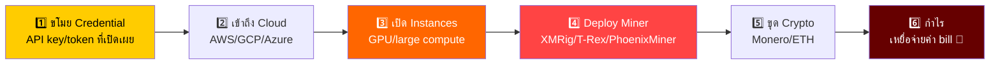
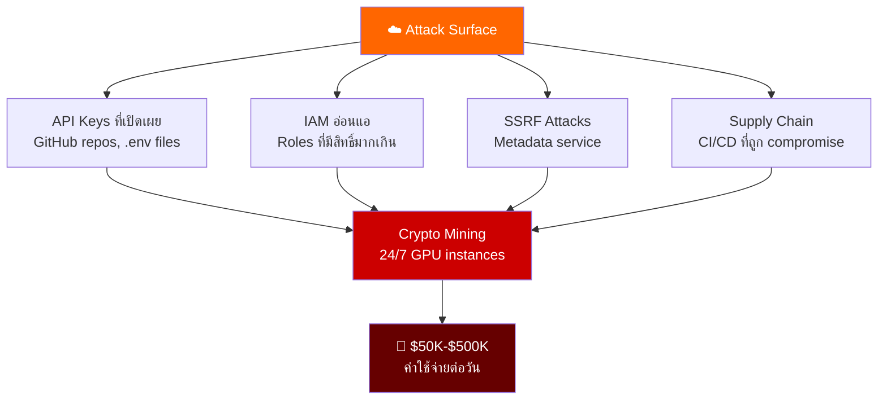
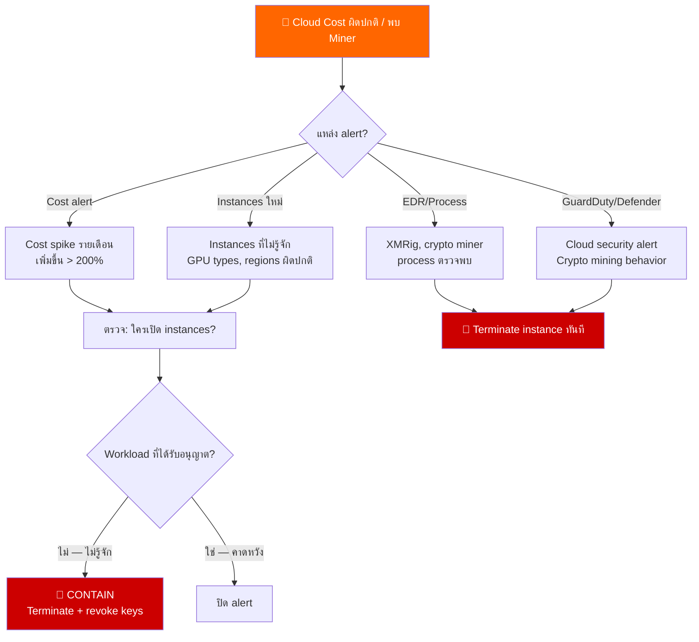
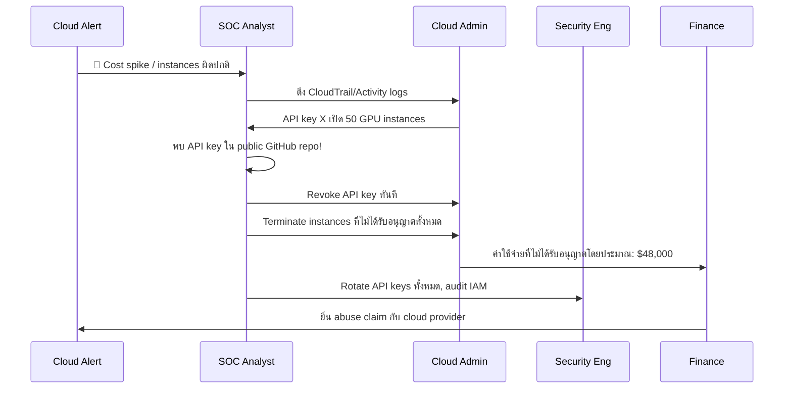
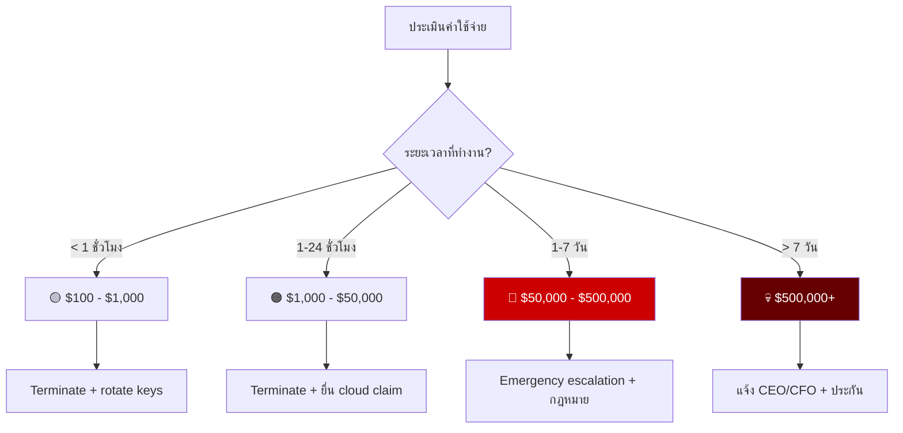
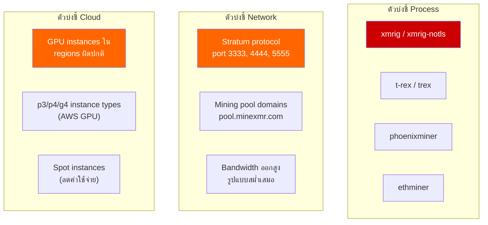

# Playbook: การตอบสนอง Cloud Cryptojacking

**ID**: PB-47
**ความรุนแรง**: สูง | **ประเภท**: Impact / Resource Hijacking
**MITRE ATT&CK**: [T1496](https://attack.mitre.org/techniques/T1496/) (Resource Hijacking)
**Trigger**: Cloud cost spike alert, การใช้ compute ผิดปกติ, EDR (crypto miner process), instances ขนาดใหญ่ที่เปิดใหม่, ตรวจพบ API key abuse

> ⚠️ **คำเตือน**: Cloud cryptojacking สามารถสร้างค่า compute หลายแสนถึงหลายล้านบาทภายในไม่กี่ชั่วโมง ผู้โจมตีใช้ API keys ที่ถูกขโมยเพื่อเปิด GPU instances สำหรับขุด crypto

### Cryptojacking Attack Chain



### Cloud Attack Surface



---

## Decision Flow



### ขั้นตอนการสืบสวน



### การประเมินผลกระทบค่าใช้จ่าย



### ตัวบ่งชี้ Miner ที่พบบ่อย



### Timeline การตอบสนอง

```mermaid
gantt
    title Cloud Cryptojacking Response
    dateFormat HH:mm
    axisFormat %H:%M
    section Detection
        Cost/cloud alert       :a1, 00:00, 5min
        ยืนยันไม่ได้รับอนุญาต  :a2, after a1, 10min
    section Containment
        Terminate instances    :a3, after a2, 5min
        Revoke API keys        :a4, after a3, 10min
    section Investigation
        Audit CloudTrail       :a5, after a4, 60min
        หาแหล่ง credential     :a6, after a5, 60min
    section Recovery
        Rotate credentials ทั้งหมด :a7, after a6, 120min
        ยื่น cloud abuse claim  :a8, after a7, 30min
```



---

## 1. การดำเนินการทันที (10 นาทีแรก)

| # | การดำเนินการ | ผู้รับผิดชอบ |
|:---|:---|:---|
| 1 | Terminate compute instances ที่ไม่ได้รับอนุญาตทั้งหมด | Cloud Admin |
| 2 | Revoke API keys/access tokens ที่ถูกโจมตี | Cloud Admin |
| 3 | ตั้ง billing alert และ spending limit ทันที | Finance |
| 4 | ตรวจ backdoor access เพิ่มเติม (IAM users, roles) | SecEng |
| 5 | Audit CloudTrail/Activity Log สำหรับทุกกิจกรรมของ key ที่ถูก compromise | SOC |
| 6 | แจ้งการเงินเรื่องค่าใช้จ่ายที่ไม่ได้รับอนุญาตโดยประมาณ | SOC Manager |

## 2. รายการตรวจสอบ

### Cloud Platform Audit
- [ ] CloudTrail/Activity logs: ใครสร้าง instances?
- [ ] API key/service account ไหนถูกใช้?
- [ ] Credential ถูกเปิดเผยที่ไหน? (GitHub, .env, CI/CD)
- [ ] Instance types และ regions อะไรถูกใช้?
- [ ] มี IAM users/roles ที่สร้างเพิ่มหรือไม่?

### วิเคราะห์ค่าใช้จ่าย
- [ ] ค่า compute ที่ไม่ได้รับอนุญาตที่แน่นอน
- [ ] ระยะเวลาที่ instances ทำงาน
- [ ] ผลกระทบทางการเงินรวมโดยประมาณ
- [ ] Cloud provider สามารถ reverse charges ได้หรือไม่?

## 3. การควบคุม (Containment)

| ขอบเขต | การดำเนินการ |
|:---|:---|
| **Instances** | Terminate compute ที่ไม่ได้รับอนุญาตทั้งหมด |
| **API keys** | Revoke ทันที, rotate ทั้งหมด |
| **IAM** | ลบ users/roles ที่ไม่ได้รับอนุญาต |
| **Budget** | ตั้ง hard spending limit |
| **Secrets** | Scan repos หา credentials ที่เปิดเผย |

## 4. หลังเหตุการณ์ (Post-Incident)

| คำถาม | คำตอบ |
|:---|:---|
| Cloud credentials ถูกเปิดเผยอย่างไร? | [GitHub/env/CI/CD] |
| Budget alerts กำหนดค่าอยู่หรือไม่? | [ใช่/ไม่] |
| IAM least-privilege บังคับใช้อยู่หรือไม่? | [สถานะ] |
| ผลกระทบทางการเงินรวม? | [$จำนวน] |

## 6. Detection Rules (Sigma)

```yaml
title: Crypto Mining Process Detected
logsource:
    product: linux
    category: process_creation
detection:
    selection:
        Image|contains:
            - 'xmrig'
            - 'minerd'
            - 'cryptonight'
            - 't-rex'
    condition: selection
    level: critical
```

## เอกสารที่เกี่ยวข้อง
- [Cloud Security Playbook](Cloud_Security.th.md)
- [Account Compromise Playbook](Account_Compromise.th.md)

## References
- [MITRE T1496 — Resource Hijacking](https://attack.mitre.org/techniques/T1496/)
- [AWS — Detecting Cryptomining](https://docs.aws.amazon.com/guardduty/latest/ug/)
