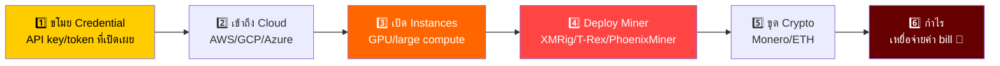
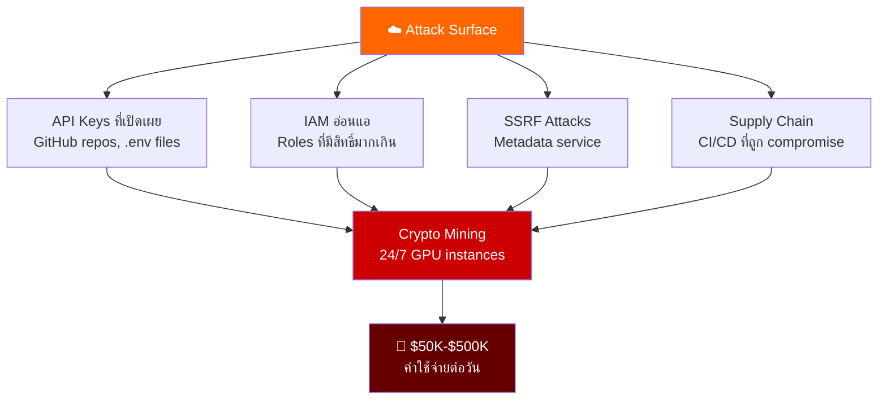
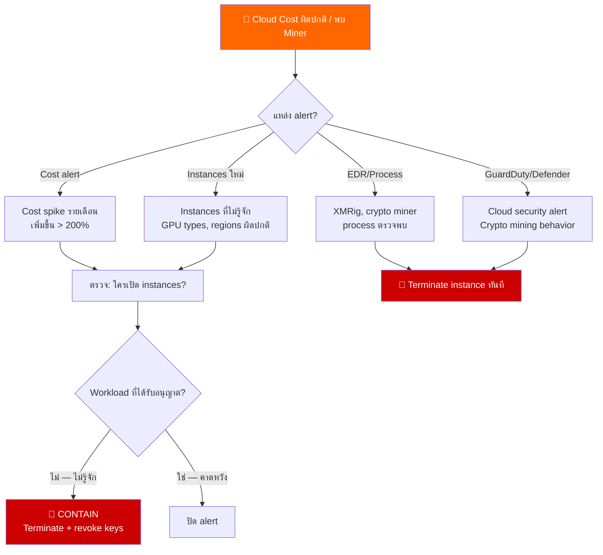
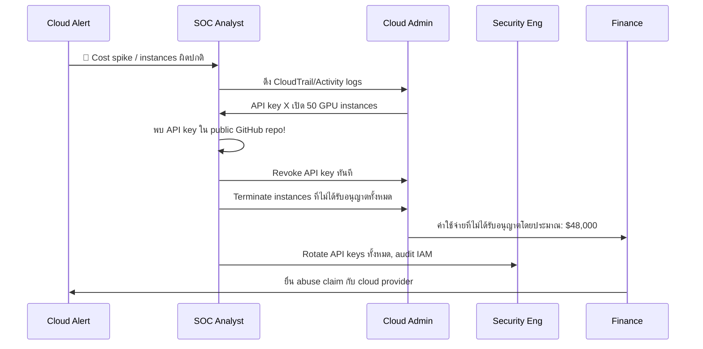
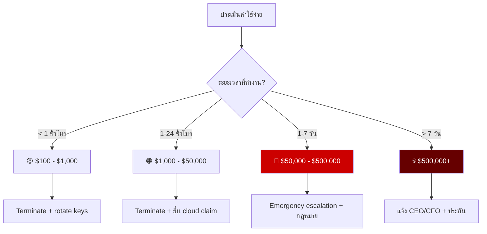
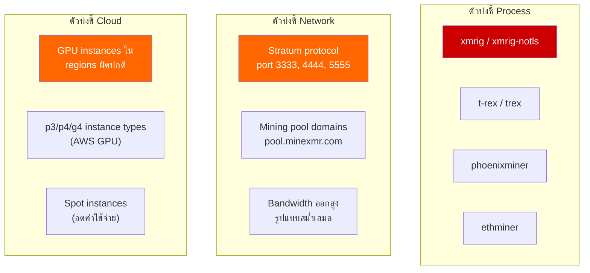

# Playbook: การตอบสนอง Cloud Cryptojacking

**ID**: PB-47
**ความรุนแรง**: สูง | **ประเภท**: Impact / Resource Hijacking
**MITRE ATT&CK**: [T1496](https://attack.mitre.org/techniques/T1496/) (Resource Hijacking)
**Trigger**: Cloud cost spike alert, การใช้ compute ผิดปกติ, EDR (crypto miner process), instances ขนาดใหญ่ที่เปิดใหม่, ตรวจพบ API key abuse

> ⚠️ **คำเตือน**: Cloud cryptojacking สามารถสร้างค่า compute หลายแสนถึงหลายล้านบาทภายในไม่กี่ชั่วโมง ผู้โจมตีใช้ API keys ที่ถูกขโมยเพื่อเปิด GPU instances สำหรับขุด crypto

### Cryptojacking Attack Chain


```mermaid
graph LR
    A["1️⃣ ขโมย Credential\nAPI key/token ที่เปิดเผย"] --> B["2️⃣ เข้าถึง Cloud\nAWS/GCP/Azure"]
    B --> C["3️⃣ เปิด Instances\nGPU/large compute"]
    C --> D["4️⃣ Deploy Miner\nXMRig/T-Rex/PhoenixMiner"]
    D --> E["5️⃣ ขุด Crypto\nMonero/ETH"]
    E --> F["6️⃣ กำไร\nเหยื่อจ่ายค่า bill 💸"]
    style A fill:#ffcc00,color:#000
    style C fill:#ff6600,color:#fff
    style D fill:#ff4444,color:#fff
    style F fill:#660000,color:#fff
```

### Cloud Attack Surface


```mermaid
graph TD
    Surface["☁️ Attack Surface"] --> Keys["API Keys ที่เปิดเผย\nGitHub repos, .env files"]
    Surface --> IAM["IAM อ่อนแอ\nRoles ที่มีสิทธิ์มากเกิน"]
    Surface --> SSRF["SSRF Attacks\nMetadata service"]
    Surface --> Supply["Supply Chain\nCI/CD ที่ถูก compromise"]
    
    Keys --> Mine["Crypto Mining\n24/7 GPU instances"]
    IAM --> Mine
    SSRF --> Mine
    Supply --> Mine
    
    Mine --> Cost["💸 $50K-$500K\nค่าใช้จ่ายต่อวัน"]
    
    style Surface fill:#ff6600,color:#fff
    style Cost fill:#660000,color:#fff
    style Mine fill:#cc0000,color:#fff
```

---

## Decision Flow


```mermaid
graph TD
    Alert["🚨 Cloud Cost ผิดปกติ / พบ Miner"] --> Source{"แหล่ง alert?"}
    Source -->|"Cost alert"| Cost["Cost spike รายเดือน\nเพิ่มขึ้น > 200%"]
    Source -->|"Instances ใหม่"| Instances["Instances ที่ไม่รู้จัก\nGPU types, regions ผิดปกติ"]
    Source -->|"EDR/Process"| Process["XMRig, crypto miner\nprocess ตรวจพบ"]
    Source -->|"GuardDuty/Defender"| Guard["Cloud security alert\nCrypto mining behavior"]
    Cost --> Investigate["ตรวจ: ใครเปิด instances?"]
    Instances --> Investigate
    Process --> Isolate["🔴 Terminate instance ทันที"]
    Guard --> Isolate
    Investigate --> Auth{"Workload ที่ได้รับอนุญาต?"}
    Auth -->|"ไม่ — ไม่รู้จัก"| Contain["🔴 CONTAIN\nTerminate + revoke keys"]
    Auth -->|"ใช่ — คาดหวัง"| Close["ปิด alert"]
    style Alert fill:#ff6600,color:#fff
    style Contain fill:#cc0000,color:#fff
    style Isolate fill:#cc0000,color:#fff
```

### ขั้นตอนการสืบสวน


```mermaid
sequenceDiagram
    participant Cloud as Cloud Alert
    participant SOC as SOC Analyst
    participant CloudAdmin as Cloud Admin
    participant SecEng as Security Eng
    participant Finance

    Cloud->>SOC: 🚨 Cost spike / instances ผิดปกติ
    SOC->>CloudAdmin: ดึง CloudTrail/Activity logs
    CloudAdmin->>SOC: API key X เปิด 50 GPU instances
    SOC->>SOC: พบ API key ใน public GitHub repo!
    SOC->>CloudAdmin: Revoke API key ทันที
    SOC->>CloudAdmin: Terminate instances ที่ไม่ได้รับอนุญาตทั้งหมด
    CloudAdmin->>Finance: ค่าใช้จ่ายที่ไม่ได้รับอนุญาตโดยประมาณ: $48,000
    SOC->>SecEng: Rotate API keys ทั้งหมด, audit IAM
    Finance->>Cloud: ยื่น abuse claim กับ cloud provider
```

### การประเมินผลกระทบค่าใช้จ่าย


```mermaid
graph TD
    Impact["ประเมินค่าใช้จ่าย"] --> Hours{"ระยะเวลาที่ทำงาน?"}
    Hours -->|"< 1 ชั่วโมง"| Low["🟡 $100 - $1,000"]
    Hours -->|"1-24 ชั่วโมง"| Med["🟠 $1,000 - $50,000"]
    Hours -->|"1-7 วัน"| High["🔴 $50,000 - $500,000"]
    Hours -->|"> 7 วัน"| Cat["💀 $500,000+"]
    Low --> Action1["Terminate + rotate keys"]
    Med --> Action2["Terminate + ยื่น cloud claim"]
    High --> Action3["Emergency escalation + กฎหมาย"]
    Cat --> Action4["แจ้ง CEO/CFO + ประกัน"]
    style Cat fill:#660000,color:#fff
    style High fill:#cc0000,color:#fff
```

### ตัวบ่งชี้ Miner ที่พบบ่อย


```mermaid
graph TD
    subgraph "ตัวบ่งชี้ Process"
        P1["xmrig / xmrig-notls"]
        P2["t-rex / trex"]
        P3["phoenixminer"]
        P4["ethminer"]
    end
    subgraph "ตัวบ่งชี้ Network"
        N1["Stratum protocol\nport 3333, 4444, 5555"]
        N2["Mining pool domains\npool.minexmr.com"]
        N3["Bandwidth ออกสูง\nรูปแบบสม่ำเสมอ"]
    end
    subgraph "ตัวบ่งชี้ Cloud"
        C1["GPU instances ใน\nregions ผิดปกติ"]
        C2["p3/p4/g4 instance types\n(AWS GPU)"]
        C3["Spot instances\n(ลดค่าใช้จ่าย)"]
    end
    style P1 fill:#cc0000,color:#fff
    style N1 fill:#ff6600,color:#fff
    style C1 fill:#ff6600,color:#fff
```

### Timeline การตอบสนอง


```mermaid
gantt
    title Cloud Cryptojacking Response
    dateFormat HH:mm
    axisFormat %H:%M
    section Detection
        Cost/cloud alert       :a1, 00:00, 5min
        ยืนยันไม่ได้รับอนุญาต  :a2, after a1, 10min
    section Containment
        Terminate instances    :a3, after a2, 5min
        Revoke API keys        :a4, after a3, 10min
    section Investigation
        Audit CloudTrail       :a5, after a4, 60min
        หาแหล่ง credential     :a6, after a5, 60min
    section Recovery
        Rotate credentials ทั้งหมด :a7, after a6, 120min
        ยื่น cloud abuse claim  :a8, after a7, 30min
```

---

## 1. การดำเนินการทันที (10 นาทีแรก)

| # | การดำเนินการ | ผู้รับผิดชอบ |
|:---|:---|:---|
| 1 | Terminate compute instances ที่ไม่ได้รับอนุญาตทั้งหมด | Cloud Admin |
| 2 | Revoke API keys/access tokens ที่ถูกโจมตี | Cloud Admin |
| 3 | ตั้ง billing alert และ spending limit ทันที | Finance |
| 4 | ตรวจ backdoor access เพิ่มเติม (IAM users, roles) | SecEng |
| 5 | Audit CloudTrail/Activity Log สำหรับทุกกิจกรรมของ key ที่ถูก compromise | SOC |
| 6 | แจ้งการเงินเรื่องค่าใช้จ่ายที่ไม่ได้รับอนุญาตโดยประมาณ | SOC Manager |

## 2. รายการตรวจสอบ

### Cloud Platform Audit
- [ ] CloudTrail/Activity logs: ใครสร้าง instances?
- [ ] API key/service account ไหนถูกใช้?
- [ ] Credential ถูกเปิดเผยที่ไหน? (GitHub, .env, CI/CD)
- [ ] Instance types และ regions อะไรถูกใช้?
- [ ] มี IAM users/roles ที่สร้างเพิ่มหรือไม่?

### วิเคราะห์ค่าใช้จ่าย
- [ ] ค่า compute ที่ไม่ได้รับอนุญาตที่แน่นอน
- [ ] ระยะเวลาที่ instances ทำงาน
- [ ] ผลกระทบทางการเงินรวมโดยประมาณ
- [ ] Cloud provider สามารถ reverse charges ได้หรือไม่?

## 3. การควบคุม (Containment)

| ขอบเขต | การดำเนินการ |
|:---|:---|
| **Instances** | Terminate compute ที่ไม่ได้รับอนุญาตทั้งหมด |
| **API keys** | Revoke ทันที, rotate ทั้งหมด |
| **IAM** | ลบ users/roles ที่ไม่ได้รับอนุญาต |
| **Budget** | ตั้ง hard spending limit |
| **Secrets** | Scan repos หา credentials ที่เปิดเผย |

## 4. Evidence Checklist

| ประเภทหลักฐาน | สิ่งที่ต้องเก็บ | แหล่งข้อมูล | เหตุผลที่ต้องเก็บ |
|:---|:---|:---|:---|
| หลักฐาน compute | unauthorized instance, region, size, tag, launch time | Cloud console / asset inventory | ใช้ประเมิน footprint ของการ abuse |
| หลักฐานด้านตัวตน | API key, role, service account, source IP, CI/CD usage | Cloud audit / IAM | ใช้ระบุเส้นทาง credential ที่ถูกใช้ |
| หลักฐานค่าใช้จ่าย | charge, budget, anomalous spend, provider case/credit | Billing / finance records | ใช้รองรับ business response และการขอคืนค่าใช้จ่าย |
| หลักฐาน persistence | user/role เพิ่ม, Lambda/ECS task, startup script | Cloud audit / config / code repo | ใช้ดูว่ามี access แบบถาวรค้างอยู่หรือไม่ |
| หลักฐานการเปิดเผย secret | จุดที่ credential รั่วหรือถูกเก็บไว้ | Secret scanning / SCM / CI logs | ใช้แก้ root cause ให้ตรงจุด |

## 5. Minimum Telemetry Required

| แหล่ง Telemetry | ใช้เพื่ออะไร | ความสำคัญ | Blind Spot ถ้าไม่มี |
|:---|:---|:---:|:---|
| Cloud activity logs | ดู resource creation, key use, role change, region spread | Required | trace เส้นทาง abuse ไม่ได้ |
| Billing และ budget telemetry | ดู cost spike และ scope การใช้ทรัพยากรผิดปกติ | Required | ตรวจการ abuse ช้าเกินไป |
| IAM และ secret-scanning telemetry | ดู key รั่ว, role ที่เสี่ยง, privileged account | Required | root cause ด้าน credential ไม่ชัด |
| Asset และ runtime telemetry | ดู instance/container/function ที่ยังรันอยู่ | Recommended | persistence อาจหลงเหลือหลัง cleanup |
| Provider support/case records | ใช้ติดตาม abuse claim และ reimbursement | Recommended | การ recovery เชิงการเงินช้าลง |

## 6. False Positive และ Tuning Guide

| Scenario | ทำไมจึงดูน่าสงสัย | วิธีตรวจสอบ | Tuning Action | ต้องยกระดับเมื่อ |
|:---|:---|:---|:---|:---|
| burst compute หรือ GPU job ที่ได้รับอนุมัติ | cost สูงและ instance ใหม่ดูเหมือน mining | ยืนยัน workload owner, budget, region, และ image | tune เฉพาะ tag/account/schedule ที่อนุมัติ | มี mining pool, image แปลก, หรือ IAM action ที่ไม่เกี่ยวข้อง |
| load test หรือ simulation | compute spike ชั่วคราวอาจดูเหมือน abuse | ยืนยัน test window และ pipeline | ลด severity ในช่วง stress test ที่อนุมัติ | resource ค้างหลัง test หรือกระจายไป region แปลก |
| autoscaling anomaly ระหว่าง incident แอป | scale-out เร็วดูเหมือน attacker สร้าง instance | ยืนยัน app incident และ autoscaling policy | tune ตาม ASG/service identity ที่อนุมัติ | มี manual launch หรือค่าใช้จ่ายยังพุ่งหลัง incident จบ |
| security scan หาคีย์รั่ว | detection activity อาจแตะ repo/account จำนวนมาก | ยืนยัน scanner identity และ scope | allowlist scanner identity แบบแคบ | key เดียวกันถูกใช้สร้าง resource จริง |

## 7. หลังเหตุการณ์ (Post-Incident)

| คำถาม | คำตอบ |
|:---|:---|
| Cloud credentials ถูกเปิดเผยอย่างไร? | [GitHub/env/CI/CD] |
| Budget alerts กำหนดค่าอยู่หรือไม่? | [ใช่/ไม่] |
| IAM least-privilege บังคับใช้อยู่หรือไม่? | [สถานะ] |
| ผลกระทบทางการเงินรวม? | [$จำนวน] |

## 8. Detection Rules (Sigma)

```yaml
title: Crypto Mining Process Detected
logsource:
    product: linux
    category: process_creation
detection:
    selection:
        Image|contains:
            - 'xmrig'
            - 'minerd'
            - 'cryptonight'
            - 't-rex'
    condition: selection
    level: critical
```

## เอกสารที่เกี่ยวข้อง
- [Cryptomining Playbook](Cryptomining.th.md)
- [Account Compromise Playbook](Account_Compromise.th.md)

## References
- [MITRE T1496 — Resource Hijacking](https://attack.mitre.org/techniques/T1496/)
- [AWS — Detecting Cryptomining](https://docs.aws.amazon.com/guardduty/latest/ug/)
