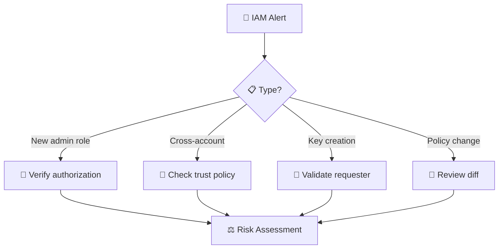
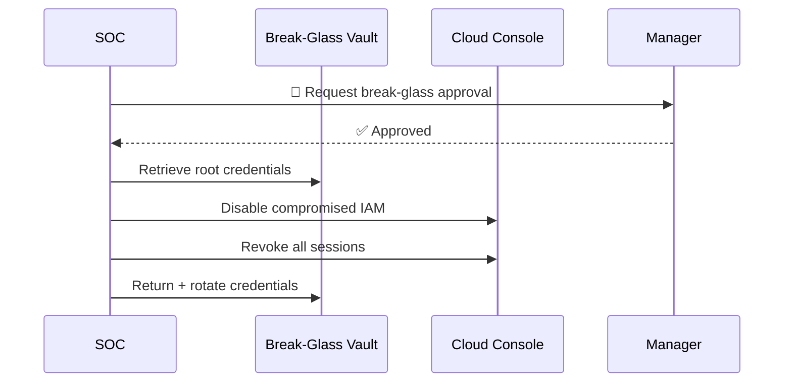
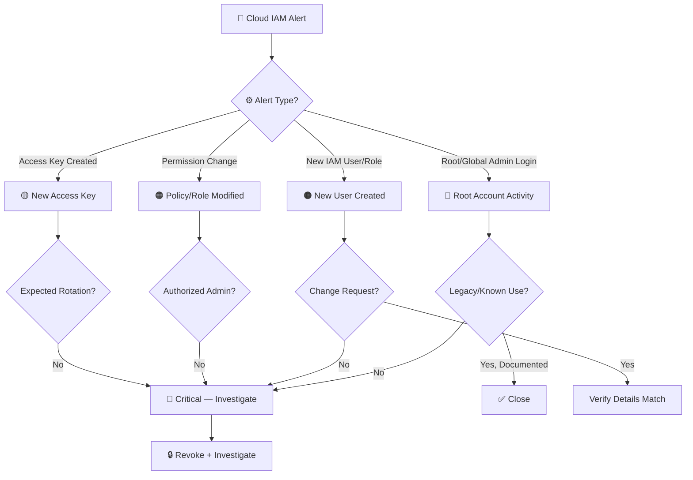
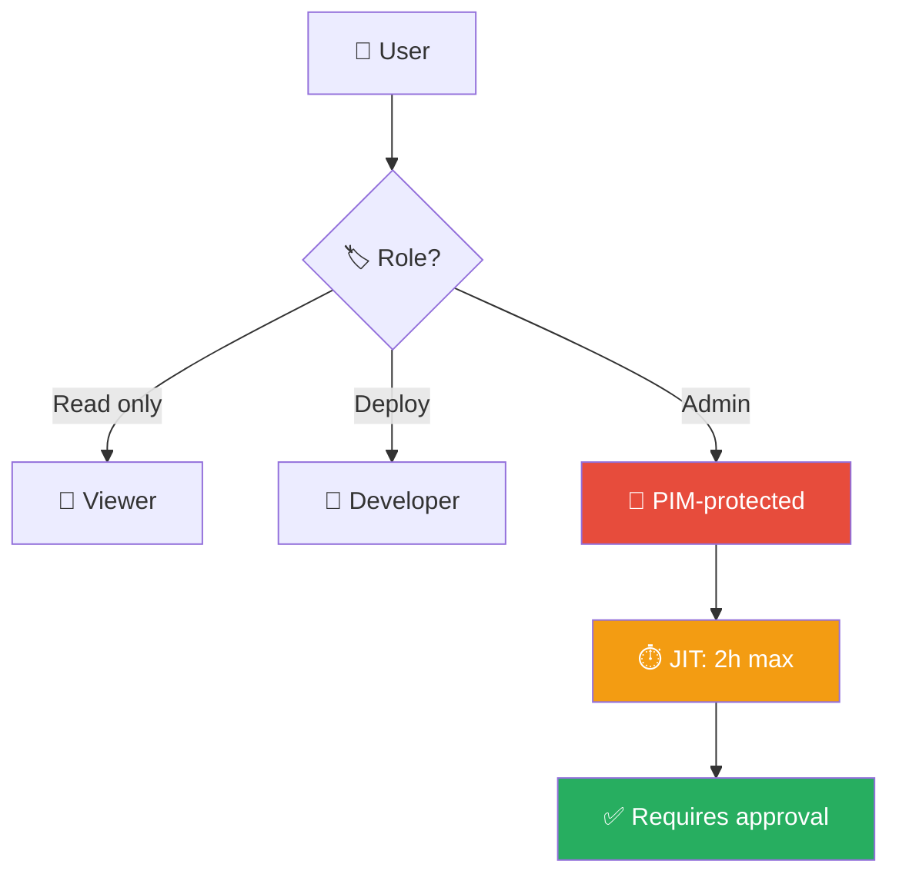
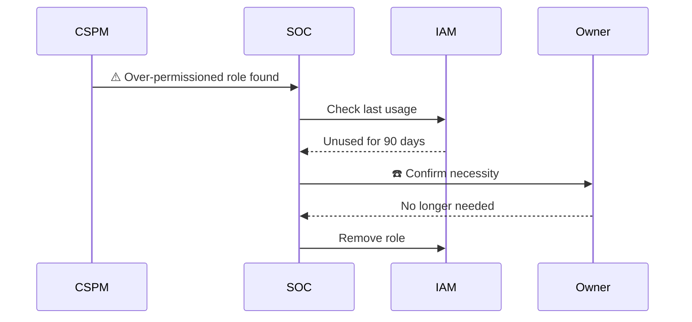

# Playbook: Cloud IAM Anomaly

**ID**: PB-16
**Severity**: High/Critical | **Category**: Cloud Security
**MITRE ATT&CK**: [T1098](https://attack.mitre.org/techniques/T1098/) (Account Manipulation), [T1078.004](https://attack.mitre.org/techniques/T1078/004/) (Cloud Accounts), [T1580](https://attack.mitre.org/techniques/T1580/) (Cloud Infrastructure Discovery)
**Trigger**: CloudTrail/Audit Log anomaly, GuardDuty/Defender alert, SIEM correlation, Billing alert

### IAM Anomaly Detection

```mermaid
graph TD
    Alert["🚨 IAM Alert"] --> Type{"📋 Type?"}
    Type -->|New admin role| Admin["👑 Verify authorization"]
    Type -->|Cross-account| Cross["🔀 Check trust policy"]
    Type -->|Key creation| Key["🔑 Validate requester"]
    Type -->|Policy change| Policy["📝 Review diff"]
    Admin --> Assess["⚖️ Risk Assessment"]
    Cross --> Assess
    Key --> Assess
    Policy --> Assess
```

### Break-Glass Procedure

```mermaid
sequenceDiagram
    participant SOC
    participant Vault as Break-Glass Vault
    participant Cloud as Cloud Console
    participant Manager
    SOC->>Manager: 🚨 Request break-glass approval
    Manager-->>SOC: ✅ Approved
    SOC->>Vault: Retrieve root credentials
    SOC->>Cloud: Disable compromised IAM
    SOC->>Cloud: Revoke all sessions
    SOC->>Vault: Return + rotate credentials
```

---

## Decision Flow

```mermaid
graph TD
    Alert["🚨 Cloud IAM Alert"] --> Type{"⚙️ Alert Type?"}
    Type -->|Root/Global Admin Login| Root["🔴 Root Account Activity"]
    Type -->|New IAM User/Role| NewUser["🟠 New User Created"]
    Type -->|Permission Change| Perm["🟠 Policy/Role Modified"]
    Type -->|Access Key Created| Key["🟡 New Access Key"]
    Root --> Legacy{"Legacy/Known Use?"}
    Legacy -->|No| Critical["🚨 Critical — Investigate"]
    Legacy -->|Yes, Documented| FP["✅ Close"]
    NewUser --> RFC{"Change Request?"}
    RFC -->|No| Critical
    RFC -->|Yes| Verify["Verify Details Match"]
    Perm --> Authorized{"Authorized Admin?"}
    Authorized -->|No| Critical
    Key --> Needed{"Expected Rotation?"}
    Needed -->|No| Critical
    Critical --> Revoke["🔒 Revoke + Investigate"]
```

---

## 1. Analysis

### 1.1 High-Risk Cloud IAM Events

| Event (AWS) | Event (Azure) | Risk | Description |
|:---|:---|:---|:---|
| `ConsoleLogin` (Root) | `Sign-in` (Global Admin) | 🔴 Critical | Root/GA should rarely be used |
| `CreateUser` | `Add user` | 🟠 High | New identity created |
| `AttachUserPolicy` | `Add member to role` | 🟠 High | Privilege escalation |
| `CreateAccessKey` | `Add service principal credential` | 🟡 Medium | Persistent programmatic access |
| `PutBucketPolicy` | `Set-AzStorageContainerAcl` | 🔴 Critical | Storage exposure |
| `AuthorizeSecurityGroupIngress` | `NSG rule create` | 🟠 High | Network exposure |
| `RunInstances` | `Microsoft.Compute/virtualMachines/write` | 🟡 Medium | Compute spin-up (cryptomining?) |
| `CreateRole` + `AssumeRole` | `Create/assign custom role` | 🔴 Critical | Cross-account escalation |
| `StopLogging` (CloudTrail) | `Disable diagnostic settings` | 🔴 Critical | Covering tracks |

### 1.2 Investigation Checklist

| Check | How | Done |
|:---|:---|:---:|
| Who performed the action? (User ARN / UPN) | CloudTrail / Azure Activity Log | ☐ |
| Source IP and geolocation | Event details | ☐ |
| Was it console or API (programmatic)? | Event details | ☐ |
| Was MFA used? | Sign-in details | ☐ |
| Change request / ticket exists? | ITSM | ☐ |
| What permissions were granted? | IAM policy details | ☐ |
| Were any resources created? (EC2, S3, VMs) | Cloud console / audit | ☐ |
| Were billing alerts triggered? | Billing / Cost Explorer | ☐ |

### 1.3 Post-Compromise Activity Check

| Resource Type | Suspicious Activity | Done |
|:---|:---|:---:|
| **Compute** (EC2/VM) | New instances (cryptomining) | ☐ |
| **Storage** (S3/Blob) | Public bucket, data download | ☐ |
| **Network** (SG/NSG) | Ingress rules opened (0.0.0.0/0) | ☐ |
| **Lambda/Functions** | New functions (backdoor, exfil) | ☐ |
| **CloudTrail/Monitor** | Logging disabled | ☐ |
| **IAM** | Additional users/roles created | ☐ |

---

## 2. Containment

### 2.1 Immediate Actions

| # | Action | Tool | Done |
|:---:|:---|:---|:---:|
| 1 | **Disable/deactivate** compromised IAM user/access key | AWS IAM / Azure AD | ☐ |
| 2 | **Revoke active sessions** | IAM / IdP | ☐ |
| 3 | **Rotate access keys** for affected accounts | IAM | ☐ |
| 4 | **Block source IP** in security group / NSG / WAF | Cloud console | ☐ |
| 5 | **Re-enable CloudTrail/logging** if disabled | Cloud console | ☐ |

### 2.2 If Root / Global Admin Compromised

| # | Action | Done |
|:---:|:---|:---:|
| 1 | Enable hardware MFA on Root/GA immediately | ☐ |
| 2 | Rotate Root/GA password (use break-glass procedure) | ☐ |
| 3 | Audit ALL IAM users and roles in the account | ☐ |
| 4 | Check for cross-account trust relationships created | ☐ |
| 5 | Review billing for unexpected charges | ☐ |
| 6 | Contact cloud provider support for suspicious activity report | ☐ |

---

## 3. Eradication

| # | Action | Done |
|:---:|:---|:---:|
| 1 | Delete unauthorized IAM users/roles | ☐ |
| 2 | Remove unauthorized policies and permissions | ☐ |
| 3 | Terminate unauthorized compute instances | ☐ |
| 4 | Delete unauthorized storage buckets/containers | ☐ |
| 5 | Remove unauthorized security group/NSG rules | ☐ |
| 6 | Remove unauthorized Lambda functions/Logic Apps | ☐ |

---

## 4. Recovery

| # | Action | Done |
|:---:|:---|:---:|
| 1 | Enforce MFA on all IAM users (hardware key for admins) | ☐ |
| 2 | Implement least-privilege IAM policies | ☐ |
| 3 | Enable GuardDuty (AWS) / Defender for Cloud (Azure) | ☐ |
| 4 | Enable CloudTrail multi-region + S3 log integrity | ☐ |
| 5 | Set billing alerts and anomaly detection | ☐ |
| 6 | Implement SCP (AWS) / Azure Policy to prevent Root usage | ☐ |
| 7 | Monitor all cloud activity for 72 hours | ☐ |

---

## 5. IoC Collection

| Type | Value | Source |
|:---|:---|:---|
| Compromised User ARN / UPN | | CloudTrail / Azure |
| Attacker IP | | Event details |
| Access Key ID used | | CloudTrail |
| Resources created | | Cloud audit |
| Policies attached | | IAM audit |
| Billing anomalies | | Cost Explorer |

---

## 6. Evidence Checklist

| Evidence Type | What to Collect | Source | Why It Matters |
|:---|:---|:---|:---|
| Identity evidence | User ARN/UPN, role, access key ID, MFA state | Cloud audit / IAM logs | Confirms which identity was abused |
| Change evidence | Policy diffs, role assignments, trust relationships, logging changes | CloudTrail / Azure audit / IaC repo | Shows what was modified and how risky it is |
| Resource impact evidence | New compute, storage, network, functions, or public exposure | Cloud console / audit logs | Defines operational impact and blast radius |
| Source evidence | Source IP, user agent, console/API method, geolocation | Event details / SIEM | Supports attribution and false-positive review |
| Business and cost evidence | Billing spikes, exposed data, affected accounts/subscriptions | Billing / asset inventory / DLP | Supports executive and legal escalation |

---

## 7. Minimum Telemetry Required

| Telemetry Source | Required For | Priority | Blind Spot If Missing |
|:---|:---|:---:|:---|
| Cloud audit logs | Identity actions, policy changes, API calls, logging tamper events | Required | Cannot prove what the attacker changed or accessed |
| IAM and directory telemetry | MFA state, role membership, trust relationships, key lifecycle | Required | Cannot determine privilege escalation or persistence paths |
| Cloud asset and posture telemetry | Public exposure, new resources, guardrail violations | Required | Blast radius and exposure remain unclear |
| Billing and usage anomaly telemetry | Cryptomining, abuse spikes, unexpected consumption | Recommended | Cost-driven abuse or stealth resource creation may be missed |
| IaC and change-management records | Expected changes, approvers, deployment windows | Recommended | Analysts may mistake planned changes for compromise |

---

## 8. False Positive and Tuning Guide

| Scenario | Why It Looks Suspicious | How to Validate | Tuning Action | Escalate If |
|:---|:---|:---|:---|:---|
| Approved infrastructure deployment | New roles, policies, or resources may look like attacker persistence | Confirm IaC change set, approver, pipeline run, and maintenance window | Suppress only for approved deployment identities and change windows | Changes occur from console/manual paths or differ from the approved template |
| Break-glass or emergency admin use | Root/Global Admin use can be legitimate during outage handling | Validate incident record, approver, and duration of emergency access | Alert with reduced severity for approved break-glass events with full logging | Access occurs without incident approval or persists beyond the window |
| Cloud security tooling actions | CSPM, SSPM, or auto-remediation may change policies or quarantine assets | Confirm tool identity, remediation policy, and target resource | Allowlist the tool identity for documented remediation actions | The same identity disables logging or expands privilege unexpectedly |
| Planned key rotation or federation update | Trust or key lifecycle changes can resemble malicious persistence | Validate change ticket, key owner, and expected expiry/rollout plan | Tune around approved key rotation and federation change windows | New principals, broad trust policies, or cross-account access appear |

---

## 9. Escalation Criteria

| Condition | Escalate To |
|:---|:---|
| Root / Global Admin compromise | CISO + Cloud team immediately |
| CloudTrail / logging disabled | CISO + SOC Lead |
| Unauthorized cross-account access | CISO + Cloud architecture |
| Cryptomining detected (billing spike) | Cloud team + Finance |
| Data exposed in public storage | Legal + DPO (PDPA 72h) |
| Multiple cloud accounts affected | Major Incident |

---

### Least Privilege Model

```mermaid
graph TD
    User["👤 User"] --> Role{"🏷️ Role?"}
    Role -->|Read only| Read["📖 Viewer"]
    Role -->|Deploy| Deploy["🚀 Developer"]
    Role -->|Admin| Admin["👑 PIM-protected"]
    Admin --> JIT["⏱️ JIT: 2h max"]
    JIT --> Approval["✅ Requires approval"]
    style Admin fill:#e74c3c,color:#fff
    style JIT fill:#f39c12,color:#fff
    style Approval fill:#27ae60,color:#fff
```

### Cloud Permission Audit

```mermaid
sequenceDiagram
    participant CSPM
    participant SOC
    participant IAM
    participant Owner
    CSPM->>SOC: ⚠️ Over-permissioned role found
    SOC->>IAM: Check last usage
    IAM-->>SOC: Unused for 90 days
    SOC->>Owner: ☎️ Confirm necessity
    Owner-->>SOC: No longer needed
    SOC->>IAM: Remove role
```

## Detection Rules (Sigma)

| Rule | File |
|:---|:---|
| AWS Root Account Login | [cloud_root_login.yml](../../08_Detection_Engineering/sigma_rules/cloud_root_login.yml) |
| User Added to Domain Admins | [win_domain_admin_group_add.yml](../../08_Detection_Engineering/sigma_rules/win_domain_admin_group_add.yml) |

## Related Documents

- [IR Framework](../Framework.en.md)
- [Incident Report](../../11_Reporting_Templates/incident_report.en.md)
- [PB-05 Account Compromise](Account_Compromise.en.md)
- [PB-07 Privilege Escalation](Privilege_Escalation.en.md)
- [PB-15 Rogue Admin](Rogue_Admin.en.md)

## References

- [MITRE ATT&CK T1098 — Account Manipulation](https://attack.mitre.org/techniques/T1098/)
- [AWS Security Incident Response Guide](https://docs.aws.amazon.com/whitepapers/latest/aws-security-incident-response-guide/welcome.html)
- [Microsoft Cloud Security Benchmark](https://learn.microsoft.com/en-us/security/benchmark/azure/)
