# Playbook: Cloud IAM Anomaly

**ID**: PB-16
**Severity**: High/Critical | **Category**: Cloud Security
**MITRE ATT&CK**: [T1098](https://attack.mitre.org/techniques/T1098/) (Account Manipulation), [T1078.004](https://attack.mitre.org/techniques/T1078/004/) (Cloud Accounts), [T1580](https://attack.mitre.org/techniques/T1580/) (Cloud Infrastructure Discovery)
**Trigger**: CloudTrail/Azure Monitor ("Root/GlobalAdmin login"), Cloud SIEM ("New IAM user created", "Policy attached"), CSPM alert

---

## Decision Flow

```mermaid
graph TD
    Alert["🚨 Cloud IAM Alert"] --> Type{"⚙️ Alert Type?"}
    Type -->|Root/Global Admin Login| Root["🔴 Root Account Activity"]
    Type -->|New IAM User/Role| NewUser["🟠 New User Created"]
    Type -->|Permission Change| Perm["🟠 Policy/Role Modified"]
    Type -->|Access Key Created| Key["🟡 New Access Key"]
    Root --> Legacy{"Legacy/Known Use?"}
    Legacy -->|No| Critical["🚨 Critical — Investigate"]
    Legacy -->|Yes, Documented| FP["✅ Close"]
    NewUser --> RFC{"Change Request?"}
    RFC -->|No| Critical
    RFC -->|Yes| Verify["Verify Details Match"]
    Perm --> Authorized{"Authorized Admin?"}
    Authorized -->|No| Critical
    Key --> Needed{"Expected Rotation?"}
    Needed -->|No| Critical
    Critical --> Revoke["🔒 Revoke + Investigate"]
```

---

## 1. Analysis

### 1.1 High-Risk Cloud IAM Events

| Event (AWS) | Event (Azure) | Risk | Description |
|:---|:---|:---|:---|
| `ConsoleLogin` (Root) | `Sign-in` (Global Admin) | 🔴 Critical | Root/GA should rarely be used |
| `CreateUser` | `Add user` | 🟠 High | New identity created |
| `AttachUserPolicy` | `Add member to role` | 🟠 High | Privilege escalation |
| `CreateAccessKey` | `Add service principal credential` | 🟡 Medium | Persistent programmatic access |
| `PutBucketPolicy` | `Set-AzStorageContainerAcl` | 🔴 Critical | Storage exposure |
| `AuthorizeSecurityGroupIngress` | `NSG rule create` | 🟠 High | Network exposure |
| `RunInstances` | `Microsoft.Compute/virtualMachines/write` | 🟡 Medium | Compute spin-up (cryptomining?) |
| `CreateRole` + `AssumeRole` | `Create/assign custom role` | 🔴 Critical | Cross-account escalation |
| `StopLogging` (CloudTrail) | `Disable diagnostic settings` | 🔴 Critical | Covering tracks |

### 1.2 Investigation Checklist

| Check | How | Done |
|:---|:---|:---:|
| Who performed the action? (User ARN / UPN) | CloudTrail / Azure Activity Log | ☐ |
| Source IP and geolocation | Event details | ☐ |
| Was it console or API (programmatic)? | Event details | ☐ |
| Was MFA used? | Sign-in details | ☐ |
| Change request / ticket exists? | ITSM | ☐ |
| What permissions were granted? | IAM policy details | ☐ |
| Were any resources created? (EC2, S3, VMs) | Cloud console / audit | ☐ |
| Were billing alerts triggered? | Billing / Cost Explorer | ☐ |

### 1.3 Post-Compromise Activity Check

| Resource Type | Suspicious Activity | Done |
|:---|:---|:---:|
| **Compute** (EC2/VM) | New instances (cryptomining) | ☐ |
| **Storage** (S3/Blob) | Public bucket, data download | ☐ |
| **Network** (SG/NSG) | Ingress rules opened (0.0.0.0/0) | ☐ |
| **Lambda/Functions** | New functions (backdoor, exfil) | ☐ |
| **CloudTrail/Monitor** | Logging disabled | ☐ |
| **IAM** | Additional users/roles created | ☐ |

---

## 2. Containment

### 2.1 Immediate Actions

| # | Action | Tool | Done |
|:---:|:---|:---|:---:|
| 1 | **Disable/deactivate** compromised IAM user/access key | AWS IAM / Azure AD | ☐ |
| 2 | **Revoke active sessions** | IAM / IdP | ☐ |
| 3 | **Rotate access keys** for affected accounts | IAM | ☐ |
| 4 | **Block source IP** in security group / NSG / WAF | Cloud console | ☐ |
| 5 | **Re-enable CloudTrail/logging** if disabled | Cloud console | ☐ |

### 2.2 If Root / Global Admin Compromised

| # | Action | Done |
|:---:|:---|:---:|
| 1 | Enable hardware MFA on Root/GA immediately | ☐ |
| 2 | Rotate Root/GA password (use break-glass procedure) | ☐ |
| 3 | Audit ALL IAM users and roles in the account | ☐ |
| 4 | Check for cross-account trust relationships created | ☐ |
| 5 | Review billing for unexpected charges | ☐ |
| 6 | Contact cloud provider support for suspicious activity report | ☐ |

---

## 3. Eradication

| # | Action | Done |
|:---:|:---|:---:|
| 1 | Delete unauthorized IAM users/roles | ☐ |
| 2 | Remove unauthorized policies and permissions | ☐ |
| 3 | Terminate unauthorized compute instances | ☐ |
| 4 | Delete unauthorized storage buckets/containers | ☐ |
| 5 | Remove unauthorized security group/NSG rules | ☐ |
| 6 | Remove unauthorized Lambda functions/Logic Apps | ☐ |

---

## 4. Recovery

| # | Action | Done |
|:---:|:---|:---:|
| 1 | Enforce MFA on all IAM users (hardware key for admins) | ☐ |
| 2 | Implement least-privilege IAM policies | ☐ |
| 3 | Enable GuardDuty (AWS) / Defender for Cloud (Azure) | ☐ |
| 4 | Enable CloudTrail multi-region + S3 log integrity | ☐ |
| 5 | Set billing alerts and anomaly detection | ☐ |
| 6 | Implement SCP (AWS) / Azure Policy to prevent Root usage | ☐ |
| 7 | Monitor all cloud activity for 72 hours | ☐ |

---

## 5. IoC Collection

| Type | Value | Source |
|:---|:---|:---|
| Compromised User ARN / UPN | | CloudTrail / Azure |
| Attacker IP | | Event details |
| Access Key ID used | | CloudTrail |
| Resources created | | Cloud audit |
| Policies attached | | IAM audit |
| Billing anomalies | | Cost Explorer |

---

## 6. Escalation Criteria

| Condition | Escalate To |
|:---|:---|
| Root / Global Admin compromise | CISO + Cloud team immediately |
| CloudTrail / logging disabled | CISO + SOC Lead |
| Unauthorized cross-account access | CISO + Cloud architecture |
| Cryptomining detected (billing spike) | Cloud team + Finance |
| Data exposed in public storage | Legal + DPO (PDPA 72h) |
| Multiple cloud accounts affected | Major Incident |

---

## Related Documents

- [IR Framework](../Framework.en.md)
- [Incident Report](../../templates/incident_report.en.md)
- [PB-05 Account Compromise](Account_Compromise.en.md)
- [PB-07 Privilege Escalation](Privilege_Escalation.en.md)
- [PB-15 Rogue Admin](Rogue_Admin.en.md)

## References

- [MITRE ATT&CK T1098 — Account Manipulation](https://attack.mitre.org/techniques/T1098/)
- [AWS Security Incident Response Guide](https://docs.aws.amazon.com/whitepapers/latest/aws-security-incident-response-guide/welcome.html)
- [Microsoft Cloud Security Benchmark](https://learn.microsoft.com/en-us/security/benchmark/azure/)
