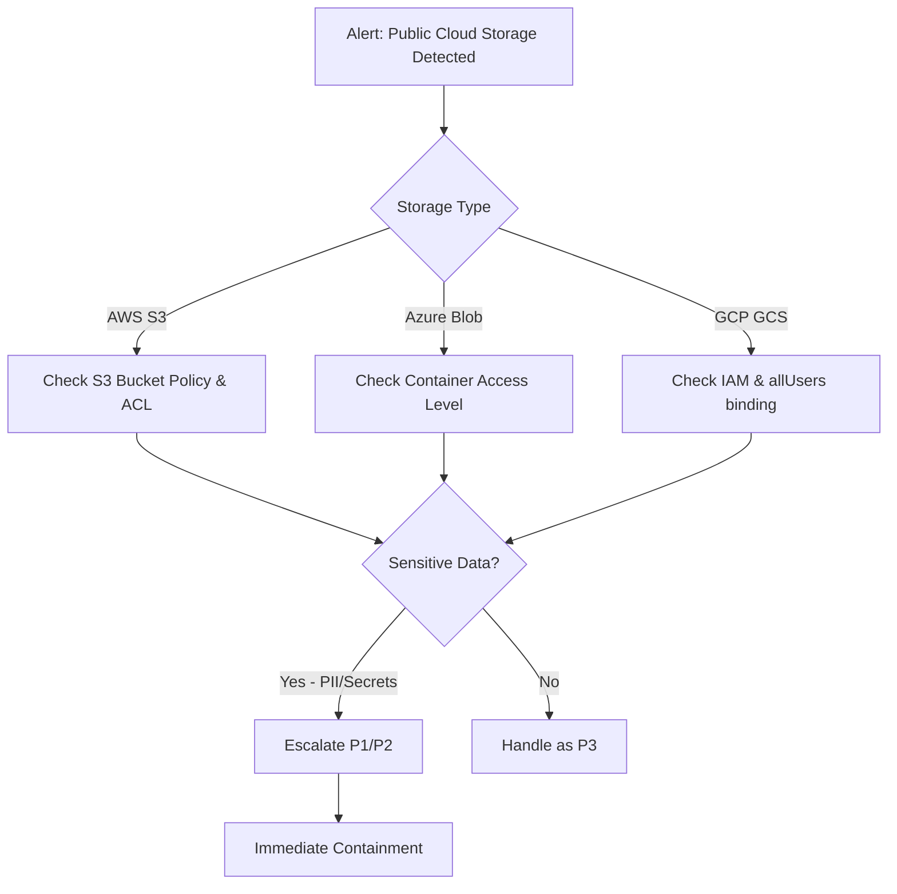

# Playbook: Cloud Storage Exposure (PB-27)

**Severity**: High | **Category**: Cloud Security | **MITRE**: T1530, T1537

## 1. Analysis (Triage)

-   **Identify Scope**: Which storage resource is exposed — S3 bucket, Azure Blob container, GCP Cloud Storage bucket.
-   **Classify Data**: Determine if exposed data contains PII, credentials, secrets, financial data, or source code.
-   **Access Logs**: Review cloud access logs (CloudTrail, Azure Monitor, GCP Audit Logs) for unauthorized data access or download.
-   **Duration**: Determine how long the storage was publicly accessible.

## 2. Containment
-   **Remove Public Access Immediately**:
    -   AWS: `aws s3api put-public-access-block --bucket <name> --public-access-block-configuration BlockPublicAcls=true,IgnorePublicAcls=true,BlockPublicPolicy=true,RestrictPublicBuckets=true`
    -   Azure: Set container access level to `Private`
    -   GCP: Remove `allUsers` and `allAuthenticatedUsers` bindings
-   **Revoke Exposed Credentials**: If secrets/keys were exposed, rotate immediately.
-   **Enable Versioning**: Preserve evidence of any modifications.

## 3. Remediation
-   **Credential Rotation**: Rotate all credentials, API keys, and tokens found in exposed storage.
-   **Data Impact Assessment**: If PII exposed, assess regulatory notification requirements (PDPA, GDPR).
-   **IAM Review**: Audit who has permission to change storage access policies.
-   **Enable Preventive Controls**:
    -   AWS: S3 Block Public Access (account-level), SCPs
    -   Azure: Azure Policy to deny public blob access
    -   GCP: Organization policy constraint `storage.publicAccessPrevention`

## 4. Recovery
-   **CSPM Deployment**: Deploy Cloud Security Posture Management (Wiz, Prisma Cloud, AWS Security Hub).
-   **Continuous Monitoring**: Enable alerts for public storage creation or policy changes.
-   **Data Classification**: Tag sensitive data and enforce encryption requirements.

## 5. Lessons Learned
-   Enforce infrastructure-as-code (Terraform/CloudFormation) with security guardrails for storage provisioning.
-   Implement SCPs/Organization Policies to prevent public storage at the account level.
-   Regular storage access audits (weekly scan).

## References
-   [MITRE ATT&CK T1530 — Data from Cloud Storage](https://attack.mitre.org/techniques/T1530/)
-   [AWS S3 Security Best Practices](https://docs.aws.amazon.com/AmazonS3/latest/userguide/security-best-practices.html)
-   [Azure Blob Storage Security](https://learn.microsoft.com/en-us/azure/storage/blobs/security-recommendations)
