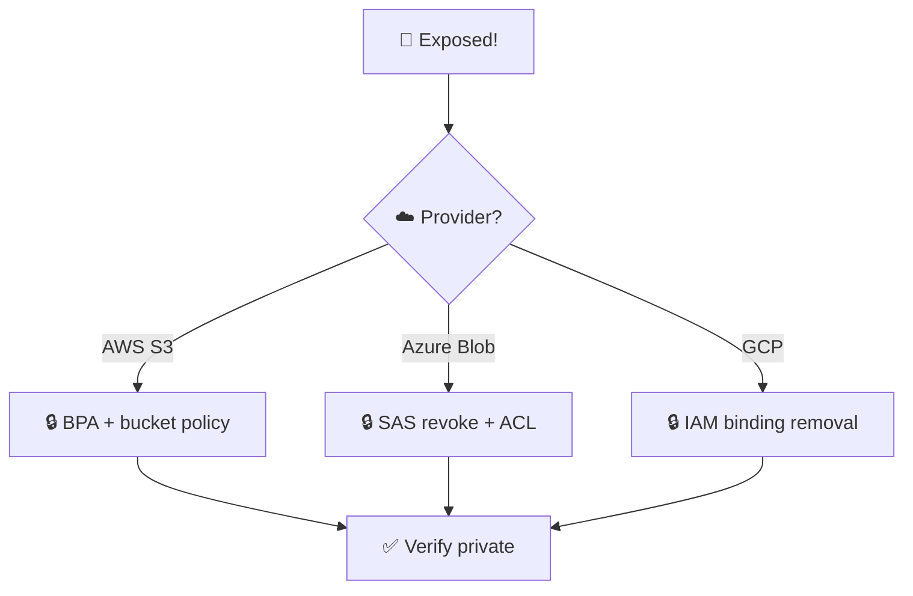
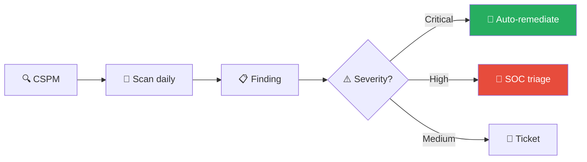
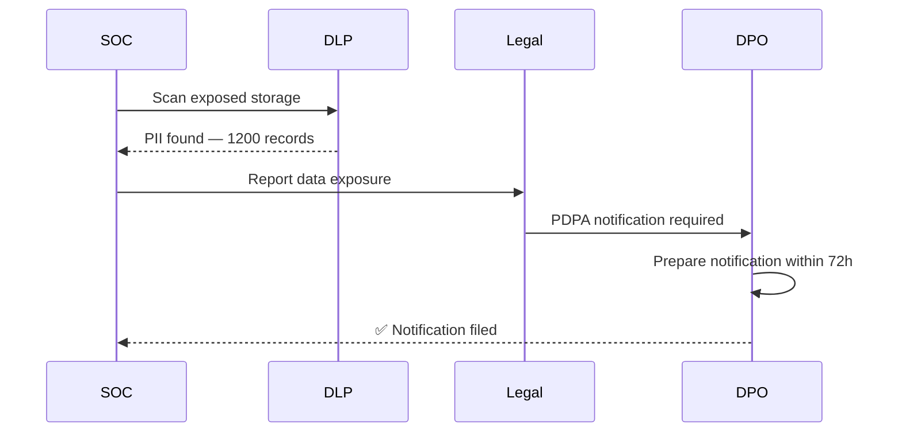

# Playbook: Cloud Storage Exposure

**ID**: PB-27
**Severity**: High/Critical | **Category**: Cloud Security
**MITRE ATT&CK**: [T1530](https://attack.mitre.org/techniques/T1530/) (Data from Cloud Storage), [T1537](https://attack.mitre.org/techniques/T1537/) (Transfer Data to Cloud Account)
**Trigger**: CSPM alert (public resource), Cloud audit, SIEM (unusual access), TI (exposed data), Researcher report

### Multi-Cloud Containment


```mermaid
graph TD
    Alert["🚨 Exposed!"] --> Cloud{"☁️ Provider?"}
    Cloud -->|AWS S3| AWS["🔒 BPA + bucket policy"]
    Cloud -->|Azure Blob| Azure["🔒 SAS revoke + ACL"]
    Cloud -->|GCP| GCP["🔒 IAM binding removal"]
    AWS --> Verify["✅ Verify private"]
    Azure --> Verify
    GCP --> Verify
```

### Data Classification Flow


```mermaid
sequenceDiagram
    participant SOC
    participant DLP
    participant Legal
    participant DPO
    SOC->>DLP: Scan exposed storage
    DLP-->>SOC: PII found — 1200 records
    SOC->>Legal: Report data exposure
    Legal->>DPO: PDPA notification required
    DPO->>DPO: Prepare notification within 72h
    DPO-->>SOC: Notification filed
```

---

## Decision Flow

```mermaid
graph TD
    Alert["🚨 Public Cloud Storage Detected"] --> Cloud{"☁️ Cloud Provider?"}
    Cloud -->|AWS S3| S3["🪣 Check S3 Policy + ACL"]
    Cloud -->|Azure Blob| Blob["📦 Check Container Access Level"]
    Cloud -->|GCP GCS| GCS["🗂️ Check IAM + allUsers"]
    S3 --> Data{"📁 Sensitive Data?"}
    Blob --> Data
    GCS --> Data
    Data -->|PII / Secrets / Source Code| Critical["🔴 P1 — Immediate Block"]
    Data -->|Internal Docs, Non-sensitive| High["🟠 P2 — Block + Assess"]
    Data -->|Public Content (intended)| Check["🟡 Verify Intended"]
    Critical --> Block["🔒 Block Public Access NOW"]
    High --> Block
    Block --> Investigate["🔍 Audit Access Logs"]
```

---

## 1. Analysis

### 1.1 Exposure Assessment per Cloud

| Cloud | Check | Command / Tool |
|:---|:---|:---|
| **AWS S3** | Block Public Access setting | `aws s3api get-public-access-block --bucket <name>` |
| **AWS S3** | Bucket Policy (`Principal: *`) | `aws s3api get-bucket-policy --bucket <name>` |
| **AWS S3** | ACL (public-read?) | `aws s3api get-bucket-acl --bucket <name>` |
| **Azure Blob** | Container access level | Portal → Storage → Containers → Access Level |
| **Azure Blob** | Anonymous access enabled? | Portal → Storage → Configuration |
| **GCP GCS** | `allUsers` / `allAuthenticatedUsers` binding | `gsutil iam get gs://<bucket>` |

### 1.2 Investigation Checklist

| Check | How | Done |
|:---|:---|:---:|
| Which storage resource is exposed? | CSPM / Cloud console | ☐ |
| What data is stored? Classify. | Manual review / DLP scan | ☐ |
| How long has it been public? | CloudTrail / Azure Activity / GCP Audit | ☐ |
| Who made it public? (IAM user/role) | Audit logs | ☐ |
| Was it intentional (static website) or accidental? | Owner inquiry | ☐ |
| Has data been accessed by unauthorized parties? | Access logs | ☐ |
| Volume of data downloaded by external IPs | Access logs, S3 server access logs | ☐ |
| Are secrets/credentials stored in exposed storage? | DLP / Secrets scanner | ☐ |

### 1.3 Data Classification Impact

| Data Type | Severity | Regulatory Impact |
|:---|:---|:---|
| **PII / Customer data** | 🔴 Critical | PDPA 72h notification |
| **Credentials / API keys** | 🔴 Critical | Immediate rotation |
| **Source code** | 🔴 Critical | IP exposure |
| **Financial records** | 🔴 Critical | Legal notification |
| **Internal documents** | 🟠 High | Risk assessment |
| **Logs / metrics** | 🟡 Medium | Info exposure |
| **Public assets** (intended) | ✅ None | Verify configuration |

---

## 2. Containment

### 2.1 Immediate Actions (within 15 minutes)

| # | Action | Done |
|:---:|:---|:---:|
| 1 | **Block public access** (see commands below) | ☐ |
| 2 | **Revoke exposed credentials** — rotate ALL secrets found | ☐ |
| 3 | **Enable versioning** to preserve evidence | ☐ |
| 4 | **Tag** resource as `Status: Compromised` | ☐ |

**Block Public Access commands:**
```bash
# AWS S3
aws s3api put-public-access-block --bucket <BUCKET> \
  --public-access-block-configuration \
  BlockPublicAcls=true,IgnorePublicAcls=true,BlockPublicPolicy=true,RestrictPublicBuckets=true

# Azure Blob
az storage account update --name <ACCOUNT> --allow-blob-public-access false

# GCP GCS
gsutil iam ch -d allUsers gs://<BUCKET>
gsutil iam ch -d allAuthenticatedUsers gs://<BUCKET>
```

### 2.2 If Credentials Were Exposed

| # | Action | Done |
|:---:|:---|:---:|
| 1 | Rotate ALL API keys, access keys, tokens found | ☐ |
| 2 | Check CloudTrail for use of exposed credentials | ☐ |
| 3 | If used, escalate to [PB-16 Cloud IAM](Cloud_IAM.en.md) | ☐ |

---

## 3. Eradication

| # | Action | Done |
|:---:|:---|:---:|
| 1 | Revert to known-good bucket/container policy (from IaC) | ☐ |
| 2 | Rotate ALL credentials found in exposed storage | ☐ |
| 3 | Audit IAM permissions — restrict who can change access policies | ☐ |
| 4 | Remove unauthorized data copies if identified | ☐ |

---

## 4. Recovery

| # | Action | Done |
|:---:|:---|:---:|
| 1 | Enable account-level Block Public Access (AWS SCP, Azure Policy, GCP Org Policy) | ☐ |
| 2 | Deploy CSPM (Wiz, Prisma Cloud, AWS Security Hub, Defender for Cloud) | ☐ |
| 3 | Enable alerts for public storage creation / policy changes | ☐ |
| 4 | Tag sensitive data and enforce encryption-at-rest | ☐ |
| 5 | Implement IaC (Terraform/CloudFormation) with security guardrails | ☐ |
| 6 | Weekly storage access audit scans | ☐ |

---

## 5. IoC Collection

| Type | Value | Source |
|:---|:---|:---|
| Exposed storage resource | | CSPM / Console |
| IAM identity that made it public | | Audit logs |
| External IPs that accessed data | | Access logs |
| Data classification of exposed content | | DLP scan |
| Duration of exposure | | Audit logs |
| Volume of data accessed externally | | Access logs |

---

## 6. Evidence Checklist

| Evidence Type | What to Collect | Source | Why It Matters |
|:---|:---|:---|:---|
| Exposure evidence | Resource name, policy/ACL diff, public URL/path, exposure timestamp | CSPM / cloud console / audit logs | Proves what was exposed and when |
| Identity evidence | User/role that changed access, source IP, API/console path | Cloud audit / IAM logs | Determines whether the exposure was accidental or malicious |
| Access evidence | External IPs, user agents, object list, download counts | Access logs / CDN logs | Shows whether exposed data was actually accessed |
| Data sensitivity evidence | Data types, classifications, secrets, customer records, source code presence | DLP / data inventory | Supports breach and notification decisions |
| Credential evidence | Keys, tokens, config files, or secrets stored in the resource | Secret scanning / file review | Determines follow-on account risk and rotation urgency |

---

## 7. Minimum Telemetry Required

| Telemetry Source | Required For | Priority | Blind Spot If Missing |
|:---|:---|:---:|:---|
| Cloud audit logs | Access-policy changes, actor identity, console/API path | Required | Cannot prove who exposed the storage or how |
| Object access logs | External reads, object names, download volume | Required | Cannot tell whether exposure became data loss |
| CSPM or posture telemetry | Continuous public-exposure detection and severity | Required | Misconfigurations may persist without visibility |
| DLP or data classification telemetry | Sensitivity and record-count assessment | Required | Notification scope and business impact remain unclear |
| IaC and change-management records | Planned versus unplanned access changes | Recommended | Analysts may treat intended public content as breach |

---

## 8. False Positive and Tuning Guide

| Scenario | Why It Looks Suspicious | How to Validate | Tuning Action | Escalate If |
|:---|:---|:---|:---|:---|
| Approved public website or CDN content | Public buckets/containers may be intentional for static assets | Validate asset owner, approved public-content tag, and no sensitive files | Suppress only tagged public-content resources with approved owners | Sensitive data, secrets, or non-web content is present |
| Temporary external sharing for project delivery | Short-term partner access can look like misconfiguration | Confirm ticket, expiry date, recipient, and object scope | Alert at lower severity for time-bound approved shares with expiry | Share exceeds scope, lacks expiry, or becomes broadly public |
| Security scanning or CSPM auto-remediation | Rapid policy changes may resemble attacker activity | Validate tool identity and remediation workflow | Allowlist documented remediation identities for expected policy flips | Same identity exposes resources or disables logging unexpectedly |
| Data migration or replication setup | New storage and policy changes may be part of a cloud project | Confirm IaC deployment, project owner, and target environment | Tune for approved deployment identities and staging accounts | Public exposure appears in production or includes sensitive data unexpectedly |

---

## 9. Escalation Criteria

| Condition | Escalate To |
|:---|:---|
| PII / customer data exposed | Legal + DPO (PDPA 72h) |
| Credentials / API keys exposed | CISO + IAM team |
| Source code exposed | CISO + Engineering lead |
| Data accessed by external IPs | Major Incident |
| Multiple storage resources exposed | Cloud team + SOC Lead |
| Intentionally made public by insider | [PB-14 Insider Threat](Insider_Threat.en.md) |

---

### CSPM Monitoring Pipeline


```mermaid
graph LR
    CSPM["🔍 CSPM"] --> Scan["📡 Scan daily"]
    Scan --> Finding["📋 Finding"]
    Finding --> Severity{"⚠️ Severity?"}
    Severity -->|Critical| Auto["🤖 Auto-remediate"]
    Severity -->|High| SOC["🎯 SOC triage"]
    Severity -->|Medium| Ticket["📝 Ticket"]
    style Auto fill:#27ae60,color:#fff
    style SOC fill:#e74c3c,color:#fff
```

### Data Breach Notification (PDPA)


```mermaid
sequenceDiagram
    participant SOC
    participant DLP
    participant Legal
    participant DPO
    SOC->>DLP: Scan exposed storage
    DLP-->>SOC: PII found — 1200 records
    SOC->>Legal: Report data exposure
    Legal->>DPO: PDPA notification required
    DPO->>DPO: Prepare notification within 72h
    DPO-->>SOC: ✅ Notification filed
```

## Detection Rules (Sigma)

| Rule | File |
|:---|:---|
| Cloud Storage Public Access | [cloud_storage_public_access.yml](../../08_Detection_Engineering/sigma_rules/cloud_storage_public_access.yml) |
| AWS S3 Public Access Enabled | [cloud_aws_s3_public_access.yml](../../08_Detection_Engineering/sigma_rules/cloud_aws_s3_public_access.yml) |

## Related Documents

- [IR Framework](../Framework.en.md)
- [Incident Report](../../11_Reporting_Templates/incident_report.en.md)
- [PB-16 Cloud IAM](Cloud_IAM.en.md)
- [PB-21 AWS S3](AWS_S3_Compromise.en.md)
- [PB-08 Data Exfiltration](Data_Exfiltration.en.md)
- [Data Governance Policy](../../07_Compliance_Privacy/Data_Governance_Policy.en.md)

## References

- [MITRE ATT&CK T1530 — Data from Cloud Storage](https://attack.mitre.org/techniques/T1530/)
- [AWS S3 Security Best Practices](https://docs.aws.amazon.com/AmazonS3/latest/userguide/security-best-practices.html)
- [Azure Blob Storage Security](https://learn.microsoft.com/en-us/azure/storage/blobs/security-recommendations)
