# Playbook: Cloud Storage Exposure

**ID**: PB-27
**Severity**: High/Critical | **Category**: Cloud Security
**MITRE ATT&CK**: [T1530](https://attack.mitre.org/techniques/T1530/) (Data from Cloud Storage), [T1537](https://attack.mitre.org/techniques/T1537/) (Transfer Data to Cloud Account)
**Trigger**: CSPM alert (public resource), Cloud audit, SIEM (unusual access), TI (exposed data), Researcher report

### Multi-Cloud Containment

```mermaid
graph TD
    Alert["🚨 Exposed!"] --> Cloud{"☁️ Provider?"}
    Cloud -->|AWS S3| AWS["🔒 BPA + bucket policy"]
    Cloud -->|Azure Blob| Azure["🔒 SAS revoke + ACL"]
    Cloud -->|GCP| GCP["🔒 IAM binding removal"]
    AWS --> Verify["✅ Verify private"]
    Azure --> Verify
    GCP --> Verify
```



### Data Classification Flow


---

## Decision Flow

```mermaid
graph TD
    Alert["🚨 Public Cloud Storage Detected"] --> Cloud{"☁️ Cloud Provider?"}
    Cloud -->|AWS S3| S3["🪣 Check S3 Policy + ACL"]
    Cloud -->|Azure Blob| Blob["📦 Check Container Access Level"]
    Cloud -->|GCP GCS| GCS["🗂️ Check IAM + allUsers"]
    S3 --> Data{"📁 Sensitive Data?"}
    Blob --> Data
    GCS --> Data
    Data -->|PII / Secrets / Source Code| Critical["🔴 P1 — Immediate Block"]
    Data -->|Internal Docs, Non-sensitive| High["🟠 P2 — Block + Assess"]
    Data -->|Public Content (intended)| Check["🟡 Verify Intended"]
    Critical --> Block["🔒 Block Public Access NOW"]
    High --> Block
    Block --> Investigate["🔍 Audit Access Logs"]
```

---

## 1. Analysis

### 1.1 Exposure Assessment per Cloud

| Cloud | Check | Command / Tool |
|:---|:---|:---|
| **AWS S3** | Block Public Access setting | `aws s3api get-public-access-block --bucket <name>` |
| **AWS S3** | Bucket Policy (`Principal: *`) | `aws s3api get-bucket-policy --bucket <name>` |
| **AWS S3** | ACL (public-read?) | `aws s3api get-bucket-acl --bucket <name>` |
| **Azure Blob** | Container access level | Portal → Storage → Containers → Access Level |
| **Azure Blob** | Anonymous access enabled? | Portal → Storage → Configuration |
| **GCP GCS** | `allUsers` / `allAuthenticatedUsers` binding | `gsutil iam get gs://<bucket>` |

### 1.2 Investigation Checklist

| Check | How | Done |
|:---|:---|:---:|
| Which storage resource is exposed? | CSPM / Cloud console | ☐ |
| What data is stored? Classify. | Manual review / DLP scan | ☐ |
| How long has it been public? | CloudTrail / Azure Activity / GCP Audit | ☐ |
| Who made it public? (IAM user/role) | Audit logs | ☐ |
| Was it intentional (static website) or accidental? | Owner inquiry | ☐ |
| Has data been accessed by unauthorized parties? | Access logs | ☐ |
| Volume of data downloaded by external IPs | Access logs, S3 server access logs | ☐ |
| Are secrets/credentials stored in exposed storage? | DLP / Secrets scanner | ☐ |

### 1.3 Data Classification Impact

| Data Type | Severity | Regulatory Impact |
|:---|:---|:---|
| **PII / Customer data** | 🔴 Critical | PDPA 72h notification |
| **Credentials / API keys** | 🔴 Critical | Immediate rotation |
| **Source code** | 🔴 Critical | IP exposure |
| **Financial records** | 🔴 Critical | Legal notification |
| **Internal documents** | 🟠 High | Risk assessment |
| **Logs / metrics** | 🟡 Medium | Info exposure |
| **Public assets** (intended) | ✅ None | Verify configuration |

---

## 2. Containment

### 2.1 Immediate Actions (within 15 minutes)

| # | Action | Done |
|:---:|:---|:---:|
| 1 | **Block public access** (see commands below) | ☐ |
| 2 | **Revoke exposed credentials** — rotate ALL secrets found | ☐ |
| 3 | **Enable versioning** to preserve evidence | ☐ |
| 4 | **Tag** resource as `Status: Compromised` | ☐ |

**Block Public Access commands:**
```bash
# AWS S3
aws s3api put-public-access-block --bucket <BUCKET> \
  --public-access-block-configuration \
  BlockPublicAcls=true,IgnorePublicAcls=true,BlockPublicPolicy=true,RestrictPublicBuckets=true

# Azure Blob
az storage account update --name <ACCOUNT> --allow-blob-public-access false

# GCP GCS
gsutil iam ch -d allUsers gs://<BUCKET>
gsutil iam ch -d allAuthenticatedUsers gs://<BUCKET>
```

### 2.2 If Credentials Were Exposed

| # | Action | Done |
|:---:|:---|:---:|
| 1 | Rotate ALL API keys, access keys, tokens found | ☐ |
| 2 | Check CloudTrail for use of exposed credentials | ☐ |
| 3 | If used, escalate to [PB-16 Cloud IAM](Cloud_IAM.en.md) | ☐ |

---

## 3. Eradication

| # | Action | Done |
|:---:|:---|:---:|
| 1 | Revert to known-good bucket/container policy (from IaC) | ☐ |
| 2 | Rotate ALL credentials found in exposed storage | ☐ |
| 3 | Audit IAM permissions — restrict who can change access policies | ☐ |
| 4 | Remove unauthorized data copies if identified | ☐ |

---

## 4. Recovery

| # | Action | Done |
|:---:|:---|:---:|
| 1 | Enable account-level Block Public Access (AWS SCP, Azure Policy, GCP Org Policy) | ☐ |
| 2 | Deploy CSPM (Wiz, Prisma Cloud, AWS Security Hub, Defender for Cloud) | ☐ |
| 3 | Enable alerts for public storage creation / policy changes | ☐ |
| 4 | Tag sensitive data and enforce encryption-at-rest | ☐ |
| 5 | Implement IaC (Terraform/CloudFormation) with security guardrails | ☐ |
| 6 | Weekly storage access audit scans | ☐ |

---

## 5. IoC Collection

| Type | Value | Source |
|:---|:---|:---|
| Exposed storage resource | | CSPM / Console |
| IAM identity that made it public | | Audit logs |
| External IPs that accessed data | | Access logs |
| Data classification of exposed content | | DLP scan |
| Duration of exposure | | Audit logs |
| Volume of data accessed externally | | Access logs |

---

## 6. Escalation Criteria

| Condition | Escalate To |
|:---|:---|
| PII / customer data exposed | Legal + DPO (PDPA 72h) |
| Credentials / API keys exposed | CISO + IAM team |
| Source code exposed | CISO + Engineering lead |
| Data accessed by external IPs | Major Incident |
| Multiple storage resources exposed | Cloud team + SOC Lead |
| Intentionally made public by insider | [PB-14 Insider Threat](Insider_Threat.en.md) |

---

### CSPM Monitoring Pipeline

```mermaid
graph LR
    CSPM["🔍 CSPM"] --> Scan["📡 Scan daily"]
    Scan --> Finding["📋 Finding"]
    Finding --> Severity{"⚠️ Severity?"}
    Severity -->|Critical| Auto["🤖 Auto-remediate"]
    Severity -->|High| SOC["🎯 SOC triage"]
    Severity -->|Medium| Ticket["📝 Ticket"]
    style Auto fill:#27ae60,color:#fff
    style SOC fill:#e74c3c,color:#fff
```



### Data Breach Notification (PDPA)

```mermaid
sequenceDiagram
    participant SOC
    participant DLP
    participant Legal
    participant DPO
    SOC->>DLP: Scan exposed storage
    DLP-->>SOC: PII found — 1200 records
    SOC->>Legal: Report data exposure
    Legal->>DPO: PDPA notification required
    DPO->>DPO: Prepare notification within 72h
    DPO-->>SOC: ✅ Notification filed
```



## Related Documents

- [IR Framework](../Framework.en.md)
- [Incident Report](../../templates/incident_report.en.md)
- [PB-16 Cloud IAM](Cloud_IAM.en.md)
- [PB-21 AWS S3](AWS_S3_Compromise.en.md)
- [PB-08 Data Exfiltration](Data_Exfiltration.en.md)
- [Data Governance Policy](../../07_Compliance_Privacy/Data_Governance_Policy.en.md)

## References

- [MITRE ATT&CK T1530 — Data from Cloud Storage](https://attack.mitre.org/techniques/T1530/)
- [AWS S3 Security Best Practices](https://docs.aws.amazon.com/AmazonS3/latest/userguide/security-best-practices.html)
- [Azure Blob Storage Security](https://learn.microsoft.com/en-us/azure/storage/blobs/security-recommendations)
