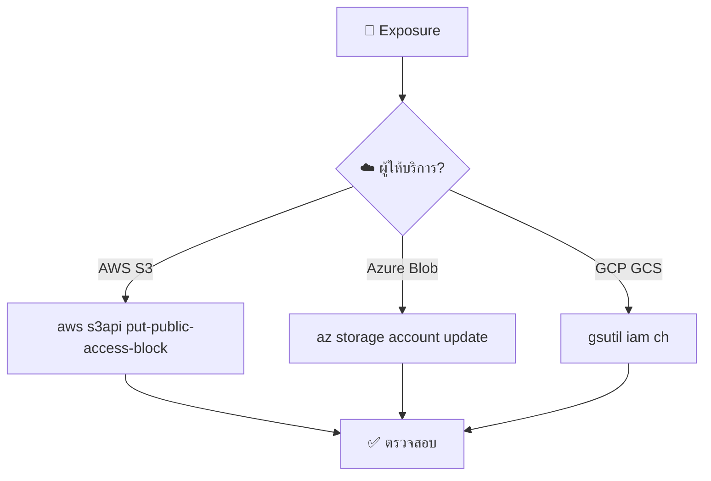
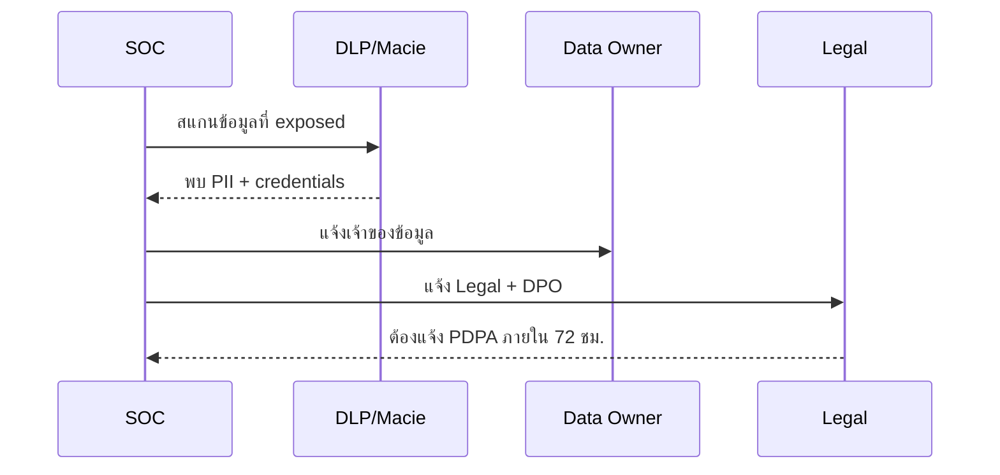
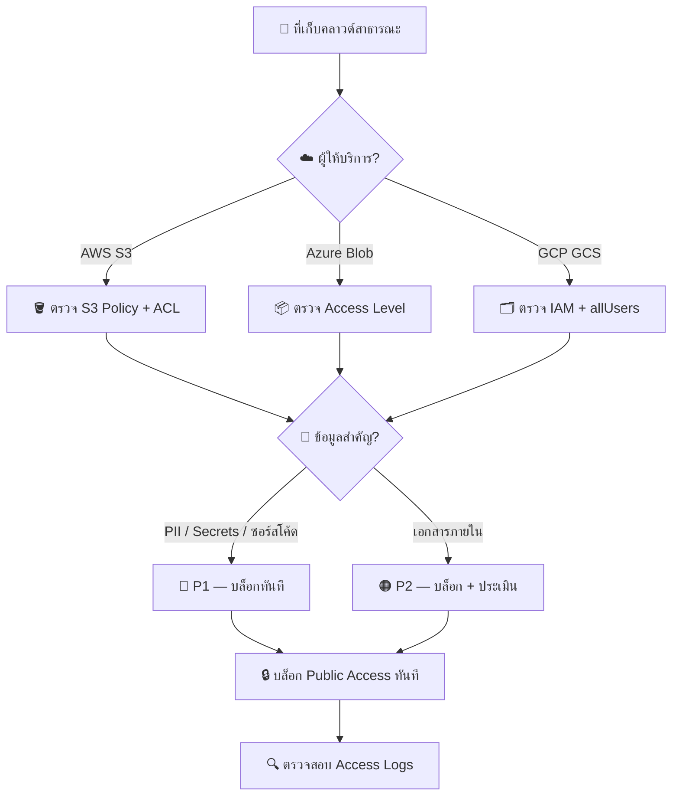
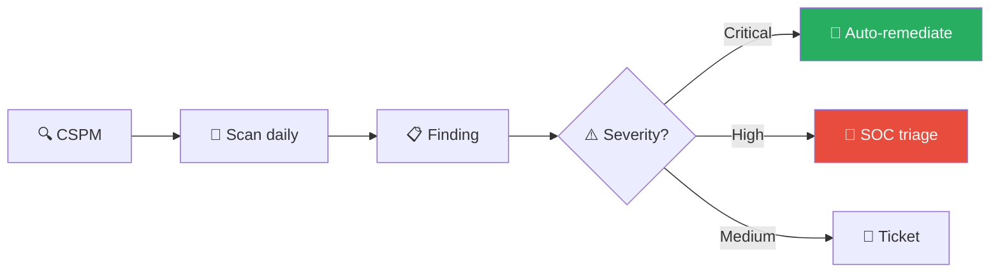
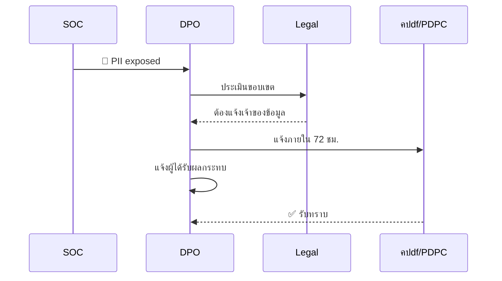

# Playbook: การเปิดเผยที่เก็บข้อมูลคลาวด์

**ID**: PB-27
**ระดับความรุนแรง**: สูง/วิกฤต | **หมวดหมู่**: ความปลอดภัยคลาวด์
**MITRE ATT&CK**: [T1530](https://attack.mitre.org/techniques/T1530/) (ข้อมูลจากที่เก็บคลาวด์), [T1537](https://attack.mitre.org/techniques/T1537/) (โอนข้อมูลไปบัญชีคลาวด์)
**ทริกเกอร์**: CASB alert, CSPM finding, ผู้ใช้รายงาน, TI match (leaked data)

### ผัง Multi-Cloud Containment

### ผังจำแนกประเภทข้อมูล

---

## ผังการตัดสินใจ

---

## 1. การวิเคราะห์

### 1.1 การประเมินการเปิดเผยตามคลาวด์

| คลาวด์ | ตรวจสอบ | คำสั่ง / เครื่องมือ |
|:---|:---|:---|
| **AWS S3** | Block Public Access | `aws s3api get-public-access-block` |
| **AWS S3** | Bucket Policy (`Principal: *`) | `aws s3api get-bucket-policy` |
| **Azure Blob** | Container access level | Portal → Storage → Containers |
| **GCP GCS** | `allUsers` binding | `gsutil iam get gs://<bucket>` |

### 1.2 รายการตรวจสอบ

| รายการ | วิธีตรวจสอบ | เสร็จ |
|:---|:---|:---:|
| ทรัพยากรใดถูกเปิดเผย? | CSPM / Console | ☐ |
| ข้อมูลอะไรถูกจัดเก็บ? จำแนกประเภท | DLP scan | ☐ |
| เปิดเป็นสาธารณะนานเท่าไหร่? | Audit logs | ☐ |
| ใครทำให้เป็นสาธารณะ? | CloudTrail | ☐ |
| มีข้อมูลถูกเข้าถึงจากภายนอก? | Access logs | ☐ |
| มี credentials/secrets อยู่ในที่เก็บ? | Secrets scanner | ☐ |

### 1.3 ผลกระทบตามประเภทข้อมูล

| ประเภทข้อมูล | ความรุนแรง | ผลกระทบ |
|:---|:---|:---|
| **PII / ข้อมูลลูกค้า** | 🔴 วิกฤต | PDPA 72 ชม. |
| **Credentials / API keys** | 🔴 วิกฤต | หมุนเวียนทันที |
| **ซอร์สโค้ด** | 🔴 วิกฤต | ทรัพย์สินทางปัญญารั่วไหล |
| **เอกสารภายใน** | 🟠 สูง | ประเมินความเสี่ยง |

---

## 2. การควบคุม

### 2.1 การดำเนินการทันที (ภายใน 15 นาที)

| # | การดำเนินการ | เสร็จ |
|:---:|:---|:---:|
| 1 | **บล็อก public access** | ☐ |
| 2 | **เพิกถอน credentials ที่เปิดเผย** — หมุนเวียน secrets ทั้งหมด | ☐ |
| 3 | **เปิด versioning** เก็บหลักฐาน | ☐ |
| 4 | **ติดแท็ก** `Status: Compromised` | ☐ |

### 2.2 หาก Credentials ถูกเปิดเผย

| # | การดำเนินการ | เสร็จ |
|:---:|:---|:---:|
| 1 | หมุนเวียน API keys, access keys, tokens ทั้งหมด | ☐ |
| 2 | ตรวจ CloudTrail ว่า credentials ถูกใช้หรือไม่ | ☐ |
| 3 | หากถูกใช้ → ยกระดับไป [PB-16 Cloud IAM](Cloud_IAM.th.md) | ☐ |

---

## 3. การกำจัด

| # | การดำเนินการ | เสร็จ |
|:---:|:---|:---:|
| 1 | คืนค่า policy ที่ถูกต้อง (จาก IaC) | ☐ |
| 2 | หมุนเวียน credentials ทั้งหมดที่อยู่ในที่เก็บ | ☐ |
| 3 | ตรวจสอบสิทธิ์ IAM — จำกัดผู้ที่เปลี่ยน access policy ได้ | ☐ |

---

## 4. การฟื้นฟู

| # | การดำเนินการ | เสร็จ |
|:---:|:---|:---:|
| 1 | เปิด Block Public Access ระดับบัญชี (SCP / Azure Policy / GCP Org) | ☐ |
| 2 | Deploy CSPM (Wiz, Prisma Cloud, Security Hub) | ☐ |
| 3 | เปิด alerts สำหรับ public storage | ☐ |
| 4 | ติดแท็กข้อมูลสำคัญและบังคับ encryption | ☐ |
| 5 | ใช้ IaC (Terraform) พร้อม security guardrails | ☐ |

---

## 5. เกณฑ์การยกระดับ

| เงื่อนไข | ยกระดับไปยัง |
|:---|:---|
| PII / ข้อมูลลูกค้ารั่วไหล | Legal + DPO (PDPA 72 ชม.) |
| Credentials ถูกเปิดเผย | CISO + ทีม IAM |
| ข้อมูลถูกเข้าถึงจาก IP ภายนอก | Major Incident |
| ทรัพยากรหลายรายการถูกเปิดเผย | Cloud team + SOC Lead |

---

### ผัง CSPM Monitoring Pipeline

### ผัง Data Breach Notification (PDPA)

## เอกสารที่เกี่ยวข้อง

- [กรอบการตอบสนองต่อเหตุการณ์](../Framework.th.md)
- [แม่แบบรายงานเหตุการณ์](../../templates/incident_report.th.md)
- [PB-16 Cloud IAM](Cloud_IAM.th.md)
- [PB-08 การนำข้อมูลออก](Data_Exfiltration.th.md)

## อ้างอิง

- [MITRE ATT&CK T1530 — Data from Cloud Storage](https://attack.mitre.org/techniques/T1530/)
- [AWS S3 Security Best Practices](https://docs.aws.amazon.com/AmazonS3/latest/userguide/security-best-practices.html)
