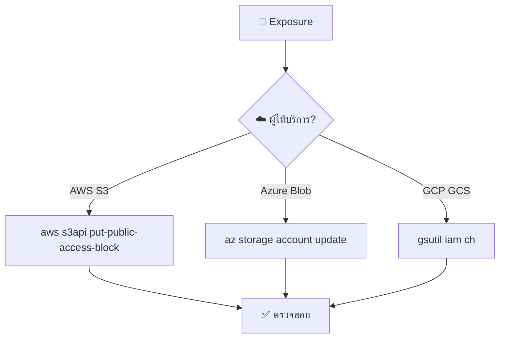
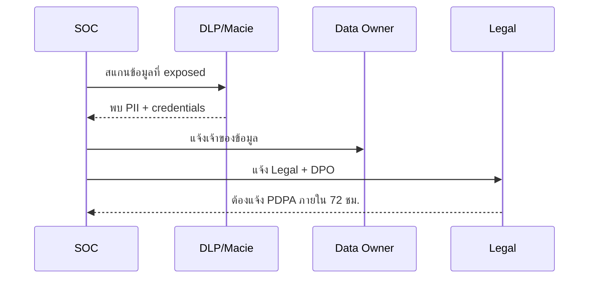
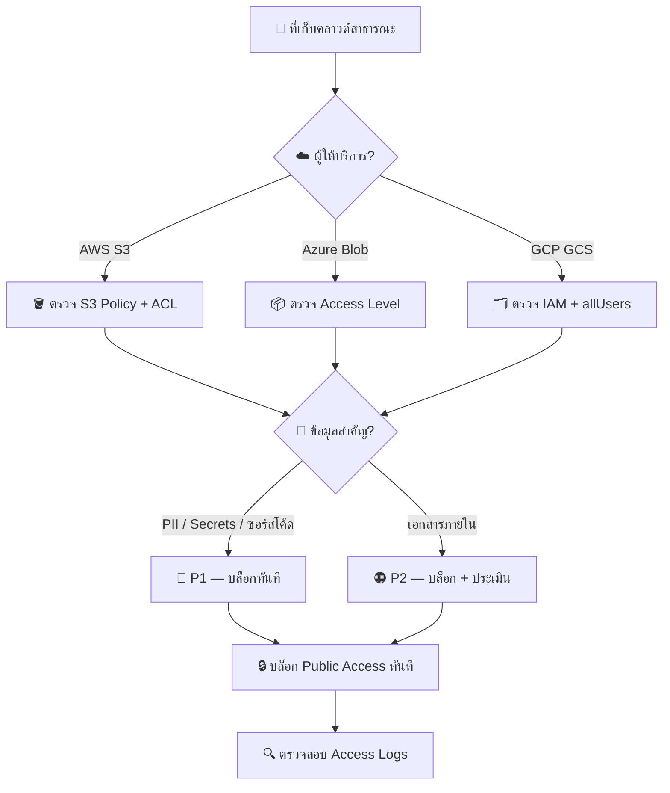
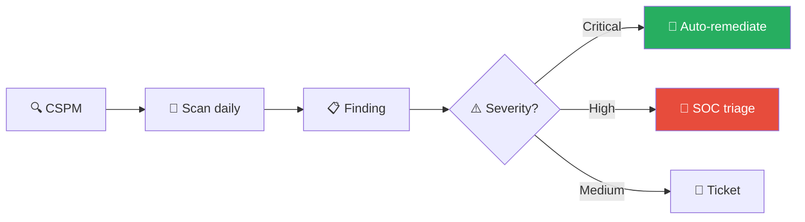
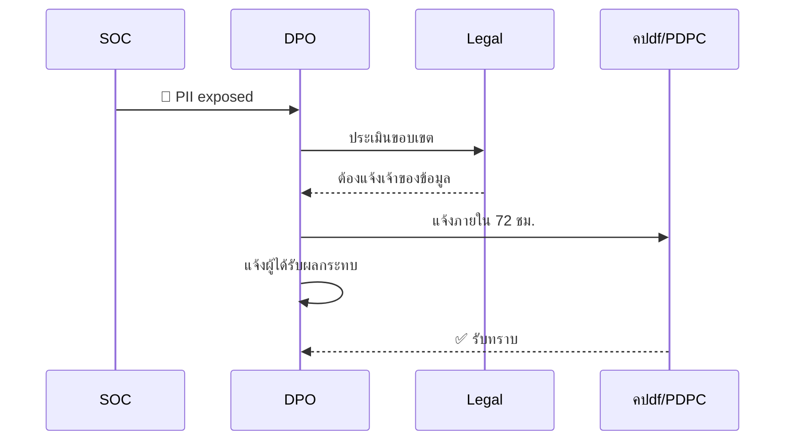

# Playbook: การเปิดเผยที่เก็บข้อมูลคลาวด์

**ID**: PB-27
**ระดับความรุนแรง**: สูง/วิกฤต | **หมวดหมู่**: ความปลอดภัยคลาวด์
**MITRE ATT&CK**: [T1530](https://attack.mitre.org/techniques/T1530/) (ข้อมูลจากที่เก็บคลาวด์), [T1537](https://attack.mitre.org/techniques/T1537/) (โอนข้อมูลไปบัญชีคลาวด์)
**ทริกเกอร์**: CASB alert, CSPM finding, ผู้ใช้รายงาน, TI match (leaked data)

## หลังเหตุการณ์ (Post-Incident)

- [ ] ใช้ CSPM เพื่อเฝ้า public bucket/blob ต่อเนื่อง
- [ ] บังคับ block public access เป็น default
- [ ] ตรวจสอบข้อมูลที่ถูกเปิดเผย (PII, credentials)
- [ ] อัพเดท bucket/blob policies ทั้งหมด
- [ ] แจ้ง PDPA/Legal ถ้ามี PII รั่วไหล
- [ ] จัดทำ [Incident Report](../../11_Reporting_Templates/incident_report.th.md)

### ผัง Multi-Cloud Containment

```mermaid
graph TD
    Alert["🚨 Exposure"] --> Cloud{"☁️ ผู้ให้บริการ?"}
    Cloud -->|AWS S3| S3["aws s3api put-public-access-block"]
    Cloud -->|Azure Blob| Blob["az storage account update"]
    Cloud -->|GCP GCS| GCS["gsutil iam ch"]
    S3 --> Verify["✅ ตรวจสอบ"]
    Blob --> Verify
    GCS --> Verify
```

### ผังจำแนกประเภทข้อมูล

```mermaid
sequenceDiagram
    participant SOC
    participant DLP as DLP/Macie
    participant Owner as Data Owner
    participant Legal
    SOC->>DLP: สแกนข้อมูลที่ exposed
    DLP-->>SOC: พบ PII + credentials
    SOC->>Owner: แจ้งเจ้าของข้อมูล
    SOC->>Legal: แจ้ง Legal + DPO
    Legal-->>SOC: ต้องแจ้ง PDPA ภายใน 72 ชม.
```

---

## ผังการตัดสินใจ

```mermaid
graph TD
    Alert["🚨 ที่เก็บคลาวด์สาธารณะ"] --> Cloud{"☁️ ผู้ให้บริการ?"}
    Cloud -->|AWS S3| S3["🪣 ตรวจ S3 Policy + ACL"]
    Cloud -->|Azure Blob| Blob["📦 ตรวจ Access Level"]
    Cloud -->|GCP GCS| GCS["🗂️ ตรวจ IAM + allUsers"]
    S3 --> Data{"📁 ข้อมูลสำคัญ?"}
    Blob --> Data
    GCS --> Data
    Data -->|PII / Secrets / ซอร์สโค้ด| Critical["🔴 P1 — บล็อกทันที"]
    Data -->|เอกสารภายใน| High["🟠 P2 — บล็อก + ประเมิน"]
    Critical --> Block["🔒 บล็อก Public Access ทันที"]
    High --> Block
    Block --> Investigate["🔍 ตรวจสอบ Access Logs"]
```

---

## 1. การวิเคราะห์

### 1.1 การประเมินการเปิดเผยตามคลาวด์

| คลาวด์ | ตรวจสอบ | คำสั่ง / เครื่องมือ |
|:---|:---|:---|
| **AWS S3** | Block Public Access | `aws s3api get-public-access-block` |
| **AWS S3** | Bucket Policy (`Principal: *`) | `aws s3api get-bucket-policy` |
| **Azure Blob** | Container access level | Portal → Storage → Containers |
| **GCP GCS** | `allUsers` binding | `gsutil iam get gs://<bucket>` |

### 1.2 รายการตรวจสอบ

| รายการ | วิธีตรวจสอบ | เสร็จ |
|:---|:---|:---:|
| ทรัพยากรใดถูกเปิดเผย? | CSPM / Console | ☐ |
| ข้อมูลอะไรถูกจัดเก็บ? จำแนกประเภท | DLP scan | ☐ |
| เปิดเป็นสาธารณะนานเท่าไหร่? | Audit logs | ☐ |
| ใครทำให้เป็นสาธารณะ? | CloudTrail | ☐ |
| มีข้อมูลถูกเข้าถึงจากภายนอก? | Access logs | ☐ |
| มี credentials/secrets อยู่ในที่เก็บ? | Secrets scanner | ☐ |

### 1.3 ผลกระทบตามประเภทข้อมูล

| ประเภทข้อมูล | ความรุนแรง | ผลกระทบ |
|:---|:---|:---|
| **PII / ข้อมูลลูกค้า** | 🔴 วิกฤต | PDPA 72 ชม. |
| **Credentials / API keys** | 🔴 วิกฤต | หมุนเวียนทันที |
| **ซอร์สโค้ด** | 🔴 วิกฤต | ทรัพย์สินทางปัญญารั่วไหล |
| **เอกสารภายใน** | 🟠 สูง | ประเมินความเสี่ยง |

---

## 2. การควบคุม

### 2.1 การดำเนินการทันที (ภายใน 15 นาที)

| # | การดำเนินการ | เสร็จ |
|:---:|:---|:---:|
| 1 | **บล็อก public access** | ☐ |
| 2 | **เพิกถอน credentials ที่เปิดเผย** — หมุนเวียน secrets ทั้งหมด | ☐ |
| 3 | **เปิด versioning** เก็บหลักฐาน | ☐ |
| 4 | **ติดแท็ก** `Status: Compromised` | ☐ |

### 2.2 หาก Credentials ถูกเปิดเผย

| # | การดำเนินการ | เสร็จ |
|:---:|:---|:---:|
| 1 | หมุนเวียน API keys, access keys, tokens ทั้งหมด | ☐ |
| 2 | ตรวจ CloudTrail ว่า credentials ถูกใช้หรือไม่ | ☐ |
| 3 | หากถูกใช้ → ยกระดับไป [PB-16 Cloud IAM](Cloud_IAM.th.md) | ☐ |

---

## 3. การกำจัด

| # | การดำเนินการ | เสร็จ |
|:---:|:---|:---:|
| 1 | คืนค่า policy ที่ถูกต้อง (จาก IaC) | ☐ |
| 2 | หมุนเวียน credentials ทั้งหมดที่อยู่ในที่เก็บ | ☐ |
| 3 | ตรวจสอบสิทธิ์ IAM — จำกัดผู้ที่เปลี่ยน access policy ได้ | ☐ |

---

## 4. การฟื้นฟู

| # | การดำเนินการ | เสร็จ |
|:---:|:---|:---:|
| 1 | เปิด Block Public Access ระดับบัญชี (SCP / Azure Policy / GCP Org) | ☐ |
| 2 | Deploy CSPM (Wiz, Prisma Cloud, Security Hub) | ☐ |
| 3 | เปิด alerts สำหรับ public storage | ☐ |
| 4 | ติดแท็กข้อมูลสำคัญและบังคับ encryption | ☐ |
| 5 | ใช้ IaC (Terraform) พร้อม security guardrails | ☐ |

---

## 5. เกณฑ์การยกระดับ

| เงื่อนไข | ยกระดับไปยัง |
|:---|:---|
| PII / ข้อมูลลูกค้ารั่วไหล | Legal + DPO (PDPA 72 ชม.) |
| Credentials ถูกเปิดเผย | CISO + ทีม IAM |
| ข้อมูลถูกเข้าถึงจาก IP ภายนอก | Major Incident |
| ทรัพยากรหลายรายการถูกเปิดเผย | Cloud team + SOC Lead |

---

## 6. Evidence Checklist

| ประเภทหลักฐาน | สิ่งที่ต้องเก็บ | แหล่งข้อมูล | เหตุผลที่ต้องเก็บ |
|:---|:---|:---|:---|
| หลักฐานการเปิดเผย | resource name, policy/ACL diff, public URL/path, exposure timestamp | CSPM / cloud console / audit logs | ยืนยันว่าอะไรถูกเปิดเผยและตั้งแต่เมื่อไร |
| หลักฐานด้านตัวตน | user/role ที่เปลี่ยน access, source IP, API/console path | Cloud audit / IAM logs | ใช้แยกว่าเป็นความผิดพลาดหรือเจตนาร้าย |
| หลักฐานการเข้าถึง | external IP, user agent, object list, download count | Access logs / CDN logs | ใช้ดูว่าข้อมูลถูกเข้าถึงจริงหรือไม่ |
| หลักฐานความอ่อนไหวของข้อมูล | data type, classification, secret, customer record, source code | DLP / data inventory | ใช้รองรับการแจ้งเหตุและการประเมินผลกระทบ |
| หลักฐาน credential | key, token, config file, secret ที่อยู่ใน resource | Secret scanning / file review | ใช้ตัดสินการ rotate credential และ follow-on risk |

---

## 7. Minimum Telemetry Required

| แหล่ง Telemetry | ใช้เพื่ออะไร | ความสำคัญ | Blind Spot ถ้าไม่มี |
|:---|:---|:---:|:---|
| Cloud audit logs | ดู policy change, actor identity, console/API path | Required | พิสูจน์ไม่ได้ว่าใครเปิดเผย resource หรือทำอย่างไร |
| Object access logs | ดู external read, object name, download volume | Required | บอกไม่ได้ว่าการเปิดเผยกลายเป็น data loss แล้วหรือยัง |
| CSPM หรือ posture telemetry | ตรวจ public exposure ต่อเนื่องและจัดระดับ severity | Required | misconfiguration อาจค้างอยู่โดยไม่รู้ตัว |
| DLP หรือ data classification telemetry | ประเมิน sensitivity และ record count | Required | ขอบเขตการแจ้งเหตุและผลกระทบไม่ชัด |
| IaC และ change-management records | เทียบ planned กับ unplanned access change | Recommended | อาจตี public content ที่ตั้งใจเปิดเป็น breach |

---

## 8. False Positive และ Tuning Guide

| Scenario | ทำไมจึงดูน่าสงสัย | วิธีตรวจสอบ | Tuning Action | ต้องยกระดับเมื่อ |
|:---|:---|:---|:---|:---|
| public website หรือ CDN content ที่ตั้งใจเปิด | bucket/container public อาจเป็น static asset จริง | ยืนยัน asset owner, approved public-content tag, และไม่มีข้อมูลอ่อนไหว | suppress เฉพาะ resource ที่ tagged และมี owner ชัดเจน | พบข้อมูลอ่อนไหว, secret, หรือ non-web content |
| การแชร์ไฟล์ให้ partner แบบชั่วคราว | external sharing ระยะสั้นดูเหมือน misconfiguration | ยืนยัน ticket, expiry date, recipient, และ object scope | alert ต่ำลงเฉพาะ share ที่อนุมัติและมี expiry | share กว้างเกิน scope, ไม่มี expiry, หรือกลายเป็น public |
| การทำงานของ CSPM auto-remediation | policy flip เร็ว ๆ อาจดูเหมือน attacker activity | ยืนยัน tool identity และ remediation workflow | allowlist identity ของเครื่องมือสำหรับ action ที่ documented | identity เดียวกันเปิด public หรือปิด logging |
| งาน data migration หรือ replication | storage/policy ใหม่อาจเป็นส่วนหนึ่งของ project | ยืนยัน IaC deployment, project owner, และ environment | tune ตาม deployment identity และ staging account ที่อนุมัติ | public exposure ไปเกิดใน production หรือมี sensitive data ไม่ควรอยู่ |

---

### ผัง CSPM Monitoring Pipeline

```mermaid
graph LR
    CSPM["🔍 CSPM"] --> Scan["📡 Scan daily"]
    Scan --> Finding["📋 Finding"]
    Finding --> Severity{"⚠️ Severity?"}
    Severity -->|Critical| Auto["🤖 Auto-remediate"]
    Severity -->|High| SOC["🎯 SOC triage"]
    Severity -->|Medium| Ticket["📝 Ticket"]
    style Auto fill:#27ae60,color:#fff
    style SOC fill:#e74c3c,color:#fff
```

### ผัง Data Breach Notification (PDPA)

```mermaid
sequenceDiagram
    participant SOC
    participant DPO
    participant Legal
    participant Authority as คปdf/PDPC
    SOC->>DPO: 🚨 PII exposed
    DPO->>Legal: ประเมินขอบเขต
    Legal-->>DPO: ต้องแจ้งเจ้าของข้อมูล
    DPO->>Authority: แจ้งภายใน 72 ชม.
    DPO->>DPO: แจ้งผู้ได้รับผลกระทบ
    Authority-->>DPO: ✅ รับทราบ
```

## กฎตรวจจับ (Sigma)

| กฎ | ไฟล์ |
|:---|:---|
| Cloud Storage Public Access | [cloud_storage_public_access.yml](../../08_Detection_Engineering/sigma_rules/cloud_storage_public_access.yml) |
| AWS S3 Public Access Enabled | [cloud_aws_s3_public_access.yml](../../08_Detection_Engineering/sigma_rules/cloud_aws_s3_public_access.yml) |

## เอกสารที่เกี่ยวข้อง

- [กรอบการตอบสนองต่อเหตุการณ์](../Framework.th.md)
- [แม่แบบรายงานเหตุการณ์](../../11_Reporting_Templates/incident_report.th.md)
- [PB-16 Cloud IAM](Cloud_IAM.th.md)
- [PB-08 การนำข้อมูลออก](Data_Exfiltration.th.md)

## Cloud Storage Risk Matrix

| Provider | Service | Common Misconfiguration |
|:---|:---|:---|
| AWS | S3 | Public bucket policy |
| Azure | Blob Storage | Public container |
| GCP | Cloud Storage | allUsers permission |

### Exposure Assessment Template

| Item | Check | Status |
|:---|:---|:---|
| Public access enabled | ☐ Yes / ☐ No | ⚠️/✅ |
| Sensitive data present | ☐ Yes / ☐ No | ⚠️/✅ |
| Access logs enabled | ☐ Yes / ☐ No | ⚠️/✅ |
| Encryption at rest | ☐ Yes / ☐ No | ⚠️/✅ |
| Data exposed duration | ______ hrs/days | - |
| Data download count | ______ | - |

### Remediation Priority

| Data Type | Response SLA | Notification |
|:---|:---|:---|
| PII/PHI | 1 hr fix | PDPA 72 hr |
| Credentials/Keys | 30 min | Rotate immediately |
| Internal docs | 4 hrs | Internal notice |
| Public data | 24 hrs | None required |

### Public Exposure Check Tools

| Provider | Tool | Auto-remediate |
|:---|:---|:---|
| AWS | Access Analyzer | ✅ via Config Rules |
| Azure | Defender for Cloud | ✅ via Policy |
| GCP | Security Command Center | ✅ via Org Policy |

## References

- [MITRE ATT&CK T1530 — Data from Cloud Storage](https://attack.mitre.org/techniques/T1530/)
- [AWS S3 Security Best Practices](https://docs.aws.amazon.com/AmazonS3/latest/userguide/security-best-practices.html)
