# Playbook: Credential Dumping Response

**ID**: PB-36
**Severity**: Critical | **Category**: Credential Access
**MITRE ATT&CK**: [T1003](https://attack.mitre.org/techniques/T1003/) (OS Credential Dumping), [T1003.001](https://attack.mitre.org/techniques/T1003/001/) (LSASS Memory), [T1003.002](https://attack.mitre.org/techniques/T1003/002/) (SAM), [T1003.003](https://attack.mitre.org/techniques/T1003/003/) (NTDS)
**Trigger**: EDR alert (LSASS access), SIEM (Mimikatz signature), suspicious process accessing credential stores

> ⚠️ **CRITICAL**: Credential dumping means the attacker likely already has privileged access. Assume ALL credentials on the compromised host are stolen. Password reset is mandatory.

### Attack Kill Chain

```mermaid
graph LR
    A["1️⃣ Initial Access"] --> B["2️⃣ Privilege Escalation"]
    B --> C["3️⃣ Credential Dumping"]
    C --> D["4️⃣ Lateral Movement"]
    D --> E["5️⃣ Domain Dominance"]
    style A fill:#ffcc00,color:#000
    style B fill:#ff9900,color:#fff
    style C fill:#ff4444,color:#fff
    style D fill:#cc0000,color:#fff
    style E fill:#660000,color:#fff
```



### Common Credential Dumping Tools

```mermaid
graph TD
    CredDump["🔓 Credential Dumping"] --> Mimikatz["Mimikatz\nsekurlsa::logonpasswords"]
    CredDump --> ProcDump["ProcDump\nlsass.exe dump"]
    CredDump --> Comsvcs["comsvcs.dll\nMiniDump"]
    CredDump --> NtdsUtil["ntdsutil.exe\nAD database"]
    CredDump --> SecretsDump["secretsdump.py\nImpacket"]
    CredDump --> LaZagne["LaZagne\nBrowser/App creds"]
    CredDump --> RegSave["reg save\nSAM/SYSTEM hives"]
    style CredDump fill:#ff4444,color:#fff
    style Mimikatz fill:#cc3333,color:#fff
    style ProcDump fill:#cc3333,color:#fff
    style NtdsUtil fill:#cc3333,color:#fff
```



---

## Decision Flow

```mermaid
graph TD
    Alert["🚨 Credential Dump Detected"] --> Verify{"Verify Alert"}
    Verify -->|"LSASS access"| LSASS["Check process accessing LSASS"]
    Verify -->|"SAM/NTDS"| Registry["Check registry/file access"]
    Verify -->|"Tool detected"| Tool["Identify tool: Mimikatz/ProcDump/etc"]
    LSASS --> Legit{"Legitimate process?"}
    Registry --> Legit
    Tool --> Legit
    Legit -->|"No — Confirmed dump"| Contain["🔴 CONTAIN IMMEDIATELY"]
    Legit -->|"Yes — Expected"| FP["Log as False Positive"]
    Contain --> Isolate["Isolate host from network"]
    Isolate --> ResetCreds["Force password reset ALL accounts on host"]
    ResetCreds --> Investigate["Full investigation"]
    style Alert fill:#ff4444,color:#fff
    style Contain fill:#cc0000,color:#fff
    style Isolate fill:#990000,color:#fff
```



### Investigation Workflow

```mermaid
sequenceDiagram
    participant EDR
    participant SOC as SOC Analyst
    participant AD as AD Admin
    participant IR as IR Team
    
    EDR->>SOC: 🚨 LSASS access alert
    SOC->>SOC: Verify process & parent process
    SOC->>EDR: Pull process tree & memory dump
    SOC->>AD: Request logon audit for compromised host
    AD->>SOC: Return all accounts authenticated
    SOC->>IR: Escalate — credential dump confirmed
    IR->>AD: Force password reset (all affected accounts)
    IR->>SOC: Begin lateral movement hunt
    SOC->>EDR: Sweep for same tool across all endpoints
```



### Credential Dump Types


### Response Timeline


### Impact Assessment Matrix


---

## 1. Immediate Actions (First 15 Minutes)

| # | Action | Owner |
|:---|:---|:---|
| 1 | Isolate affected host (EDR network isolation preferred) | SOC T1 |
| 2 | Capture volatile memory before shutdown | SOC T2 |
| 3 | Identify ALL accounts that were logged into the host | SOC T2 |
| 4 | Disable/reset passwords for all identified accounts | AD Admin |
| 5 | Check for LSASS dump files on disk | SOC T2 |
| 6 | Alert IR team — potential domain compromise | SOC Manager |

## 2. Investigation Checklist

### Host Analysis
- [ ] Process tree: What process accessed LSASS? Parent process?
- [ ] Tool identification: Mimikatz, ProcDump, comsvcs.dll, Task Manager?
- [ ] Check for `.dmp` files in `%TEMP%`, `C:\Windows\Temp`, user Desktop
- [ ] Review PowerShell history: `Get-Content (Get-PSReadLineOption).HistorySavePath`
- [ ] Check Sysmon Event ID 10 (ProcessAccess to lsass.exe)
- [ ] Look for `reg save HKLM\SAM`, `reg save HKLM\SYSTEM` commands
- [ ] Check for ntdsutil.exe or vssadmin shadow copies

### Network Analysis
- [ ] Check for DCSync traffic (DRSUAPI replication)
- [ ] Look for LDAP queries for SPNs (Kerberoasting)
- [ ] Check for Pass-the-Hash (NTLM authentication with new source IPs)
- [ ] Review lateral movement (RDP, WMI, PsExec, SMB) from compromised host

### Active Directory Analysis
- [ ] Audit Kerberos TGT/TGS requests from compromised host
- [ ] Check for new/modified service accounts
- [ ] Review Group Policy for persistence (scheduled tasks, startup scripts)
- [ ] Verify KRBTGT account last password change date

## 3. Containment

| Scope | Action | Command |
|:---|:---|:---|
| **Host** | Network isolation via EDR | `Isolate-Endpoint -HostId <ID>` |
| **Accounts** | Force password reset | `Set-ADAccountPassword -Identity <user>` |
| **Kerberos** | Purge tickets | `klist purge` on all affected hosts |
| **Service accts** | Rotate credentials | Update all service account passwords |
| **Admin accounts** | Disable & recreate | New admin accounts with different names |

## 4. Eradication & Recovery

### Short-term
1. Reimage compromised host (do NOT trust cleanup alone)
2. Reset ALL passwords for accounts on the compromised host
3. Rotate service account credentials
4. Reset KRBTGT password **twice** (if domain admin compromised)
5. Revoke all active Kerberos tickets

### Long-term
1. Enable **Credential Guard** on all Windows 10/11 endpoints
2. Deploy **LSASS protection** (`RunAsPPL` registry key)
3. Implement **tiered admin model** (Tier 0/1/2)
4. Disable WDigest authentication (`UseLogonCredential = 0`)
5. Deploy **Privileged Access Workstations (PAWs)** for admin tasks

## 5. Post-Incident

### Lessons Learned
| Question | Answer |
|:---|:---|
| How did attacker gain initial access? | [Document] |
| Was Credential Guard enabled? | [Yes/No — if no, why?] |
| Were admin accounts properly tiered? | [Document gaps] |
| How long were credentials exposed? | [Timeline] |

### Hardening Checklist
- [ ] Credential Guard enabled on all domain-joined endpoints
- [ ] LSASS RunAsPPL enabled
- [ ] WDigest disabled
- [ ] Local admin passwords managed via LAPS
- [ ] Tiered admin model implemented
- [ ] Protected Users group configured for privileged accounts

## 6. Detection Rules (Sigma)

```yaml
# LSASS Memory Access Detection
title: LSASS Memory Access by Non-System Process
logsource:
    product: windows
    category: process_access
detection:
    selection:
        TargetImage|endswith: '\lsass.exe'
        GrantedAccess|contains:
            - '0x1010'   # PROCESS_QUERY_LIMITED_INFORMATION + PROCESS_VM_READ
            - '0x1410'   # + PROCESS_QUERY_INFORMATION
            - '0x1F0FFF' # PROCESS_ALL_ACCESS
    filter:
        SourceImage|endswith:
            - '\wmiprvse.exe'
            - '\taskmgr.exe'
            - '\procexp64.exe'
    condition: selection and not filter
    level: critical
```

```yaml
# SAM/SYSTEM Registry Hive Export
title: SAM Registry Hive Export
logsource:
    product: windows
    category: process_creation
detection:
    selection:
        CommandLine|contains|all:
            - 'reg'
            - 'save'
        CommandLine|contains:
            - 'HKLM\SAM'
            - 'HKLM\SYSTEM'
            - 'HKLM\SECURITY'
    condition: selection
    level: critical
```

## Related Documents
- [Lateral Movement Playbook](Lateral_Movement.en.md)
- [Account Compromise Playbook](Account_Compromise.en.md)
- [Privilege Escalation Playbook](Privilege_Escalation.en.md)
- [Brute Force Playbook](Brute_Force.en.md)
- [Tier 2 Runbook](../Runbooks/Tier2_Runbook.en.md)

## References
- [MITRE T1003 — OS Credential Dumping](https://attack.mitre.org/techniques/T1003/)
- [Microsoft — Credential Guard](https://learn.microsoft.com/en-us/windows/security/identity-protection/credential-guard/)
- [SANS — Detecting Mimikatz](https://www.sans.org/white-papers/)
