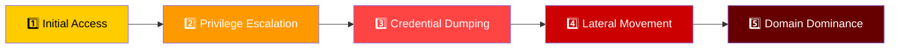
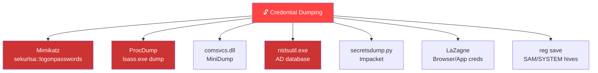
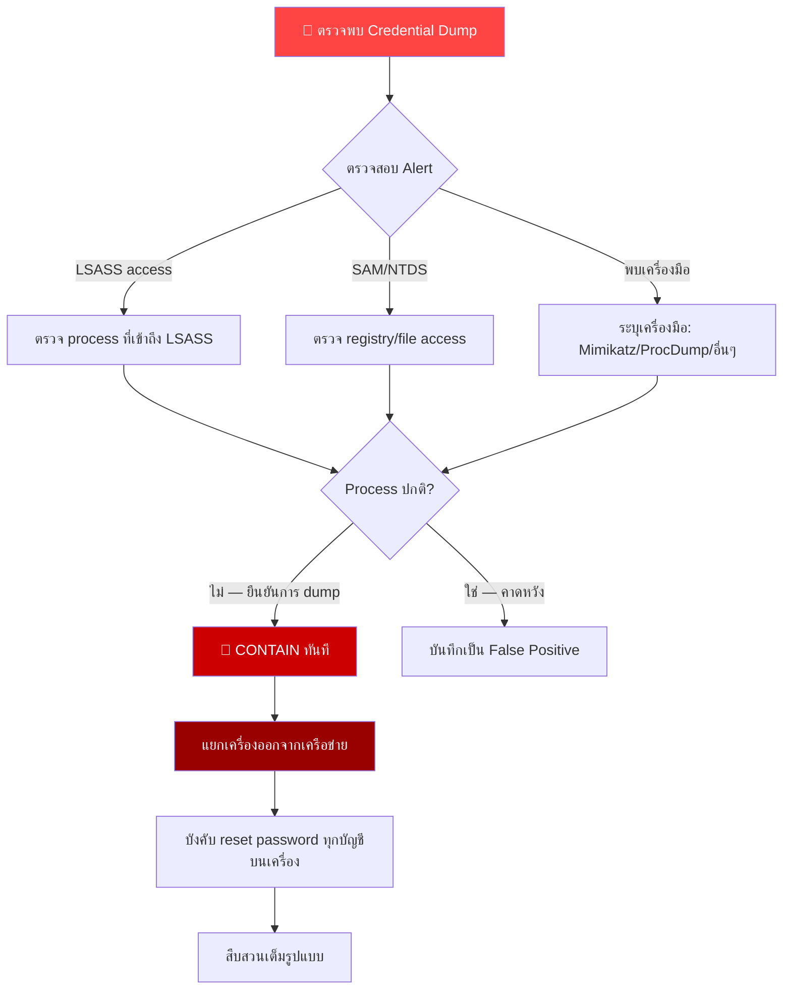
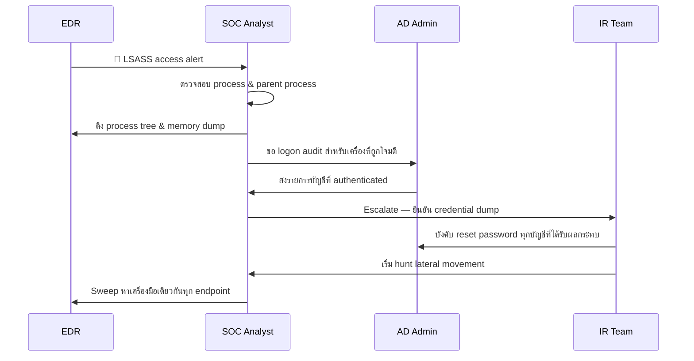
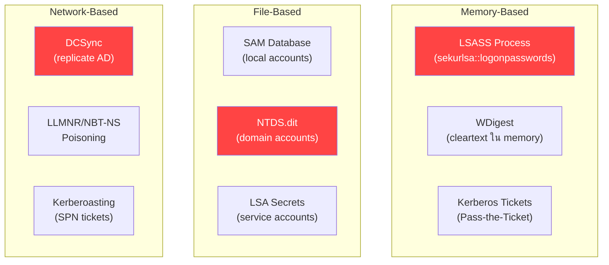
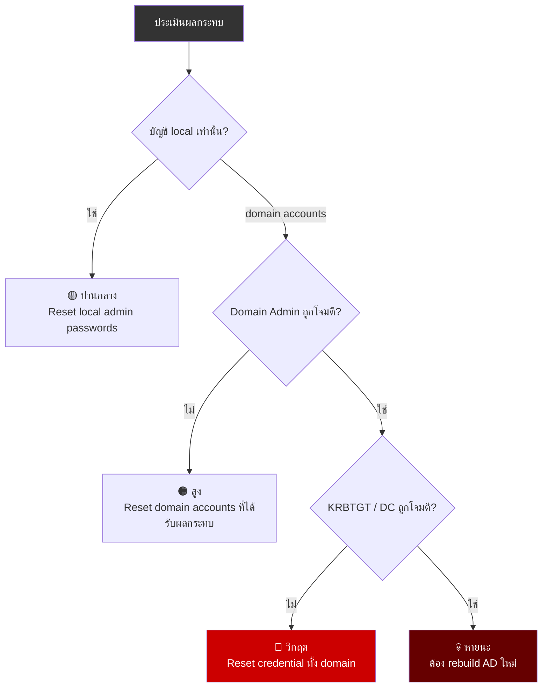

# Playbook: การตอบสนอง Credential Dumping

**ID**: PB-36
**ความรุนแรง**: วิกฤต | **ประเภท**: Credential Access
**MITRE ATT&CK**: [T1003](https://attack.mitre.org/techniques/T1003/) (OS Credential Dumping), [T1003.001](https://attack.mitre.org/techniques/T1003/001/) (LSASS Memory), [T1003.002](https://attack.mitre.org/techniques/T1003/002/) (SAM), [T1003.003](https://attack.mitre.org/techniques/T1003/003/) (NTDS)
**Trigger**: EDR alert (LSASS access), SIEM (Mimikatz signature), กระบวนการที่เข้าถึง credential stores ผิดปกติ

> ⚠️ **วิกฤต**: Credential dumping หมายความว่าผู้โจมตีมี privileged access แล้ว สันนิษฐานว่า credentials ทั้งหมดบนเครื่องถูกขโมย ต้อง reset password ทันที

### Attack Kill Chain



### เครื่องมือ Credential Dumping ที่พบบ่อย



---

## Decision Flow



### ขั้นตอนการสืบสวน



### ประเภท Credential Dump



### Timeline การตอบสนอง

```mermaid
gantt
    title Credential Dumping Response Timeline
    dateFormat HH:mm
    axisFormat %H:%M
    section Detection
        Alert triggered           :a1, 00:00, 5min
        Triage & verify           :a2, after a1, 10min
    section Containment
        แยกเครื่อง                :a3, after a2, 5min
        ปิดบัญชีที่ถูกโจมตี       :a4, after a3, 15min
    section Investigation
        วิเคราะห์ process tree    :a5, after a4, 30min
        Hunt lateral movement     :a6, after a5, 60min
        ตรวจสอบ credential ทั้งหมด :a7, after a6, 60min
    section Recovery
        Mass password reset       :a8, after a7, 120min
        เปิด Credential Guard     :a9, after a8, 60min
```



### การประเมินผลกระทบ



---

## 1. การดำเนินการทันที (15 นาทีแรก)

| # | การดำเนินการ | ผู้รับผิดชอบ |
|:---|:---|:---|
| 1 | แยกเครื่องที่ได้รับผลกระทบ (EDR network isolation) | SOC T1 |
| 2 | เก็บ volatile memory ก่อนปิดเครื่อง | SOC T2 |
| 3 | ระบุบัญชีทั้งหมดที่ login อยู่บนเครื่อง | SOC T2 |
| 4 | ปิด/reset password สำหรับทุกบัญชีที่ระบุ | AD Admin |
| 5 | ตรวจหา LSASS dump files บน disk | SOC T2 |
| 6 | แจ้ง IR team — อาจเป็น domain compromise | SOC Manager |

## 2. รายการตรวจสอบการสืบสวน

### การวิเคราะห์ Host
- [ ] Process tree: process อะไรเข้าถึง LSASS? Parent process?
- [ ] ระบุเครื่องมือ: Mimikatz, ProcDump, comsvcs.dll, Task Manager?
- [ ] ตรวจหาไฟล์ `.dmp` ใน `%TEMP%`, `C:\Windows\Temp`, Desktop
- [ ] ตรวจ PowerShell history: `Get-Content (Get-PSReadLineOption).HistorySavePath`
- [ ] ตรวจ Sysmon Event ID 10 (ProcessAccess to lsass.exe)
- [ ] ตรวจคำสั่ง `reg save HKLM\SAM`, `reg save HKLM\SYSTEM`
- [ ] ตรวจ ntdsutil.exe หรือ vssadmin shadow copies

### การวิเคราะห์ Network
- [ ] ตรวจ DCSync traffic (DRSUAPI replication)
- [ ] ตรวจ LDAP queries สำหรับ SPNs (Kerberoasting)
- [ ] ตรวจ Pass-the-Hash (NTLM auth จาก IP ใหม่)
- [ ] ตรวจ lateral movement (RDP, WMI, PsExec, SMB) จากเครื่องที่ถูกโจมตี

### การวิเคราะห์ Active Directory
- [ ] ตรวจ Kerberos TGT/TGS requests จากเครื่องที่ถูกโจมตี
- [ ] ตรวจ service accounts ที่สร้างใหม่/แก้ไข
- [ ] ตรวจ Group Policy สำหรับ persistence
- [ ] ตรวจ KRBTGT account — วันที่เปลี่ยน password ล่าสุด

## 3. การควบคุม (Containment)

| ขอบเขต | การดำเนินการ | คำสั่ง |
|:---|:---|:---|
| **Host** | แยกเครือข่ายผ่าน EDR | `Isolate-Endpoint -HostId <ID>` |
| **บัญชี** | บังคับ reset password | `Set-ADAccountPassword -Identity <user>` |
| **Kerberos** | ลบ tickets | `klist purge` บนทุกเครื่องที่ได้รับผลกระทบ |
| **Service accts** | หมุนเวียน credentials | อัปเดต password service account ทั้งหมด |
| **Admin accounts** | ปิดและสร้างใหม่ | สร้างบัญชี admin ใหม่ชื่อต่างจากเดิม |

## 4. การกำจัดและกู้คืน

### ระยะสั้น
1. Reimage เครื่องที่ถูกโจมตี (อย่าเชื่อการ cleanup อย่างเดียว)
2. Reset password ทั้งหมดสำหรับบัญชีบนเครื่องที่ถูกโจมตี
3. หมุนเวียน service account credentials
4. Reset KRBTGT password **2 ครั้ง** (ถ้า domain admin ถูกโจมตี)
5. เพิกถอน Kerberos tickets ที่ active ทั้งหมด

### ระยะยาว
1. เปิด **Credential Guard** บน Windows 10/11 ทุกเครื่อง
2. Deploy **LSASS protection** (`RunAsPPL` registry key)
3. ใช้ **tiered admin model** (Tier 0/1/2)
4. ปิด WDigest authentication (`UseLogonCredential = 0`)
5. Deploy **Privileged Access Workstations (PAWs)**

## 5. หลังเหตุการณ์ (Post-Incident)

### บทเรียน
| คำถาม | คำตอบ |
|:---|:---|
| ผู้โจมตีได้ initial access อย่างไร? | [บันทึก] |
| Credential Guard เปิดใช้อยู่หรือไม่? | [ใช่/ไม่ — ถ้าไม่ เพราะอะไร?] |
| บัญชี admin แบ่ง tier ถูกต้องหรือไม่? | [บันทึกช่องว่าง] |
| Credentials ถูกเปิดเผยนานแค่ไหน? | [Timeline] |

### Hardening Checklist
- [ ] Credential Guard เปิดบนทุก endpoint ที่ join domain
- [ ] LSASS RunAsPPL เปิดใช้
- [ ] WDigest ปิดใช้
- [ ] Local admin passwords จัดการผ่าน LAPS
- [ ] Tiered admin model ใช้งาน
- [ ] Protected Users group กำหนดค่าสำหรับ privileged accounts

## 6. Detection Rules (Sigma)

```yaml
# ตรวจจับการเข้าถึง LSASS Memory
title: LSASS Memory Access by Non-System Process
logsource:
    product: windows
    category: process_access
detection:
    selection:
        TargetImage|endswith: '\lsass.exe'
        GrantedAccess|contains:
            - '0x1010'
            - '0x1410'
            - '0x1F0FFF'
    filter:
        SourceImage|endswith:
            - '\wmiprvse.exe'
            - '\taskmgr.exe'
            - '\procexp64.exe'
    condition: selection and not filter
    level: critical
```

```yaml
# ตรวจจับ SAM/SYSTEM Registry Hive Export
title: SAM Registry Hive Export
logsource:
    product: windows
    category: process_creation
detection:
    selection:
        CommandLine|contains|all:
            - 'reg'
            - 'save'
        CommandLine|contains:
            - 'HKLM\SAM'
            - 'HKLM\SYSTEM'
            - 'HKLM\SECURITY'
    condition: selection
    level: critical
```

## เอกสารที่เกี่ยวข้อง
- [Lateral Movement Playbook](Lateral_Movement.th.md)
- [Account Compromise Playbook](Account_Compromise.th.md)
- [Privilege Escalation Playbook](Privilege_Escalation.th.md)
- [Brute Force Playbook](Brute_Force.th.md)
- [คู่มือ Tier 2](../Runbooks/Tier2_Runbook.th.md)

## References
- [MITRE T1003 — OS Credential Dumping](https://attack.mitre.org/techniques/T1003/)
- [Microsoft — Credential Guard](https://learn.microsoft.com/en-us/windows/security/identity-protection/credential-guard/)
- [SANS — Detecting Mimikatz](https://www.sans.org/white-papers/)
