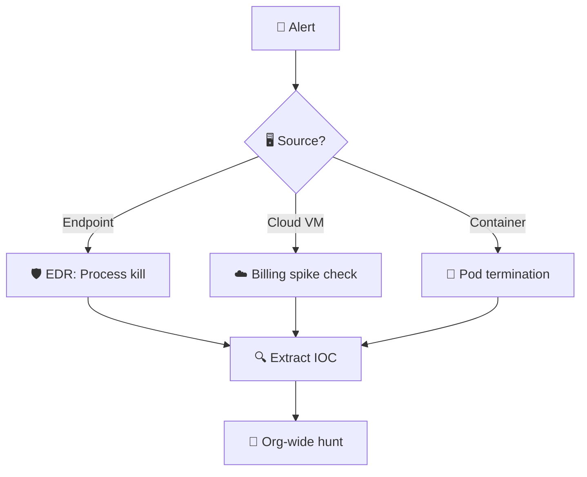
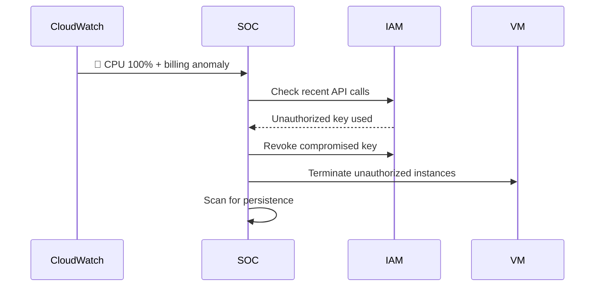
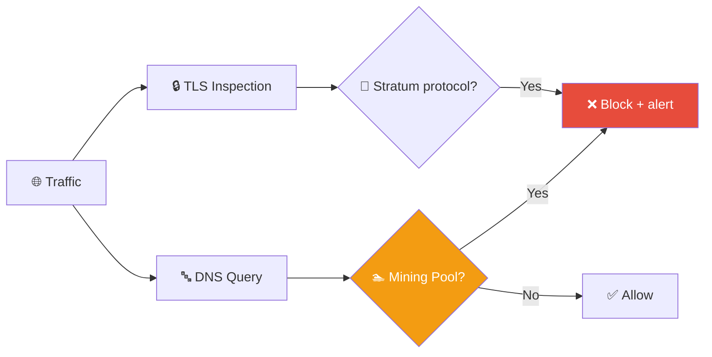
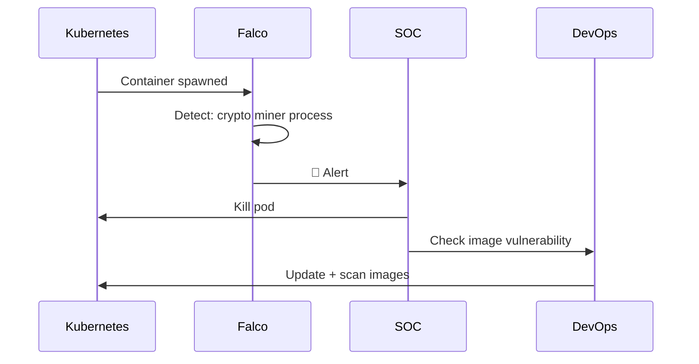

# Playbook: Cryptomining Response

**ID**: PB-31
**Severity**: Medium/High | **Category**: Resource Abuse
**MITRE ATT&CK**: [T1496](https://attack.mitre.org/techniques/T1496/) (Resource Hijacking)
**Trigger**: EDR alert (crypto miner), Cloud billing anomaly, SIEM (Stratum protocol), CPU alert

### Detection Flow



### Cloud Remediation



---

## Decision Flow

```mermaid
graph TD
    Alert["🚨 High CPU/GPU Usage"] --> Source{"🖥️ Where?"}
    Source -->|Cloud Instance (EC2/VM)| Cloud["☁️ Cloud Billing Check"]
    Source -->|On-Prem Server| Server["🔍 Process Analysis"]
    Source -->|Endpoint (Workstation)| Endpoint["👤 User Activity Check"]
    Source -->|Container / K8s| Container["🐳 Image Audit"]
    Cloud --> Process{"⛏️ Mining Binary?"}
    Server --> Process
    Endpoint --> Process
    Container --> Process
    Process -->|xmrig/minerd/etc| Confirmed["🔴 Cryptomining Confirmed"]
    Process -->|Unknown Binary| Hash["🔍 Hash Check + Network"]
    Hash -->|Mining Pool Connection| Confirmed
    Hash -->|No Pool, High CPU| Legit["🟡 Investigate Further"]
    Confirmed --> Entry{"🚪 Entry Vector?"}
    Entry -->|Vulnerable App| Exploit["🔴 Deeper Compromise"]
    Entry -->|Compromised Creds| Creds["🔴 IAM Compromise"]
    Entry -->|Malicious Image| Supply["🟠 Supply Chain"]
    Exploit --> Full["🔒 Full IR Response"]
    Creds --> Full
```

---

## 1. Analysis

### 1.1 Known Mining Binaries & Tools

| Binary | Cryptocurrency | Indicators |
|:---|:---|:---|
| `xmrig` | Monero (XMR) | High CPU, connects to *pool domains |
| `minerd` | Various | Legacy CPU miner |
| `ccminer` | Various | GPU miner |
| `phoenixminer` | Ethereum | GPU miner |
| `t-rex` | Various | GPU miner |
| `nbminer` | Various | GPU miner |
| `cryptonight` | Monero | In-memory, library-based |
| Browser-based (Coinhive-style) | Monero | JavaScript, WebSocket connections |

### 1.2 Mining Pool Indicators

| Indicator | Examples |
|:---|:---|
| **Domains** | `*pool.com`, `*xmr.*`, `*mining.*`, `*hashvault.*`, `*nanopool.*` |
| **Ports** | 3333, 4444, 5555, 8333, 14444, 45700 |
| **Protocols** | Stratum (`stratum+tcp://`), JSON-RPC |
| **User-Agent** | Contains mining software name |

### 1.3 Investigation Checklist

| Check | How | Done |
|:---|:---|:---:|
| Identify specific process/binary | EDR / `top` / Task Manager | ☐ |
| File hash of mining binary | EDR / `sha256sum` | ☐ |
| Network connections to mining pools | Netflow / VPC Flow / EDR | ☐ |
| How was it installed? (entry vector) | Timeline analysis | ☐ |
| Persistence mechanism? (cron, service, container restart) | System inspection | ☐ |
| Cloud billing impact | Cost Explorer / Billing | ☐ |
| Is this the only compromised system? | Search for same hash/connections | ☐ |
| Were other actions taken? (not just mining) | Full forensic review | ☐ |

---

## 2. Containment

### 2.1 Immediate Actions

| # | Action | Done |
|:---:|:---|:---:|
| 1 | **Kill** mining process | ☐ |
| 2 | **Block** mining pool domains/IPs at firewall/DNS | ☐ |
| 3 | **Block** common mining ports (3333, 4444, 5555, 8333) | ☐ |
| 4 | **Isolate** the system if entry via exploit (deeper compromise) | ☐ |
| 5 | **Suspend** unauthorized cloud instances | ☐ |

### 2.2 Cloud-Specific

| # | Action | Done |
|:---:|:---|:---:|
| 1 | Terminate unauthorized instances (esp. GPU, spot) | ☐ |
| 2 | Disable compromised IAM access keys | ☐ |
| 3 | Check for instances in ALL regions | ☐ |
| 4 | Set billing alerts and budgets | ☐ |

---

## 3. Eradication

| # | Action | Done |
|:---:|:---|:---:|
| 1 | Delete mining binary and configuration files | ☐ |
| 2 | Remove persistence (crontab, systemd, scheduled task, Docker restart policy) | ☐ |
| 3 | Patch entry vector (vulnerable app, exposed SSH/RDP) | ☐ |
| 4 | Reset compromised credentials | ☐ |
| 5 | Audit container images for embedded miners | ☐ |
| 6 | Full AV/EDR scan | ☐ |

---

## 4. Recovery

| # | Action | Done |
|:---:|:---|:---:|
| 1 | Verify CPU/GPU returns to normal | ☐ |
| 2 | File cloud provider support request for unauthorized usage credits | ☐ |
| 3 | Add detection rules for mining pool connections | ☐ |
| 4 | Add CPU anomaly detection (sustained >90%) | ☐ |
| 5 | Implement egress filtering (block non-business ports) | ☐ |
| 6 | Monitor for 72 hours | ☐ |

---

## 5. IoC Collection

| Type | Value | Source |
|:---|:---|:---|
| Mining binary hash | | EDR / Filesystem |
| Mining pool domain/IP | | DNS / Netflow |
| Wallet address (Monero/ETH) | | Config file |
| Entry vector (CVE / exposed port) | | Investigation |
| Persistence mechanism | | System inspection |
| Cloud instances launched | | CloudTrail / Billing |

---

## 6. Escalation Criteria

| Condition | Escalate To |
|:---|:---|
| Entry via exploit (not just mining — deeper compromise) | Tier 2 + [PB-18 Exploit](Exploit.en.md) |
| Multiple systems mining | Major Incident |
| Cloud billing spike > $500 | Finance + Cloud team |
| Container image compromised (supply chain) | [PB-32 Supply Chain](Supply_Chain_Attack.en.md) |
| Insider deployed miner intentionally | [PB-14 Insider Threat](Insider_Threat.en.md) |
| C2 communication alongside mining | [PB-13 C2](C2_Communication.en.md) |

---

### Mining Pool Detection



### Container Security



## Related Documents

- [IR Framework](../Framework.en.md)
- [Incident Report](../../templates/incident_report.en.md)
- [PB-03 Malware Infection](Malware_Infection.en.md)
- [PB-18 Exploit](Exploit.en.md)
- [PB-22 AWS EC2](AWS_EC2_Compromise.en.md)

## References

- [MITRE ATT&CK T1496 — Resource Hijacking](https://attack.mitre.org/techniques/T1496/)
- [Red Canary — Cryptominer Detection](https://redcanary.com/threat-detection-report/threats/cryptominers/)
- [CISA — Cryptomining Malware](https://www.cisa.gov/news-events/alerts)
