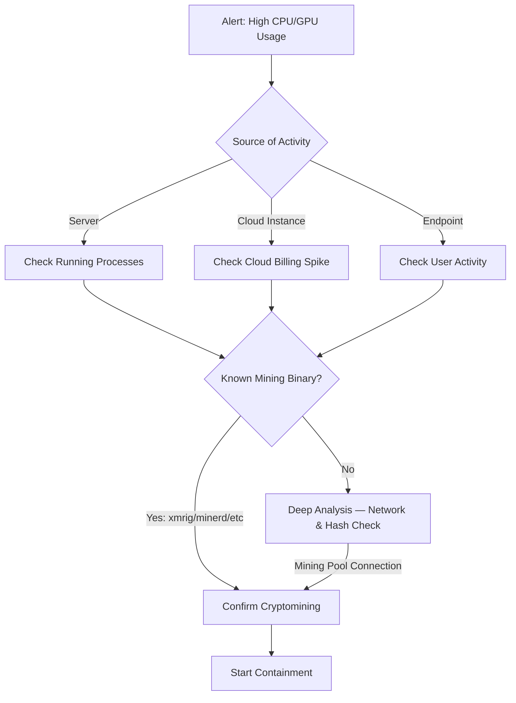

# Playbook: Cryptomining Response

**Severity**: Medium | **Category**: Resource Abuse

## 1. Analysis (Triage)

-   **CPU/GPU Anomaly**: Identify the process or container consuming abnormal CPU/GPU resources (>90% sustained).
-   **Process Analysis**: Check for known mining binaries (xmrig, minerd, ccminer, phoenixminer) or suspicious processes with randomized names.
-   **Network Connections**: Look for connections to known mining pool domains/ports (e.g., `*pool.com`, `*xmr.*`, ports 3333, 4444, 5555, 8333).
-   **Cloud Billing**: Check for unexpected cost spikes in cloud billing (new instances, GPU instances, spot instances).
-   **Entry Vector**: Determine how the miner was installed — vulnerable web app, compromised credentials, Docker image, or supply chain.

## 2. Containment
-   **Kill Process**: Terminate the mining process immediately.
-   **Block Pool**: Add mining pool domains/IPs to Firewall/Proxy blocklist.
-   **Isolate System**: Network-isolate if the miner was installed via an exploit (indicates deeper compromise).
-   **Suspend Cloud Resources**: Terminate unauthorized cloud instances spawned for mining.
-   **Block Ports**: Block common mining ports (3333, 4444, 5555, 8333, 14444) at the firewall.

## 3. Remediation
-   **Remove Malware**: Delete the mining binary and all associated files (config files, persistence mechanisms).
-   **Check Persistence**: Look for crontabs, scheduled tasks, systemd services, or container restart policies that re-launch the miner.
-   **Patch Entry Point**: Fix the vulnerability or misconfiguration that allowed the miner to be installed.
-   **Credential Reset**: Reset credentials if the miner was installed via compromised accounts.
-   **Container Audit**: If running in containers, audit all images for embedded miners.

## 4. Recovery
-   **Restore Performance**: Verify CPU/GPU usage returns to normal after remediation.
-   **Cost Recovery**: File a support request with the cloud provider for unauthorized usage credits.
-   **Detection Rules**: Add monitoring for mining pool connections and abnormal CPU patterns.

## Related Documents
-   [Incident Response Framework](../Framework.en.md)
-   [Malware Infection Playbook](Malware_Infection.en.md)
-   [Exploit Playbook](Exploit.en.md)
-   [Incident Report Template](../../templates/incident_report.en.md)
-   [Shift Handover Log](../../templates/shift_handover.en.md)

## References
-   [MITRE ATT&CK T1496 — Resource Hijacking](https://attack.mitre.org/techniques/T1496/)
-   [Red Canary — Cryptomining Detection](https://redcanary.com/threat-detection-report/threats/cryptominers/)
-   [CISA Alert — Cryptomining Malware](https://www.cisa.gov/news-events/alerts)
