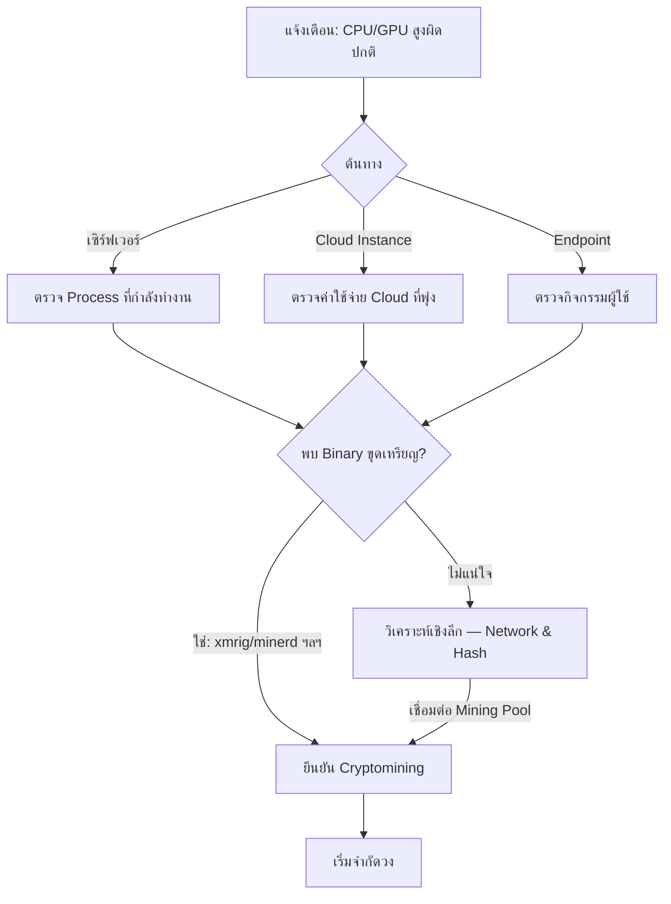

# Playbook: การตอบสนองต่อ Cryptomining (การขุดเหรียญเข้ารหัสลับ)

**ความรุนแรง**: ปานกลาง | **หมวดหมู่**: Resource Abuse

## 1. การวิเคราะห์ (Triage)

-   **CPU/GPU ผิดปกติ**: ระบุ Process หรือ Container ที่กิน CPU/GPU สูงผิดปกติ (>90% ต่อเนื่อง)
-   **วิเคราะห์ Process**: ค้นหา Binary ขุดเหรียญที่รู้จัก (xmrig, minerd, ccminer, phoenixminer) หรือ Process ชื่อแปลก
-   **ตรวจ Network**: หาการเชื่อมต่อไปยัง Mining Pool (เช่น `*pool.com`, `*xmr.*`, Port 3333, 4444, 5555, 8333)
-   **ค่าใช้จ่าย Cloud**: ตรวจสอบค่าใช้จ่าย Cloud ที่พุ่งสูงผิดปกติ (Instance ใหม่, GPU Instance)
-   **ช่องทางเข้า**: หาว่า Miner ถูกติดตั้งอย่างไร — Web App มีช่องโหว่, Credential ถูกแฮก, Docker Image หรือ Supply Chain

## 2. การจำกัดวง (Containment)
-   **Kill Process**: หยุด Process ขุดเหรียญทันที
-   **บล็อก Pool**: เพิ่ม Domain/IP ของ Mining Pool เข้า Blocklist ใน Firewall/Proxy
-   **แยกระบบ**: Network-isolate ถ้า Miner ถูกติดตั้งผ่าน Exploit (อาจมีการ Compromise ลึกกว่า)
-   **หยุด Cloud Resource**: ปิด Cloud Instance ที่ถูกสร้างมาเพื่อขุดเหรียญโดยไม่ได้รับอนุญาต
-   **บล็อก Port**: บล็อก Port ที่ใช้ขุดเหรียญ (3333, 4444, 5555, 8333, 14444)

## 3. การแก้ไข (Remediation)
-   **ลบมัลแวร์**: ลบ Mining Binary และไฟล์ที่เกี่ยวข้องทั้งหมด (Config File, กลไก Persistence)
-   **ตรวจ Persistence**: ค้นหา Crontab, Scheduled Task, Systemd Service หรือ Container Restart Policy
-   **Patch จุดเข้า**: แก้ช่องโหว่หรือการตั้งค่าผิดที่ทำให้ Miner ถูกติดตั้งได้
-   **เปลี่ยนรหัส**: Reset Credential ถ้า Miner ถูกติดตั้งผ่านบัญชีที่ถูก Compromise
-   **ตรวจ Container**: ถ้ารันใน Container ให้ตรวจทุก Image ว่ามี Miner ฝังอยู่หรือไม่

## 4. การกู้คืน (Recovery)
-   **คืนสภาพ**: ยืนยันว่า CPU/GPU กลับสู่ปกติหลังแก้ไข
-   **ขอคืนค่าใช้จ่าย**: ยื่นคำร้องกับ Cloud Provider เพื่อขอเครดิตคืนจากการใช้งานที่ไม่ได้อนุญาต
-   **เพิ่ม Detection Rule**: เพิ่มการเฝ้าระวัง Mining Pool Connection และ CPU Pattern ผิดปกติ

## เอกสารที่เกี่ยวข้อง (Related Documents)
-   [กรอบ Incident Response](../Framework.th.md)
-   [Playbook: Malware Infection](Malware_Infection.th.md)
-   [Playbook: Exploit](Exploit.th.md)
-   [แบบฟอร์มรายงาน Incident](../../templates/incident_report.th.md)
-   [แบบฟอร์มส่งมอบกะ](../../templates/shift_handover.th.md)

## References
-   [MITRE ATT&CK T1496 — Resource Hijacking](https://attack.mitre.org/techniques/T1496/)
-   [Red Canary — Cryptomining Detection](https://redcanary.com/threat-detection-report/threats/cryptominers/)
-   [CISA Alert — Cryptomining Malware](https://www.cisa.gov/news-events/alerts)
