# Playbook: Denial of Service (DDoS)

**ID**: PB-09
**Severity**: High/Critical | **Category**: Availability
**MITRE ATT&CK**: [T1498](https://attack.mitre.org/techniques/T1498/) (Network DoS), [T1499](https://attack.mitre.org/techniques/T1499/) (Endpoint DoS)
**Trigger**: Monitoring alert (high CPU/bandwidth), WAF logs (flood detected), User reports (service unavailable)

---

## Decision Flow

```mermaid
graph TD
    Alert["🚨 High Traffic / Service Down"] --> Verify{"📊 Legitimate Spike?"}
    Verify -->|Marketing Campaign / Launch| Scale["⬆️ Scale Up Resources"]
    Verify -->|No Known Cause| Analyze{"🔍 Attack Type?"}
    Analyze -->|Volumetric| Vol["🌊 UDP/ICMP/SYN Flood"]
    Analyze -->|Protocol| Proto["⚙️ SYN/ACK Exploit"]
    Analyze -->|Application| App["🌐 HTTP GET/POST Flood"]
    Vol --> ISP["📞 Contact ISP / CDN"]
    Proto --> FW["🛡️ Firewall Rate Limit"]
    App --> WAF["🔒 WAF Under-Attack Mode"]
    ISP --> Monitor["📊 Monitor Recovery"]
    FW --> Monitor
    WAF --> Monitor
    Monitor --> Stable{"Service Stable?"}
    Stable -->|Yes| PostInc["📝 Post-Incident"]
    Stable -->|No| Blackhole["🕳️ Blackhole / Null Route"]
```

---

## 1. Analysis (Triage)

### 1.1 Attack Classification

| Type | Characteristics | Layer | Common Tools |
|:---|:---|:---|:---|
| **Volumetric** | UDP/ICMP/DNS amplification flood | L3/L4 | Booters, botnets |
| **Protocol** | SYN flood, fragmented packet attack | L4 | hping3, custom tools |
| **Application** | HTTP GET/POST flood, Slowloris | L7 | LOIC, Slowloris, custom |
| **Multi-vector** | Combination of above | L3-L7 | Sophisticated actors |

### 1.2 Initial Assessment

| Check | How | Done |
|:---|:---|:---:|
| Confirm service impact | Synthetic monitoring, user reports | ☐ |
| Identify attack type | Traffic analysis (protocol, port, payload) | ☐ |
| Determine target | Specific IP, URL path, or application? | ☐ |
| Measure bandwidth | Current vs baseline throughput | ☐ |
| Check source distribution | Single IP, botnet, or amplification? | ☐ |
| Rule out legitimate traffic | Marketing campaigns, product launches? | ☐ |

### 1.3 Impact Assessment

| Service | Status | Users Affected | Business Impact |
|:---|:---|:---|:---|
| Web application | ☐ Up / ☐ Degraded / ☐ Down | | |
| API endpoints | ☐ Up / ☐ Degraded / ☐ Down | | |
| Email/DNS | ☐ Up / ☐ Degraded / ☐ Down | | |
| VPN/Remote access | ☐ Up / ☐ Degraded / ☐ Down | | |

---

## 2. Containment

### 2.1 Immediate Mitigation (within 5 minutes)

| # | Action | Tool | Done |
|:---:|:---|:---|:---:|
| 1 | Enable "Under Attack" mode | Cloudflare / Akamai / AWS Shield | ☐ |
| 2 | Activate DDoS protection rules | WAF | ☐ |
| 3 | Rate-limit by GeoIP (block non-business countries) | Firewall / CDN | ☐ |
| 4 | Enable CAPTCHA challenge | CDN / WAF | ☐ |
| 5 | Block top attacking IPs / CIDR blocks | Firewall | ☐ |

### 2.2 If Pipe Saturated (Volumetric)

| # | Action | Done |
|:---:|:---|:---:|
| 1 | Contact ISP for upstream filtering | ☐ |
| 2 | Request null-route/blackhole for targeted IP (last resort) | ☐ |
| 3 | Activate CDN / scrubbing center if not already in use | ☐ |
| 4 | Failover to DR site if primary is unreachable | ☐ |

### 2.3 If Application Layer (L7)

| # | Action | Done |
|:---:|:---|:---:|
| 1 | Identify and block attack pattern (User-Agent, URI, header) | ☐ |
| 2 | Deploy JavaScript challenge / CAPTCHA | ☐ |
| 3 | Increase connection timeouts, limit concurrent connections | ☐ |
| 4 | Scale backend servers (auto-scaling groups) | ☐ |

---

## 3. Communication

| Stakeholder | When | Channel | Message |
|:---|:---|:---|:---|
| IT Operations | Immediately | Chat + Phone | Service impact details |
| SOC Lead | Within 5 minutes | Chat | Attack classification |
| Business stakeholders | Within 15 minutes | Email | Service status update |
| Customers (if public-facing) | Within 30 minutes | Status page | Incident acknowledgment |
| Executive team | If extended (>1 hour) | Briefing | Business impact summary |

---

## 4. Recovery

| # | Action | Done |
|:---:|:---|:---:|
| 1 | Gradually relax mitigation rules | ☐ |
| 2 | Monitor for attack resumption (often comes in waves) | ☐ |
| 3 | Validate service health via synthetic monitoring | ☐ |
| 4 | Scale down temporary resources after 2 hours stability | ☐ |
| 5 | Update status page / notify stakeholders of resolution | ☐ |

---

## 5. IoC Collection

| Type | Value | Source |
|:---|:---|:---|
| Top attacking IPs | | Firewall / CDN |
| Attack bandwidth (Gbps) | | Network monitoring |
| Attack protocol/port | | Traffic analysis |
| Target IP / URL | | WAF / Server logs |
| Attack duration | | Monitoring |
| User-Agent patterns (L7) | | WAF logs |

---

## 6. Escalation Criteria

| Condition | Escalate To |
|:---|:---|
| Service down > 30 minutes | SOC Manager + IT Director |
| Attack > 10 Gbps | ISP + CDN provider |
| Revenue-generating service affected | Business unit + Executive |
| Ransom demand received (RDoS) | CISO + Legal |
| Attack combined with other indicators (ransomware, intrusion) | Major Incident response |

---

## Related Documents

- [IR Framework](../Framework.en.md)
- [Incident Report](../../templates/incident_report.en.md)
- [Disaster Recovery / BCP](../Disaster_Recovery_BCP.en.md)

## References

- [MITRE ATT&CK T1498 — Network Denial of Service](https://attack.mitre.org/techniques/T1498/)
- [CISA DDoS Quick Guide](https://www.cisa.gov/sites/default/files/publications/ddos-quick-guide.pdf)
- [Cloudflare DDoS Trends](https://radar.cloudflare.com/security-and-attacks)
