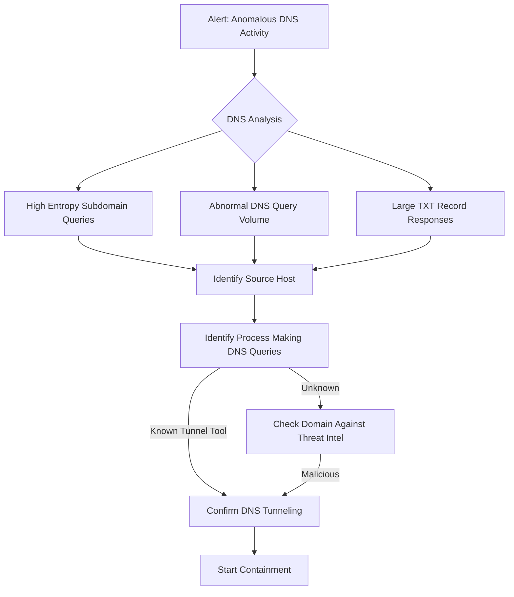

# Playbook: DNS Tunneling Response

**Severity**: High | **Category**: Data Exfiltration / C2

## 1. Analysis (Triage)

-   **DNS Query Analysis**: Look for high-entropy subdomain queries (long, random-looking strings like `aGVsbG8gd29ybGQ.evil.com`), excessive query volume to a single domain, or unusually large TXT/NULL/CNAME responses.
-   **Source Host**: Identify the endpoint making the DNS queries from DNS server logs or EDR telemetry.
-   **Process Identification**: Use EDR to find the process generating the DNS traffic (e.g., iodine, dnscat2, dns2tcp, or custom malware).
-   **Domain Analysis**: Check if the destination domain is newly registered, uses a free DNS provider, or appears in Threat Intel feeds.
-   **Data Volume**: Estimate the volume of data potentially exfiltrated by analyzing query payload sizes.

## 2. Containment
-   **Block Domain**: Add the tunneling domain to the DNS sinkhole/blocklist.
-   **Isolate Host**: Network-isolate the source endpoint to prevent further data exfiltration.
-   **DNS Filtering**: If not already in place, route all DNS through a filtering DNS resolver (e.g., Cisco Umbrella, Cloudflare Gateway).
-   **Block Direct DNS**: Block outbound DNS (port 53/853) to any server other than your approved resolvers at the firewall.

## 3. Remediation
-   **Remove Malware**: Remove the DNS tunneling tool/malware from the compromised host.
-   **Forensic Analysis**: Determine what data was exfiltrated through the DNS tunnel. Reconstruct the payloads if possible.
-   **Credential Reset**: Reset credentials for any accounts on the compromised host.
-   **DNS Security**: Implement DNS monitoring and Response Policy Zones (RPZ) if not already deployed.

## 4. Recovery
-   **Restore Host**: Rebuild or restore the compromised host from a known-good backup.
-   **Detection Rules**: Add detection for high-entropy DNS queries, excessive NXDOMAIN responses, and anomalous TXT record sizes.
-   **DNS Logging**: Ensure full DNS query logging is enabled and forwarded to SIEM.

## Related Documents
-   [Incident Response Framework](../Framework.en.md)
-   [Data Exfiltration Playbook](Data_Exfiltration.en.md)
-   [C2 Communication Playbook](C2_Communication.en.md)
-   [Incident Report Template](../../templates/incident_report.en.md)
-   [Shift Handover Log](../../templates/shift_handover.en.md)

## References
-   [MITRE ATT&CK T1071.004 — Application Layer Protocol: DNS](https://attack.mitre.org/techniques/T1071/004/)
-   [MITRE ATT&CK T1048.003 — Exfiltration Over Alternative Protocol](https://attack.mitre.org/techniques/T1048/003/)
-   [SANS — Detecting DNS Tunneling](https://www.sans.org/white-papers/detecting-dns-tunneling/)
-   [Infoblox — DNS Tunneling Detection](https://www.infoblox.com/dns-security-resource-center/dns-tunneling/)
