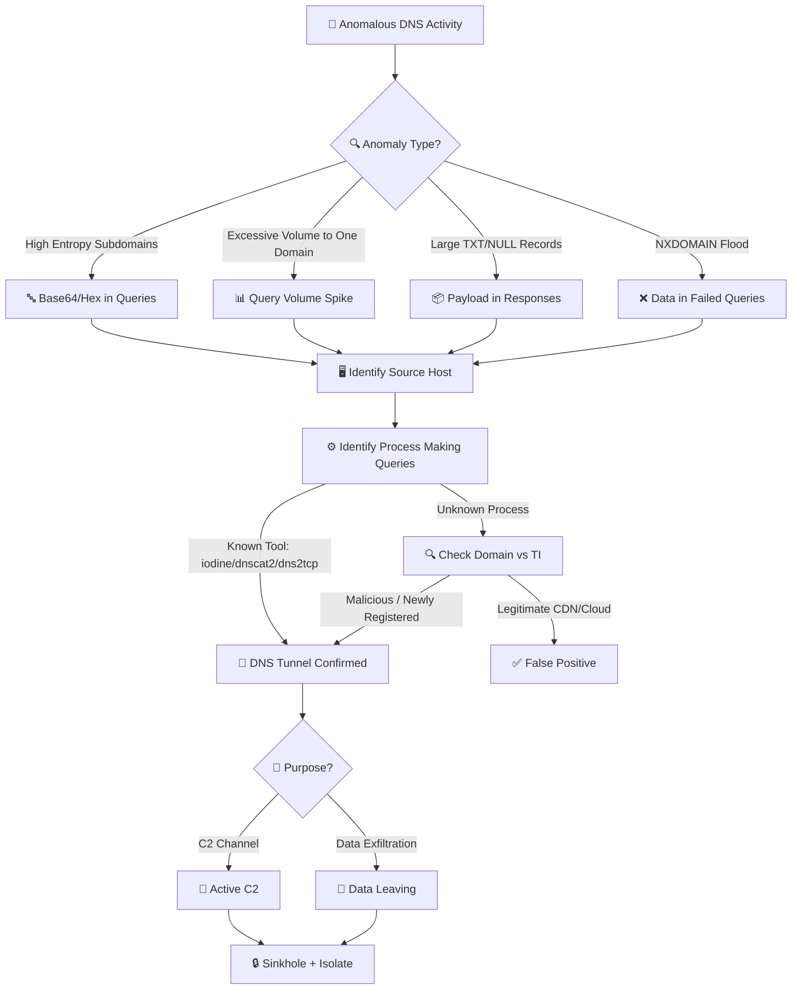
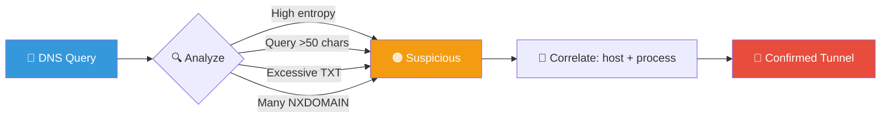
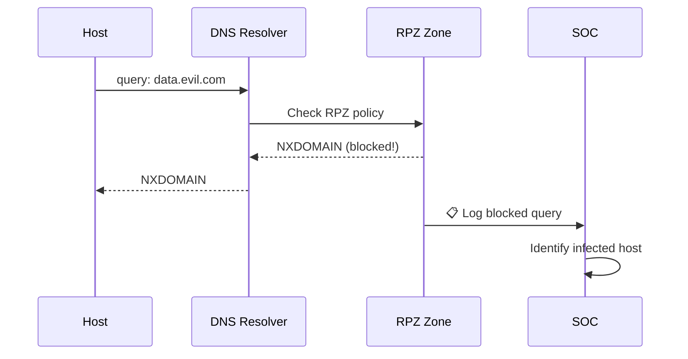
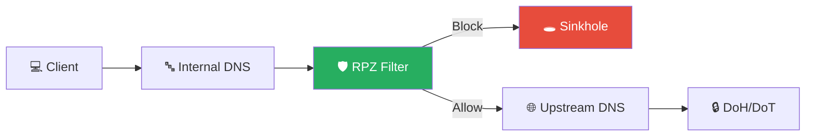
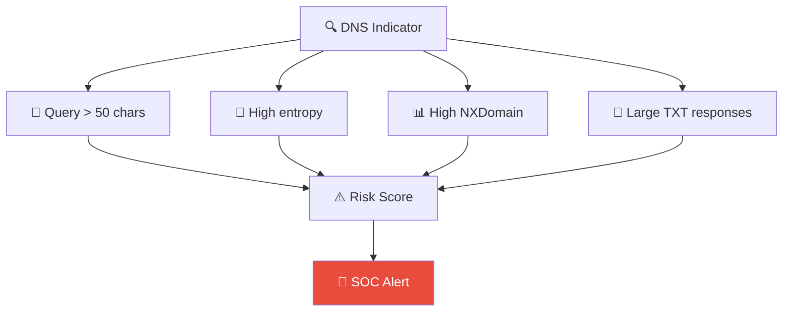

# Playbook: DNS Tunneling Response

**ID**: PB-25
**Severity**: High | **Category**: Data Exfiltration / C2
**MITRE ATT&CK**: [T1071.004](https://attack.mitre.org/techniques/T1071/004/) (Application Layer Protocol: DNS), [T1048.003](https://attack.mitre.org/techniques/T1048/003/) (Exfiltration Over Alternative Protocol)
**Trigger**: DNS anomaly detection (high entropy queries), SIEM correlation, DNS firewall alert, UEBA baseline deviation

---

## Decision Flow

---

## 1. Analysis

### 1.1 Known DNS Tunneling Tools

| Tool | Protocol | Indicators |
|:---|:---|:---|
| **iodine** | NULL / CNAME | Long A/AAAA subdomains, `topdns.xyz` |
| **dnscat2** | TXT / CNAME | High-entropy subdomains, session IDs |
| **dns2tcp** | TXT | Base64 encoded subdomains |
| **Cobalt Strike DNS** | A / AAAA / TXT | Short polling queries, beacon pattern |
| **Custom malware** | Various | Varies — look for patterns |

### 1.2 DNS Anomaly Indicators

| Indicator | Normal | Suspicious | Detection |
|:---|:---|:---|:---|
| **Subdomain length** | < 30 chars | > 50 chars, looks random | DNS log analysis |
| **Query volume to single domain** | < 100/hr | > 1000/hr | SIEM threshold |
| **TXT record response size** | < 200 bytes | > 500 bytes | DNS log analysis |
| **NXDOMAIN ratio** | < 5% | > 30% | SIEM baseline |
| **Query entropy** | Low (readable) | High (Base64/hex) | Shannon entropy calc |
| **Domain registration age** | > 1 year | < 30 days | WHOIS |
| **Unique subdomains** | Few (www, mail) | Thousands of unique | DNS log aggregation |

### 1.3 Investigation Checklist

| Check | How | Done |
|:---|:---|:---:|
| Source host generating DNS queries | DNS server logs / EDR | ☐ |
| Process responsible for queries | EDR Sysmon Event ID 22 | ☐ |
| Destination domain — who owns it? | WHOIS, VirusTotal | ☐ |
| Domain age — newly registered? | WHOIS | ☐ |
| Query payload analysis (decode Base64/hex) | CyberChef, manual | ☐ |
| Volume of data potentially exfiltrated | Query count × avg payload | ☐ |
| Is direct DNS (port 53) to external used? | Firewall logs | ☐ |
| Other hosts querying same domain? | DNS log search | ☐ |

---

## 2. Containment

### 2.1 Immediate Actions

| # | Action | Tool | Done |
|:---:|:---|:---|:---:|
| 1 | **Sinkhole** the tunneling domain | DNS server / RPZ | ☐ |
| 2 | **Isolate** the source host | EDR / Network | ☐ |
| 3 | **Block** the domain at DNS filtering (Umbrella, CF Gateway) | DNS proxy | ☐ |
| 4 | **Block direct DNS** — force all DNS through corporate resolvers | Firewall: block outbound 53/853 except approved | ☐ |

### 2.2 If C2 Channel

| # | Action | Done |
|:---:|:---|:---:|
| 1 | Check for additional implants on the host | ☐ |
| 2 | Escalate to [PB-13 C2 Communication](C2_Communication.en.md) | ☐ |
| 3 | Search for same C2 domain across all DNS logs | ☐ |

---

## 3. Eradication

| # | Action | Done |
|:---:|:---|:---:|
| 1 | Remove DNS tunneling tool / malware from host | ☐ |
| 2 | Remove persistence mechanisms | ☐ |
| 3 | Reset credentials for accounts on compromised host | ☐ |
| 4 | Full AV/EDR scan | ☐ |

---

## 4. Recovery

| # | Action | Done |
|:---:|:---|:---:|
| 1 | Rebuild / restore host from known-good backup | ☐ |
| 2 | Implement DNS monitoring and Response Policy Zones (RPZ) | ☐ |
| 3 | Route ALL DNS through filtering resolver | ☐ |
| 4 | Block direct DNS (53/853) to external at firewall | ☐ |
| 5 | Enable full DNS query logging → SIEM | ☐ |
| 6 | Add detection rules (high-entropy, excessive NXDOMAIN, TXT size) | ☐ |
| 7 | Monitor for 72 hours | ☐ |

### DNS Tunnel Detection

### RPZ Sinkhole Flow

---

## 5. IoC Collection

| Type | Value | Source |
|:---|:---|:---|
| Tunneling domain | | DNS logs |
| Domain registrant | | WHOIS |
| Source host | | DNS server / EDR |
| Process name / hash | | EDR |
| Decoded payload samples | | DNS analysis |
| Data volume exfiltrated (estimate) | | Query analysis |

---

## 6. Escalation Criteria

| Condition | Escalate To |
|:---|:---|
| Active C2 via DNS | [PB-13 C2](C2_Communication.en.md) + Tier 2 |
| Sensitive data exfiltrated | [PB-08 Data Exfiltration](Data_Exfiltration.en.md) + Legal |
| Multiple hosts using same tunnel domain | Major Incident |
| Direct DNS bypassing corporate resolvers | Network team urgently |
| Cobalt Strike DNS beacon | Tier 2 + Threat Hunt |
| PII in exfiltrated data | DPO (PDPA 72h) |

---

### DNS Security Architecture

### DNS-based C2 Indicators

## Related Documents

- [IR Framework](../Framework.en.md)
- [Incident Report](../../templates/incident_report.en.md)
- [PB-08 Data Exfiltration](Data_Exfiltration.en.md)
- [PB-13 C2 Communication](C2_Communication.en.md)

## References

- [MITRE ATT&CK T1071.004 — Application Layer Protocol: DNS](https://attack.mitre.org/techniques/T1071/004/)
- [MITRE ATT&CK T1048.003 — Exfiltration Over Alternative Protocol](https://attack.mitre.org/techniques/T1048/003/)
- [SANS — Detecting DNS Tunneling](https://www.sans.org/white-papers/detecting-dns-tunneling/)
- [Infoblox — DNS Tunneling Detection](https://www.infoblox.com/dns-security-resource-center/dns-tunneling/)
