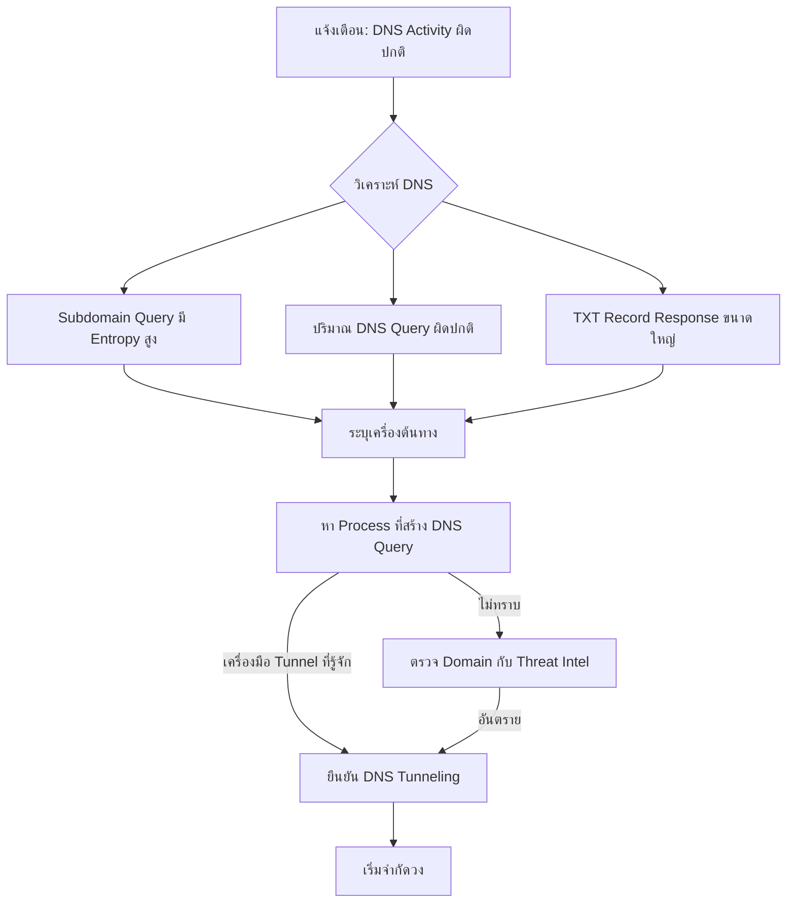

# Playbook: การตอบสนองต่อ DNS Tunneling (การส่งข้อมูลผ่าน DNS)

**ความรุนแรง**: สูง | **หมวดหมู่**: Data Exfiltration / C2

## 1. การวิเคราะห์ (Triage)

-   **วิเคราะห์ DNS Query**: ค้นหา Subdomain Query ที่มี Entropy สูง (สตริงยาว สุ่ม เช่น `aGVsbG8gd29ybGQ.evil.com`), ปริมาณ Query สูงผิดปกติไปยัง Domain เดียว หรือ TXT/NULL/CNAME Response ขนาดใหญ่ผิดปกติ
-   **เครื่องต้นทาง**: ระบุ Endpoint ที่สร้าง DNS Query จาก DNS Server Log หรือ EDR Telemetry
-   **ระบุ Process**: ใช้ EDR หา Process ที่สร้าง DNS Traffic (เช่น iodine, dnscat2, dns2tcp หรือมัลแวร์ Custom)
-   **วิเคราะห์ Domain**: ตรวจว่า Domain ปลายทางจดทะเบียนใหม่หรือไม่ ใช้ DNS Provider ฟรีหรือไม่ หรือปรากฏใน Threat Intel Feed
-   **ปริมาณข้อมูล**: ประเมินปริมาณข้อมูลที่อาจรั่วไหลจากขนาด Payload ของ Query

## 2. การจำกัดวง (Containment)
-   **บล็อก Domain**: เพิ่ม Domain ที่ใช้ Tunneling เข้า DNS Sinkhole/Blocklist
-   **แยกเครื่อง**: Network-isolate Endpoint ต้นทางเพื่อป้องกันการรั่วไหลเพิ่มเติม
-   **กรอง DNS**: ถ้ายังไม่มี ให้ Route DNS ทั้งหมดผ่าน Filtering DNS Resolver (เช่น Cisco Umbrella, Cloudflare Gateway)
-   **บล็อก Direct DNS**: บล็อก Outbound DNS (Port 53/853) ไปยังเซิร์ฟเวอร์อื่นนอกจาก Resolver ที่อนุมัติที่ Firewall

## 3. การแก้ไข (Remediation)
-   **ลบมัลแวร์**: ลบเครื่องมือ DNS Tunneling/มัลแวร์ออกจากเครื่องที่ถูก Compromise
-   **วิเคราะห์ Forensic**: ตรวจสอบว่าข้อมูลอะไรถูกส่งออกผ่าน DNS Tunnel สร้าง Payload ใหม่ถ้าเป็นไปได้
-   **เปลี่ยนรหัส**: Reset Credential สำหรับทุกบัญชีบนเครื่องที่ถูก Compromise
-   **DNS Security**: ติดตั้ง DNS Monitoring และ Response Policy Zones (RPZ) ถ้ายังไม่มี

## 4. การกู้คืน (Recovery)
-   **กู้คืนเครื่อง**: Rebuild หรือ Restore เครื่องที่ถูก Compromise จาก Backup ที่ปลอดภัย
-   **เพิ่ม Detection Rule**: ตรวจจับ DNS Query ที่มี Entropy สูง, NXDOMAIN Response จำนวนมาก และ TXT Record Size ผิดปกติ
-   **DNS Logging**: ให้แน่ใจว่ามีการ Log DNS Query ครบถ้วนและส่งไป SIEM

## เอกสารที่เกี่ยวข้อง (Related Documents)
-   [กรอบ Incident Response](../Framework.th.md)
-   [Playbook: Data Exfiltration](Data_Exfiltration.th.md)
-   [Playbook: C2 Communication](C2_Communication.th.md)
-   [แบบฟอร์มรายงาน Incident](../../templates/incident_report.th.md)
-   [แบบฟอร์มส่งมอบกะ](../../templates/shift_handover.th.md)

## References
-   [MITRE ATT&CK T1071.004 — Application Layer Protocol: DNS](https://attack.mitre.org/techniques/T1071/004/)
-   [MITRE ATT&CK T1048.003 — Exfiltration Over Alternative Protocol](https://attack.mitre.org/techniques/T1048/003/)
-   [SANS — Detecting DNS Tunneling](https://www.sans.org/white-papers/detecting-dns-tunneling/)
-   [Infoblox — DNS Tunneling Detection](https://www.infoblox.com/dns-security-resource-center/dns-tunneling/)
