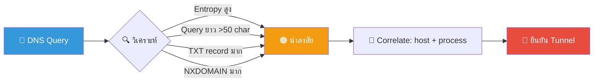
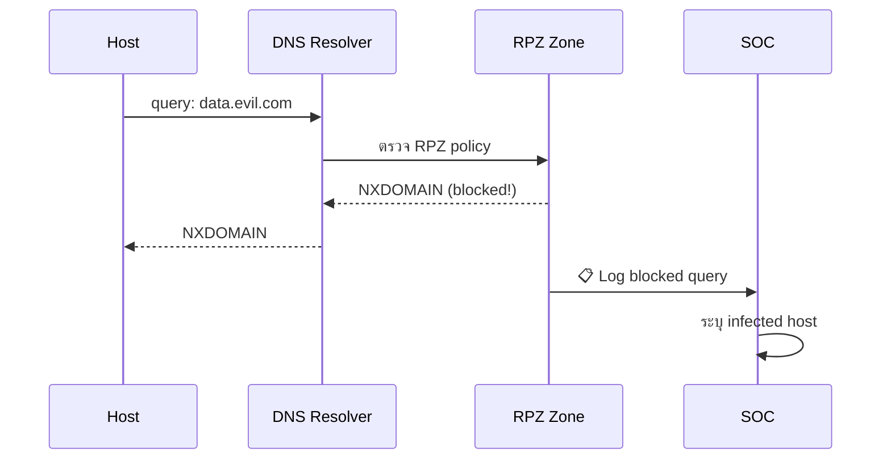
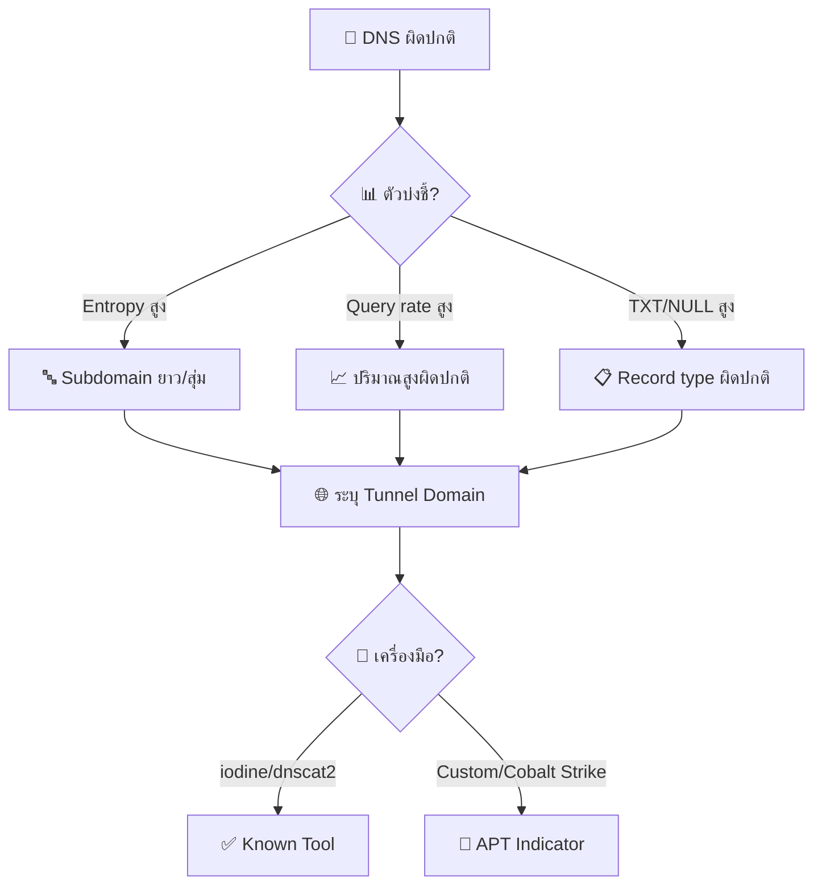
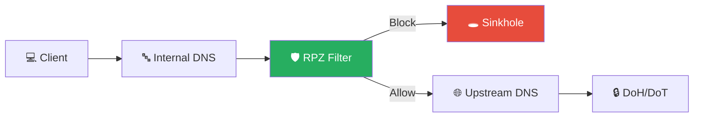
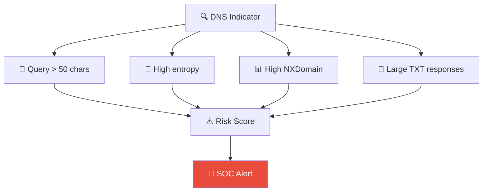

# Playbook: DNS Tunneling

**ID**: PB-25
**ระดับความรุนแรง**: สูง | **หมวดหมู่**: เครือข่าย / การนำข้อมูลออก
**MITRE ATT&CK**: [T1071.004](https://attack.mitre.org/techniques/T1071/004/) (Application Layer Protocol: DNS)
**ทริกเกอร์**: DNS analytics alert (high entropy), SIEM (excessive NXDOMAIN/TXT), IDS/IPS signature

### ผังการตรวจจับ DNS Tunneling

### ผังขั้นตอน RPZ Sinkhole

---

## ผังการตัดสินใจ

---

## 1. การวิเคราะห์

### 1.1 ตัวบ่งชี้ DNS Tunneling

| ตัวบ่งชี้ | ค่าปกติ | ค่าน่าสงสัย | การตรวจจับ |
|:---|:---|:---|:---|
| **Subdomain length** | < 30 chars | > 50 chars | DNS analytics |
| **Shannon entropy** | < 3.5 | > 4.0 | DNS analytics |
| **Query rate** (single domain) | < 10/min | > 100/min | SIEM |
| **TXT query volume** | ต่ำ | สูงผิดปกติ | DNS logs |
| **NULL/CNAME unusual** | น้อย | มาก | DNS logs |
| **Domain จดทะเบียนใหม่** | — | < 30 วัน | WHOIS / TI |
| **Non-cached queries** | ปกติ | 100% non-cached | DNS resolver | 

### 1.2 เครื่องมือ DNS Tunnel ที่รู้จัก

| เครื่องมือ | ลักษณะ | ความรุนแรง |
|:---|:---|:---|
| **iodine** | IP-over-DNS, NULL records | 🟠 สูง |
| **dnscat2** | Encrypted C2, TXT records | 🔴 สูง |
| **DNSExfiltrator** | Data exfil, TXT/CNAME | 🔴 สูง |
| **Cobalt Strike DNS** | Beacon over DNS | 🔴 วิกฤต |
| **SUNBURST** | SolarWinds, CNAME | 🔴 วิกฤต (APT) |

### 1.3 รายการตรวจสอบ

| รายการ | วิธีตรวจสอบ | เสร็จ |
|:---|:---|:---:|
| Domain ที่ใช้ tunnel | DNS logs / analytics | ☐ |
| Source host(s) | DNS query logs | ☐ |
| Process ที่ทำ DNS queries | EDR (Sysmon Event 22) | ☐ |
| ปริมาณข้อมูลที่ส่งออก (ประมาณ) | Query volume × payload size | ☐ |
| Domain ลงทะเบียนเมื่อไหร่? | WHOIS | ☐ |
| มี host อื่นติดต่อ domain เดียวกัน? | SIEM pivot | ☐ |
| ข้อมูลอะไรถูกส่งออก? (decode payload) | Base32/Base64 decode | ☐ |

---

## 2. การควบคุม

| # | การดำเนินการ | เครื่องมือ | เสร็จ |
|:---:|:---|:---|:---:|
| 1 | **Block** tunnel domain → DNS RPZ / Sinkhole | DNS server | ☐ |
| 2 | **Isolate** source host | EDR / Network | ☐ |
| 3 | **Kill** tunnel process | EDR | ☐ |
| 4 | **Block** DoH/DoT ไปยัง external resolvers | Firewall | ☐ |
| 5 | ค้นหา host อื่นที่ query domain เดียวกัน | SIEM | ☐ |

---

## 3. การกำจัด

| # | การดำเนินการ | เสร็จ |
|:---:|:---|:---:|
| 1 | ลบ DNS tunnel tool จาก host | ☐ |
| 2 | ลบ persistence (scheduled task, startup) | ☐ |
| 3 | หมุนเวียน credentials ที่อาจถูกส่งออก | ☐ |
| 4 | ตรวจ malware อื่นบน host (EDR full scan) | ☐ |

---

## 4. การฟื้นฟู

| # | การดำเนินการ | เสร็จ |
|:---:|:---|:---:|
| 1 | **บังคับ DNS ภายในเท่านั้น** (block outbound 53/UDP ไม่ผ่าน resolver) | ☐ |
| 2 | **Block DoH/DoT** ไปยัง external providers (8.8.8.8, 1.1.1.1) | ☐ |
| 3 | เปิด **DNS analytics** / DNS firewall | ☐ |
| 4 | ตั้ง threshold alerts สำหรับ entropy > 4.0 | ☐ |
| 5 | ติดตาม 30 วัน | ☐ |

---

## 5. เกณฑ์การยกระดับ

| เงื่อนไข | ยกระดับไปยัง |
|:---|:---|
| Data exfiltration ยืนยัน | [PB-08 Data Exfiltration](Data_Exfiltration.th.md) + Legal |
| C2 over DNS (Cobalt Strike / APT) | [PB-13 C2](C2_Communication.th.md) + Threat Hunt |
| SUNBURST / nation-state indicators | CISO + Law Enforcement |
| หลาย host ใช้ tunnel เดียวกัน | Major Incident |

---

### ผัง DNS Security Architecture

### ผัง DNS-based C2 Indicators

## เอกสารที่เกี่ยวข้อง

- [กรอบการตอบสนองต่อเหตุการณ์](../Framework.th.md)
- [PB-13 C2 Communication](C2_Communication.th.md)
- [PB-08 Data Exfiltration](Data_Exfiltration.th.md)

## อ้างอิง

- [MITRE ATT&CK T1071.004 — DNS](https://attack.mitre.org/techniques/T1071/004/)
- [SANS — Detecting DNS Tunneling](https://www.sans.org/white-papers/detecting-dns-tunneling/)
