# Playbook PB-35: Suspicious Data Collection

**Severity**: High | **Category**: Collection | **MITRE**: T1560, T1119, T1115, T1074, T1213, T1005

---

## Decision Flow

```mermaid
graph TD
    Alert["🚨 Data Collection Alert"] --> Auth{"👤 Authorized?"}
    Auth -->|Normal role| Close["✅ Close"]
    Auth -->|Unusual| Volume{"📊 Volume?"}
    Volume -->|Normal| Monitor["👁️ Monitor 48h"]
    Volume -->|Excessive| Escalate["🔴 Escalate Tier 2"]
    Escalate --> Contain["🔌 Isolate + Investigate"]
```

### Data Staging Process

```mermaid
graph LR
    Collect["📁 Collect Files"] --> Archive["📦 Archive"]
    Archive --> Stage["📂 Staging Dir"]
    Stage --> Method{"📡 Exfil Method?"}
    Method -->|Web| Cloud["☁️ Cloud Upload"]
    Method -->|USB| USB["💾 Removable"]
    Method -->|Email| Mail["📧 Email"]
    style Collect fill:#3498db,color:#fff
    style Stage fill:#f39c12,color:#fff
    style Cloud fill:#e74c3c,color:#fff
```

### UEBA Detection Sequence

```mermaid
sequenceDiagram
    participant User
    participant DLP
    participant UEBA
    participant SOC
    User->>DLP: Access 500+ files
    DLP->>UEBA: Volume anomaly
    UEBA->>UEBA: Compare baseline
    UEBA->>SOC: 🚨 Risk score exceeded
    SOC->>SOC: Review data type + user role
    SOC->>DLP: Block further access
```

## Description

An attacker gathers sensitive data from within the environment before exfiltration. This includes staging files in temporary directories, accessing SharePoint/OneDrive, archiving data with compression tools, clipboard capture, and automated collection scripts. Collection is a precursor to exfiltration and indicates the attacker has achieved their objective access.

## Detection Sources

| Source | Alert Examples |
|:---|:---|
| **EDR** | Suspicious archiver usage (7z, rar, zip from temp dirs), data staging |
| **SIEM** | Bulk file access, unusual SharePoint/OneDrive downloads |
| **DLP** | Sensitive data in archives, clipboard monitoring alerts |
| **Cloud** | Mass document downloads from Teams/SharePoint/Google Drive |
| **Network** | Large internal data transfers, staging to file shares |

## Triage Checklist

| # | Step | Action |
|:---:|:---|:---|
| 1 | **Identify the user** | Who is collecting data? Authorized role? |
| 2 | **Check data type** | What files/data are being accessed? Sensitive? Classified? |
| 3 | **Volume** | How much data? Unusual volume for this user/role? |
| 4 | **Staging** | Are files being copied to temp directories, USB, or cloud? |
| 5 | **Tools** | Compression tools used? (7z, rar, WinRAR, tar with password) |
| 6 | **Timeline** | Does this correlate with discovery or credential access alerts? |

## Response Actions

### Tier 1

1. Document the user, files accessed, volume, and destination
2. Check if user's role justifies the data access pattern
3. If unauthorized volume/type → Escalate to Tier 2

### Tier 2

4. Review full file access history for the user (past 30 days)
5. Check for preceding compromise indicators
6. Investigate staging locations (temp dirs, file shares, cloud storage)
7. If confirmed malicious:
   - **Isolate** the source host
   - **Revoke** cloud/file share access
   - **Preserve** staging artifacts for forensics
   - **Block** egress for the source IP

### Tier 3

8. Full forensic analysis of staging directories
9. Analyze archives for content classification
10. Assess data breach scope — what data was collected?
11. Coordinate with Legal if PII/sensitive data involved
12. Update DLP rules to detect similar patterns

## Containment

| Action | Method | Approval |
|:---|:---|:---|
| Isolate source host | EDR network isolation | SOC Lead |
| Revoke access | SharePoint/OneDrive/IAM | SOC Lead |
| Block egress | Firewall rules for source IP | SOC Lead + Network |
| Preserve evidence | Forensic image of staging location | IR Lead |
| Disable auto-forward rules | Exchange admin / Google admin | SOC Lead |

## Eradication

| # | Action | Done |
|:---:|:---|:---:|
| 1 | Remove staging archives and temp files | ☐ |
| 2 | Delete archiving tools not part of baseline | ☐ |
| 3 | Remove unauthorized scripts (PowerShell, Python) | ☐ |
| 4 | Clear scheduled tasks created for data collection | ☐ |
| 5 | Revoke OAuth tokens used for cloud access | ☐ |
| 6 | Remove malicious email forwarding rules | ☐ |

## IoC Collection

| Type | Value | Source |
|:---|:---|:---|
| Source host / IP | | EDR / SIEM |
| User account | | AD / IAM logs |
| Archive file name | | File system / DLP |
| Archive hash (SHA256) | | Forensic analysis |
| Staging directory path | | EDR telemetry |
| Destination (upload URL / email) | | Proxy / email logs |
| Volume of data collected (MB/GB) | | DLP / Cloud audit |
| Tools used | | Process logs |

## Escalation Criteria

| Condition | Escalate To |
|:---|:---|
| PII / customer data in staging archive | Legal + DPO (PDPA) |
| > 1 GB of data archived/staged | SOC Lead + IR |
| Source code or trade secrets identified | CISO + Legal |
| Collection followed by confirmed exfiltration | Tier 3 + CISO |
| Multiple departments' data accessed | SOC Manager + Data Owners |
| Executive/C-level data targeted | CISO + CEO |

## Recovery

- [ ] Restore any files inadvertently deleted during containment
- [ ] Re-enable user account after credential reset and access review
- [ ] Verify DLP policies properly cover staging paths
- [ ] Confirm no data reached external destinations
- [ ] Review and re-baseline file access permissions
- [ ] Re-enable disabled services after threat is removed

## Post-Incident

- [ ] Update DLP rules with new staging path patterns observed
- [ ] Add file archiver monitoring to EDR policy
- [ ] Conduct user access review for affected data repositories
- [ ] Create Sigma rule for bulk file access patterns
- [ ] Review data classification labels for affected data
- [ ] Document findings in [Incident Report](../../templates/incident_report.en.md)

## Key Indicators

| Indicator | Example |
|:---|:---|
| **Archiver Tools** | `7z a -p`, `rar a -hp`, `tar -czf`, `Compress-Archive` (PowerShell) |
| **Staging Paths** | `C:\Temp\`, `C:\Users\Public\`, `/tmp/`, `%APPDATA%\Temp\` |
| **Bulk Access** | 100+ files accessed in < 10 min, SharePoint bulk download |
| **Cloud** | OneDrive sync of entire department folder, Google Takeout |
| **Clipboard** | Clipboard capture tools, screen recording software |
| **Email** | Mass email forwarding rules, auto-forward to external addresses |

## Data Classification Impact

| Data Type | Risk | Notification |
|:---|:---|:---|
| **PII (General)** | High | DPO within 72 hours |
| **PII (Sensitive)** | Critical | DPO immediately, PDPC notification |
| **Financial** | High | CFO, Legal |
| **Trade Secrets** | Critical | CEO, Legal |
| **Source Code** | High | CTO, Engineering Lead |

### DLP Architecture

### Insider Data Theft Indicators

```mermaid
graph TD
    UEBA["🔍 UEBA"] --> Type{"📋 Indicator?"}
    Type --> Resign["📝 Upcoming resignation"]
    Type --> Hours["🕐 Off-hours access"]
    Type --> Volume["📊 Excessive downloads"]
    Type --> USB["💾 USB data copy"]
    Resign --> Risk["⚠️ High Risk"]
    Hours --> Risk
    Volume --> Risk
    USB --> Risk
    style Risk fill:#e74c3c,color:#fff
```

## Related Documents

- [Data Exfiltration Playbook](Data_Exfiltration.en.md)
- [Insider Threat Playbook](Insider_Threat.en.md)
- [Network Discovery Playbook](Network_Discovery.en.md)
- [PDPA Compliance](../../07_Compliance_Privacy/PDPA_Compliance.en.md)
- [Data Handling Protocol](../../06_Operations_Management/Data_Handling_Protocol.en.md)

## References

- [MITRE ATT&CK — Collection](https://attack.mitre.org/tactics/TA0009/)
- [MITRE T1560 — Archive Collected Data](https://attack.mitre.org/techniques/T1560/)
- [MITRE T1119 — Automated Collection](https://attack.mitre.org/techniques/T1119/)
- [MITRE T1074 — Data Staged](https://attack.mitre.org/techniques/T1074/)
- [MITRE T1213 — Data from Information Repositories](https://attack.mitre.org/techniques/T1213/)
