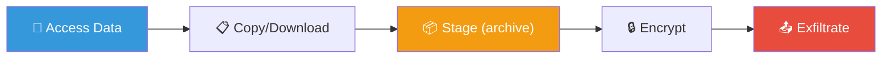
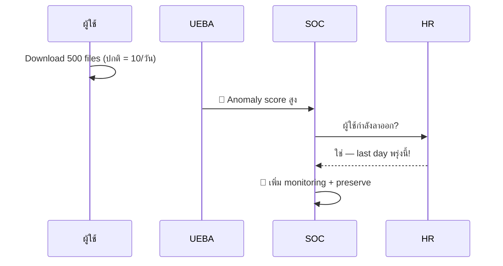
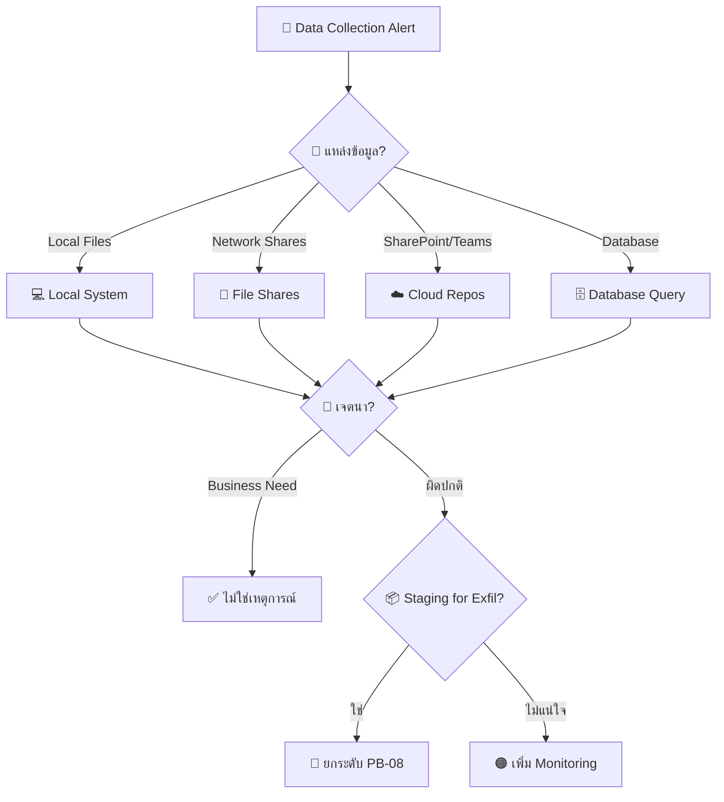
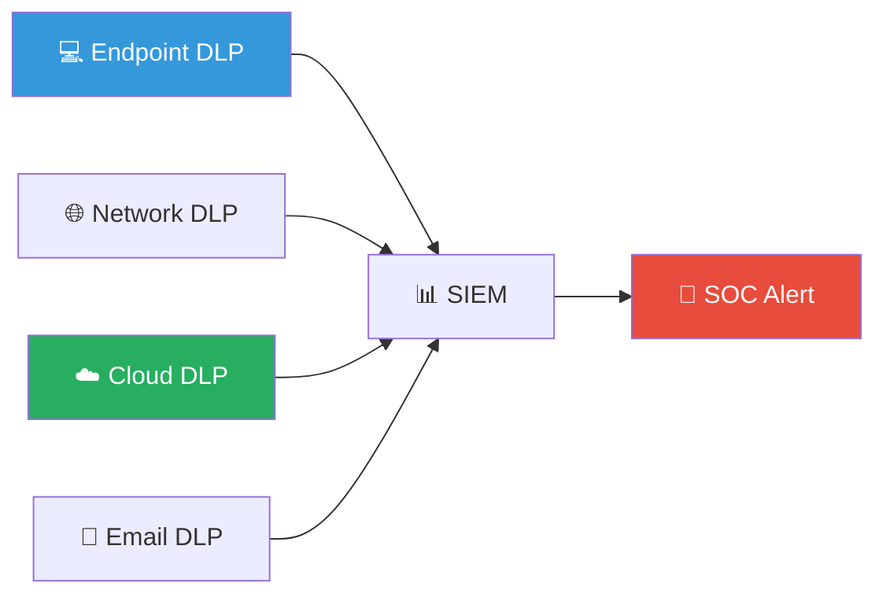
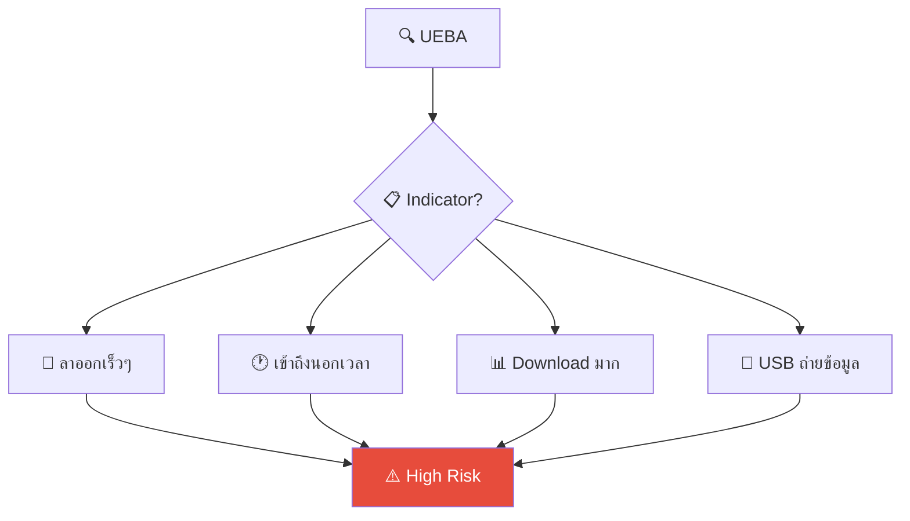

# Playbook: Data Collection / การเก็บรวบรวมข้อมูล

**ID**: PB-20
**ระดับความรุนแรง**: สูง | **หมวดหมู่**: ความปลอดภัยข้อมูล
**MITRE ATT&CK**: [T1005](https://attack.mitre.org/techniques/T1005/) (Data from Local System), [T1039](https://attack.mitre.org/techniques/T1039/) (Data from Network Shared Drive), [T1213](https://attack.mitre.org/techniques/T1213/) (Data from Information Repositories)
**ทริกเกอร์**: DLP alert, UEBA (unusual file access), EDR (archive creation), insider threat indicator

### ผังขั้นตอน Data Staging

### ผัง UEBA Detection

---

## ผังการตัดสินใจ

---

## 1. การวิเคราะห์

### 1.1 แหล่งข้อมูลที่มักถูกเก็บรวบรวม

| แหล่ง | ตัวบ่งชี้ | MITRE | เครื่องมือตรวจจับ |
|:---|:---|:---|:---|
| **Local system** | Archive creation (7z, rar, zip), large copy | T1005 | EDR / DLP |
| **Network shares** | Bulk file access, recursive copy | T1039 | File audit / DLP |
| **SharePoint / Teams / Confluence** | Bulk download, API scraping | T1213 | CASB / Cloud audit |
| **Email / Mailbox** | Export PST, search+download | T1114 | DLP / Exchange audit |
| **Database** | Large query, dump export (pg_dump, mysqldump) | T1005 | DB audit logs |
| **Source code repo** | `git clone` ขนาดใหญ่, API download | T1213 | SCM audit | 
| **Screenshots / clipboard** | Screen capture tools, clipboard access | T1113 | EDR |

### 1.2 Staging Indicators

| ตัวบ่งชี้ | ตัวอย่าง |
|:---|:---|
| **Archive creation** | 7z, rar, zip ขนาดใหญ่ใน temp/desktop |
| **Encryption** | rar -p, 7z -pPASSWORD (password-protected) |
| **Rename** | เปลี่ยนนามสกุลไฟล์เพื่อหลีก DLP |
| **Staging directory** | ย้ายไฟล์ไปยัง temp, recycle bin, hidden folder |
| **Cloud upload prep** | Copy to cloud sync folder (Dropbox, GDrive) |

### 1.3 รายการตรวจสอบ

| รายการ | วิธีตรวจสอบ | เสร็จ |
|:---|:---|:---:|
| ใครเข้าถึงข้อมูล? | DLP / UEBA / AD logs | ☐ |
| ข้อมูลอะไร? จำแนกประเภท (PII, IP, financial) | Data classification | ☐ |
| ปริมาณที่เข้าถึง (จำนวนไฟล์, ขนาด) | File audit | ☐ |
| ผิดปกติเมื่อเทียบกับ baseline? | UEBA | ☐ |
| เป็นส่วนหนึ่งของหน้าที่การงาน? | Manager interview | ☐ |
| มี staging (archive, encrypt, copy to temp)? | EDR / DLP | ☐ |
| มี exfiltration ตามมา? (upload, USB, email) | DLP / CASB | ☐ |
| ผู้ใช้กำลังจะลาออก/ถูก PIP? | HR check | ☐ |

---

## 2. การควบคุม

| # | การดำเนินการ | เครื่องมือ | เสร็จ |
|:---:|:---|:---|:---:|
| 1 | **เพิ่ม DLP monitoring** บนผู้ใช้/host | DLP / CASB | ☐ |
| 2 | **จำกัด** network share / cloud access ชั่วคราว | IAM / CASB | ☐ |
| 3 | **Block** USB / external upload (ถ้ามี staging) | EDR / GPO | ☐ |
| 4 | **Preserve** evidence (copy of staged files, logs) | Forensics | ☐ |
| 5 | หากเจตนาร้ายยืนยัน → **ล็อกบัญชี** | IAM | ☐ |

---

## 3. การกำจัด

| # | การดำเนินการ | เสร็จ |
|:---:|:---|:---:|
| 1 | ลบ staged archives / copies | ☐ |
| 2 | ลบ collection tools (ถ้าใช้ automated tool) | ☐ |
| 3 | กู้คืน access permissions ที่ถูกแก้ไข | ☐ |

---

## 4. การฟื้นฟู

| # | การดำเนินการ | เสร็จ |
|:---:|:---|:---:|
| 1 | ใช้ **DLP content-aware policies** (PII, financial, IP) | ☐ |
| 2 | เปิด **UEBA** สำหรับ abnormal file access patterns | ☐ |
| 3 | ตั้ง **data classification + labeling** (auto + manual) | ☐ |
| 4 | จำกัด **least privilege** access สำหรับ sensitive repos | ☐ |
| 5 | เปิด **file access auditing** บน critical shares/repos | ☐ |
| 6 | ใช้ **IRM/DRM** สำหรับข้อมูลที่สำคัญมาก | ☐ |

---

## 5. เกณฑ์การยกระดับ

| เงื่อนไข | ยกระดับไปยัง |
|:---|:---|
| Staging + exfiltration ยืนยัน | [PB-08 Data Exfiltration](Data_Exfiltration.th.md) |
| Insider threat ยืนยัน | [PB-14 Insider Threat](Insider_Threat.th.md) + HR |
| PII / customer data ถูกเข้าถึง | Legal + DPO (PDPA 72 ชม.) |
| Source code / IP ถูก collect | CISO + Legal |
| ผู้ใช้กำลังลาออก + bulk download | HR + SOC Lead ทันที |

---

### ผัง DLP Architecture

### ผัง Insider Data Theft Indicators

## เอกสารที่เกี่ยวข้อง

- [กรอบการตอบสนองต่อเหตุการณ์](../Framework.th.md)
- [PB-08 Data Exfiltration](Data_Exfiltration.th.md)
- [PB-14 Insider Threat](Insider_Threat.th.md)

## อ้างอิง

- [MITRE ATT&CK — Collection](https://attack.mitre.org/tactics/TA0009/)
