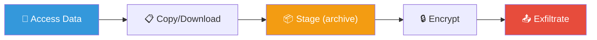
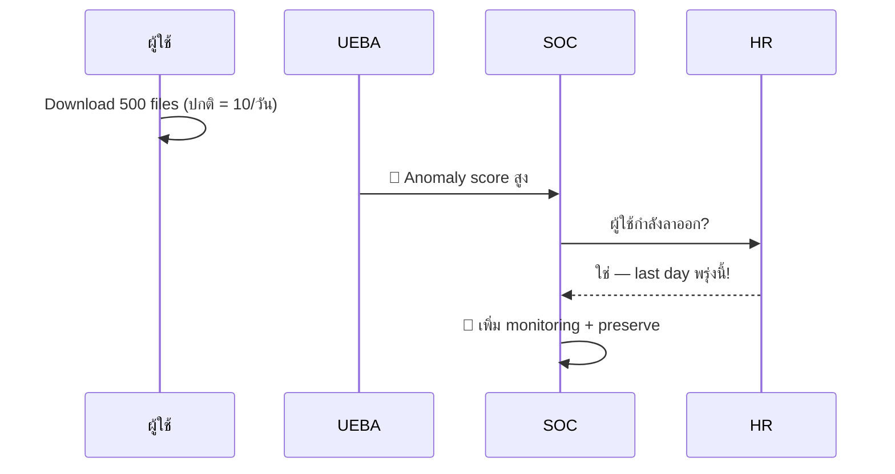
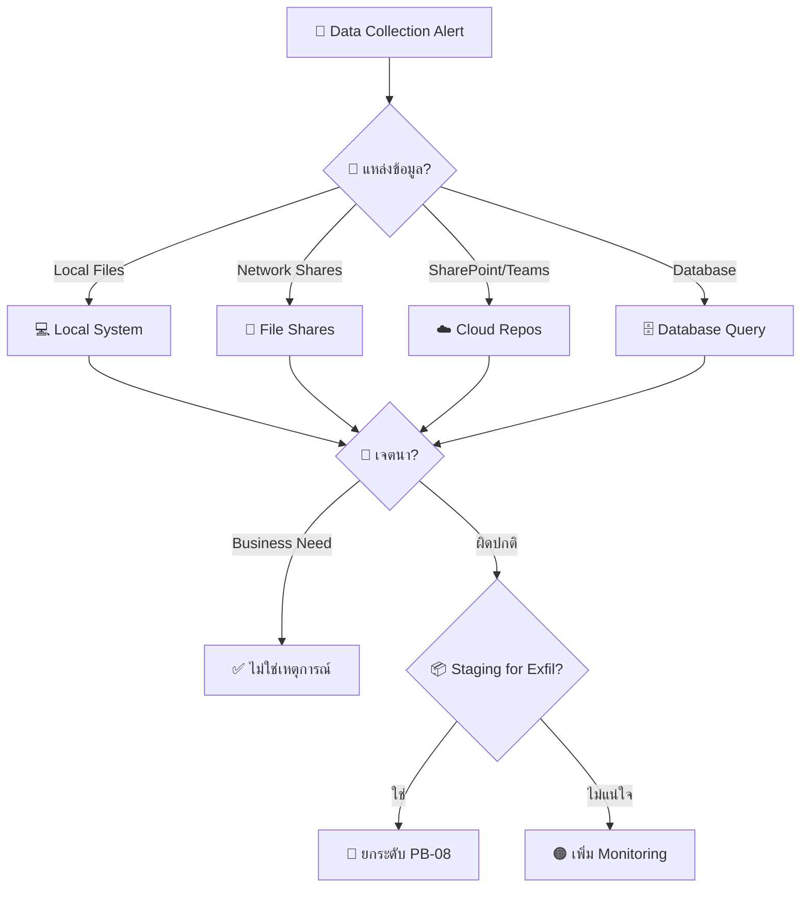
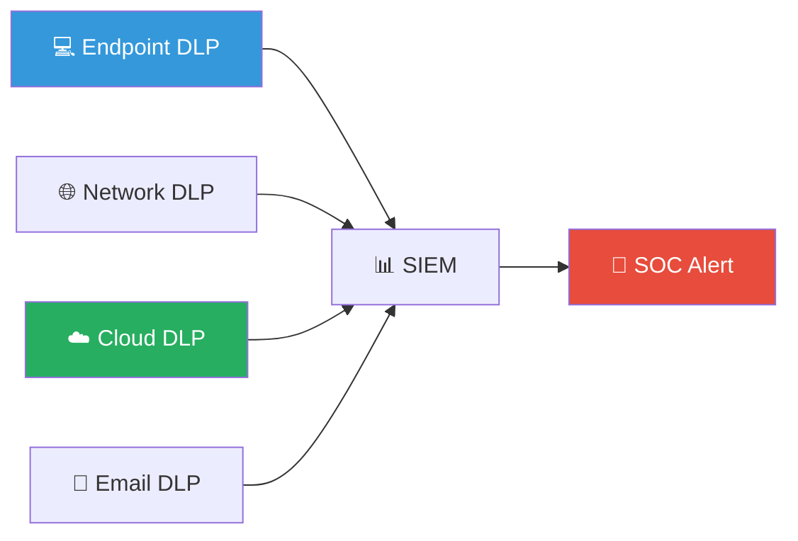
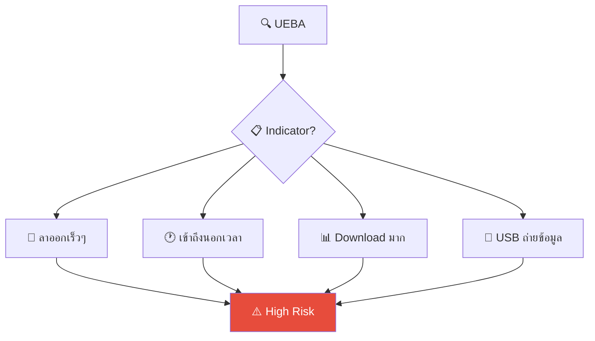

# Playbook: Data Collection / การเก็บรวบรวมข้อมูล

**ID**: PB-35
**ระดับความรุนแรง**: สูง | **หมวดหมู่**: ความปลอดภัยข้อมูล
**MITRE ATT&CK**: [T1005](https://attack.mitre.org/techniques/T1005/) (Data from Local System), [T1039](https://attack.mitre.org/techniques/T1039/) (Data from Network Shared Drive), [T1213](https://attack.mitre.org/techniques/T1213/) (Data from Information Repositories)
**ทริกเกอร์**: DLP alert, UEBA (unusual file access), EDR (archive creation), insider threat indicator

## หลังเหตุการณ์ (Post-Incident)

- [ ] อัพเดท DLP rules ตาม staging path patterns ที่พบ
- [ ] เพิ่ม file archiver monitoring ใน EDR policy
- [ ] ทำ user access review สำหรับ data repositories
- [ ] สร้าง Sigma rule สำหรับ bulk file access patterns
- [ ] ทบทวน data classification labels
- [ ] จัดทำ [Incident Report](../../11_Reporting_Templates/incident_report.th.md)

### ผังขั้นตอน Data Staging

```mermaid
graph LR
    Access["📁 Access Data"] --> Copy["📋 Copy/Download"]
    Copy --> Stage["📦 Stage (archive)"]
    Stage --> Encrypt["🔒 Encrypt"]
    Encrypt --> Exfil["📤 Exfiltrate"]
    style Access fill:#3498db,color:#fff
    style Stage fill:#f39c12,color:#fff
    style Exfil fill:#e74c3c,color:#fff
```

### ผัง UEBA Detection

```mermaid
sequenceDiagram
    participant User as ผู้ใช้
    participant UEBA
    participant SOC
    participant HR
    User->>User: Download 500 files (ปกติ = 10/วัน)
    UEBA->>SOC: 🚨 Anomaly score สูง
    SOC->>HR: ผู้ใช้กำลังลาออก?
    HR-->>SOC: ใช่ — last day พรุ่งนี้!
    SOC->>SOC: 🔴 เพิ่ม monitoring + preserve
```

---

## ผังการตัดสินใจ

```mermaid
graph TD
    Alert["🚨 Data Collection Alert"] --> Source{"📍 แหล่งข้อมูล?"}
    Source -->|Local Files| Local["💻 Local System"]
    Source -->|Network Shares| Share["📁 File Shares"]
    Source -->|SharePoint/Teams| Cloud["☁️ Cloud Repos"]
    Source -->|Database| DB["🗄️ Database Query"]
    Local --> Intent{"🤔 เจตนา?"}
    Share --> Intent
    Cloud --> Intent
    DB --> Intent
    Intent -->|Business Need| FP["✅ ไม่ใช่เหตุการณ์"]
    Intent -->|ผิดปกติ| Staging{"📦 Staging for Exfil?"}
    Staging -->|ใช่| Exfil["🔴 ยกระดับ PB-08"]
    Staging -->|ไม่แน่ใจ| Monitor["🟠 เพิ่ม Monitoring"]
```

---

## 1. การวิเคราะห์

### 1.1 แหล่งข้อมูลที่มักถูกเก็บรวบรวม

| แหล่ง | ตัวบ่งชี้ | MITRE | เครื่องมือตรวจจับ |
|:---|:---|:---|:---|
| **Local system** | Archive creation (7z, rar, zip), large copy | T1005 | EDR / DLP |
| **Network shares** | Bulk file access, recursive copy | T1039 | File audit / DLP |
| **SharePoint / Teams / Confluence** | Bulk download, API scraping | T1213 | CASB / Cloud audit |
| **Email / Mailbox** | Export PST, search+download | T1114 | DLP / Exchange audit |
| **Database** | Large query, dump export (pg_dump, mysqldump) | T1005 | DB audit logs |
| **Source code repo** | `git clone` ขนาดใหญ่, API download | T1213 | SCM audit | 
| **Screenshots / clipboard** | Screen capture tools, clipboard access | T1113 | EDR |

### 1.2 Staging Indicators

| ตัวบ่งชี้ | ตัวอย่าง |
|:---|:---|
| **Archive creation** | 7z, rar, zip ขนาดใหญ่ใน temp/desktop |
| **Encryption** | rar -p, 7z -pPASSWORD (password-protected) |
| **Rename** | เปลี่ยนนามสกุลไฟล์เพื่อหลีก DLP |
| **Staging directory** | ย้ายไฟล์ไปยัง temp, recycle bin, hidden folder |
| **Cloud upload prep** | Copy to cloud sync folder (Dropbox, GDrive) |

### 1.3 รายการตรวจสอบ

| รายการ | วิธีตรวจสอบ | เสร็จ |
|:---|:---|:---:|
| ใครเข้าถึงข้อมูล? | DLP / UEBA / AD logs | ☐ |
| ข้อมูลอะไร? จำแนกประเภท (PII, IP, financial) | Data classification | ☐ |
| ปริมาณที่เข้าถึง (จำนวนไฟล์, ขนาด) | File audit | ☐ |
| ผิดปกติเมื่อเทียบกับ baseline? | UEBA | ☐ |
| เป็นส่วนหนึ่งของหน้าที่การงาน? | Manager interview | ☐ |
| มี staging (archive, encrypt, copy to temp)? | EDR / DLP | ☐ |
| มี exfiltration ตามมา? (upload, USB, email) | DLP / CASB | ☐ |
| ผู้ใช้กำลังจะลาออก/ถูก PIP? | HR check | ☐ |

---

## 2. การควบคุม

| # | การดำเนินการ | เครื่องมือ | เสร็จ |
|:---:|:---|:---|:---:|
| 1 | **เพิ่ม DLP monitoring** บนผู้ใช้/host | DLP / CASB | ☐ |
| 2 | **จำกัด** network share / cloud access ชั่วคราว | IAM / CASB | ☐ |
| 3 | **Block** USB / external upload (ถ้ามี staging) | EDR / GPO | ☐ |
| 4 | **Preserve** evidence (copy of staged files, logs) | Forensics | ☐ |
| 5 | หากเจตนาร้ายยืนยัน → **ล็อกบัญชี** | IAM | ☐ |

---

## 3. การกำจัด

| # | การดำเนินการ | เสร็จ |
|:---:|:---|:---:|
| 1 | ลบ staged archives / copies | ☐ |
| 2 | ลบ collection tools (ถ้าใช้ automated tool) | ☐ |
| 3 | กู้คืน access permissions ที่ถูกแก้ไข | ☐ |

---

## 4. การฟื้นฟู

| # | การดำเนินการ | เสร็จ |
|:---:|:---|:---:|
| 1 | ใช้ **DLP content-aware policies** (PII, financial, IP) | ☐ |
| 2 | เปิด **UEBA** สำหรับ abnormal file access patterns | ☐ |
| 3 | ตั้ง **data classification + labeling** (auto + manual) | ☐ |
| 4 | จำกัด **least privilege** access สำหรับ sensitive repos | ☐ |
| 5 | เปิด **file access auditing** บน critical shares/repos | ☐ |
| 6 | ใช้ **IRM/DRM** สำหรับข้อมูลที่สำคัญมาก | ☐ |

---

## 5. Evidence Checklist

| ประเภทหลักฐาน | สิ่งที่ต้องเก็บ | แหล่งข้อมูล | เหตุผลที่ต้องเก็บ |
|:---|:---|:---|:---|
| หลักฐานการเก็บข้อมูล | file ที่ถูกเข้าถึง, query ที่รัน, archive name, staging path, timestamp | EDR / DLP / DB audit | ใช้ดูว่าข้อมูลอะไรถูกเก็บและเตรียมไว้ |
| หลักฐานด้านผู้ใช้และสิทธิ์ | user role, source host, privilege, app/session context | IAM / SIEM / endpoint logs | ใช้แยก misuse ออกจากงานที่ถูกต้อง |
| หลักฐานของเครื่องมือ | archiver, script, sync tool, clipboard/screenshot tool | Process logs / EDR | ใช้ระบุวิธีการเก็บข้อมูลและ detection gap |
| หลักฐานปลายทาง | upload URL, email forwarding, removable media, cloud sync | Proxy / email / USB / cloud logs | ใช้ดูเจตนาว่ากำลังเตรียม exfiltration หรือไม่ |
| หลักฐานความอ่อนไหวของข้อมูล | data label, record count, customer/PII/IP scope | DLP / data inventory | ใช้รองรับ legal และ executive decision |

---

## 6. Minimum Telemetry Required

| แหล่ง Telemetry | ใช้เพื่ออะไร | ความสำคัญ | Blind Spot ถ้าไม่มี |
|:---|:---|:---:|:---|
| Endpoint และ process telemetry | ดู archiving, staging, file access, removable media | Required | มองไม่เห็นพฤติกรรม collection บนเครื่อง |
| DLP และ data classification telemetry | ดู sensitive content, label, record count | Required | ผลกระทบทางธุรกิจและกฎหมายไม่ชัด |
| Identity, share, และ cloud-access logs | ดูว่าใครเข้าถึง repository ไหน เมื่อไร | Required | ผูก collection activity กับผู้ใช้ไม่ได้ |
| Database และ application audit logs | ดู structured-data export และ repo access | Recommended | พลาด collection ที่ไม่ใช่ไฟล์ปกติ |
| Proxy, email, และ cloud-sync telemetry | ดูสัญญาณเตรียม outbound movement | Recommended | เห็น staging แต่ไม่เห็น intent ชัด |

---

## 7. False Positive และ Tuning Guide

| Scenario | ทำไมจึงดูน่าสงสัย | วิธีตรวจสอบ | Tuning Action | ต้องยกระดับเมื่อ |
|:---|:---|:---|:---|:---|
| งาน export หรือ reporting ที่ได้รับอนุมัติ | archive ใหญ่และ file access จำนวนมากดูเหมือน malicious | ยืนยัน report owner, schedule, destination, และ ticket | tune เฉพาะ job/account/path ที่อนุมัติ | ไปแตะข้อมูลอ่อนไหวที่ไม่เกี่ยวข้องหรือใช้ปลายทางใหม่ |
| backup หรือ migration activity | copy และ compression ดูเหมือน staging | ยืนยัน service account, maintenance window, และ source repo | ลด severity สำหรับ workflow ที่ documented | activity เกิดจาก user endpoint หรือนอกเวลา |
| eDiscovery หรือ legal hold | bulk export อาจดูเหมือน data theft | ยืนยัน case ID และ legal owner | suppress เฉพาะ workflow ทางกฎหมายที่อนุมัติ | export ออกนอก controlled storage หรือเกิน scope |
| developer/analyst prep dataset ใน lab | การแพ็กข้อมูลทดสอบอาจ noisy | ยืนยัน project owner และขอบเขต sanitized-data | tune เฉพาะ lab path และ sanitized dataset | มี production data จริงหรือ personal storage เข้ามาเกี่ยวข้อง |

---

## 8. เกณฑ์การยกระดับ

| เงื่อนไข | ยกระดับไปยัง |
|:---|:---|
| Staging + exfiltration ยืนยัน | [PB-08 Data Exfiltration](Data_Exfiltration.th.md) |
| Insider threat ยืนยัน | [PB-14 Insider Threat](Insider_Threat.th.md) + HR |
| PII / customer data ถูกเข้าถึง | Legal + DPO (PDPA 72 ชม.) |
| Source code / IP ถูก collect | CISO + Legal |
| ผู้ใช้กำลังลาออก + bulk download | HR + SOC Lead ทันที |

---

### ผัง DLP Architecture

```mermaid
graph LR
    Endpoint["💻 Endpoint DLP"] --> SIEM["📊 SIEM"]
    Network["🌐 Network DLP"] --> SIEM
    Cloud["☁️ Cloud DLP"] --> SIEM
    Email["📧 Email DLP"] --> SIEM
    SIEM --> SOC["🎯 SOC Alert"]
    style Endpoint fill:#3498db,color:#fff
    style Cloud fill:#27ae60,color:#fff
    style SOC fill:#e74c3c,color:#fff
```

### ผัง Insider Data Theft Indicators

```mermaid
graph TD
    UEBA["🔍 UEBA"] --> Type{"📋 Indicator?"}
    Type --> Resign["📝 ลาออกเร็วๆ"]
    Type --> Hours["🕐 เข้าถึงนอกเวลา"]
    Type --> Volume["📊 Download มาก"]
    Type --> USB["💾 USB ถ่ายข้อมูล"]
    Resign --> Risk["⚠️ High Risk"]
    Hours --> Risk
    Volume --> Risk
    USB --> Risk
    style Risk fill:#e74c3c,color:#fff
```

## กฎตรวจจับ (Sigma)

| กฎ | ไฟล์ |
|:---|:---|
| Data Collection and Staging | [sigma/win_data_collection_staging.yml](../../08_Detection_Engineering/sigma_rules/win_data_collection_staging.yml) |
| Bulk File Copy to USB | [file_bulk_usb_copy.yml](../../08_Detection_Engineering/sigma_rules/file_bulk_usb_copy.yml) |

## เอกสารที่เกี่ยวข้อง

- [กรอบการตอบสนองต่อเหตุการณ์](../Framework.th.md)
- [PB-08 Data Exfiltration](Data_Exfiltration.th.md)
- [PB-14 Insider Threat](Insider_Threat.th.md)

## Data Staging Detection

| Indicator | Source | Detection |
|:---|:---|:---|
| Bulk file copy to temp | EDR file events | Volume threshold |
| Archive creation (zip/rar) | Process monitoring | New archiver process |
| Clipboard data hoarding | DLP | Content analysis |
| Database export | DB audit logs | Large SELECT queries |
| Screenshot capture | EDR | Screen capture tools |

### Data Collection TTPs (MITRE ATT&CK)

| Technique | ID | Detection Priority |
|:---|:---|:---|
| Data from Local System | T1005 | High |
| Data from Network Share | T1039 | High |
| Input Capture | T1056 | Medium |
| Screen Capture | T1113 | Medium |
| Archive Collected Data | T1560 | Critical |
| Data Staged | T1074 | Critical |

### Data Classification Impact

| Data Type | Risk If Collected | Response |
|:---|:---|:---|
| PII/PHI | Critical | PDPA notification |
| Financial | High | Legal + audit |
| IP/Trade secrets | Critical | Legal + forensics |
| Internal docs | Medium | Assess scope |

### Collection Method Indicators

| Method | Log Source | Alert |
|:---|:---|:---|
| Bulk file copy | EDR | Volume threshold |
| Archive creation | Process log | Archiver from user |
| DB export | DB audit | Large query result |

## References

- [MITRE ATT&CK — Collection](https://attack.mitre.org/tactics/TA0009/)
