# Playbook: Data Exfiltration

**ID**: PB-08
**Severity**: Critical | **Category**: Data Protection
**MITRE ATT&CK**: [T1048](https://attack.mitre.org/techniques/T1048/) (Exfiltration Over Alternative Protocol), [T1567](https://attack.mitre.org/techniques/T1567/) (Exfiltration Over Web Service), [T1041](https://attack.mitre.org/techniques/T1041/) (Exfiltration Over C2 Channel)
**Trigger**: DLP alert, Netflow anomaly, UEBA, Proxy/Cloud alert, EDR large file operation

### Detection by Channel

```mermaid
graph TD
    DLP["🔍 DLP Engine"] --> Ch{"📡 Channel?"}
    Ch -->|Web Upload| Proxy["🌐 Proxy / CASB"]
    Ch -->|Email| Mail["📧 Mail Gateway"]
    Ch -->|USB| Endpoint["💻 Endpoint DLP"]
    Ch -->|DNS| DNS["🔤 DNS Analytics"]
    Proxy --> Alert["🚨 Alert SOC"]
    Mail --> Alert
    Endpoint --> Alert
    DNS --> Alert
    Alert --> Investigate["🔎 Investigate"]
```

### Data Impact Assessment

```mermaid
sequenceDiagram
    participant SOC
    participant DLP
    participant Legal
    participant DPO
    SOC->>DLP: What data was exfiltrated?
    DLP-->>SOC: PII — 500 records
    SOC->>Legal: 📋 Incident report
    Legal->>DPO: PDPA notification required?
    DPO-->>Legal: Yes — within 72 hours
    Legal->>SOC: Prepare notification report
```

---

## Decision Flow

```mermaid
graph TD
    Alert["🚨 DLP / Anomaly Alert"] --> Classify{"📄 Data Classification?"}
    Classify -->|L1 Public| FP["✅ Low Risk — Monitor"]
    Classify -->|L2 Internal| Review["⚠️ Review Context"]
    Classify -->|L3 Confidential| Urgent["🔴 Urgent Investigation"]
    Classify -->|L4 Restricted/PII| Critical["🚨 Critical — Notify Legal"]
    Review --> Dest{"🌐 Destination?"}
    Urgent --> Dest
    Critical --> Dest
    Dest -->|Corporate/Approved| Context["Check Business Justification"]
    Dest -->|Personal Cloud/Unknown| Block["🛑 Block + Investigate"]
    Dest -->|Known Malicious| Block
    Context -->|Justified| Close["Close with Documentation"]
    Context -->|Unjustified| Block
    Block --> Isolate["🔌 Isolate Source"]
```

---

## 1. Analysis (Triage)

### 1.1 Initial Assessment

| Check | How | Done |
|:---|:---|:---:|
| Data volume transferred | DLP / Proxy logs — anomalous for this user? | ☐ |
| Destination IP/domain | Trusted or unknown? Check reputation | ☐ |
| Data classification | PII, financial, IP, credentials? | ☐ |
| Protocol used | HTTP/S, FTP, DNS tunneling, USB? | ☐ |
| User context | Normal behavior or first-time transfer? | ☐ |

### 1.2 Exfiltration Method Identification

| Method | Detection Source | MITRE ID |
|:---|:---|:---|
| Upload to personal cloud (Google Drive, Dropbox) | Proxy / CASB | T1567.002 |
| Email to external address | DLP / Email Gateway | T1048.003 |
| USB/removable media | DLP / Endpoint agent | T1052.001 |
| DNS tunneling | DNS logs (high entropy/length) | T1048.001 |
| FTP/SCP/SFTP to external server | Firewall / IDS | T1048 |
| Encoded/encrypted upload | Proxy (content inspection) | T1048.002 |
| Cloud sync (OneDrive, iCloud) | CASB / Endpoint | T1567 |
| Print to PDF / screenshot | Endpoint monitoring | T1113 |

### 1.3 Scope Assessment

- [ ] Total volume of data transferred (MB/GB)?
- [ ] How long has the exfiltration been occurring?
- [ ] Exactly which files/databases were accessed?
- [ ] Was data staged before exfiltration? ([PB-35](Data_Collection.en.md))
- [ ] Is this insider threat or external attacker?
- [ ] Multiple users/endpoints involved?

---

## 2. Containment

### 2.1 Immediate Actions (within 10 minutes)

| # | Action | Tool | Done |
|:---:|:---|:---|:---:|
| 1 | **Block destination** IP/domain at firewall/proxy | Firewall, Proxy | ☐ |
| 2 | **Isolate source** endpoint from network | EDR | ☐ |
| 3 | **Disable user account** (if user-driven) | AD / IdP | ☐ |
| 4 | **Revoke active sessions** | IdP | ☐ |
| 5 | **Preserve evidence** — snapshot/image the source system | Forensics | ☐ |

### 2.2 Additional Containment

| # | Action | Done |
|:---:|:---|:---:|
| 1 | Block USB/removable media on endpoint (if USB method) | ☐ |
| 2 | Disable user's cloud sync application | ☐ |
| 3 | Place legal hold on user's mailbox and cloud storage | ☐ |
| 4 | Block similar transfers org-wide (if widespread) | ☐ |

---

## 3. Eradication

| # | Action | Done |
|:---:|:---|:---:|
| 1 | Remove any staging files (RAR/ZIP archives) from source | ☐ |
| 2 | Scan for persistence / backdoors left by attacker | ☐ |
| 3 | Remove any unauthorized scripts or scheduled tasks | ☐ |
| 4 | Verify no additional exfiltration channels remain | ☐ |

---

## 4. Recovery & Legal

### 4.1 Damage Assessment

| Question | Answer |
|:---|:---|
| What data was exfiltrated? | [File list / description] |
| Classification level? | L1 / L2 / L3 / L4 |
| Number of records (if PII)? | |
| Business impact? | |
| Regulatory notification required? | PDPA (72h) / GDPR / Other |

### 4.2 Notification

| Stakeholder | When | Condition |
|:---|:---|:---|
| SOC Lead | Immediately | All confirmed cases |
| Legal / Compliance | Within 1 hour | If L3+ data or PII involved |
| CISO | Within 2 hours | If L4 data or regulatory impact |
| Data Protection Officer | Within 24 hours | If PII of data subjects |
| Regulatory authority | Within 72 hours | If PDPA/GDPR breach confirmed |
| Affected individuals | Per legal guidance | If personal data exposed |

---

## 5. IoC Collection

| Type | Value | Source |
|:---|:---|:---|
| Destination IP(s) | | Firewall / Proxy |
| Destination Domain(s) | | DNS / Proxy |
| Source Host | | DLP / EDR |
| Source User | | DLP / SIEM |
| Protocol / Port | | Firewall |
| File Names | | DLP |
| Data Volume | | Proxy / DLP |
| Staging Path | | EDR |

---

## 6. Escalation Criteria

| Condition | Escalate To |
|:---|:---|
| L3/L4 data confirmed exfiltrated | CISO + Legal |
| PII of > 500 individuals | DPO + Regulatory |
| Insider threat suspected | HR + Legal + [PB-14](Insider_Threat.en.md) |
| External attacker (APT) | Threat Intel + External IR |
| Multiple endpoints involved | Major Incident |
| Data staging found | Cross-reference [PB-35](Data_Collection.en.md) |

---

### Exfiltration Channels

```mermaid
graph TD
    Exfil["📤 Exfiltration"] --> Web["🌐 Web upload"]
    Exfil --> Email["📧 Email attach"]
    Exfil --> Cloud["☁️ Cloud sync"]
    Exfil --> USB["💾 USB"]
    Exfil --> DNS["🔤 DNS tunnel"]
    Web --> DLP["🛡️ DLP inspect"]
    Email --> DLP
    Cloud --> DLP
    USB --> EDR["🔍 EDR block"]
    DNS --> NDR["📡 NDR detect"]
    style Exfil fill:#e74c3c,color:#fff
    style DLP fill:#27ae60,color:#fff
```

### Data Loss Prevention Pipeline

```mermaid
sequenceDiagram
    participant User
    participant DLP
    participant SOC
    participant Manager
    User->>DLP: Upload 500MB to Google Drive
    DLP->>DLP: Scan: PII detected!
    DLP-->>User: ❌ Blocked
    DLP->>SOC: 🚨 Alert: PII exfiltration attempt
    SOC->>Manager: Notify team lead
```

## Related Documents

- [IR Framework](../Framework.en.md)
- [Incident Report](../../templates/incident_report.en.md)
- [PB-14 Insider Threat](Insider_Threat.en.md)
- [PB-35 Data Collection](Data_Collection.en.md)
- [Data Governance Policy](../../07_Compliance_Privacy/Data_Governance_Policy.en.md)
- [PDPA Compliance](../../07_Compliance_Privacy/PDPA_Compliance.en.md)

## References

- [MITRE ATT&CK T1048 — Exfiltration Over Alternative Protocol](https://attack.mitre.org/techniques/T1048/)
- [NIST SP 800-61r2 — Incident Handling](https://csrc.nist.gov/publications/detail/sp/800-61/rev-2/final)
