# Playbook: Deepfake Social Engineering Response

**ID**: PB-48
**Severity**: Critical | **Category**: Social Engineering / Fraud
**MITRE ATT&CK**: [T1598](https://attack.mitre.org/techniques/T1598/) (Phishing for Information), [T1204.001](https://attack.mitre.org/techniques/T1204/001/) (Malicious Link)
**Trigger**: Employee report (suspicious video/voice call from "executive"), unusual wire transfer request via video call, AI-generated voice message requesting credentials

> ⚠️ **CRITICAL**: Deepfake technology can clone voices with 3 seconds of audio and generate convincing video in real-time. Executive impersonation via deepfake has caused multi-million dollar fraud losses.

### Deepfake Attack Taxonomy


### Real-World Deepfake Cases


---

## Decision Flow

```mermaid
graph TD
    Alert["🚨 Suspected Deepfake"] --> Type{"Communication type?"}
    Type -->|"Video call"| Video["Video call with 'executive'\nRequesting unusual action"]
    Type -->|"Voice call"| Voice["Phone call sounding\nlike known person"]
    Type -->|"Voice message"| VM["Voice message from\n'executive' with request"]
    Video --> Verify["🔴 STOP — Do NOT comply\nVerify via separate channel"]
    Voice --> Verify
    VM --> Verify
    Verify --> Method{"Verification method"}
    Method --> CallBack["📞 Call back on known number"]
    Method --> InPerson["👤 Walk to their office"]
    Method --> Slack["💬 Message on verified platform"]
    CallBack --> Result{"Confirmed real?"}
    InPerson --> Result
    Slack --> Result
    Result -->|"No — Deepfake!"| IR["🔴 Report to IR immediately"]
    Result -->|"Yes — Legitimate"| Proceed["Proceed with standard approval"]
    style Alert fill:#ff6600,color:#fff
    style IR fill:#cc0000,color:#fff
```



### Deepfake Detection Indicators


### Verification Protocol

```mermaid
sequenceDiagram
    participant Attacker as Deepfake Call
    participant Employee
    participant SOC
    participant Executive as Real Executive
    participant Finance

    Attacker->>Employee: 🎭 "This is [CEO]. Wire $2M immediately"
    Employee->>Employee: ⚠️ Unusual request — trigger protocol
    Employee->>Executive: 📞 Call CEO on verified number
    Executive->>Employee: "I never made that call!"
    Employee->>SOC: 🚨 Report deepfake attempt
    SOC->>Finance: HOLD all pending wire transfers
    SOC->>SOC: Preserve call recording/logs
    SOC->>SOC: Investigation — source of voice sample
```



### Financial Impact Assessment

```mermaid
graph TD
    Impact["Deepfake Impact Assessment"] --> Detected{"Detected before action?"}
    Detected -->|"Yes — Blocked"| Low["🟢 No Financial Loss\nAwareness training trigger"]
    Detected -->|"No — Action taken"| Action{"What was done?"}
    Action -->|"Wire sent"| Wire["🔴 Contact bank IMMEDIATELY\nRecall wire within 24h"]
    Action -->|"Credentials shared"| Creds["🟠 Reset creds + audit\nCheck for access"]
    Action -->|"Data disclosed"| Data["🟡 Assess data sensitivity\nPDPA notification?"]
    Wire --> Recovery{"Within recall window?"}
    Recovery -->|"Yes ≤ 24h"| Recall["Bank recall possible"]
    Recovery -->|"No > 24h"| Lost["💀 Funds likely unrecoverable"]
    style Lost fill:#660000,color:#fff
    style Wire fill:#cc0000,color:#fff
```



### Response Timeline


---

## 1. Immediate Actions (First 10 Minutes)

| # | Action | Owner |
|:---|:---|:---|
| 1 | **STOP** — do NOT comply with any request | Employee |
| 2 | Verify identity via separate, known channel | Employee |
| 3 | If deepfake confirmed — report to SOC immediately | Employee |
| 4 | Hold ALL pending financial transactions | Finance |
| 5 | Preserve call logs, recordings, chat history | SOC |
| 6 | Alert leadership about ongoing deepfake campaign | SOC Manager |

## 2. Investigation Checklist

### Communication Analysis
- [ ] What platform was the call/message received on?
- [ ] Is there a recording of the deepfake call?
- [ ] What specific requests were made?
- [ ] Were any links or files shared?
- [ ] Was the caller's number spoofed?

### Damage Assessment
- [ ] Were any financial transactions approved?
- [ ] Were credentials or sensitive data shared?
- [ ] Were any systems accessed as a result?
- [ ] Were other employees targeted simultaneously?

### Source Investigation
- [ ] Where could the attacker have obtained voice/video samples?
- [ ] Public speeches, interviews, social media?
- [ ] Previous recorded meetings or webinars?
- [ ] Is this part of a broader campaign?

## 3. Containment

| Scope | Action |
|:---|:---|
| **Financial** | Freeze all pending transactions |
| **Communications** | Warn all employees of active campaign |
| **Credentials** | Reset if any were shared |
| **Platform** | Report deepfake to platform provider |

## 4. Post-Incident

| Question | Answer |
|:---|:---|
| Was the deepfake detected before action? | [Yes/No] |
| What was the financial impact? | [$Amount] |
| Were dual authorization controls in place? | [Status] |
| Is employee deepfake awareness training in place? | [Status] |

## 6. Detection Rules

> Note: Deepfake detection is primarily procedural — verify via separate channels for any unusual requests.

```yaml
title: Unusual Wire Transfer Request After Video Call
logsource:
    product: email
detection:
    selection:
        subject|contains:
            - 'wire transfer'
            - 'urgent payment'
            - 'confidential transaction'
        sender_domain|external: true
    condition: selection
    level: high
```

## Related Documents
- [IR Framework](../Framework.en.md)
- [Sigma Rules Index](../../08_Detection_Engineering/sigma_rules/)
- [BEC Playbook](BEC.en.md)
- [Phishing Playbook](Phishing.en.md)

## References
- [FBI — Business Email Compromise](https://www.ic3.gov/Media/Y2023/PSA230609)
- [MITRE T1598 — Phishing for Information](https://attack.mitre.org/techniques/T1598/)
