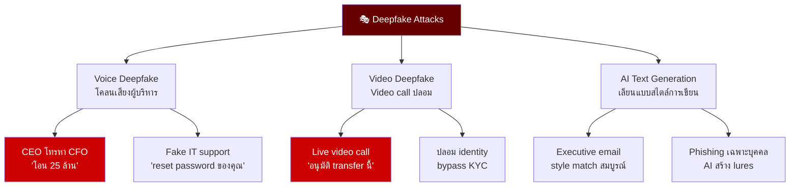
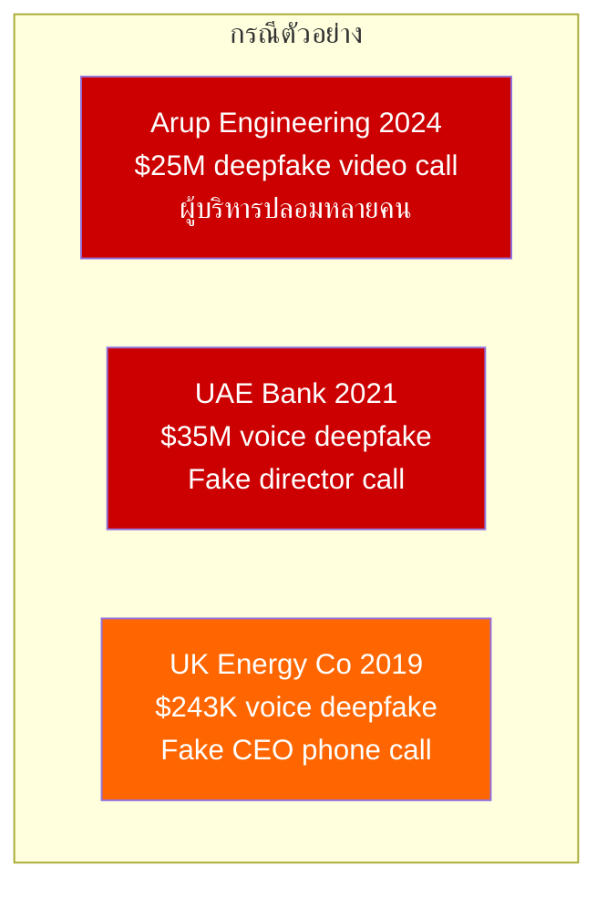
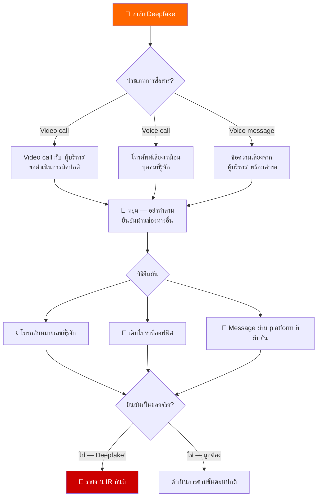
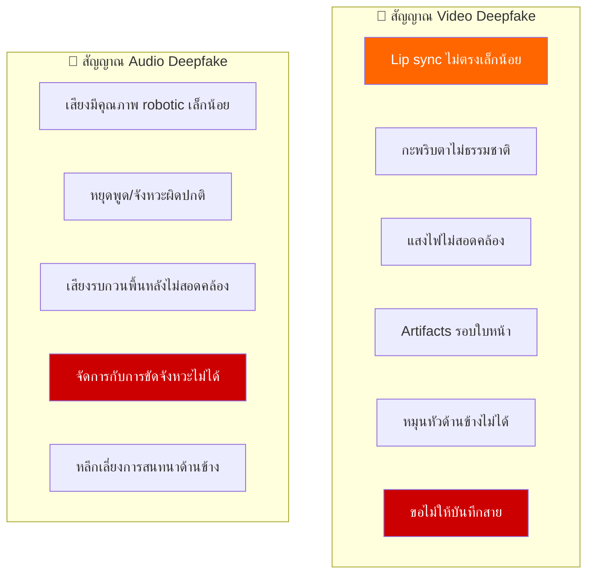
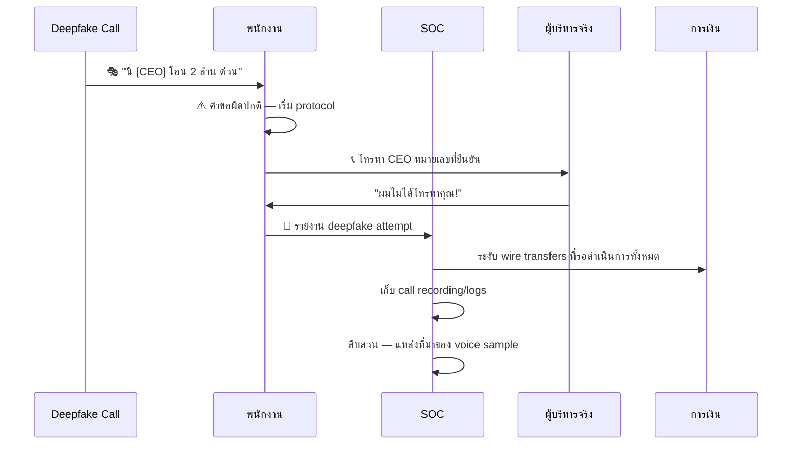
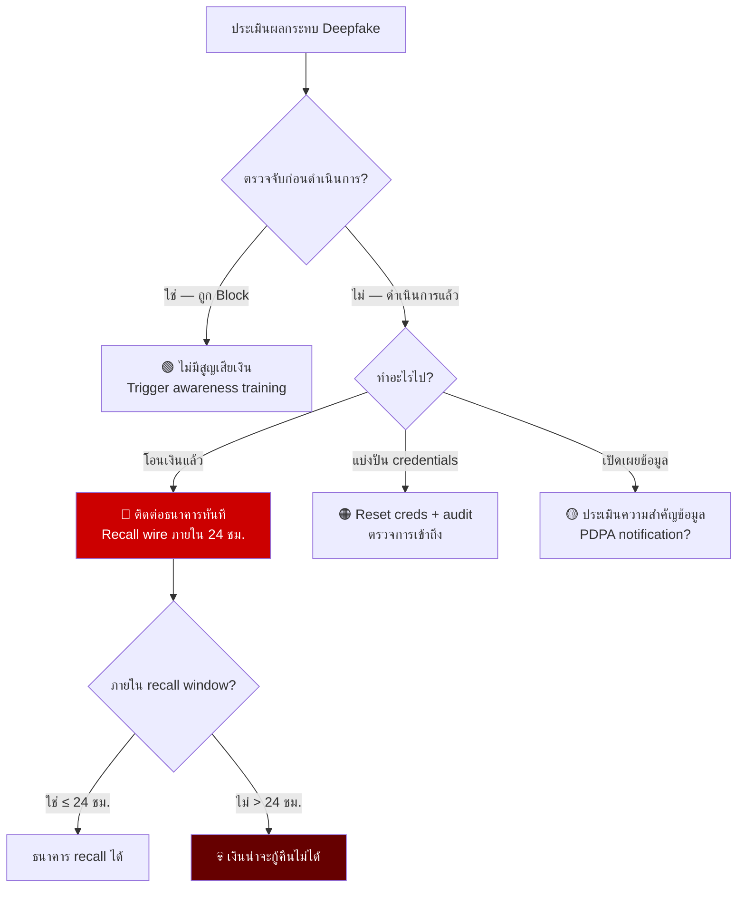

# Playbook: การตอบสนอง Deepfake Social Engineering

**ID**: PB-48
**ความรุนแรง**: วิกฤต | **ประเภท**: Social Engineering / Fraud
**MITRE ATT&CK**: [T1598](https://attack.mitre.org/techniques/T1598/) (Phishing for Information), [T1204.001](https://attack.mitre.org/techniques/T1204/001/) (Malicious Link)
**Trigger**: พนักงานรายงาน (video/voice call ผิดปกติจาก "ผู้บริหาร"), คำขอ wire transfer ผิดปกติผ่าน video call, ข้อความเสียง AI ขอ credentials

> ⚠️ **วิกฤต**: เทคโนโลยี Deepfake สามารถโคลนเสียงด้วยเสียงเพียง 3 วินาที และสร้างวิดีโอที่น่าเชื่อถือแบบ real-time การปลอมเป็นผู้บริหารผ่าน deepfake ทำให้เกิดความเสียหายหลายล้านดอลลาร์

### Deepfake Attack Taxonomy



### กรณี Deepfake ที่เกิดขึ้นจริง



---

## Decision Flow



### ตัวบ่งชี้ Deepfake



### ขั้นตอนการยืนยัน



### การประเมินผลกระทบทางเงิน



### Timeline การตอบสนอง

```mermaid
gantt
    title Deepfake Social Engineering Response
    dateFormat HH:mm
    axisFormat %H:%M
    section Detection
        พนักงานรายงาน          :a1, 00:00, 5min
        ยืนยันกับบุคคลจริง     :a2, after a1, 10min
    section Containment
        ระงับ pending actions   :a3, after a2, 5min
        แจ้งทุกแผนก            :a4, after a3, 15min
    section Investigation
        เก็บหลักฐาน            :a5, after a4, 30min
        วิเคราะห์แหล่งที่มา    :a6, after a5, 60min
    section Response
        กู้คืนทางการเงิน       :a7, after a6, 120min
        Awareness ทั้งองค์กร    :a8, after a7, 60min
```



---

## 1. การดำเนินการทันที (10 นาทีแรก)

| # | การดำเนินการ | ผู้รับผิดชอบ |
|:---|:---|:---|
| 1 | **หยุด** — อย่าทำตามคำขอใดๆ | พนักงาน |
| 2 | ยืนยันตัวตนผ่านช่องทางอื่นที่รู้จัก | พนักงาน |
| 3 | ถ้ายืนยัน deepfake — รายงาน SOC ทันที | พนักงาน |
| 4 | ระงับ financial transactions ที่รอดำเนินการทั้งหมด | Finance |
| 5 | เก็บ call logs, recordings, chat history | SOC |
| 6 | แจ้งผู้บริหารเรื่อง deepfake campaign ที่กำลังดำเนินอยู่ | SOC Manager |

## 2. รายการตรวจสอบ

### วิเคราะห์การสื่อสาร
- [ ] รับ call/message บน platform ไหน?
- [ ] มี recording ของ deepfake call หรือไม่?
- [ ] มีคำขอเฉพาะอะไร?
- [ ] มี links หรือ files ที่แชร์หรือไม่?

### ประเมินความเสียหาย
- [ ] มี financial transactions ที่อนุมัติหรือไม่?
- [ ] มี credentials หรือข้อมูลสำคัญที่แชร์หรือไม่?
- [ ] มีพนักงานอื่นที่ถูกเป้าหมายพร้อมกันหรือไม่?

## 3. การควบคุม (Containment)

| ขอบเขต | การดำเนินการ |
|:---|:---|
| **การเงิน** | Freeze transactions ที่รอดำเนินการทั้งหมด |
| **การสื่อสาร** | เตือนพนักงานทั้งหมดเรื่อง campaign |
| **Credentials** | Reset ถ้ามีการแชร์ |

## 4. หลังเหตุการณ์ (Post-Incident)

| คำถาม | คำตอบ |
|:---|:---|
| Deepfake ถูกตรวจจับก่อนดำเนินการหรือไม่? | [ใช่/ไม่] |
| ผลกระทบทางการเงิน? | [$จำนวน] |
| มี dual authorization controls หรือไม่? | [สถานะ] |
| มี deepfake awareness training หรือไม่? | [สถานะ] |

## 6. Detection Rules

```yaml
title: Unusual Wire Transfer Request After Video Call
logsource:
    product: email
detection:
    selection:
        subject|contains:
            - 'wire transfer'
            - 'urgent payment'
    condition: selection
    level: high
```

## เอกสารที่เกี่ยวข้อง
- [BEC Playbook](BEC.th.md)
- [Phishing Playbook](Phishing.th.md)
- [Social Engineering Playbook](Social_Engineering.th.md)

## References
- [FBI — Business Email Compromise](https://www.ic3.gov/Media/Y2023/PSA230609)
- [MITRE T1598 — Phishing for Information](https://attack.mitre.org/techniques/T1598/)
