# Playbook: การตอบสนอง Deepfake Social Engineering

**ID**: PB-48
**ความรุนแรง**: วิกฤต | **ประเภท**: Social Engineering / Fraud
**MITRE ATT&CK**: [T1598](https://attack.mitre.org/techniques/T1598/) (Phishing for Information), [T1204.001](https://attack.mitre.org/techniques/T1204/001/) (Malicious Link)
**Trigger**: พนักงานรายงาน (video/voice call ผิดปกติจาก "ผู้บริหาร"), คำขอ wire transfer ผิดปกติผ่าน video call, ข้อความเสียง AI ขอ credentials

> ⚠️ **วิกฤต**: เทคโนโลยี Deepfake สามารถโคลนเสียงด้วยเสียงเพียง 3 วินาที และสร้างวิดีโอที่น่าเชื่อถือแบบ real-time การปลอมเป็นผู้บริหารผ่าน deepfake ทำให้เกิดความเสียหายหลายล้านดอลลาร์

### Deepfake Attack Taxonomy

```mermaid
graph TD
    DF["🎭 Deepfake Attacks"] --> Voice["Voice Deepfake\nโคลนเสียงผู้บริหาร"]
    DF --> Video["Video Deepfake\nVideo call ปลอม"]
    DF --> Text["AI Text Generation\nเลียนแบบสไตล์การเขียน"]
    
    Voice --> VoiceBEC["CEO โทรหา CFO\n'โอน 25 ล้าน'"]
    Voice --> VoiceVish["Fake IT support\n'reset password ของคุณ'"]
    
    Video --> VideoBEC["Live video call\n'อนุมัติ transfer นี้'"]
    Video --> VideoID["ปลอม identity\nbypass KYC"]
    
    Text --> TextBEC["Executive email\nstyle match สมบูรณ์"]
    Text --> TextPhish["Phishing เฉพาะบุคคล\nAI สร้าง lures"]
    
    style DF fill:#660000,color:#fff
    style VoiceBEC fill:#cc0000,color:#fff
    style VideoBEC fill:#cc0000,color:#fff
```



### กรณี Deepfake ที่เกิดขึ้นจริง

```mermaid
graph TD
    subgraph "กรณีตัวอย่าง"
        C1["Arup Engineering 2024\n$25M deepfake video call\nผู้บริหารปลอมหลายคน"]
        C2["UAE Bank 2021\n$35M voice deepfake\nFake director call"]
        C3["UK Energy Co 2019\n$243K voice deepfake\nFake CEO phone call"]
    end
    style C1 fill:#cc0000,color:#fff
    style C2 fill:#cc0000,color:#fff
    style C3 fill:#ff6600,color:#fff
```



---

## Decision Flow

```mermaid
graph TD
    Alert["🚨 สงสัย Deepfake"] --> Type{"ประเภทการสื่อสาร?"}
    Type -->|"Video call"| Video["Video call กับ 'ผู้บริหาร'\nขอดำเนินการผิดปกติ"]
    Type -->|"Voice call"| Voice["โทรศัพท์เสียงเหมือน\nบุคคลที่รู้จัก"]
    Type -->|"Voice message"| VM["ข้อความเสียงจาก\n'ผู้บริหาร' พร้อมคำขอ"]
    Video --> Verify["🔴 หยุด — อย่าทำตาม\nยืนยันผ่านช่องทางอื่น"]
    Voice --> Verify
    VM --> Verify
    Verify --> Method{"วิธียืนยัน"}
    Method --> CallBack["📞 โทรกลับหมายเลขที่รู้จัก"]
    Method --> InPerson["👤 เดินไปหาที่ออฟฟิศ"]
    Method --> Slack["💬 Message ผ่าน platform ที่ยืนยัน"]
    CallBack --> Result{"ยืนยันเป็นของจริง?"}
    InPerson --> Result
    Slack --> Result
    Result -->|"ไม่ — Deepfake!"| IR["🔴 รายงาน IR ทันที"]
    Result -->|"ใช่ — ถูกต้อง"| Proceed["ดำเนินการตามขั้นตอนปกติ"]
    style Alert fill:#ff6600,color:#fff
    style IR fill:#cc0000,color:#fff
```



### ตัวบ่งชี้ Deepfake

```mermaid
graph TD
    subgraph "🔴 สัญญาณ Video Deepfake"
        V1["Lip sync ไม่ตรงเล็กน้อย"]
        V2["กะพริบตาไม่ธรรมชาติ"]
        V3["แสงไฟไม่สอดคล้อง"]
        V4["Artifacts รอบใบหน้า"]
        V5["หมุนหัวด้านข้างไม่ได้"]
        V6["ขอไม่ให้บันทึกสาย"]
    end
    subgraph "🔴 สัญญาณ Audio Deepfake"
        A1["เสียงมีคุณภาพ robotic เล็กน้อย"]
        A2["หยุดพูด/จังหวะผิดปกติ"]
        A3["เสียงรบกวนพื้นหลังไม่สอดคล้อง"]
        A4["จัดการกับการขัดจังหวะไม่ได้"]
        A5["หลีกเลี่ยงการสนทนาด้านข้าง"]
    end
    style V1 fill:#ff6600,color:#fff
    style V6 fill:#cc0000,color:#fff
    style A4 fill:#cc0000,color:#fff
```



### ขั้นตอนการยืนยัน

```mermaid
sequenceDiagram
    participant Attacker as Deepfake Call
    participant Employee as พนักงาน
    participant SOC
    participant Executive as ผู้บริหารจริง
    participant Finance as การเงิน

    Attacker->>Employee: 🎭 "นี่ [CEO] โอน 2 ล้าน ด่วน"
    Employee->>Employee: ⚠️ คำขอผิดปกติ — เริ่ม protocol
    Employee->>Executive: 📞 โทรหา CEO หมายเลขที่ยืนยัน
    Executive->>Employee: "ผมไม่ได้โทรหาคุณ!"
    Employee->>SOC: 🚨 รายงาน deepfake attempt
    SOC->>Finance: ระงับ wire transfers ที่รอดำเนินการทั้งหมด
    SOC->>SOC: เก็บ call recording/logs
    SOC->>SOC: สืบสวน — แหล่งที่มาของ voice sample
```



### การประเมินผลกระทบทางเงิน

```mermaid
graph TD
    Impact["ประเมินผลกระทบ Deepfake"] --> Detected{"ตรวจจับก่อนดำเนินการ?"}
    Detected -->|"ใช่ — ถูก Block"| Low["🟢 ไม่มีสูญเสียเงิน\nTrigger awareness training"]
    Detected -->|"ไม่ — ดำเนินการแล้ว"| Action{"ทำอะไรไป?"}
    Action -->|"โอนเงินแล้ว"| Wire["🔴 ติดต่อธนาคารทันที\nRecall wire ภายใน 24 ชม."]
    Action -->|"แบ่งปัน credentials"| Creds["🟠 Reset creds + audit\nตรวจการเข้าถึง"]
    Action -->|"เปิดเผยข้อมูล"| Data["🟡 ประเมินความสำคัญข้อมูล\nPDPA notification?"]
    Wire --> Recovery{"ภายใน recall window?"}
    Recovery -->|"ใช่ ≤ 24 ชม."| Recall["ธนาคาร recall ได้"]
    Recovery -->|"ไม่ > 24 ชม."| Lost["💀 เงินน่าจะกู้คืนไม่ได้"]
    style Lost fill:#660000,color:#fff
    style Wire fill:#cc0000,color:#fff
```



### Timeline การตอบสนอง

```mermaid
gantt
    title Deepfake Social Engineering Response
    dateFormat HH:mm
    axisFormat %H:%M
    section Detection
        พนักงานรายงาน          :a1, 00:00, 5min
        ยืนยันกับบุคคลจริง     :a2, after a1, 10min
    section Containment
        ระงับ pending actions   :a3, after a2, 5min
        แจ้งทุกแผนก            :a4, after a3, 15min
    section Investigation
        เก็บหลักฐาน            :a5, after a4, 30min
        วิเคราะห์แหล่งที่มา    :a6, after a5, 60min
    section Response
        กู้คืนทางการเงิน       :a7, after a6, 120min
        Awareness ทั้งองค์กร    :a8, after a7, 60min
```



---

## 1. การดำเนินการทันที (10 นาทีแรก)

| # | การดำเนินการ | ผู้รับผิดชอบ |
|:---|:---|:---|
| 1 | **หยุด** — อย่าทำตามคำขอใดๆ | พนักงาน |
| 2 | ยืนยันตัวตนผ่านช่องทางอื่นที่รู้จัก | พนักงาน |
| 3 | ถ้ายืนยัน deepfake — รายงาน SOC ทันที | พนักงาน |
| 4 | ระงับ financial transactions ที่รอดำเนินการทั้งหมด | Finance |
| 5 | เก็บ call logs, recordings, chat history | SOC |
| 6 | แจ้งผู้บริหารเรื่อง deepfake campaign ที่กำลังดำเนินอยู่ | SOC Manager |

## 2. รายการตรวจสอบ

### วิเคราะห์การสื่อสาร
- [ ] รับ call/message บน platform ไหน?
- [ ] มี recording ของ deepfake call หรือไม่?
- [ ] มีคำขอเฉพาะอะไร?
- [ ] มี links หรือ files ที่แชร์หรือไม่?

### ประเมินความเสียหาย
- [ ] มี financial transactions ที่อนุมัติหรือไม่?
- [ ] มี credentials หรือข้อมูลสำคัญที่แชร์หรือไม่?
- [ ] มีพนักงานอื่นที่ถูกเป้าหมายพร้อมกันหรือไม่?

## 3. การควบคุม (Containment)

| ขอบเขต | การดำเนินการ |
|:---|:---|
| **การเงิน** | Freeze transactions ที่รอดำเนินการทั้งหมด |
| **การสื่อสาร** | เตือนพนักงานทั้งหมดเรื่อง campaign |
| **Credentials** | Reset ถ้ามีการแชร์ |

## 4. หลังเหตุการณ์ (Post-Incident)

| คำถาม | คำตอบ |
|:---|:---|
| Deepfake ถูกตรวจจับก่อนดำเนินการหรือไม่? | [ใช่/ไม่] |
| ผลกระทบทางการเงิน? | [$จำนวน] |
| มี dual authorization controls หรือไม่? | [สถานะ] |
| มี deepfake awareness training หรือไม่? | [สถานะ] |

## 6. Detection Rules

```yaml
title: Unusual Wire Transfer Request After Video Call
logsource:
    product: email
detection:
    selection:
        subject|contains:
            - 'wire transfer'
            - 'urgent payment'
    condition: selection
    level: high
```

## เอกสารที่เกี่ยวข้อง
- [BEC Playbook](BEC.th.md)
- [Phishing Playbook](Phishing.th.md)
- [Social Engineering Playbook](Social_Engineering.th.md)

## References
- [FBI — Business Email Compromise](https://www.ic3.gov/Media/Y2023/PSA230609)
- [MITRE T1598 — Phishing for Information](https://attack.mitre.org/techniques/T1598/)
