# Playbook: Drive-By Download Response

**ID**: PB-44
**Severity**: High | **Category**: Initial Access / Execution
**MITRE ATT&CK**: [T1189](https://attack.mitre.org/techniques/T1189/) (Drive-by Compromise), [T1204.001](https://attack.mitre.org/techniques/T1204/001/) (Malicious Link)
**Trigger**: EDR (exploit execution after browsing), proxy/DNS (known malicious redirect), IDS (exploit kit traffic), user report (unexpected download/popup)

> ⚠️ **WARNING**: Drive-by downloads require NO user interaction — just visiting a compromised or malicious page is enough. Exploit kits profile the browser and silently deliver malware.

### Drive-By Download Attack Flow

```mermaid
graph LR
    A["1️⃣ Lure\nMalvertising / SEO"] --> B["2️⃣ Redirect\nTraffic Distribution"]
    B --> C["3️⃣ Exploit Kit\nLanding Page"]
    C --> D["4️⃣ Profiling\nBrowser/OS/Plugins"]
    D --> E["5️⃣ Exploit\nSilent execution"]
    E --> F["6️⃣ Payload\nMalware installed"]
    style A fill:#ffcc00,color:#000
    style C fill:#ff6600,color:#fff
    style E fill:#ff4444,color:#fff
    style F fill:#660000,color:#fff
```



### Exploit Kit Ecosystem


---

## Decision Flow

```mermaid
graph TD
    Alert["🚨 Potential Drive-By Download"] --> Source{"Detection source?"}
    Source -->|"EDR"| EDR["Post-exploit process\nafter browser"]
    Source -->|"Proxy"| Proxy["Redirect to known EK\nor suspicious domain"]
    Source -->|"User report"| User["Unexpected download\nor popup window"]
    Source -->|"IDS"| IDS["Exploit kit traffic\npattern match"]
    EDR --> Isolate["🔴 Isolate endpoint\nPreserve memory"]
    Proxy --> Block["Block domain\nCheck who visited"]
    User --> Scan["Full endpoint scan\nCheck downloads folder"]
    IDS --> Analyze["Analyze PCAP\nExtract IOCs"]
    Isolate --> Payload{"Payload executed?"}
    Payload -->|Yes| Full["🔴 Full compromise assumed"]
    Payload -->|"No — Blocked"| Partial["🟡 Attempt blocked\nMonitor endpoint"]
    Full --> IR["IR investigation"]
    style Alert fill:#ff4444,color:#fff
    style Full fill:#660000,color:#fff
```



### Investigation Workflow

```mermaid
sequenceDiagram
    participant EDR
    participant SOC as SOC Analyst
    participant Proxy as Proxy/DNS
    participant Sandbox
    participant IR as IR Team

    EDR->>SOC: 🚨 Browser spawned suspicious process
    SOC->>EDR: Full process tree + network connections
    SOC->>Proxy: Get URL chain (redirects)
    Proxy->>SOC: URL1 → URL2 → EK landing → payload
    SOC->>Sandbox: Submit payload for analysis
    Sandbox->>SOC: Malware family identified
    SOC->>IR: Confirmed drive-by — escalate
    IR->>Proxy: Block entire redirect chain
    IR->>EDR: Sweep endpoints for same payload hash
```



### Traffic Distribution System (TDS)


### Browser Vulnerability Timeline


### Response Timeline


---

## 1. Immediate Actions (First 15 Minutes)

| # | Action | Owner |
|:---|:---|:---|
| 1 | Isolate affected endpoint via EDR | SOC T1 |
| 2 | Capture browser process tree and network connections | SOC T1 |
| 3 | Block the full redirect chain (all domains/IPs) | SOC T2 |
| 4 | Check proxy logs: other users who visited same URL | SOC T2 |
| 5 | Submit downloaded payload to sandbox | SOC T2 |
| 6 | Verify browser and plugin patch level | IT Team |

## 2. Investigation Checklist

### Browser/Endpoint Analysis
- [ ] Process tree: browser → child processes
- [ ] Downloaded files in temp/downloads folders
- [ ] Browser history: URL chain leading to exploit
- [ ] Network connections made post-exploitation
- [ ] New scheduled tasks, services, or registry changes
- [ ] Memory dump for exploit shellcode analysis

### Network/Proxy Analysis
- [ ] Full URL redirect chain from proxy logs
- [ ] DNS queries to suspicious domains
- [ ] Certificate information for HTTPS connections
- [ ] Check if URL is on threat intel blocklists
- [ ] Analyze JavaScript from the exploit kit landing page

### Scope Assessment
- [ ] How many users visited the same malicious URL?
- [ ] Were other endpoints also exploited?
- [ ] Is the source site a compromised legitimate site or purpose-built?
- [ ] Is this part of a malvertising campaign?

## 3. Containment

| Scope | Action |
|:---|:---|
| **Endpoint** | EDR isolation, preserve for forensics |
| **Network** | Block all domains/IPs in the redirect chain |
| **DNS** | Sinkhole exploit kit domains |
| **Proxy** | Add URL category block for exploit kits |
| **Browser** | Force-update to latest version |

## 4. Eradication & Recovery

1. Reimage endpoint if post-exploitation activity confirmed
2. Force browser updates across the organization
3. Disable legacy plugins (Flash, Java, Silverlight)
4. Deploy browser isolation for high-risk browsing
5. Update proxy/DNS blocklists with new IOCs

## 5. Post-Incident

| Question | Answer |
|:---|:---|
| What exploit was used (CVE)? | [CVE number] |
| Was the browser fully patched? | [Yes/No] |
| Were legacy plugins enabled? | [List] |
| How was user directed to the malicious site? | [Malvertising/link/redirect] |
| Is browser isolation deployed for risky categories? | [Status] |

## 6. Detection Rules (Sigma)

```yaml
title: Browser Spawning Suspicious Child Process
logsource:
    product: windows
    category: process_creation
detection:
    selection_parent:
        ParentImage|endswith:
            - '\chrome.exe'
            - '\msedge.exe'
            - '\firefox.exe'
            - '\iexplore.exe'
    selection_child:
        Image|endswith:
            - '\cmd.exe'
            - '\powershell.exe'
            - '\wscript.exe'
            - '\cscript.exe'
            - '\rundll32.exe'
            - '\mshta.exe'
    condition: selection_parent and selection_child
    level: high
```

## Related Documents
- [IR Framework](../Framework.en.md)
- [Sigma Rules Index](../../08_Detection_Engineering/sigma_rules/)
- [Watering Hole Playbook](Watering_Hole.en.md)
- [Malware Infection Playbook](Malware_Infection.en.md)
- [Exploit Playbook](Exploit.en.md)
- [Web Attack Playbook](Web_Attack.en.md)

## References
- [MITRE T1189 — Drive-by Compromise](https://attack.mitre.org/techniques/T1189/)
- [Trend Micro — Exploit Kit Overview](https://www.trendmicro.com/vinfo/us/security/definition/exploit-kit)
