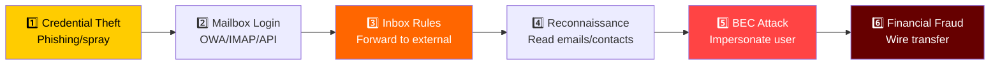
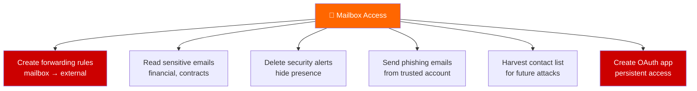
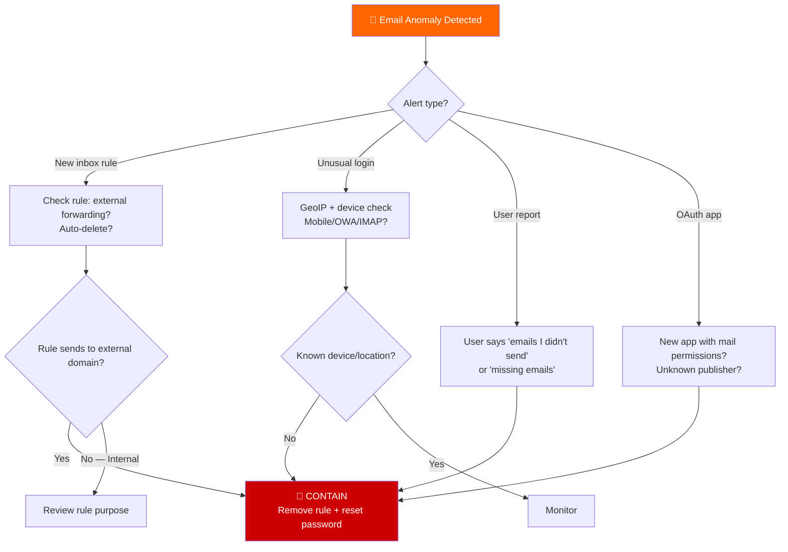
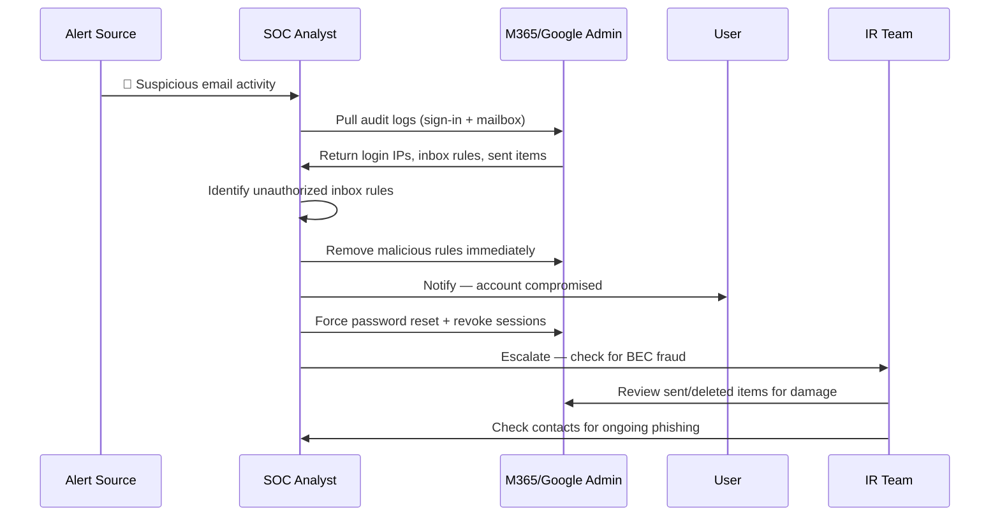
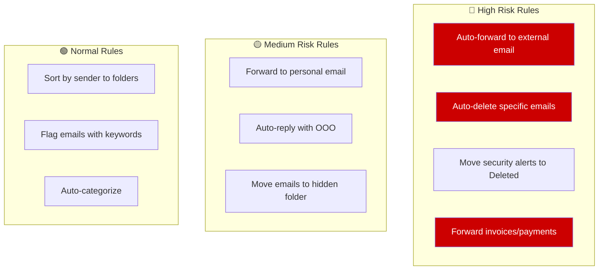
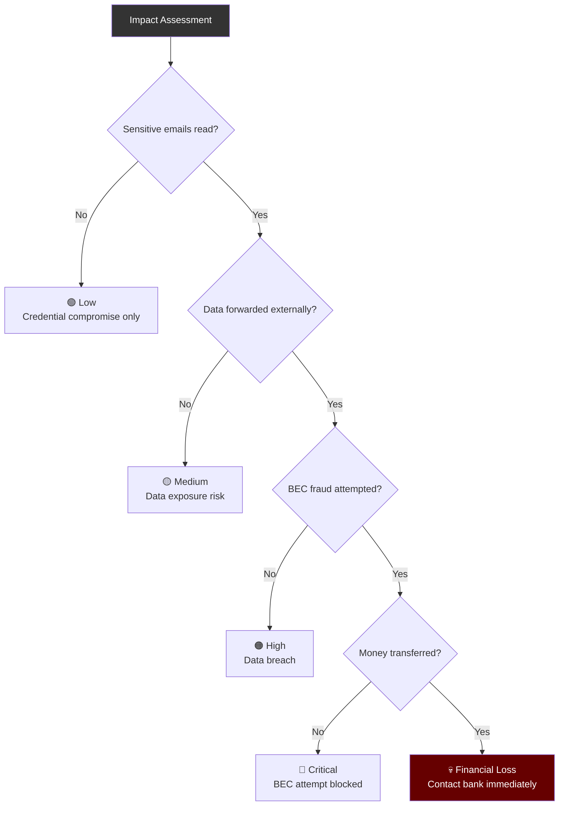

# Playbook: Email Account Takeover Response

**ID**: PB-42
**Severity**: High | **Category**: Collection / Impact
**MITRE ATT&CK**: [T1114](https://attack.mitre.org/techniques/T1114/) (Email Collection), [T1114.003](https://attack.mitre.org/techniques/T1114/003/) (Email Forwarding Rule)
**Trigger**: User report (suspicious sent emails), SIEM (new inbox rule), M365/Google alert (impossible travel login to mail), DLP (sensitive data forwarded)

> ⚠️ **CRITICAL**: Email account takeover enables BEC fraud, data exfiltration via forwarding rules, and supply chain attacks against contacts.

### Email Takeover Attack Flow


```mermaid
graph LR
    A["1️⃣ Credential Theft\nPhishing/spray"] --> B["2️⃣ Mailbox Login\nOWA/IMAP/API"]
    B --> C["3️⃣ Inbox Rules\nForward to external"]
    C --> D["4️⃣ Reconnaissance\nRead emails/contacts"]
    D --> E["5️⃣ BEC Attack\nImpersonate user"]
    E --> F["6️⃣ Financial Fraud\nWire transfer"]
    style A fill:#ffcc00,color:#000
    style C fill:#ff6600,color:#fff
    style E fill:#ff4444,color:#fff
    style F fill:#660000,color:#fff
```

### Attacker Actions in Mailbox


```mermaid
graph TD
    Access["📧 Mailbox Access"] --> Rules["Create forwarding rules\nmailbox → external"]
    Access --> Read["Read sensitive emails\nfinancial, contracts"]
    Access --> Delete["Delete security alerts\nhide presence"]
    Access --> Send["Send phishing emails\nfrom trusted account"]
    Access --> Contacts["Harvest contact list\nfor future attacks"]
    Access --> OAuth["Create OAuth app\npersistent access"]
    style Access fill:#ff6600,color:#fff
    style Rules fill:#cc0000,color:#fff
    style OAuth fill:#cc0000,color:#fff
```

---

## Decision Flow


```mermaid
graph TD
    Alert["🚨 Email Anomaly Detected"] --> Type{"Alert type?"}
    Type -->|"New inbox rule"| Rule["Check rule: external forwarding?\nAuto-delete?"]
    Type -->|"Unusual login"| Login["GeoIP + device check\nMobile/OWA/IMAP?"]
    Type -->|"User report"| Report["User says 'emails I didn't send'\nor 'missing emails'"]
    Type -->|"OAuth app"| OAuth["New app with mail permissions?\nUnknown publisher?"]
    Rule --> Malicious{"Rule sends to external domain?"}
    Malicious -->|Yes| Contain["🔴 CONTAIN\nRemove rule + reset password"]
    Malicious -->|"No — Internal"| Review["Review rule purpose"]
    Login --> Known{"Known device/location?"}
    Known -->|No| Contain
    Known -->|Yes| Monitor["Monitor"]
    Report --> Contain
    OAuth --> Contain
    style Alert fill:#ff6600,color:#fff
    style Contain fill:#cc0000,color:#fff
```

### Investigation Workflow


```mermaid
sequenceDiagram
    participant Alert as Alert Source
    participant SOC as SOC Analyst
    participant M365 as M365/Google Admin
    participant User
    participant IR as IR Team

    Alert->>SOC: 🚨 Suspicious email activity
    SOC->>M365: Pull audit logs (sign-in + mailbox)
    M365->>SOC: Return login IPs, inbox rules, sent items
    SOC->>SOC: Identify unauthorized inbox rules
    SOC->>M365: Remove malicious rules immediately
    SOC->>User: Notify — account compromised
    SOC->>M365: Force password reset + revoke sessions
    SOC->>IR: Escalate — check for BEC fraud
    IR->>M365: Review sent/deleted items for damage
    IR->>SOC: Check contacts for ongoing phishing
```

### Email Rule Types to Monitor


```mermaid
graph TD
    subgraph "🔴 High Risk Rules"
        R1["Auto-forward to external email"]
        R2["Auto-delete specific emails"]
        R3["Move security alerts to Deleted"]
        R4["Forward invoices/payments"]
    end
    subgraph "🟡 Medium Risk Rules"
        R5["Forward to personal email"]
        R6["Auto-reply with OOO"]
        R7["Move emails to hidden folder"]
    end
    subgraph "🟢 Normal Rules"
        R8["Sort by sender to folders"]
        R9["Flag emails with keywords"]
        R10["Auto-categorize"]
    end
    style R1 fill:#cc0000,color:#fff
    style R2 fill:#cc0000,color:#fff
    style R4 fill:#cc0000,color:#fff
```

### Impact Assessment


```mermaid
graph TD
    Impact["Impact Assessment"] --> DataRead{"Sensitive emails read?"}
    DataRead -->|No| Low["🟢 Low\nCredential compromise only"]
    DataRead -->|Yes| Forward{"Data forwarded externally?"}
    Forward -->|No| Med["🟡 Medium\nData exposure risk"]
    Forward -->|Yes| BEC{"BEC fraud attempted?"}
    BEC -->|No| High["🟠 High\nData breach"]
    BEC -->|Yes| Money{"Money transferred?"}
    Money -->|No| VHigh["🔴 Critical\nBEC attempt blocked"]
    Money -->|Yes| Cat["💀 Financial Loss\nContact bank immediately"]
    style Impact fill:#333,color:#fff
    style Cat fill:#660000,color:#fff
```

### Response Timeline


```mermaid
gantt
    title Email Account Takeover Response
    dateFormat HH:mm
    axisFormat %H:%M
    section Detection
        Alert received          :a1, 00:00, 5min
        Verify unauthorized     :a2, after a1, 10min
    section Containment
        Remove inbox rules      :a3, after a2, 5min
        Reset password & MFA    :a4, after a3, 10min
        Revoke OAuth apps       :a5, after a4, 10min
    section Investigation
        Audit mailbox activity  :a6, after a5, 60min
        Check sent/deleted      :a7, after a6, 30min
        Assess BEC risk         :a8, after a7, 60min
    section Recovery
        Notify affected parties :a9, after a8, 30min
```

---

## 1. Immediate Actions (First 15 Minutes)

| # | Action | Owner |
|:---|:---|:---|
| 1 | Remove ALL suspicious inbox rules (forwarding, auto-delete) | M365/Google Admin |
| 2 | Reset user password immediately | IAM Team |
| 3 | Revoke all active sessions and tokens | M365/Google Admin |
| 4 | Revoke any unknown OAuth/app permissions | M365/Google Admin |
| 5 | Re-enroll MFA with a new device/method | IAM Team |
| 6 | Check Sent and Deleted Items for attacker actions | SOC T2 |

## 2. Investigation Checklist

### Mailbox Audit
- [ ] Sign-in logs: IP addresses, devices, locations, timestamps
- [ ] Inbox rules created/modified: forwarding destinations
- [ ] Sent Items: emails sent by attacker (phishing, BEC)
- [ ] Deleted Items: security alerts or evidence deleted
- [ ] OAuth/App permissions: unknown apps with mail.read scope
- [ ] Delegate access: other users added as delegates

### BEC Assessment
- [ ] Were any financial instructions sent (wire transfer, invoice change)?
- [ ] Were vendor/partner communications impersonated?
- [ ] Did attacker monitor specific email threads (invoice, contract)?
- [ ] Were any contacts phished from this account?

### Data Exposure
- [ ] What sensitive emails were accessible?
- [ ] Were attachments downloaded?
- [ ] Were emails forwarded to external addresses?
- [ ] PDPA/regulatory notification requirements?

## 3. Containment

| Scope | Action |
|:---|:---|
| **Inbox rules** | Remove all forwarding/delete rules |
| **Password** | Force reset + MFA re-enrollment |
| **Sessions** | Revoke all active sessions/tokens |
| **OAuth** | Remove unknown app permissions |
| **Delegates** | Remove unauthorized delegate access |

## 4. Evidence Checklist

| Evidence Type | What to Collect | Source | Why It Matters |
|:---|:---|:---|:---|
| Mailbox evidence | Inbox rules, forwarding, delegates, sent/deleted items, audit trail | Mailbox audit / admin console | Shows persistence and attacker actions inside the mailbox |
| Identity evidence | Sign-ins, MFA events, session IDs, devices, IPs, OAuth apps | IdP / sign-in logs | Distinguishes mailbox-only abuse from full identity compromise |
| Message-flow evidence | Phishing emails sent, recipient list, external forwarding, purge results | Message trace / gateway | Defines blast radius and downstream victim scope |
| Data exposure evidence | Sensitive mailboxes, attachments viewed/downloaded, thread monitoring | Mailbox audit / DLP | Supports legal and business impact assessment |
| Business fraud evidence | Invoice threads, payment requests, partner impersonation, callback records | Finance / ticketing / call logs | Determines whether the takeover escalated into BEC or vendor fraud |

## 5. Minimum Telemetry Required

| Telemetry Source | Required For | Priority | Blind Spot If Missing |
|:---|:---|:---:|:---|
| Mailbox audit and message trace | Rules, forwarding, sent mail, purge scope, delegate changes | Required | Cannot scope mailbox abuse accurately |
| Identity provider sign-in logs | Login source, MFA, session anomalies, OAuth grants | Required | Cannot tell how the mailbox was taken over |
| Email gateway and DLP telemetry | Outbound phishing, attachment access, sensitive content | Required | Cannot quantify downstream impact or data exposure |
| Helpdesk and finance workflow records | Verification controls, user-reported anomalies, callback evidence | Recommended | Fraud context and process failure remain weak |
| Threat intel and domain monitoring | Lookalike domains, campaign overlap, sender reputation | Recommended | Broader campaign detection and response slow down |

## 6. False Positive and Tuning Guide

| Scenario | Why It Looks Suspicious | How to Validate | Tuning Action | Escalate If |
|:---|:---|:---|:---|:---|
| Approved forwarding or delegate change | Admin or executive workflows may use mailbox delegation | Validate ticket, approver, and exact delegate/forwarding target | Suppress only approved changes for named mailboxes | Target is external, hidden, or outside approved workflow |
| User mailbox cleanup or rule management | Users can create folders/filters that resemble abuse | Confirm with user and inspect whether rules redirect or delete security mail | Tune for benign foldering rules only, not external forwarding | Rule deletes alerts, forwards externally, or hides invoices/security mail |
| Mobile or new mail client enrollment | New app consent and session creation may look like compromise | Validate device enrollment and approved app ID | Allowlist approved client apps and enrollment windows narrowly | App requests high-risk scopes or session comes from unusual geo/device |
| Compliance or eDiscovery access | Legal review can generate mass mailbox access | Confirm case ID, reviewer identity, and target mailbox list | Reduce severity for documented legal workflows only | Access extends beyond case scope or results in external forwarding/export |

## 7. Post-Incident

| Question | Answer |
|:---|:---|
| How were email credentials compromised? | [Phishing/spray/leak] |
| Were inbox rule alerts configured? | [Yes/No] |
| Was conditional access policy enforced? | [Status] |
| Were financial controls (dual approval) in place? | [Status] |

## 8. Detection Rules (Sigma)

```yaml
title: Suspicious Email Forwarding Rule Created
logsource:
    product: m365
    service: exchange
detection:
    selection:
        Operation: 'New-InboxRule'
        Parameters|contains:
            - 'ForwardTo'
            - 'RedirectTo'
            - 'ForwardAsAttachmentTo'
    condition: selection
    level: high
```

## Related Documents
- [IR Framework](../Framework.en.md)
- [Sigma Rules Index](../../08_Detection_Engineering/README.md)
- [BEC Playbook](BEC.en.md)
- [Account Compromise Playbook](Account_Compromise.en.md)
- [Phishing Playbook](Phishing.en.md)
- [MFA Bypass Playbook](MFA_Bypass.en.md)

## References
- [MITRE T1114 — Email Collection](https://attack.mitre.org/techniques/T1114/)
- [Microsoft — Detect Email Compromise](https://learn.microsoft.com/en-us/microsoft-365/security/)
