# Playbook: Email Account Takeover Response

**ID**: PB-42
**Severity**: High | **Category**: Collection / Impact
**MITRE ATT&CK**: [T1114](https://attack.mitre.org/techniques/T1114/) (Email Collection), [T1114.003](https://attack.mitre.org/techniques/T1114/003/) (Email Forwarding Rule)
**Trigger**: User report (suspicious sent emails), SIEM (new inbox rule), M365/Google alert (impossible travel login to mail), DLP (sensitive data forwarded)

> ⚠️ **CRITICAL**: Email account takeover enables BEC fraud, data exfiltration via forwarding rules, and supply chain attacks against contacts.

### Email Takeover Attack Flow

```mermaid
graph LR
    A["1️⃣ Credential Theft\nPhishing/spray"] --> B["2️⃣ Mailbox Login\nOWA/IMAP/API"]
    B --> C["3️⃣ Inbox Rules\nForward to external"]
    C --> D["4️⃣ Reconnaissance\nRead emails/contacts"]
    D --> E["5️⃣ BEC Attack\nImpersonate user"]
    E --> F["6️⃣ Financial Fraud\nWire transfer"]
    style A fill:#ffcc00,color:#000
    style C fill:#ff6600,color:#fff
    style E fill:#ff4444,color:#fff
    style F fill:#660000,color:#fff
```



### Attacker Actions in Mailbox

```mermaid
graph TD
    Access["📧 Mailbox Access"] --> Rules["Create forwarding rules\nmailbox → external"]
    Access --> Read["Read sensitive emails\nfinancial, contracts"]
    Access --> Delete["Delete security alerts\nhide presence"]
    Access --> Send["Send phishing emails\nfrom trusted account"]
    Access --> Contacts["Harvest contact list\nfor future attacks"]
    Access --> OAuth["Create OAuth app\npersistent access"]
    style Access fill:#ff6600,color:#fff
    style Rules fill:#cc0000,color:#fff
    style OAuth fill:#cc0000,color:#fff
```



---

## Decision Flow

```mermaid
graph TD
    Alert["🚨 Email Anomaly Detected"] --> Type{"Alert type?"}
    Type -->|"New inbox rule"| Rule["Check rule: external forwarding?\nAuto-delete?"]
    Type -->|"Unusual login"| Login["GeoIP + device check\nMobile/OWA/IMAP?"]
    Type -->|"User report"| Report["User says 'emails I didn't send'\nor 'missing emails'"]
    Type -->|"OAuth app"| OAuth["New app with mail permissions?\nUnknown publisher?"]
    Rule --> Malicious{"Rule sends to external domain?"}
    Malicious -->|Yes| Contain["🔴 CONTAIN\nRemove rule + reset password"]
    Malicious -->|"No — Internal"| Review["Review rule purpose"]
    Login --> Known{"Known device/location?"}
    Known -->|No| Contain
    Known -->|Yes| Monitor["Monitor"]
    Report --> Contain
    OAuth --> Contain
    style Alert fill:#ff6600,color:#fff
    style Contain fill:#cc0000,color:#fff
```



### Investigation Workflow

```mermaid
sequenceDiagram
    participant Alert as Alert Source
    participant SOC as SOC Analyst
    participant M365 as M365/Google Admin
    participant User
    participant IR as IR Team

    Alert->>SOC: 🚨 Suspicious email activity
    SOC->>M365: Pull audit logs (sign-in + mailbox)
    M365->>SOC: Return login IPs, inbox rules, sent items
    SOC->>SOC: Identify unauthorized inbox rules
    SOC->>M365: Remove malicious rules immediately
    SOC->>User: Notify — account compromised
    SOC->>M365: Force password reset + revoke sessions
    SOC->>IR: Escalate — check for BEC fraud
    IR->>M365: Review sent/deleted items for damage
    IR->>SOC: Check contacts for ongoing phishing
```



### Email Rule Types to Monitor


### Impact Assessment


### Response Timeline


---

## 1. Immediate Actions (First 15 Minutes)

| # | Action | Owner |
|:---|:---|:---|
| 1 | Remove ALL suspicious inbox rules (forwarding, auto-delete) | M365/Google Admin |
| 2 | Reset user password immediately | IAM Team |
| 3 | Revoke all active sessions and tokens | M365/Google Admin |
| 4 | Revoke any unknown OAuth/app permissions | M365/Google Admin |
| 5 | Re-enroll MFA with a new device/method | IAM Team |
| 6 | Check Sent and Deleted Items for attacker actions | SOC T2 |

## 2. Investigation Checklist

### Mailbox Audit
- [ ] Sign-in logs: IP addresses, devices, locations, timestamps
- [ ] Inbox rules created/modified: forwarding destinations
- [ ] Sent Items: emails sent by attacker (phishing, BEC)
- [ ] Deleted Items: security alerts or evidence deleted
- [ ] OAuth/App permissions: unknown apps with mail.read scope
- [ ] Delegate access: other users added as delegates

### BEC Assessment
- [ ] Were any financial instructions sent (wire transfer, invoice change)?
- [ ] Were vendor/partner communications impersonated?
- [ ] Did attacker monitor specific email threads (invoice, contract)?
- [ ] Were any contacts phished from this account?

### Data Exposure
- [ ] What sensitive emails were accessible?
- [ ] Were attachments downloaded?
- [ ] Were emails forwarded to external addresses?
- [ ] PDPA/regulatory notification requirements?

## 3. Containment

| Scope | Action |
|:---|:---|
| **Inbox rules** | Remove all forwarding/delete rules |
| **Password** | Force reset + MFA re-enrollment |
| **Sessions** | Revoke all active sessions/tokens |
| **OAuth** | Remove unknown app permissions |
| **Delegates** | Remove unauthorized delegate access |

## 4. Post-Incident

| Question | Answer |
|:---|:---|
| How were email credentials compromised? | [Phishing/spray/leak] |
| Were inbox rule alerts configured? | [Yes/No] |
| Was conditional access policy enforced? | [Status] |
| Were financial controls (dual approval) in place? | [Status] |

## 6. Detection Rules (Sigma)

```yaml
title: Suspicious Email Forwarding Rule Created
logsource:
    product: m365
    service: exchange
detection:
    selection:
        Operation: 'New-InboxRule'
        Parameters|contains:
            - 'ForwardTo'
            - 'RedirectTo'
            - 'ForwardAsAttachmentTo'
    condition: selection
    level: high
```

## Related Documents
- [IR Framework](../Framework.en.md)
- [Sigma Rules Index](../../08_Detection_Engineering/sigma_rules/)
- [BEC Playbook](BEC.en.md)
- [Account Compromise Playbook](Account_Compromise.en.md)
- [Phishing Playbook](Phishing.en.md)
- [MFA Bypass Playbook](MFA_Bypass.en.md)

## References
- [MITRE T1114 — Email Collection](https://attack.mitre.org/techniques/T1114/)
- [Microsoft — Detect Email Compromise](https://learn.microsoft.com/en-us/microsoft-365/security/)
