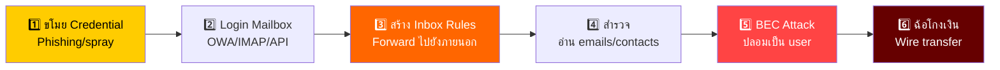
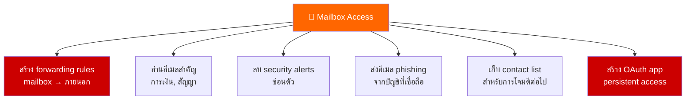
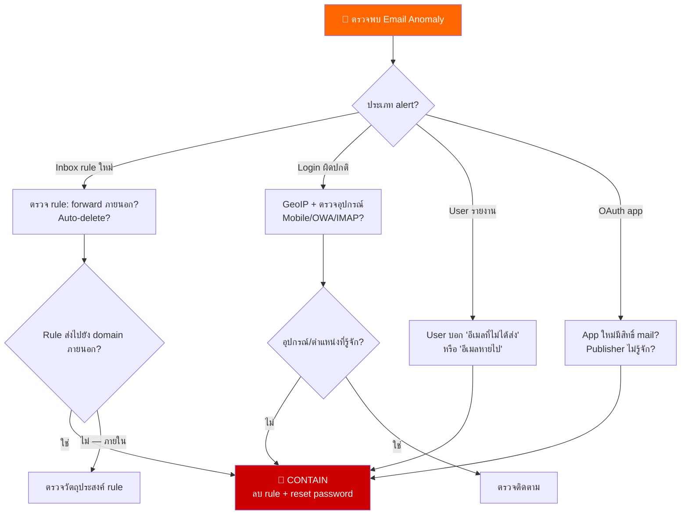
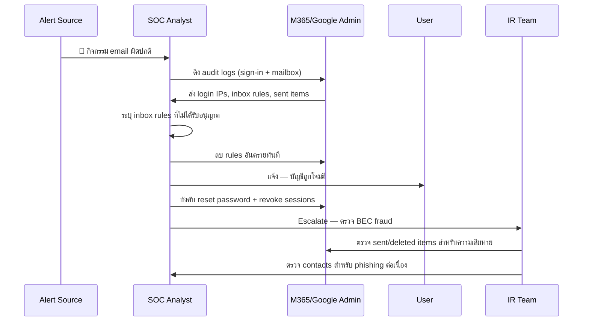
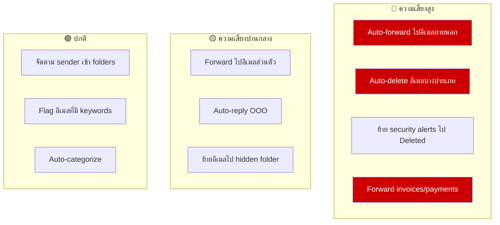
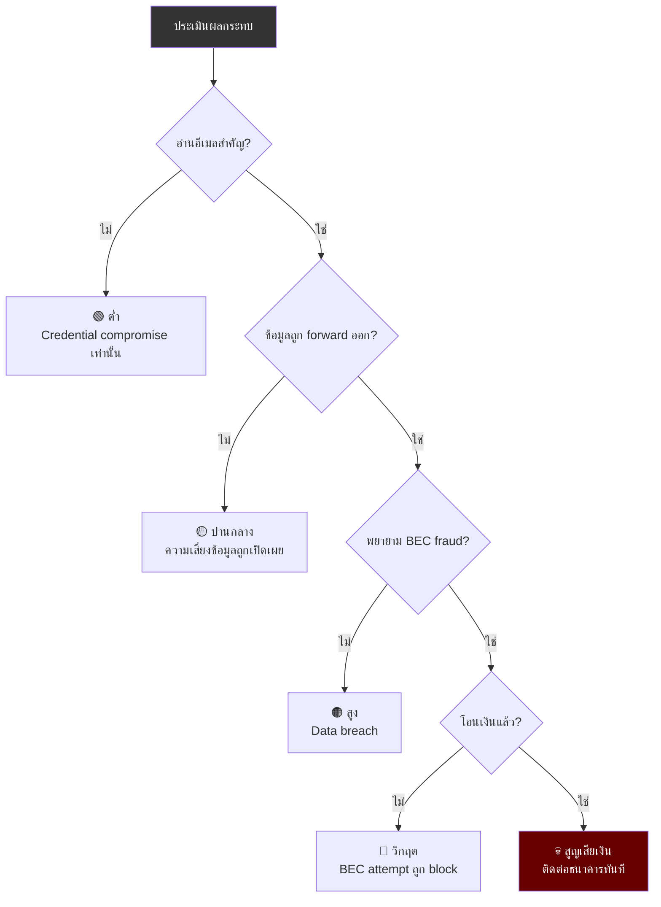

# Playbook: การตอบสนอง Email Account Takeover

**ID**: PB-42
**ความรุนแรง**: สูง | **ประเภท**: Collection / Impact
**MITRE ATT&CK**: [T1114](https://attack.mitre.org/techniques/T1114/) (Email Collection), [T1114.003](https://attack.mitre.org/techniques/T1114/003/) (Email Forwarding Rule)
**Trigger**: User รายงาน (อีเมลที่ไม่ได้ส่ง), SIEM (inbox rule ใหม่), M365/Google alert (impossible travel login ไปยัง mail), DLP (ข้อมูลสำคัญถูก forward)

> ⚠️ **วิกฤต**: Email account takeover เปิดทาง BEC fraud, ขโมยข้อมูลผ่าน forwarding rules, และโจมตี supply chain ผ่าน contacts

### Email Takeover Attack Flow



### กิจกรรมของผู้โจมตีใน Mailbox



---

## Decision Flow



### ขั้นตอนการสืบสวน



### ประเภท Email Rules ที่ต้องจับตา



### การประเมินผลกระทบ



### Timeline การตอบสนอง

```mermaid
gantt
    title Email Account Takeover Response
    dateFormat HH:mm
    axisFormat %H:%M
    section Detection
        ได้รับ alert             :a1, 00:00, 5min
        ยืนยันไม่ได้รับอนุญาต   :a2, after a1, 10min
    section Containment
        ลบ inbox rules          :a3, after a2, 5min
        Reset password & MFA    :a4, after a3, 10min
        Revoke OAuth apps       :a5, after a4, 10min
    section Investigation
        Audit mailbox activity  :a6, after a5, 60min
        ตรวจ sent/deleted       :a7, after a6, 30min
        ประเมิน BEC risk        :a8, after a7, 60min
    section Recovery
        แจ้งผู้ที่ได้รับผลกระทบ  :a9, after a8, 30min
```



---

## 1. การดำเนินการทันที (15 นาทีแรก)

| # | การดำเนินการ | ผู้รับผิดชอบ |
|:---|:---|:---|
| 1 | ลบ inbox rules ที่น่าสงสัยทั้งหมด (forwarding, auto-delete) | M365/Google Admin |
| 2 | Reset password ทันที | IAM Team |
| 3 | Revoke active sessions และ tokens ทั้งหมด | M365/Google Admin |
| 4 | Revoke OAuth/app permissions ที่ไม่รู้จัก | M365/Google Admin |
| 5 | Enroll MFA ใหม่ด้วยอุปกรณ์/วิธีใหม่ | IAM Team |
| 6 | ตรวจ Sent และ Deleted Items สำหรับกิจกรรมของผู้โจมตี | SOC T2 |

## 2. รายการตรวจสอบ

### Mailbox Audit
- [ ] Sign-in logs: IP addresses, อุปกรณ์, ตำแหน่ง, timestamps
- [ ] Inbox rules สร้าง/แก้ไข: forwarding destinations
- [ ] Sent Items: อีเมลที่ผู้โจมตีส่ง (phishing, BEC)
- [ ] Deleted Items: security alerts หรือหลักฐานที่ลบ
- [ ] OAuth/App permissions: apps ไม่รู้จักที่มี mail.read scope
- [ ] Delegate access: users อื่นที่เพิ่มเป็น delegates

### การประเมิน BEC
- [ ] มีคำสั่งทางการเงินถูกส่งหรือไม่ (wire transfer, invoice change)?
- [ ] มีการปลอมเป็น vendor/partner หรือไม่?
- [ ] ผู้โจมตีติดตาม email threads เฉพาะ (invoice, contract) หรือไม่?
- [ ] มี contacts ถูก phish จากบัญชีนี้หรือไม่?

## 3. การควบคุม (Containment)

| ขอบเขต | การดำเนินการ |
|:---|:---|
| **Inbox rules** | ลบ forwarding/delete rules ทั้งหมด |
| **Password** | บังคับ reset + MFA re-enrollment |
| **Sessions** | Revoke active sessions/tokens ทั้งหมด |
| **OAuth** | ลบ app permissions ที่ไม่รู้จัก |
| **Delegates** | ลบ delegate access ที่ไม่ได้รับอนุญาต |

### การยืนยันการกู้คืน
- [ ] ยืนยันว่า inbox rules ที่เป็นอันตรายถูกลบ
- [ ] ยืนยัน OAuth apps ที่ไม่ได้รับอนุญาตถูกเพิกถอน
- [ ] ตรวจ login history 7 วันหลังกู้คืน
- [ ] ยืนยัน MFA ทำงานบนทุกช่องทาง
- [ ] แจ้งผู้ติดต่อภายนอกเรื่อง compromise ถ้าจำเป็น

## 4. หลังเหตุการณ์ (Post-Incident)

| คำถาม | คำตอบ |
|:---|:---|
| Email credentials ถูกโจมตีอย่างไร? | [Phishing/spray/leak] |
| Inbox rule alerts กำหนดค่าอยู่หรือไม่? | [ใช่/ไม่] |
| Conditional access policy บังคับใช้อยู่หรือไม่? | [สถานะ] |
| มี financial controls (dual approval) หรือไม่? | [สถานะ] |

## 6. Detection Rules (Sigma)

```yaml
title: Suspicious Email Forwarding Rule Created
logsource:
    product: m365
    service: exchange
detection:
    selection:
        Operation: 'New-InboxRule'
        Parameters|contains:
            - 'ForwardTo'
            - 'RedirectTo'
            - 'ForwardAsAttachmentTo'
    condition: selection
    level: high
```

## เอกสารที่เกี่ยวข้อง
- [BEC Playbook](BEC.th.md)
- [Account Compromise Playbook](Account_Compromise.th.md)
- [Phishing Playbook](Phishing.th.md)
- [MFA Bypass Playbook](MFA_Bypass.th.md)

## References
- [MITRE T1114 — Email Collection](https://attack.mitre.org/techniques/T1114/)
- [Microsoft — Detect Email Compromise](https://learn.microsoft.com/en-us/microsoft-365/security/)
